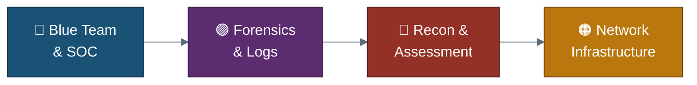

<a id="top"></a>
<div align="center">

# 🧭 Executive Summary
### Cybersecurity Lab Projects — Foundational Projects


**A one-page read of what this portfolio proves — investigate, probe, secure, document.**

**[📖 Full README](README.md)**

</div>

<br>

<div align="center">

<table>
<tr>
<td align="center" width="25%"><h2>10</h2>Projects</td>
<td align="center" width="25%"><h2>4</h2>Skill Areas</td>
<td align="center" width="25%"><h2>87</h2>Screenshots</td>
<td align="center" width="25%"><h2>3</h2>Doc Layers per Project</td>
</tr>
</table>

</div>

<p align="center"><sub>Doc layers = README · INDEX · screenshots</sub></p>

---

### 🧩 Four Skill Areas, One Method



---

### 📂 Area 01 · 🔵 Blue Team & SOC
`Phishing Analysis` `MITRE ATT&CK` `D3FEND` `SIEM` `Splunk`
> Investigated a phishing email, mapped WannaCry to threat frameworks, and triaged SIEM alerts to opposite verdicts on log evidence — 3 projects (P01, P04, P06).
> **✅ Documented** · [Projects 01, 04, 06](./1-Foundational-Projects)

### 📂 Area 02 · 🟣 Forensics & Logs
`Wireshark` `Display Filters` `auth.log` `dpkg.log` `auditd`
> Reconstructed an attack from a packet capture and rebuilt a compromised Linux host's timeline from built-in logs — 2 projects (P05, P07).
> **✅ Documented** · [Projects 05, 07](./1-Foundational-Projects)

### 📂 Area 03 · 🔴 Recon & Assessment
`Python` `Nmap` `John the Ripper` `Gobuster` `GTFOBins`
> Automated port scanning, cracked and analysed password hashes, and wrote a full vulnerability assessment report — 3 projects (P03, P08, P09).
> **✅ Documented** · [Projects 03, 08, 09](./1-Foundational-Projects)

### 📂 Area 04 · 🟠 Network Infrastructure
`Cisco IOS` `ACLs` `VLANs` `Inter-VLAN Routing`
> Built secure routing with a tested ACL and segmented a network with VLANs and inter-VLAN routing — 2 projects (P02, P10).
> **✅ Documented** · [Projects 02, 10](./1-Foundational-Projects)

---

### 🎯 Verification Snapshot

| Check | Status |
|---|:---:|
| Every project has its own README and screenshots folder | ✅ |
| Every project has a step index (INDEX.md) | ✅ |
| Each project follows the same scope → test → finding → verify pattern | ✅ |
| A real finding or issue documented along the way, not just a clean result | ✅ |
| Foundational scope stated: concept-building work, advanced projects in a separate repo | ✅ |

> [!NOTE]
> This is a summary only — full methodology, commands, and screenshots for each project live in that project's own README.

---

### 📁 Folder Structure

```text
cybersecurity-lab-projects/
└── 1-Foundational-Projects/
    ├── 🔵 project-01-phishing-email-investigation/
    ├── 🟠 project-02-cisco-infrastructure-secure-routing/
    ├── 🔴 project-03-automated-port-scanner/
    ├── 🔵 project-04-threat-framework-mapping-wannacry/
    ├── 🟣 project-05-network-forensics-wireshark/
    ├── 🔵 project-06-siem-alert-triage/
    ├── 🟣 project-07-linux-log-analysis-forensics/
    ├── 🔴 project-08-password-cracking-hash-analysis/
    ├── 🔴 project-09-vulnerability-assessment-report/
    └── 🟠 project-10-vlan-segmentation-intervlan-routing/
```

---

<div align="center">

[⬆️ Back to top](#top) &nbsp;·&nbsp; [📖 Full README](README.md)

</div>
