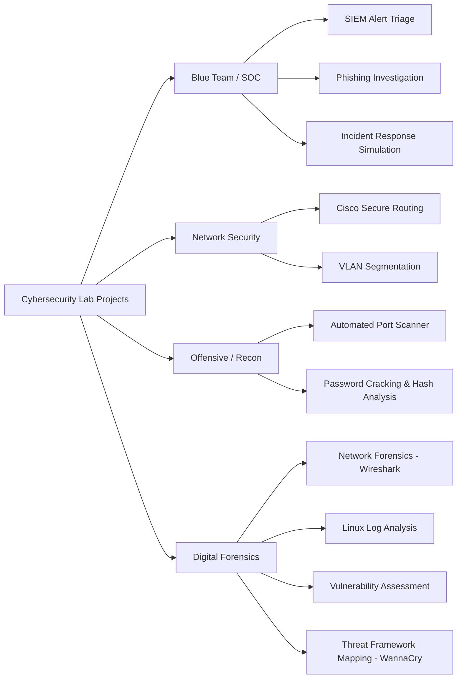
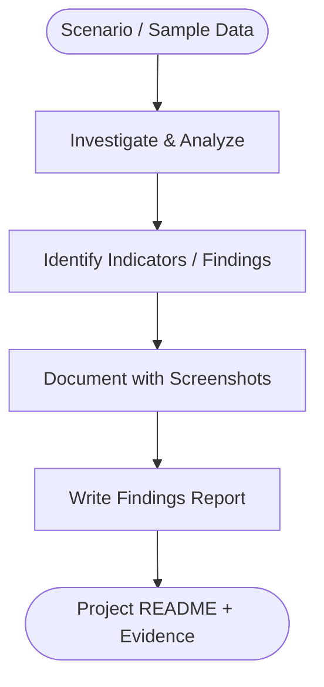

# 🛡️ Cybersecurity Lab Projects

**Malaika Azhar** — Cybersecurity & Network Engineer | SOC & NOC Aspirant | CEH Certified

[](https://www.linkedin.com/in/malaika-azhar-tech)
[]()
[]()

> 📌 **Note:** These are foundational, concept-building projects — the phase where core cybersecurity concepts (SOC triage, network forensics, vulnerability assessment) were learned hands-on. They reflect early skill-building work.

---

## 📖 About This Repository

A collection of **10 hands-on cybersecurity projects** covering SOC alert triage, phishing investigation, network reconnaissance, vulnerability assessment, incident response, and network infrastructure security. Each project includes documentation and screenshots demonstrating the workflow and findings.

---

## 🧭 Repository Structure

```
cybersecurity-lab-projects/
│
├── foundational-projects/
│   ├── project-01-phishing-email-investigation/
│   │   ├── README.md
│   │   └── screenshots/
│   │
│   ├── project-02-cisco-infrastructure-secure-routing/
│   │   ├── README.md
│   │   └── screenshots/
│   │
│   ├── project-03-automated-port-scanner/
│   │   ├── README.md
│   │   └── screenshots/
│   │
│   ├── project-04-threat-framework-mapping-wannacry/
│   │   ├── README.md
│   │   └── screenshots/
│   │
│   ├── project-05-network-forensics-wireshark/
│   │   ├── README.md
│   │   └── screenshots/
│   │
│   ├── project-06-siem-alert-triage/
│   │   ├── README.md
│   │   └── screenshots/
│   │
│   ├── project-07-linux-log-analysis-forensics/
│   │   ├── README.md
│   │   └── screenshots/
│   │
│   ├── project-08-password-cracking-hash-analysis/
│   │   ├── README.md
│   │   └── screenshots/
│   │
│   ├── project-09-vulnerability-assessment-report/
│   │   ├── README.md
│   │   └── screenshots/
│   │
│   └── project-10-vlan-segmentation-intervlan-routing/
│       ├── README.md
│       └── screenshots/
│
├── LICENSE
└── README.md   ← you are here
```

---

## 🗺️ Skill Coverage Map



---

## 📋 Projects Overview

| # | Project | Focus Area | Key Tools |
|---|---------|-------------|-----------|
| 01 | [Phishing Email Investigation](./foundational-projects/project-01-phishing-email-investigation) | Phishing analysis, IOC hunting | Email headers, VirusTotal |
| 02 | [Cisco Infrastructure Secure Routing](./foundational-projects/project-02-cisco-infrastructure-secure-routing) | Network infrastructure security | Cisco IOS |
| 03 | [Automated Port Scanner](./foundational-projects/project-03-automated-port-scanner) | Reconnaissance automation | Python, Nmap |
| 04 | [Threat Framework Mapping — WannaCry](./foundational-projects/project-04-threat-framework-mapping-wannacry) | Threat intelligence, MITRE ATT&CK | Threat framework mapping |
| 05 | [Network Forensics — Wireshark](./foundational-projects/project-05-network-forensics-wireshark) | Packet analysis | Wireshark |
| 06 | [SIEM Alert Triage](./foundational-projects/project-06-siem-alert-triage) | SOC alert investigation | SIEM, Splunk |
| 07 | [Linux Log Analysis & Forensics](./foundational-projects/project-07-linux-log-analysis-forensics) | Log-based forensics | Linux logs |
| 08 | [Password Cracking & Hash Analysis](./foundational-projects/project-08-password-cracking-hash-analysis) | Credential security | Hash cracking tools |
| 09 | [Vulnerability Assessment Report](./foundational-projects/project-09-vulnerability-assessment-report) | Vulnerability scanning & reporting | Nmap, Gobuster |
| 10 | [VLAN Segmentation & Inter-VLAN Routing](./foundational-projects/project-10-vlan-segmentation-intervlan-routing) | Network segmentation | Cisco IOS |

---

## 🔄 Project Workflow (General Pattern)



---

## 🧰 Topics Covered

`SOC` · `Blue Team` · `Red Team` · `Incident Response` · `Vulnerability Assessment` · `Penetration Testing` · `Wireshark` · `Nmap` · `Splunk` · `Cybersecurity`

---

## 📫 Connect

- **LinkedIn:** [linkedin.com/in/malaika-azhar-tech](https://www.linkedin.com/in/malaika-azhar-tech)
- **GitHub:** [github.com/malaika-azhar](https://github.com/malaika-azhar)
- **Location:** Pakistan

---

<p align="center"><i>More advanced, infrastructure-based SOC/Blue Team projects in progress — see upcoming lab repository.</i></p>
