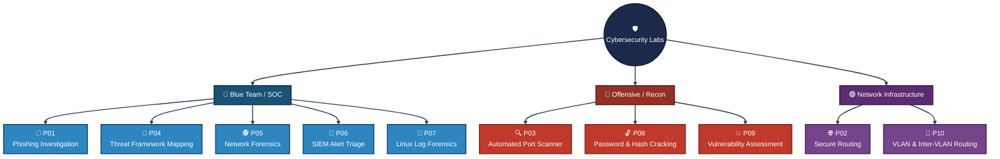

<div align="center">

# 🛡️ Cybersecurity Lab Projects

**Malaika Azhar — Cybersecurity & Network Engineer | SOC & NOC Aspirant | CEH Certified**

[](https://www.linkedin.com/in/malaika-azhar-tech)


> 📌 **Note:** These are foundational, concept-building projects — the phase where core cybersecurity concepts (SOC triage, network forensics, vulnerability assessment) were learned hands-on. They reflect early skill-building work. More advanced, infrastructure-focused projects live in a separate repo.

</div>

---

## 📑 Table of Contents

1. [About This Repository](#about)
2. [About the Foundational Projects](#foundational)
3. [Repository Structure](#structure)
4. [Skill Coverage Map](#coverage)
5. [Projects Overview](#projects)
6. [Skills Demonstrated](#skills)
7. [How to Navigate This Repo](#navigate)
8. [Project Workflow](#workflow)
9. [Topics Covered](#topics)
10. [License](#license)
11. [Connect](#connect)

---

<a id="about"></a>
## 📖 About This Repository

A collection of **10 hands-on cybersecurity projects** covering SOC alert triage, phishing investigation, network reconnaissance, threat intelligence, vulnerability assessment, digital forensics, and network infrastructure security. Each project includes full documentation, CLI commands, and screenshots demonstrating the workflow and findings.

### 🎯 What This Portfolio Demonstrates

- **Investigating** — phishing emails, packet captures, Linux logs, and SIEM alerts
- **Probing** — port scanning, password hash analysis, and vulnerability assessment
- **Securing** — Cisco IOS routing with access control, plus VLAN segmentation
- **Documenting** — every project records commands, evidence, and lessons learned, not just a final result

### 📚 How Each Project Is Documented

| File | Purpose |
|---|---|
| `README.md` | Full write-up: objective, steps, commands, findings, challenges, and lessons learned |
| `INDEX.md` | Quick guide to every step and screenshot in the project |
| `screenshots/` | Numbered evidence for each step |

A one-page read of the whole portfolio is available in [`EXECUTIVE-SUMMARY.md`](./EXECUTIVE-SUMMARY.md).

---

<a id="foundational"></a>
## 🌱 About the Foundational Projects

The projects in `1-Foundational-Projects/` are the **concept-building phase** of this portfolio — the stage where core cybersecurity ideas (SOC triage, network forensics, vulnerability assessment) were learned hands-on rather than just read about.

| | |
|---|---|
| **What they are** | 10 hands-on projects across three tracks: Blue Team/SOC, offensive/recon, and network infrastructure |
| **What they show** | Early skill-building work, with real findings, evidence, and lessons learned in each project |
| **What they are not** | The advanced, infrastructure-focused work — that lives in a separate repo |

Every project follows the same pattern (see [Project Workflow](#workflow)): scope the objective, run the technique, hit a real finding, fix or confirm it, capture evidence, and verify the result.

---

<a id="structure"></a>
## 🧭 Repository Structure

```text
cybersecurity-lab-projects/
│
├── 1-Foundational-Projects/
│   ├── project-01-phishing-email-investigation/
│   │   ├── README.md
│   │   ├── INDEX.md
│   │   └── screenshots/
│   │
│   ├── project-02-cisco-infrastructure-secure-routing/
│   │   ├── README.md
│   │   ├── INDEX.md
│   │   └── screenshots/
│   │
│   ├── project-03-automated-port-scanner/
│   │   ├── README.md
│   │   ├── INDEX.md
│   │   └── screenshots/
│   │
│   ├── project-04-threat-framework-mapping-wannacry/
│   │   ├── README.md
│   │   ├── INDEX.md
│   │   └── screenshots/
│   │
│   ├── project-05-network-forensics-wireshark/
│   │   ├── README.md
│   │   ├── INDEX.md
│   │   └── screenshots/
│   │
│   ├── project-06-siem-alert-triage/
│   │   ├── README.md
│   │   ├── INDEX.md
│   │   └── screenshots/
│   │
│   ├── project-07-linux-log-analysis-forensics/
│   │   ├── README.md
│   │   ├── INDEX.md
│   │   └── screenshots/
│   │
│   ├── project-08-password-cracking-hash-analysis/
│   │   ├── README.md
│   │   ├── INDEX.md
│   │   └── screenshots/
│   │
│   ├── project-09-vulnerability-assessment-report/
│   │   ├── README.md
│   │   ├── INDEX.md
│   │   └── screenshots/
│   │
│   └── project-10-vlan-segmentation-intervlan-routing/
│       ├── README.md
│       ├── INDEX.md
│       └── screenshots/
│
├── EXECUTIVE-SUMMARY.md
├── LICENSE
└── README.md   ← you are here
```

---

<a id="coverage"></a>
## 🗺️ Skill Coverage Map


```mermaid
%%{init: {'theme': 'base', 'themeVariables': {'fontSize': '15px'}, 'flowchart': {'nodeSpacing': 30, 'rankSpacing': 44, 'padding': 10}}}%%
flowchart TB
    ROOT(("🛡️<br/>Cybersecurity Labs")):::root --> BLUE["🔵 Blue Team / SOC"]:::blue
    ROOT --> RED["🔴 Offensive / Recon"]:::red
    ROOT --> NET["🟣 Network Infrastructure"]:::net
    BLUE --> P01["📧 P01<br/>Phishing Investigation"]:::leafBlue
    BLUE --> P04["🦠 P04<br/>Threat Framework Mapping"]:::leafBlue
    BLUE --> P05["🕵️ P05<br/>Network Forensics"]:::leafBlue
    BLUE --> P06["🚨 P06<br/>SIEM Alert Triage"]:::leafBlue
    BLUE --> P07["🐧 P07<br/>Linux Log Forensics"]:::leafBlue
    RED --> P03["🔍 P03<br/>Automated Port Scanner"]:::leafRed
    RED --> P08["🔓 P08<br/>Password & Hash Cracking"]:::leafRed
    RED --> P09["💥 P09<br/>Vulnerability Assessment"]:::leafRed
    NET --> P02["🌐 P02<br/>Secure Routing"]:::leafNet
    NET --> P10["🏢 P10<br/>VLAN & Inter-VLAN Routing"]:::leafNet
    classDef root fill:#1B2A4A,stroke:#0B1A33,stroke-width:2px,color:#FFFFFF
    classDef blue fill:#1A5276,stroke:#0B2E43,stroke-width:2px,color:#FFFFFF
    classDef red fill:#943126,stroke:#571C16,stroke-width:2px,color:#FFFFFF
    classDef net fill:#5B2C6F,stroke:#3B1A48,stroke-width:2px,color:#FFFFFF
    classDef leafBlue fill:#2E86C1,stroke:#154360,stroke-width:2px,color:#FFFFFF
    classDef leafRed fill:#C0392B,stroke:#78281F,stroke-width:2px,color:#FFFFFF
    classDef leafNet fill:#76448A,stroke:#432752,stroke-width:2px,color:#FFFFFF
    linkStyle default stroke:#2C3E50,stroke-width:2px
```
<p align="center"><em>Ten projects split across three tracks — Blue Team/SOC, offensive/recon fundamentals, and network infrastructure — all rooted in the same hands-on portfolio.</em></p>

---

<a id="projects"></a>
## 📋 Projects Overview

| # | Project | Focus Area | Key Tools |
|:---:|---|---|---|
| 01 | [Phishing Email Investigation](./project-01-phishing-email-investigation) | Phishing analysis, IOC hunting | Email headers, VirusTotal |
| 02 | [Cisco Infrastructure Secure Routing](./project-02-cisco-infrastructure-secure-routing) | Network infrastructure security | Cisco IOS |
| 03 | [Automated Port Scanner](./project-03-automated-port-scanner) | Reconnaissance automation | Python, Nmap |
| 04 | [Threat Framework Mapping — WannaCry](./project-04-threat-framework-mapping-wannacry) | Threat intelligence, MITRE ATT&CK | ATT&CK, D3FEND, Pyramid of Pain |
| 05 | [Network Forensics — Wireshark](./project-05-network-forensics-wireshark) | Packet analysis | Wireshark |
| 06 | [SIEM Alert Triage](./project-06-siem-alert-triage) | SOC alert investigation | SIEM, Splunk |
| 07 | [Linux Log Analysis & Forensics](./project-07-linux-log-analysis-forensics) | Log-based forensics | Linux logs, auditd |
| 08 | [Password Cracking & Hash Analysis](./project-08-password-cracking-hash-analysis) | Credential security | John the Ripper |
| 09 | [Vulnerability Assessment Report](./project-09-vulnerability-assessment-report) | Vulnerability scanning & reporting | Nmap, Gobuster, GTFOBins |
| 10 | [VLAN Segmentation & Inter-VLAN Routing](./project-10-vlan-segmentation-intervlan-routing) | Network segmentation | Cisco IOS |

---

<a id="skills"></a>
## 🛠️ Skills Demonstrated

### 🔵 Blue Team / SOC
- Phishing analysis and IOC hunting using email headers and VirusTotal
- Mapping a real threat (WannaCry) to MITRE ATT&CK, D3FEND, and the Pyramid of Pain
- Packet analysis and network forensics with Wireshark
- SIEM alert triage using Splunk
- Log-based forensics on Linux systems with auditd

### 🔴 Offensive / Recon
- Automating reconnaissance with Python and Nmap
- Password cracking and hash analysis with John the Ripper
- Vulnerability scanning and reporting with Nmap, Gobuster, and GTFOBins

### 🟣 Network Infrastructure
- Secure routing on Cisco IOS
- Network segmentation with VLANs and inter-VLAN routing

---

<a id="navigate"></a>
## 🧭 How to Navigate This Repo

1. Start with [`EXECUTIVE-SUMMARY.md`](./EXECUTIVE-SUMMARY.md) for a one-page overview.
2. Use the [Projects Overview](#projects) table to jump to any project.
3. Inside a project, open `INDEX.md` for the step-by-step guide and screenshots, or `README.md` for the full write-up.

---

<a id="workflow"></a>
## 🔄 Project Workflow (General Pattern)


```mermaid
%%{init: {'theme': 'base', 'themeVariables': {'fontSize': '15px'}, 'flowchart': {'nodeSpacing': 30, 'rankSpacing': 46, 'padding': 10}}}%%
flowchart LR
    A["🎯 Scope the<br/>objective"]:::step --> B["🛠️ Run the<br/>tool/technique"]:::step
    B --> C["🚨 Hit a real<br/>issue or finding"]:::alert
    C --> D["🔧 Diagnose<br/>& fix / confirm"]:::step
    D --> E["📸 Screenshot +<br/>document evidence"]:::step
    E --> F["✅ Verify result<br/>& write up lessons"]:::done
    classDef step fill:#1A5276,stroke:#0B2E43,stroke-width:2px,color:#FFFFFF
    classDef alert fill:#943126,stroke:#571C16,stroke-width:2px,color:#FFFFFF
    classDef done fill:#117864,stroke:#083D33,stroke-width:2px,color:#FFFFFF
    linkStyle default stroke:#2C3E50,stroke-width:2px
```
<p align="center"><em>Every project in this repo follows the same discipline: a real finding along the way, evidence for each step, and verification before calling it done — not just a clean final screenshot.</em></p>

---

<a id="topics"></a>
## 🧰 Topics Covered

`SOC` · `Blue Team` · `Red Team` · `Incident Response` · `Vulnerability Assessment` · `Penetration Testing` · `Digital Forensics` · `Threat Intelligence` · `Wireshark` · `Nmap` · `Splunk` · `Cisco Networking` · `Cybersecurity`

---

<a id="license"></a>
## 📄 License

This repository is released under the MIT License — see the [LICENSE](./LICENSE) file.

---

<a id="connect"></a>
## 📫 Connect

[](https://www.linkedin.com/in/malaika-azhar-tech)
[](https://github.com/malaika-azhar)

**Location:** Pakistan

</div>
