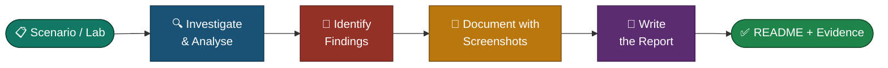

<div align="center">

# 🛡️ Foundational Projects

**Cybersecurity Lab Projects — Section 1 · 10 Projects**

Phishing Investigation · Network Infrastructure · Reconnaissance · Threat Frameworks · Network Forensics · SIEM Triage · Log Analysis · Password Security · Vulnerability Assessment

[](https://www.linkedin.com/in/malaika-azhar-tech)


> 📌 **Note:** These are the concept-building projects — the phase where core cybersecurity skills (SOC triage, network forensics, vulnerability assessment, secure network design) were learned hands-on. They lead into the [`2-Blue-Team-Cybersecurity-Internship`](../2-Blue-Team-Cybersecurity-Internship) reports and the [`3-Advanced-Cyber-Projects`](../3-Advanced-Cyber-Projects) labs. Each project's own README states its scope and limitations.

</div>

---

## 📑 Table of Contents

1. [At a Glance](#at-a-glance)
2. [About This Folder](#about)
3. [Folder Structure](#structure)
4. [Skill Map](#skill-map)
5. [Projects Overview](#projects)
6. [Project Highlights](#highlights)
7. [Scope & Limitations](#scope-limitations)
8. [Skills Demonstrated](#skills)
9. [Tools & Frameworks](#tools)
10. [Suggested Reading Paths](#reading-paths)
11. [How to Navigate](#navigate)
12. [Connect](#connect)

---

<a id="at-a-glance"></a>
## 📊 At a Glance

| 🧩 Projects | 🗂️ Skill Areas | 🖼️ Screenshots | 🧪 Lab Sources |
|:---:|:---:|:---:|:---:|
| **10** | **4** | **87** | **3** |

<sub>Lab sources: Cisco Packet Tracer simulations, TryHackMe rooms, and a local Windows machine.</sub>

---

<a id="about"></a>
## 📖 About This Folder

A collection of **10 hands-on projects** that cover the first steps of a Blue Team path: investigating a phishing email, building and hardening a small network, automating a port scan, mapping a ransomware attack to threat frameworks, reconstructing an attack from a packet capture, triaging SIEM alerts, reading Linux logs for evidence, cracking password hashes, assessing a vulnerable machine, and segmenting a network with VLANs.

### 🎯 What These Projects Demonstrate

- **Investigating** — a spoofed phishing email, a packet capture, and a compromised Linux host
- **Triaging** — real and false-positive alerts in a SIEM, decided on log evidence
- **Securing** — Cisco networks hardened with ACLs, VLANs, port security, and SSH
- **Probing** — port scanning, service detection, web enumeration, and hash cracking in training labs
- **Framing** — a real ransomware case mapped to MITRE ATT&CK, the Pyramid of Pain, and MITRE D3FEND
- **Documenting** — every project records its steps, its evidence, and its stated limits

### 📚 How Each Project Is Documented

| File | Purpose |
|---|---|
| `README.md` | Full write-up: objective, steps, findings, and what the project does and does not claim |
| `INDEX.md` | Quick guide to every step and screenshot in the project |
| `screenshots/` | Numbered evidence for each step |

---

<a id="structure"></a>
## 🧭 Folder Structure

```text
1-Foundational-Projects/
│
├── project-01-phishing-email-investigation/
├── project-02-cisco-infrastructure-secure-routing/
├── project-03-automated-port-scanner/
├── project-04-threat-framework-mapping-wannacry/
├── project-05-network-forensics-wireshark/
├── project-06-siem-alert-triage/
├── project-07-linux-log-analysis-forensics/
├── project-08-password-cracking-hash-analysis/
├── project-09-vulnerability-assessment-report/
├── project-10-vlan-segmentation-intervlan-routing/
│
└── README.md   ← you are here
```

Inside each project folder:

```text
project-XX-name/
├── README.md
├── INDEX.md
└── screenshots/
```

---

<a id="skill-map"></a>
## 🗺️ Skill Map


```mermaid
%%{init: {'theme': 'base', 'themeVariables': {'fontSize': '15px'}, 'flowchart': {'nodeSpacing': 30, 'rankSpacing': 44, 'padding': 10}}}%%
flowchart TB
    ROOT(("🛡️<br/>Foundational Projects")):::root --> BLUE["🔵 Blue Team & SOC"]:::blue
    ROOT --> FOR["🟣 Forensics & Logs"]:::purple
    ROOT --> OFF["🔴 Recon & Assessment"]:::red
    ROOT --> NET["🟠 Network Infrastructure"]:::orange
    BLUE --> B1["P01 Phishing Email Investigation"]:::leafBlue
    BLUE --> B2["P04 Threat Framework Mapping — WannaCry"]:::leafBlue
    BLUE --> B3["P06 SIEM Alert Triage"]:::leafBlue
    FOR --> F1["P05 Network Forensics — Wireshark"]:::leafPurple
    FOR --> F2["P07 Linux Log Analysis & Forensics"]:::leafPurple
    OFF --> O1["P03 Automated Port Scanner"]:::leafRed
    OFF --> O2["P08 Password Cracking & Hash Analysis"]:::leafRed
    OFF --> O3["P09 Vulnerability Assessment Report"]:::leafRed
    NET --> N1["P02 Cisco Infrastructure & Secure Routing"]:::leafOrange
    NET --> N2["P10 VLAN Segmentation & Inter-VLAN Routing"]:::leafOrange
    classDef root fill:#1B2A4A,stroke:#0B1A33,stroke-width:2px,color:#FFFFFF
    classDef blue fill:#1A5276,stroke:#0B2E43,stroke-width:2px,color:#FFFFFF
    classDef purple fill:#5B2C6F,stroke:#3B1A48,stroke-width:2px,color:#FFFFFF
    classDef red fill:#943126,stroke:#571C16,stroke-width:2px,color:#FFFFFF
    classDef orange fill:#B9770E,stroke:#6E4409,stroke-width:2px,color:#FFFFFF
    classDef leafBlue fill:#2E86C1,stroke:#154360,stroke-width:2px,color:#FFFFFF
    classDef leafPurple fill:#76448A,stroke:#432752,stroke-width:2px,color:#FFFFFF
    classDef leafRed fill:#C0392B,stroke:#78281F,stroke-width:2px,color:#FFFFFF
    classDef leafOrange fill:#D68910,stroke:#7E5109,stroke-width:2px,color:#FFFFFF
    linkStyle default stroke:#2C3E50,stroke-width:2px
```
<p align="center"><em>Ten projects across four skill areas: SOC work, forensics, reconnaissance and assessment, and network infrastructure.</em></p>

### 🔄 How a Project Runs


```mermaid
flowchart LR
    A(["📋 Scenario / Lab"]) --> B["🔍 Investigate<br/>& Analyse"]
    B --> C["🎯 Identify<br/>Findings"]
    C --> D["📸 Document with<br/>Screenshots"]
    D --> E["📝 Write<br/>the Report"]
    E --> F(["✅ README + Evidence"])
    style A fill:#117864,color:#fff,stroke:#083D33
    style B fill:#1A5276,color:#fff,stroke:#0B2E43
    style C fill:#943126,color:#fff,stroke:#571C16
    style D fill:#B9770E,color:#fff,stroke:#6E4409
    style E fill:#5B2C6F,color:#fff,stroke:#3B1A48
    style F fill:#1E8449,color:#fff,stroke:#0E4A28
```

---

<a id="projects"></a>
## 📋 Projects Overview

### 🔵 Blue Team & SOC

| # | Project | Focus | Key Tools | Evidence |
|:---:|---|---|---|:---:|
| 01 | [Phishing Email Investigation](./project-01-phishing-email-investigation) | A spoofed PayPal email traced from threat feed to header analysis to multi-vendor confirmation | PhishTank, MXToolbox, VirusTotal | 6 |
| 04 | [Threat Framework Mapping — WannaCry](./project-04-threat-framework-mapping-wannacry) | WannaCry mapped across three frameworks to show how defenders detect and stop ransomware | MITRE ATT&CK, Pyramid of Pain, MITRE D3FEND | 5 |
| 06 | [SIEM Alert Triage](./project-06-siem-alert-triage) | Two look-alike phishing alerts triaged to opposite verdicts on log evidence | TryHackMe SOC Simulator, Splunk | 12 |

### 🟣 Forensics & Logs

| # | Project | Focus | Key Tools | Evidence |
|:---:|---|---|---|:---:|
| 05 | [Network Forensics with Wireshark](./project-05-network-forensics-wireshark) | An FTP brute-force and malware-upload attack reconstructed from a raw packet capture | Wireshark, TryHackMe | 6 |
| 07 | [Linux Log Analysis & Forensics](./project-07-linux-log-analysis-forensics) | A compromised host's entry point, persistence, tooling, and scanning rebuilt from built-in logs | `grep`, auth.log, dpkg.log, auditd | 7 |

### 🔴 Recon & Assessment

| # | Project | Focus | Key Tools | Evidence |
|:---:|---|---|---|:---:|
| 03 | [Automated Port Scanner](./project-03-automated-port-scanner) | A Python wrapper around Nmap for open ports and service versions, built and debugged | Python, Nmap, Npcap, python-nmap | 6 |
| 08 | [Password Cracking & Hash Analysis](./project-08-password-cracking-hash-analysis) | Three hashes identified and cracked with a dictionary attack | hashid, John the Ripper, rockyou.txt | 8 |
| 09 | [Vulnerability Assessment Report](./project-09-vulnerability-assessment-report) | A full black-box assessment from reconnaissance to root on a training machine | Nmap, Gobuster, curl, GTFOBins | 7 |

### 🟠 Network Infrastructure

| # | Project | Focus | Key Tools | Evidence |
|:---:|---|---|---|:---:|
| 02 | [Cisco Infrastructure & Secure Routing](./project-02-cisco-infrastructure-secure-routing) | A small company network with static routing, then firewall rules hardened with ACLs | Cisco Packet Tracer, Cisco IOS | 9 |
| 10 | [VLAN Segmentation & Inter-VLAN Routing](./project-10-vlan-segmentation-intervlan-routing) | Three VLANs across two switches, routed, with DHCP, SSH, port security, and an ACL | Cisco Packet Tracer, Cisco IOS | 21 |

---

<a id="highlights"></a>
## 🌟 Project Highlights

Headline results pulled from the individual project write-ups.

| Project | Highlight |
|:---:|---|
| 01 | Look-alike domain `paypa1.com` (a "1" in place of an "l") flagged by 12 vendors on VirusTotal; a Reply-To redirect found in the headers |
| 02 | First ACL had a default-allow gap that testing PC1 exposed; hardened with default-deny in a second iteration |
| 03 | 3 real environment errors diagnosed and fixed in order, ending in a clean verification scan |
| 04 | Behavioural indicators (unauthorised service creation) shown to outlast file hashes as detection targets |
| 05 | Full attack chain rebuilt from display filters alone — brute force, `shell.php` upload, privilege escalation |
| 06 | One alert closed as a false positive and one escalated as a true positive, decided by ticket history and firewall logs |
| 07 | Brute-force source, backdoor account, installed tool, downloaded scanner, and target range correlated across 4 log sources |
| 08 | All 3 hashes (2 × MD5, 1 × SHA-1) cracked in under a second each |
| 09 | 6 open ports found; upload filter bypassed and a SUID binary used to reach root |
| 10 | 3 VLANs synchronised by VTP; ACL blocks VLAN 10 → 20 while VLAN 20 → 10 still passes; 21 documented steps |

---

<a id="scope-limitations"></a>
## 🚧 Scope & Limitations

Each project is complete within the scope it states. The limits of that scope are listed here:

- **Project 01:** One case study; links were not detonated in a sandbox, and VirusTotal results reflect a single point in time.
- **Project 02:** A simulated environment with one subnet and a standard numbered ACL; VLANs are covered in Project 10.
- **Project 03:** Tested against localhost only; no CVE correlation, and the fixes documented are Windows-specific.
- **Project 04:** Desk-based analysis of one malware family; it names what to monitor but does not write SIEM rules.
- **Project 05:** FTP traffic only, analysed from a pre-recorded training capture rather than live traffic.
- **Project 06:** A simulated environment; 2 of the 5 queued alerts were triaged.
- **Project 07:** Post-compromise log analysis on a single host, using raw command-line logs rather than SIEM or EDR tools.
- **Project 08:** A wordlist attack only, against unsalted training hashes.
- **Project 09:** A training lab with one privilege-escalation path; no persistence or lateral movement.
- **Project 10:** A simulated environment; the ACL covers ICMP only and one direction, and the single uplink has no redundancy.

These limits are marked here instead of hidden, so the portfolio reflects exactly what was done.

---

<a id="skills"></a>
## 🛠️ Skills Demonstrated

### 🔵 Blue Team & SOC
- Investigating a phishing email from its headers, sender domain, and threat-feed reputation
- Triaging SIEM alerts and justifying a false-positive or true-positive verdict with log evidence
- Mapping an attack to MITRE ATT&CK, the Pyramid of Pain, and MITRE D3FEND

### 🟣 Forensics & Logs
- Reconstructing an attack from a packet capture using Wireshark display filters
- Correlating `auth.log`, `syslog`, `dpkg.log`, and auditd records into one attacker timeline

### 🔴 Recon & Assessment
- Automating Nmap scans in Python and debugging the environment around them
- Identifying hash types and recovering weak passwords with a dictionary attack
- Running a black-box assessment: scanning, web enumeration, file-upload bypass, and SUID escalation

### 🟠 Network Infrastructure
- Configuring static routing and addressing on Cisco devices
- Writing, testing, and hardening ACLs
- Building VLANs with VTP, router-on-a-stick routing, DHCP, SSH, and port security

---

<a id="tools"></a>
## 🧰 Tools & Frameworks

`PhishTank` · `MXToolbox` · `VirusTotal` · `Cisco Packet Tracer` · `Python` · `python-nmap` · `Nmap` · `Npcap` · `Wireshark` · `Splunk` · `TryHackMe` · `auditd` · `John the Ripper` · `hashid` · `rockyou.txt` · `Gobuster` · `curl` · `GTFOBins` · `MITRE ATT&CK` · `MITRE D3FEND` · `Pyramid of Pain`

---

<a id="reading-paths"></a>
## 🧭 Suggested Reading Paths

Short routes through the folder, depending on what you want to see.

| If You Want To See | Start Here |
|---|---|
| SOC analyst work | P01 → P06 → P04 |
| Forensic investigation | P05 → P07 |
| Network security | P02 → P10 |
| Offensive and recon basics | P03 → P08 → P09 |
| A short, easy-to-read project | P04 (five modules, desk-based) |
| The full set, in order | P01 → P10 |

---

<a id="navigate"></a>
## 🧭 How to Navigate

1. Pick a project from the [Projects Overview](#projects) tables.
2. Open the project's `INDEX.md` for the step-by-step guide and screenshots, or its `README.md` for the full write-up.
3. When you are done here, continue to the [Blue Team Internship](../2-Blue-Team-Cybersecurity-Internship) reports or the [Advanced Cyber Projects](../3-Advanced-Cyber-Projects), which build on these foundations.

---

<a id="connect"></a>
## 📫 Connect

[](https://www.linkedin.com/in/malaika-azhar-tech)
[](https://github.com/malaika-azhar)

**Location:** Pakistan
