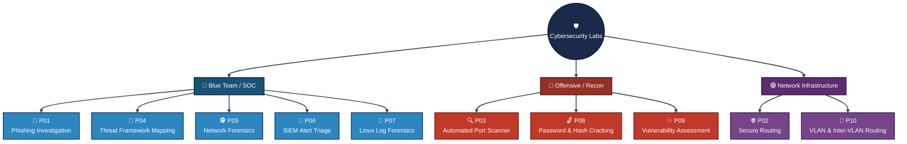

<div align="center">

# 🛡️ Cybersecurity Lab Projects

**Malaika Azhar — Cybersecurity & Network Engineer | SOC & NOC Aspirant | CEH Certified**

[](https://www.linkedin.com/in/malaika-azhar-tech)


> 📌 **Note:** These are foundational, concept-building projects — the phase where core cybersecurity concepts (SOC triage, network forensics, vulnerability assessment) were learned hands-on. They reflect early skill-building work. More advanced, infrastructure-focused projects live in a separate repo.

</div>

---

## 📖 About This Repository

A collection of **10 hands-on cybersecurity projects** covering SOC alert triage, phishing investigation, network reconnaissance, threat intelligence, vulnerability assessment, digital forensics, and network infrastructure security. Each project includes full documentation, CLI commands, and screenshots demonstrating the workflow and findings.

---

## 🧭 Repository Structure

```text
cybersecurity-lab-projects/
│
├── 1-Foundational-Projects/
│   ├── project-01-phishing-email-investigation/
│   │   ├── README.md
│   │   ├── INDEX.md
│   │   └── screenshots/
│   │
│   ├── project-02-cisco-infrastructure-secure-routing/
│   │   ├── README.md
│   │   ├── INDEX.md
│   │   └── screenshots/
│   │
│   ├── project-03-automated-port-scanner/
│   │   ├── README.md
│   │   ├── INDEX.md
│   │   └── screenshots/
│   │
│   ├── project-04-threat-framework-mapping-wannacry/
│   │   ├── README.md
│   │   ├── INDEX.md
│   │   └── screenshots/
│   │
│   ├── project-05-network-forensics-wireshark/
│   │   ├── README.md
│   │   ├── INDEX.md
│   │   └── screenshots/
│   │
│   ├── project-06-siem-alert-triage/
│   │   ├── README.md
│   │   ├── INDEX.md
│   │   └── screenshots/
│   │
│   ├── project-07-linux-log-analysis-forensics/
│   │   ├── README.md
│   │   ├── INDEX.md
│   │   └── screenshots/
│   │
│   ├── project-08-password-cracking-hash-analysis/
│   │   ├── README.md
│   │   ├── INDEX.md
│   │   └── screenshots/
│   │
│   ├── project-09-vulnerability-assessment-report/
│   │   ├── README.md
│   │   ├── INDEX.md
│   │   └── screenshots/
│   │
│   └── project-10-vlan-segmentation-intervlan-routing/
│       ├── README.md
│       ├── INDEX.md
│       └── screenshots/
│
├── LICENSE
└── README.md   ← you are here
```

---

## 🗺️ Skill Coverage Map


```mermaid
%%{init: {'theme': 'base', 'themeVariables': {'fontSize': '15px'}, 'flowchart': {'nodeSpacing': 30, 'rankSpacing': 44, 'padding': 10}}}%%
flowchart TB
    ROOT(("🛡️<br/>Cybersecurity Labs")):::root --> BLUE["🔵 Blue Team / SOC"]:::blue
    ROOT --> RED["🔴 Offensive / Recon"]:::red
    ROOT --> NET["🟣 Network Infrastructure"]:::net
    BLUE --> P01["📧 P01<br/>Phishing Investigation"]:::leafBlue
    BLUE --> P04["🦠 P04<br/>Threat Framework Mapping"]:::leafBlue
    BLUE --> P05["🕵️ P05<br/>Network Forensics"]:::leafBlue
    BLUE --> P06["🚨 P06<br/>SIEM Alert Triage"]:::leafBlue
    BLUE --> P07["🐧 P07<br/>Linux Log Forensics"]:::leafBlue
    RED --> P03["🔍 P03<br/>Automated Port Scanner"]:::leafRed
    RED --> P08["🔓 P08<br/>Password & Hash Cracking"]:::leafRed
    RED --> P09["💥 P09<br/>Vulnerability Assessment"]:::leafRed
    NET --> P02["🌐 P02<br/>Secure Routing"]:::leafNet
    NET --> P10["🏢 P10<br/>VLAN & Inter-VLAN Routing"]:::leafNet
    classDef root fill:#1B2A4A,stroke:#0B1A33,stroke-width:2px,color:#FFFFFF
    classDef blue fill:#1A5276,stroke:#0B2E43,stroke-width:2px,color:#FFFFFF
    classDef red fill:#943126,stroke:#571C16,stroke-width:2px,color:#FFFFFF
    classDef net fill:#5B2C6F,stroke:#3B1A48,stroke-width:2px,color:#FFFFFF
    classDef leafBlue fill:#2E86C1,stroke:#154360,stroke-width:2px,color:#FFFFFF
    classDef leafRed fill:#C0392B,stroke:#78281F,stroke-width:2px,color:#FFFFFF
    classDef leafNet fill:#76448A,stroke:#432752,stroke-width:2px,color:#FFFFFF
    linkStyle default stroke:#2C3E50,stroke-width:2px
```
<p align="center"><em>Ten projects split across three tracks — Blue Team/SOC, offensive/recon fundamentals, and network infrastructure — all rooted in the same hands-on portfolio.</em></p>

---

## 📋 Projects Overview

| # | Project | Focus Area | Key Tools |
|:---:|---|---|---|
| 01 | [Phishing Email Investigation](./project-01-phishing-email-investigation) | Phishing analysis, IOC hunting | Email headers, VirusTotal |
| 02 | [Cisco Infrastructure Secure Routing](./project-02-cisco-infrastructure-secure-routing) | Network infrastructure security | Cisco IOS |
| 03 | [Automated Port Scanner](./project-03-automated-port-scanner) | Reconnaissance automation | Python, Nmap |
| 04 | [Threat Framework Mapping — WannaCry](./project-04-threat-framework-mapping-wannacry) | Threat intelligence, MITRE ATT&CK | ATT&CK, D3FEND, Pyramid of Pain |
| 05 | [Network Forensics — Wireshark](./project-05-network-forensics-wireshark) | Packet analysis | Wireshark |
| 06 | [SIEM Alert Triage](./project-06-siem-alert-triage) | SOC alert investigation | SIEM, Splunk |
| 07 | [Linux Log Analysis & Forensics](./project-07-linux-log-analysis-forensics) | Log-based forensics | Linux logs, auditd |
| 08 | [Password Cracking & Hash Analysis](./project-08-password-cracking-hash-analysis) | Credential security | John the Ripper |
| 09 | [Vulnerability Assessment Report](./project-09-vulnerability-assessment-report) | Vulnerability scanning & reporting | Nmap, Gobuster, GTFOBins |
| 10 | [VLAN Segmentation & Inter-VLAN Routing](./project-10-vlan-segmentation-intervlan-routing) | Network segmentation | Cisco IOS |

---

## 🔄 Project Workflow (General Pattern)


```mermaid
%%{init: {'theme': 'base', 'themeVariables': {'fontSize': '15px'}, 'flowchart': {'nodeSpacing': 30, 'rankSpacing': 46, 'padding': 10}}}%%
flowchart LR
    A["🎯 Scope the<br/>objective"]:::step --> B["🛠️ Run the<br/>tool/technique"]:::step
    B --> C["🚨 Hit a real<br/>issue or finding"]:::alert
    C --> D["🔧 Diagnose<br/>& fix / confirm"]:::step
    D --> E["📸 Screenshot +<br/>document evidence"]:::step
    E --> F["✅ Verify result<br/>& write up lessons"]:::done
    classDef step fill:#1A5276,stroke:#0B2E43,stroke-width:2px,color:#FFFFFF
    classDef alert fill:#943126,stroke:#571C16,stroke-width:2px,color:#FFFFFF
    classDef done fill:#117864,stroke:#083D33,stroke-width:2px,color:#FFFFFF
    linkStyle default stroke:#2C3E50,stroke-width:2px
```
<p align="center"><em>Every project in this repo follows the same discipline: a real finding along the way, evidence for each step, and verification before calling it done — not just a clean final screenshot.</em></p>

---

## 🧰 Topics Covered

`SOC` · `Blue Team` · `Red Team` · `Incident Response` · `Vulnerability Assessment` · `Penetration Testing` · `Digital Forensics` · `Threat Intelligence` · `Wireshark` · `Nmap` · `Splunk` · `Cisco Networking` · `Cybersecurity`

---

## 📫 Connect

[](https://www.linkedin.com/in/malaika-azhar-tech)
[](https://github.com/malaika-azhar)

**Location:** Pakistan

</div>
