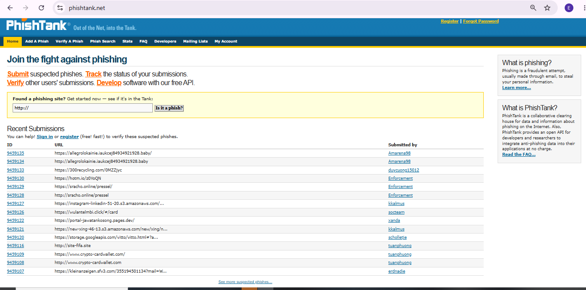
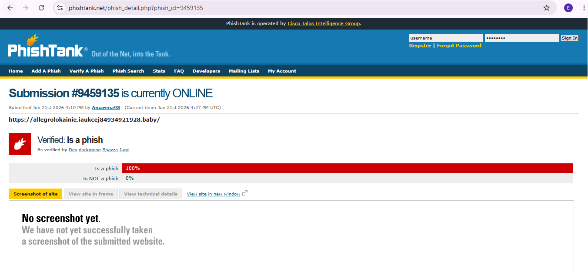
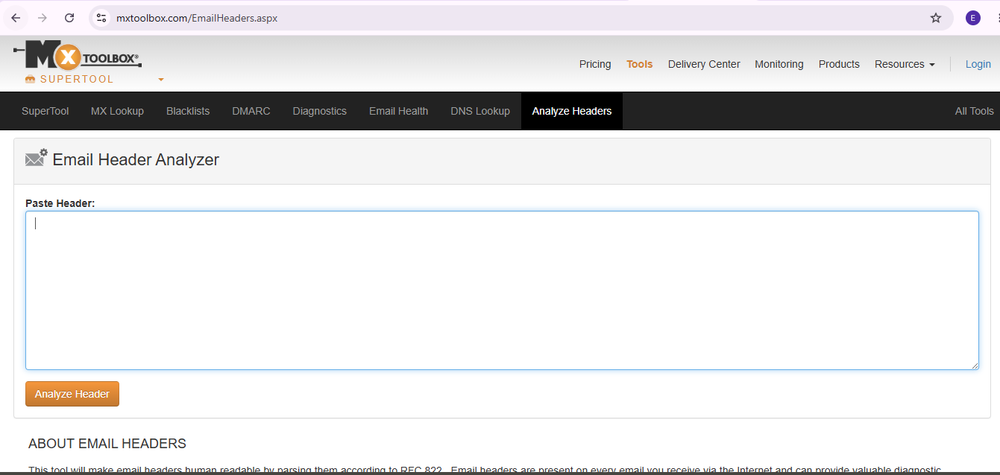
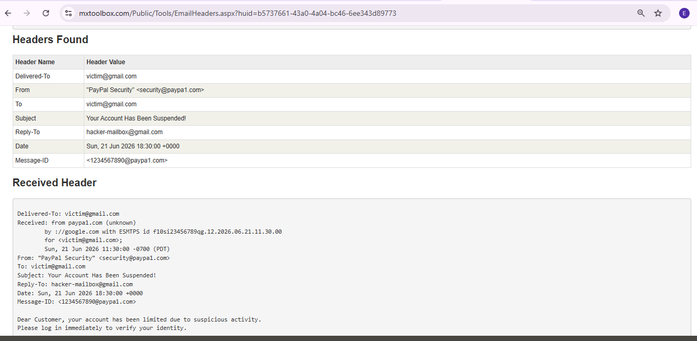
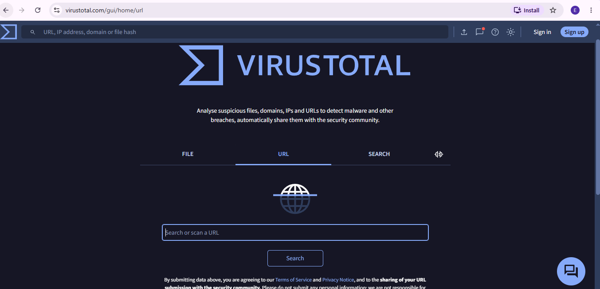
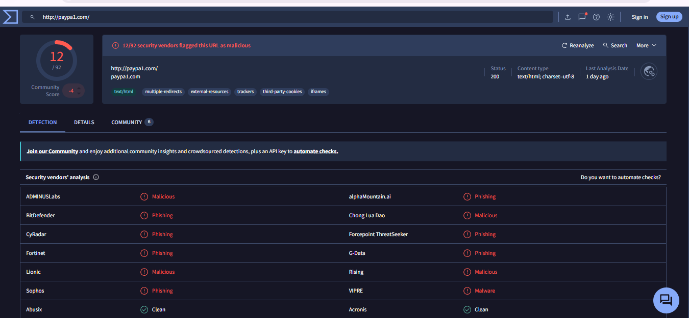

# 🎣 Project 01 — Index
### Phishing Email Investigation — PayPal Spoof
**Project 01 of 10 — Foundational Projects**

**Quick guide to every step and screenshot in this project.**

### [📖 Open the full README](README.md)

---

| 🧩 Phases | 🖼️ Screenshots | 🛠️ Tools Used | 🚩 Vendors Flagging Domain |
|:---:|:---:|:---:|:---:|
| **6** | **6** | **3** | **12** |

🧩 <b>Case:</b> PhishTank Submission ID 9459135 · Spoofed domain <code>paypa1.com</code> vs real <code>paypal.com</code>

---

## 📑 Step Index

| # | Step | Module | Result | Evidence |
|:---:|---|:---:|---|:---:|
| 1 | Open PhishTank's main platform | 🔵 Module 1 | Live phishing feed reviewed as baseline | [Exhibit 1](#ex1) |
| 2 | Open a live submission | 🔵 Module 2 | Case ID 9459135 opened and inspected | [Exhibit 2](#ex2) |
| 3 | Open MXToolbox's Email Header Analyzer | 🟠 Module 3 | Analyzer ready for the raw header | [Exhibit 3](#ex3) |
| 4 | Read the header analysis results | 🟠 Module 4 | Fake `paypa1.com` and Reply-To redirect confirmed | [Exhibit 4](#ex4) |
| 5 | Open VirusTotal's URL scanner | 🟢 Module 5 | Domain `paypa1.com` submitted for scanning | [Exhibit 5](#ex5) |
| 6 | Review the scan verdict | 🟢 Module 6 | 12 vendors flag the domain as malicious | [Exhibit 6](#ex6) |

---

## 🔵 Module 1–2 — Source Intake

Exhibits 1 to 2.

<table>
<tr>
<td align="center" valign="top" width="50%">

 <b>Exhibit 1 — PhishTank home</b>
 Main platform reviewed as the baseline reference
</td>
<td align="center" valign="top" width="50%">

 <b>Exhibit 2 — Live case opened</b>
 Submission ID 9459135 inspected
</td>
</tr>
</table>

---

## 🟠 Module 3–4 — Header Forensics

Exhibits 3 to 4.

<table>
<tr>
<td align="center" valign="top" width="50%">

 <b>Exhibit 3 — Header analyzer ready</b>
 MXToolbox Email Header Analyzer opened for input
</td>
<td align="center" valign="top" width="50%">

 <b>Exhibit 4 — Spoof and redirect confirmed</b>
 Fake <code>paypa1.com</code> and Reply-To mismatch in the header data
</td>
</tr>
</table>

---

## 🟢 Module 5–6 — Reputation Confirmation

Exhibits 5 to 6.

<table>
<tr>
<td align="center" valign="top" width="50%">

 <b>Exhibit 5 — VirusTotal scanner</b>
 URL scanner interface, ready to scan the domain
</td>
<td align="center" valign="top" width="50%">

 <b>Exhibit 6 — Scan verdict</b>
 12 vendors flag <code>paypa1.com</code> as malicious
</td>
</tr>
</table>

---

## 📝 Verdict

**True Positive** — confirmed phishing: spoofed domain, spoofed sender, and a Reply-To redirect set up to capture victim responses.

| Element | Finding |
|---|---|
| Displayed sender | "PayPal" (fake) |
| Actual domain | `paypa1.com` |
| Reply-To | `hacker-mailbox@gmail.com` |
| Reputation | Malicious — 12 vendors (VirusTotal) |

---

## 🎯 Verification Checklist

| Check | Method | Module | Status |
|:---:|---|---|:---:|
| Live case pulled | PhishTank Submission ID 9459135 | Module 2 | ✅ Confirmed |
| Real sender domain identified | MXToolbox header analysis | Module 4 | ✅ Confirmed |
| Reply-To redirect detected | MXToolbox header analysis | Module 4 | ✅ Confirmed |
| Independent reputation check | VirusTotal multi-vendor scan | Module 6 | ✅ Confirmed (12 vendors) |
| Cross-tool corroboration | Header findings vs reputation scan | Modules 4 + 6 | ✅ Confirmed (agree) |

> [!NOTE]
> The spoof swaps the numeral **"1"** for the lowercase **"l"** (`paypa1.com` vs `paypal.com`) — a look-alike built to defeat a quick visual check, which is why the case was verified with tools rather than by eye.

---

[⬆️ Back to top](#top) &nbsp;·&nbsp; [📖 Full README](README.md)

🎣 **[PhishTank](https://phishtank.org/)** · 📬 **[MXToolbox](https://mxtoolbox.com/EmailHeaders.aspx)** · 🌐 **[VirusTotal](https://www.virustotal.com/)**

