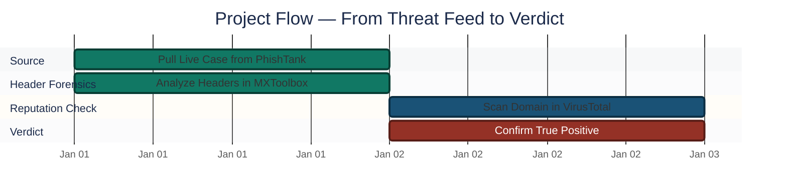
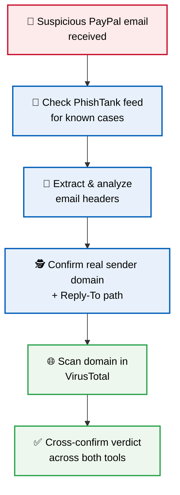
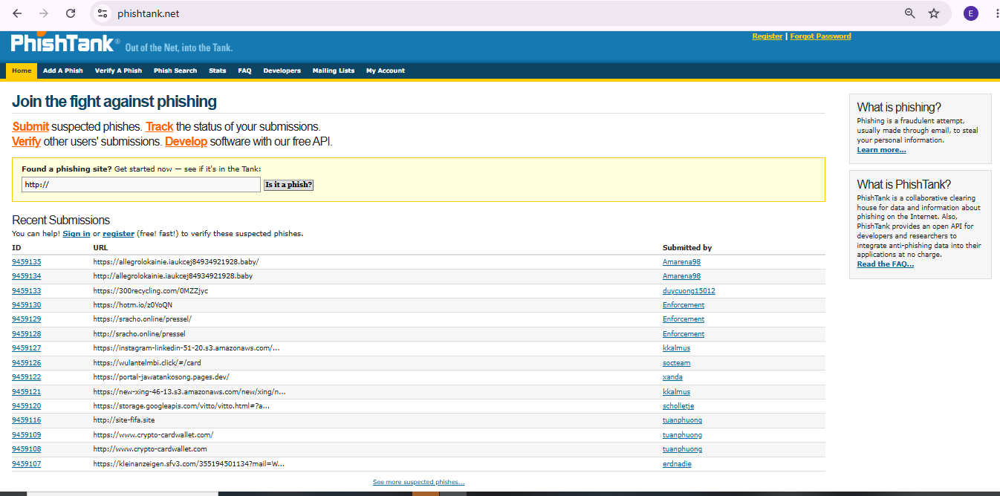
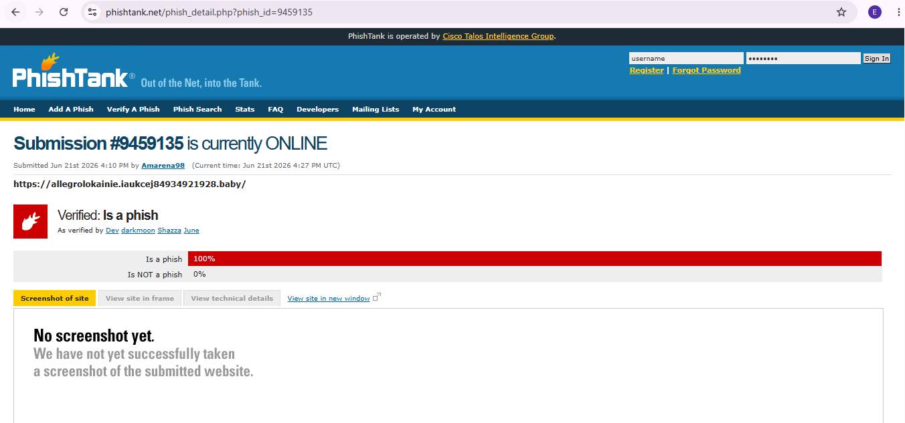
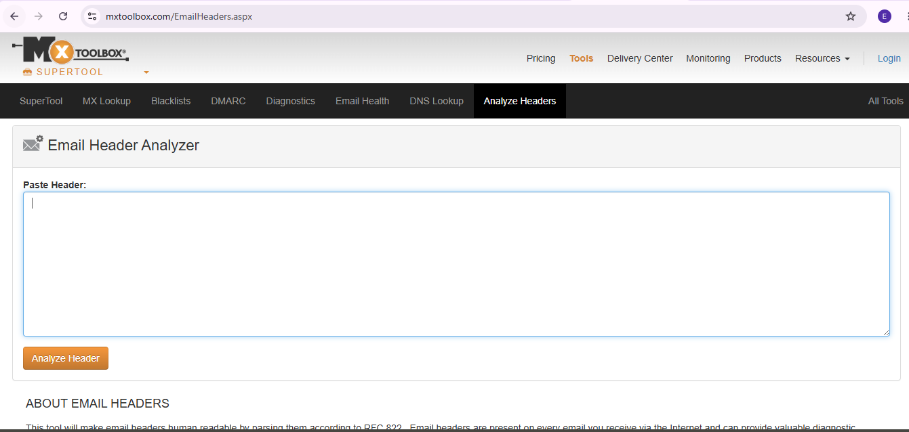
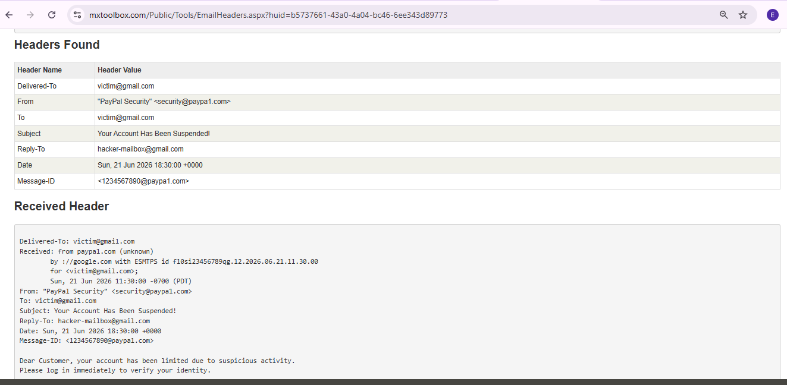
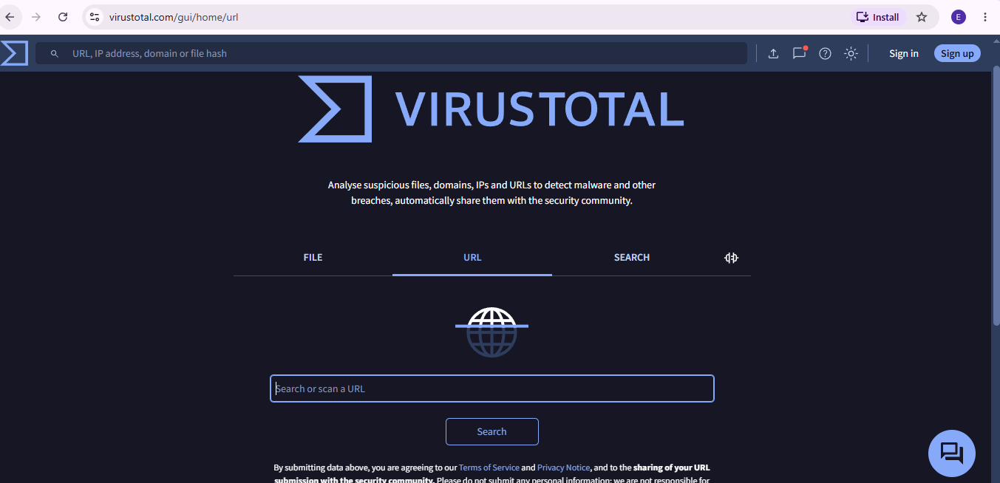
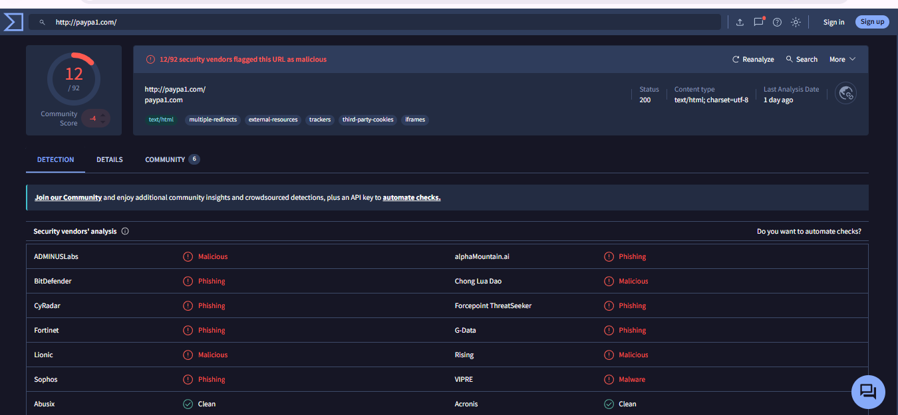

<div align="center">

# 🎣 Phishing Email Investigation — PayPal Spoof

**Project 01 of 10 — Foundational Projects**

Phishing Analysis & Email Forensics


A phishing email impersonating PayPal, traced from a single spoofed domain guess to a fully evidence-backed verdict — header analysis exposing a hidden reply-to redirect, and multi-vendor reputation scanning confirming it independently.

</div>

---

## 📑 Table of Contents

1. [At a Glance](#at-a-glance)
2. [Project Background](#project-background)
3. [Environment](#environment)
4. [Project Flow](#project-flow)
5. [Investigation Walkthrough](#investigation-walkthrough)
6. [Findings Summary](#findings-summary)
7. [Verdict](#verdict)
8. [What I Missed](#what-i-missed)
9. [Challenges & Fixes](#challenges-fixes)
10. [Scope & Limitations](#scope-limitations)
11. [Key Lessons Learned](#key-lessons-learned)
12. [Skills Demonstrated](#skills-demonstrated)
13. [Screenshot Index](#screenshot-index)
14. [Repo Structure](#repo-structure)

---

<a id="at-a-glance"></a>
## 📊 At a Glance

| 🧩 Phases | 🖼️ Screenshots | 🛠️ Tools Used | 🚩 Vendors Flagging Domain |
|:---:|:---:|:---:|:---:|
| **6** | **6** | **3** | **12** |

---

<a id="project-background"></a>
## 📖 Project Background

A phishing email impersonating PayPal claimed the recipient's account was locked. Default assumption: **domain spoofing** — a look-alike domain instead of the real `paypal.com`.

Three tools were used to confirm or rule this out:

- **PhishTank** — live phishing URL database, for cross-referencing against community-reported cases
- **MXToolbox** — email header analyzer, to reveal the real sender domain and routing hidden behind the display name
- **VirusTotal** — multi-engine reputation scan, to check the domain against dozens of security vendors at once

> [!NOTE]
> The spoof used the numeral **"1"** in place of the lowercase letter **"l"** (`paypa1.com` vs `paypal.com`) — a look-alike domain built specifically to defeat a quick visual scan.

---

<a id="environment"></a>
## 🖧 Environment

| Item | Value |
|---|---|
| **Case Source** | PhishTank live submission feed |
| **Submission ID** | 9459135 |
| **Header Analysis Tool** | MXToolbox Email Header Analyzer |
| **Reputation Tool** | VirusTotal URL/domain scanner |
| **Suspicious Domain** | `paypa1.com` |
| **Real Domain (spoofed)** | `paypal.com` |

---

<a id="project-flow"></a>
## ⏱️ Project Flow


<p align="center"><em>Colors distinguish each investigation stage — all stages complete.</em></p>

---

<a id="investigation-walkthrough"></a>
## 🔵 Investigation Walkthrough

**Objective:** Move from a visual hunch ("this looks off") to a documented, evidence-backed verdict using header analysis and reputation tools — not gut feeling.



### Phase 1 — Accessing the Phishing Threat Database ✅
Opened PhishTank's main platform to check current phishing trends and reported URLs.

<p align="center">
  <br>
  <em>Phase 1 — PhishTank main platform, baseline reference</em>
</p>

### Phase 2 — Extracting a Live Threat Link ✅
Navigated PhishTank's live submission feed and opened an active case (**Submission ID: 9459135**) to inspect a real, currently-tracked phishing report.

<p align="center">
  <br>
  <em>Phase 2 — Live phishing case (ID 9459135) details</em>
</p>

### Phase 3 — Setting Up Email Header Analysis ✅
Opened MXToolbox's Email Header Analyzer to inspect the hidden technical routing data behind the suspicious email.

<p align="center">
  <br>
  <em>Phase 3 — Email Header Analyzer tool, ready for input</em>
</p>

### Phase 4 — Tracking Sender Spoofing & Mail Route Mismatches ✅
Pasted the email's header data into the analyzer. The results confirmed the spoofing hypothesis and surfaced something worse:

- **Sender domain:** confirmed as the fake `paypa1.com` — not the real `paypal.com`
- **Reply-To mismatch:** any reply from the victim would route directly to `hacker-mailbox@gmail.com`, not PayPal

<p align="center">
  <br>
  <em>Phase 4 — Spoofed domain and Reply-To mismatch confirmed</em>
</p>

### Phase 5 — Preparing the Link Reputation Scan ✅
With the fake domain confirmed via headers, moved to verify it independently using VirusTotal's URL scanner.

<p align="center">
  <br>
  <em>Phase 5 — VirusTotal URL scanner interface</em>
</p>

### Phase 6 — Final Reputation Scan Results ✅
Scanned `paypa1.com` directly.

<p align="center">
  <br>
  <em>Phase 6 — 12 vendors flag <code>paypa1.com</code> as malicious</em>
</p>

🎯 **Result:** 12 security vendors flagged the domain as malicious/phishing — independent confirmation of what the header analysis already showed.

---

<a id="findings-summary"></a>
## 🌟 Findings Summary

| 🔍 Check | ✅ Result | 📌 Detail |
|---|---|---|
| Domain spoofing | Confirmed | `paypa1.com` impersonating `paypal.com` |
| Reply-To redirect | Confirmed | Routes to `hacker-mailbox@gmail.com` |
| Reputation scan | 12/∼90 vendors flagged | VirusTotal, cross-confirms header findings |
| Source case | Live | PhishTank Submission ID 9459135 |

---

<a id="verdict"></a>
## 📝 Verdict

**True Positive.** Confirmed phishing attack — spoofed domain, spoofed sender, and a reply-to redirect set up to capture victim responses directly.

| Element | Finding |
|---|---|
| Displayed sender | "PayPal" (fake) |
| Actual domain | `paypa1.com` |
| Reply-To | `hacker-mailbox@gmail.com` |
| Reputation | Malicious — 12 vendors (VirusTotal) |

---

<a id="what-i-missed"></a>
## ⚠️ What I Missed

On first look, the visual trick worked — `paypa1.com` (with the numeral "1") is nearly indistinguishable from `paypal.com` (lowercase "l") at a glance, especially in a font where the two characters look almost identical. The spoof was only caught once I stopped relying on visual inspection and ran the domain through actual technical tools.

---

<a id="challenges-fixes"></a>
## ⚠️ Challenges & Fixes

| ❌ Challenge | ✅ Fix |
|---|---|
| Look-alike domain nearly identical to the real one at a glance | Stopped relying on visual inspection; verified via MXToolbox header data instead |
| Display name alone suggested a legitimate PayPal sender | Traced the actual sending domain in the raw header, not the display name |
| Needed independent confirmation beyond header analysis | Cross-checked the domain against VirusTotal's multi-vendor reputation scan |

---

<a id="scope-limitations"></a>
## 🚧 Scope & Limitations

- **Single case study:** Investigation covers one PhishTank submission (ID 9459135), not a bulk sample.
- **No sandbox detonation:** The malicious link/domain was assessed via reputation and header data only — not executed in an isolated environment.
- **Static point-in-time scan:** VirusTotal results reflect vendor detections at time of scan; reputation data can change.

---

<a id="key-lessons-learned"></a>
## 🧠 Key Lessons Learned

- **Never trust the display name.** The visible sender name on an email means nothing — only the actual domain in the header matters.
- **Automate the check, don't eyeball it.** Look-alike domains are specifically designed to defeat a quick visual scan. Tools like MXToolbox and VirusTotal catch what the eye is built to miss.
- **Corroborate across independent sources.** Header analysis and reputation scanning came from separate tools and still agreed — that agreement is what turns a hunch into a verdict.

---

<a id="skills-demonstrated"></a>
## 🛠️ Skills Demonstrated

- Cross-referencing a suspicious link against a live phishing threat database (PhishTank)
- Reading raw email headers to identify the true sender domain and routing path
- Detecting Reply-To redirection used to hijack victim responses
- Running multi-vendor domain/URL reputation scans (VirusTotal)
- Building a documented, evidence-backed verdict rather than relying on visual judgment
- Standard SOC Tier 1 triage workflow: user report → technical verification → true/false positive verdict

---

<a id="screenshot-index"></a>
## 🖼️ Screenshot Index

| # | File | Shows |
|:---:|---|---|
| 1 | `S1_PhishTank_Home_Page.PNG` | PhishTank main platform, baseline reference |
| 2 | `S2_PhishTank_Link_Details.PNG` | Live phishing case (ID 9459135) details |
| 3 | `S3_MXToolbox_Analyzer_Page.PNG` | Email Header Analyzer tool, ready for input |
| 4 | `S4_MXToolbox_Analysis_Results.PNG` | Spoofed domain and Reply-To mismatch confirmed |
| 5 | `S5_VirusTotal_Home_Page.PNG` | VirusTotal URL scanner interface |
| 6 | `S6_VirusTotal_Scan_Results.PNG` | 12 vendors flag `paypa1.com` as malicious |

---

<a id="repo-structure"></a>
## 📁 Repo Structure

```text
1-Foundational-Projects/project-01-phishing-email-investigation/
|-- README.md
`-- screenshots/
    |-- S1_PhishTank_Home_Page.PNG
    |-- S2_PhishTank_Link_Details.PNG
    |-- S3_MXToolbox_Analyzer_Page.PNG
    |-- S4_MXToolbox_Analysis_Results.PNG
    |-- S5_VirusTotal_Home_Page.PNG
    `-- S6_VirusTotal_Scan_Results.PNG
```

<div align="center">

🎣 **[PhishTank](https://phishtank.org/)** · 📬 **[MXToolbox](https://mxtoolbox.com/EmailHeaders.aspx)** · 🌐 **[VirusTotal](https://www.virustotal.com/)**

</div>
