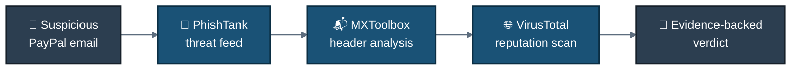
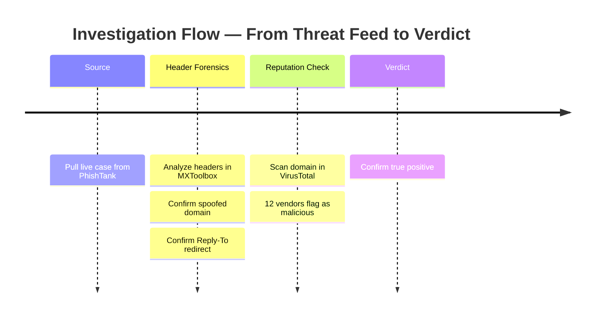

<div align="center">

# 🎣 Phishing Email Investigation — PayPal Spoof

**Project 01 of 10 — Foundational Projects — Cybersecurity Lab Projects Portfolio**

Phishing Analysis & Email Forensics — Header Inspection, Reply-To Redirect Detection, and Multi-Vendor Reputation Scanning


Six phases run end-to-end on a live phishing case — from a single spoofed-domain guess to a fully evidence-backed verdict — using header forensics to expose a hidden reply-to redirect, and multi-vendor reputation scanning to confirm it independently.

</div>

---

## 📑 Table of Contents

1. [At a Glance](#at-a-glance)
2. [Project Background](#project-background)
3. [Tools & Technologies](#tools-technologies)
4. [Case Environment](#case-environment)
5. [Investigation Toolkit Map](#investigation-toolkit-map)
6. [Investigation Timeline](#investigation-timeline)
7. [Module 1 — Access the Phishing Threat Database](#module-1)
8. [Module 2 — Extract a Live Threat Case](#module-2)
9. [Module 3 — Set Up Email Header Analysis](#module-3)
10. [Module 4 — Track Sender Spoofing & Mail Route Mismatches](#module-4)
11. [Module 5 — Prepare the Link Reputation Scan](#module-5)
12. [Module 6 — Read the Final Reputation Scan Results](#module-6)
13. [Verdict](#verdict)
14. [Coverage Snapshot](#coverage-snapshot)
15. [Reference Tools Summary](#reference-tools-summary)
16. [Challenges & Fixes](#challenges-fixes)
17. [Scope & Limitations](#scope-limitations)
18. [What I Learned](#what-i-learned)
19. [Skills Demonstrated](#skills-demonstrated)
20. [Screenshot Index](#screenshot-index)
21. [Repo Structure](#repo-structure)

---

<a id="at-a-glance"></a>
## 📊 At a Glance

<div align="center">

| 🧩 Phases | 🖼️ Screenshots | 🛠️ Tools Used | 🚩 Vendors Flagging Domain |
|:---:|:---:|:---:|:---:|
| **6** | **6** | **3** | **12** |

</div>

---

<a id="project-background"></a>
## 📖 Project Background

A phishing email impersonating PayPal claimed the recipient's account was locked. Default assumption: **domain spoofing** — a look-alike domain standing in for the real `paypal.com`. Rather than trust that hunch, the case was run through three independent tools until the assumption became a documented, evidence-backed verdict.

| Module Group | Focus |
|---|---|
| 🎣 **Source Intake (Module 1–2)** | PhishTank home platform, live submission feed, case ID pulled |
| 🧾 **Header Forensics (Module 3–4)** | MXToolbox analyzer setup, sender domain and Reply-To mismatch confirmed |
| 🌐 **Reputation Confirmation (Module 5–6)** | VirusTotal scanner setup, multi-vendor scan results read |

> [!NOTE]
> The spoof used the numeral **"1"** in place of the lowercase letter **"l"** (`paypa1.com` vs `paypal.com`) — a look-alike domain built specifically to defeat a quick visual scan.

---

<a id="tools-technologies"></a>
## 🛠️ Tools & Technologies

| Tool | Purpose |
|------|---------|
| 🎣 PhishTank | Live phishing URL/domain threat database, for cross-referencing reported cases |
| 📬 MXToolbox Email Header Analyzer | Reveals the real sender domain and routing hidden behind a display name |
| 🌐 VirusTotal | Multi-engine reputation scan, checks a domain against dozens of security vendors at once |

---

<a id="case-environment"></a>
## 🖧 Case Environment

| Item | Value |
|------|--------|
| Case Source | PhishTank live submission feed |
| Submission ID | 9459135 |
| Header Analysis Tool | MXToolbox Email Header Analyzer |
| Reputation Tool | VirusTotal URL/domain scanner |
| Suspicious Domain | `paypa1.com` |
| Real Domain (spoofed) | `paypal.com` |

---

<a id="investigation-toolkit-map"></a>
## 🗺️ Investigation Toolkit Map


```mermaid
flowchart LR
    A["📧 Suspicious<br/>PayPal email"]:::stage
    B["🎣 PhishTank<br/>threat feed"]:::tool
    C["📬 MXToolbox<br/>header analysis"]:::tool
    D["🌐 VirusTotal<br/>reputation scan"]:::tool
    E["🎯 Evidence-backed<br/>verdict"]:::stage

    A --> B --> C --> D --> E

    classDef stage fill:#2C3E50,stroke:#16202A,stroke-width:2px,color:#FFFFFF
    classDef tool fill:#1A5276,stroke:#0B2E43,stroke-width:2px,color:#FFFFFF
    linkStyle default stroke:#5D6D7E,stroke-width:2px
```
<p align="center"><em>The case moves through three independent tools in sequence — each one adds evidence until the hunch becomes a verdict.</em></p>

---

<a id="investigation-timeline"></a>
## ⏱️ Investigation Timeline


```mermaid
timeline
    title Investigation Flow — From Threat Feed to Verdict
    Source : Pull live case from PhishTank
    Header Forensics : Analyze headers in MXToolbox : Confirm spoofed domain : Confirm Reply-To redirect
    Reputation Check : Scan domain in VirusTotal : 12 vendors flag as malicious
    Verdict : Confirm true positive
```
<p align="center"><em>Four stages read left to right — source intake, header forensics, reputation confirmation, and the final verdict.</em></p>

---

<a id="module-1"></a>
## 🎣 Module 1 — Access the Phishing Threat Database

**Objective:** Open PhishTank to review current phishing trends and reported URLs.

### Step 1 — Open PhishTank's Main Platform ✅

```
Go to: phishtank.org

→ Review the live phishing feed on the home page
→ Note the platform layout as a baseline reference
→ Confirm the feed is community-reported and continuously updated
```

<p align="center">
  <br>
  <em>Exhibit 1 — PhishTank main platform reviewed as the baseline reference</em>
</p>

---

<a id="module-2"></a>
## 🎣 Module 2 — Extract a Live Threat Case

**Objective:** Pull an active, currently-tracked phishing report to investigate.

### Step 2 — Open a Live Submission ✅

```
PhishTank → Live submission feed
→ Locate a recent, active case
→ Open Submission ID: 9459135
→ Review the reported URL, submission date, and current verification status
```

<p align="center">
  <br>
  <em>Exhibit 2 — Live phishing case (ID 9459135) opened for inspection</em>
</p>

---

<a id="module-3"></a>
## 📬 Module 3 — Set Up Email Header Analysis

**Objective:** Open a header analyzer to inspect the hidden technical routing data behind the suspicious email.

### Step 3 — Open MXToolbox's Email Header Analyzer ✅

```
Go to: mxtoolbox.com/EmailHeaders.aspx

→ Copy the full raw header from the suspicious email
  (in most mail clients: Message → View Source / Show Original)
→ Paste the raw header into the analyzer input box
→ Click "Analyze Header"
```

<p align="center">
  <br>
  <em>Exhibit 3 — Email Header Analyzer opened and ready for input</em>
</p>

---

<a id="module-4"></a>
## 📬 Module 4 — Track Sender Spoofing & Mail Route Mismatches

**Objective:** Confirm the real sending domain and check for a Reply-To redirect hidden behind the display name.

### Step 4 — Read the Header Analysis Results ✅

```
MXToolbox results page → review:
→ "From" display name vs actual sending domain
→ Reply-To field — does it match the From domain?
→ Received/routing chain — does every hop make sense?

Findings on this case:
- Sender domain confirmed as fake "paypa1.com" — not real "paypal.com"
- Reply-To mismatch: any reply routes to hacker-mailbox@gmail.com, not PayPal
```

<p align="center">
  <br>
  <em>Exhibit 4 — Spoofed domain and Reply-To mismatch confirmed in the header data</em>
</p>

---

<a id="module-5"></a>
## 🌐 Module 5 — Prepare the Link Reputation Scan

**Objective:** Independently verify the fake domain using a multi-vendor reputation scanner.

### Step 5 — Open VirusTotal's URL Scanner ✅

```
Go to: virustotal.com

→ Select the URL/domain scan tab
→ Enter the suspicious domain: paypa1.com
→ Submit for scanning
```

<p align="center">
  <br>
  <em>Exhibit 5 — VirusTotal URL scanner interface, ready to scan the domain</em>
</p>

---

<a id="module-6"></a>
## 🌐 Module 6 — Read the Final Reputation Scan Results

**Objective:** Cross-confirm the header findings against independent vendor reputation data.

### Step 6 — Review the Scan Verdict ✅

```
VirusTotal results page → review:
→ Detection ratio (vendors flagged / total vendors scanned)
→ Community score and tags (phishing, malicious, suspicious)
→ Any historical detections for the same domain

Result on this case: 12 security vendors flagged paypa1.com as malicious/phishing
```

<p align="center">
  <br>
  <em>Exhibit 6 — 12 vendors flag <code>paypa1.com</code> as malicious, independently confirming the header findings</em>
</p>

---

<a id="verdict"></a>
## 📝 Verdict

**True Positive.** Confirmed phishing attack — spoofed domain, spoofed sender, and a Reply-To redirect set up to capture victim responses directly.

| Element | Finding |
|---|---|
| Displayed sender | "PayPal" (fake) |
| Actual domain | `paypa1.com` |
| Reply-To | `hacker-mailbox@gmail.com` |
| Reputation | Malicious — 12 vendors (VirusTotal) |
| Source case | Live — PhishTank Submission ID 9459135 |

---

<a id="coverage-snapshot"></a>
## 🌟 Coverage Snapshot

| 🛡️ Layer | ✅ Status | 📌 Detail |
|---|---|---|
| Threat feed reviewed | Live | PhishTank home platform reviewed as baseline (Exhibit 1) |
| Live case pulled | Proven | Submission ID 9459135 opened and inspected (Exhibit 2) |
| Header analyzer set up | Live | MXToolbox analyzer opened, raw header ready for input (Exhibit 3) |
| Sender domain & Reply-To checked | Proven | Fake `paypa1.com` and reply redirect confirmed (Exhibit 4) |
| Reputation scanner set up | Live | VirusTotal URL scanner opened, domain submitted (Exhibit 5) |
| Reputation verdict read | Proven | 12/∼90 vendors flagged domain as malicious (Exhibit 6) |
| Cross-tool corroboration | Proven | Header findings and reputation scan independently agree |

---

<a id="reference-tools-summary"></a>
## 📟 Reference Tools Summary

| Tool / URL | Purpose |
|----------------|---------|
| `phishtank.org` | Live phishing threat feed and case lookup |
| `mxtoolbox.com/EmailHeaders.aspx` | Email header analyzer — reveals real sender domain and routing |
| `virustotal.com` | Multi-vendor URL/domain reputation scan |
| Message → View Source / Show Original | Extract raw email headers from a mail client |

---

<a id="challenges-fixes"></a>
## ⚠️ Challenges & Fixes

| ❌ Challenge | ✅ Solution |
|---|---|
| Look-alike domain nearly identical to the real one at a glance | Stopped relying on visual inspection; verified via MXToolbox header data instead |
| Display name alone suggested a legitimate PayPal sender | Traced the actual sending domain in the raw header, not the display name |
| Needed independent confirmation beyond header analysis | Cross-checked the domain against VirusTotal's multi-vendor reputation scan |

---

<a id="scope-limitations"></a>
## 🚧 Scope & Limitations

- **Single case study:** investigation covers one PhishTank submission (ID 9459135), not a bulk sample.
- **No sandbox detonation:** the malicious link/domain was assessed via reputation and header data only — not executed in an isolated environment.
- **Static point-in-time scan:** VirusTotal results reflect vendor detections at time of scan; reputation data can change.

These limits are stated so the project is read as a foundational phishing-analysis exercise, not a full incident-response or malware-sandboxing exercise.

---

<a id="what-i-learned"></a>
## 🧠 What I Learned

- **Never trust the display name.** The visible sender name on an email means nothing — only the actual domain in the header matters.
- **Automate the check, don't eyeball it.** Look-alike domains are specifically designed to defeat a quick visual scan. Tools like MXToolbox and VirusTotal catch what the eye is built to miss.
- **Corroborate across independent sources.** Header analysis and reputation scanning came from separate tools and still agreed — that agreement is what turns a hunch into a verdict.

---

<a id="skills-demonstrated"></a>
## 🛠️ Skills Demonstrated

- Cross-referencing a suspicious link against a live phishing threat database (PhishTank)
- Reading raw email headers to identify the true sender domain and routing path
- Detecting Reply-To redirection used to hijack victim responses
- Running multi-vendor domain/URL reputation scans (VirusTotal)
- Building a documented, evidence-backed verdict rather than relying on visual judgment
- Standard SOC Tier 1 triage workflow: user report → technical verification → true/false positive verdict

---

<a id="screenshot-index"></a>
## 🖼️ Screenshot Index

| # | File | Shows |
|:---:|---|---|
| 1 | `S1_PhishTank_Home_Page.PNG` | PhishTank main platform, baseline reference |
| 2 | `S2_PhishTank_Link_Details.PNG` | Live phishing case (ID 9459135) details |
| 3 | `S3_MXToolbox_Analyzer_Page.PNG` | Email Header Analyzer tool, ready for input |
| 4 | `S4_MXToolbox_Analysis_Results.PNG` | Spoofed domain and Reply-To mismatch confirmed |
| 5 | `S5_VirusTotal_Home_Page.PNG` | VirusTotal URL scanner interface |
| 6 | `S6_VirusTotal_Scan_Results.PNG` | 12 vendors flag `paypa1.com` as malicious |

---

<a id="repo-structure"></a>
## 📁 Repo Structure

```text
1-Foundational-Projects/project-01-phishing-email-investigation/
|-- README.md
`-- screenshots/
    |-- S1_PhishTank_Home_Page.PNG
    |-- S2_PhishTank_Link_Details.PNG
    |-- S3_MXToolbox_Analyzer_Page.PNG
    |-- S4_MXToolbox_Analysis_Results.PNG
    |-- S5_VirusTotal_Home_Page.PNG
    `-- S6_VirusTotal_Scan_Results.PNG
```

<div align="center">

🎣 **[PhishTank](https://phishtank.org/)** · 📬 **[MXToolbox](https://mxtoolbox.com/EmailHeaders.aspx)** · 🌐 **[VirusTotal](https://www.virustotal.com/)**

</div>
