<div align="center">

# 🌐 Cisco Infrastructure & Secure Routing

**Project 02 of 10 — Foundational Projects**

Network Infrastructure & Security


A small company network built in Cisco Packet Tracer — router and switch configured, static IPs assigned to three end devices, and an Access Control List deployed to restrict one host's access. A real ACL misconfiguration was caught mid-build, diagnosed, and fixed — not staged, found through testing.

> [!NOTE]
> This is the foundational networking lab in this portfolio. **Project 10** (VLAN Segmentation & Inter-VLAN Routing) builds directly on this same setup, adding VLANs, VTP synchronization, and advanced security hardening.

</div>

---

## 📑 Table of Contents

1. [At a Glance](#at-a-glance)
2. [Project Background](#project-background)
3. [Environment](#environment)
4. [Project Flow](#project-flow)
5. [Build Process](#build-process)
6. [Findings Summary](#findings-summary)
7. [What I Got Wrong](#what-i-got-wrong)
8. [Challenges & Fixes](#challenges-fixes)
9. [Scope & Limitations](#scope-limitations)
10. [Key Lesson](#key-lesson)
11. [Skills Demonstrated](#skills-demonstrated)
12. [Screenshot Index](#screenshot-index)
13. [Repo Structure](#repo-structure)

---

<a id="at-a-glance"></a>
## 📊 At a Glance

| 🧩 Phases | 🖼️ Screenshots | 🖥️ End Devices | 🔒 ACL Rules Written |
|:---:|:---:|:---:|:---:|
| **9** | **9** | **3** | **2 (1 flawed, 1 fixed)** |

---

<a id="project-background"></a>
## 📖 Project Background

A small company network topology built end-to-end in **Cisco Packet Tracer**: router and switch configured, static IPs assigned to three PCs, then an **Access Control List (ACL)** deployed to restrict a specific host's access. The goal was to practice both basic network setup and firewall rule configuration — including catching and fixing a real misconfiguration along the way rather than presenting only a clean, working result.

---

<a id="environment"></a>
## 🖧 Environment

| Item | Value |
|---|---|
| **Simulation Tool** | Cisco Packet Tracer |
| **Router** | Cisco 2911 |
| **Switch** | Cisco 2960 |
| **End Devices** | 3× PC (PC0, PC1, PC2) |
| **Cabling** | Copper Straight-Through |
| **Router Interface** | GigabitEthernet 0/0 — `192.168.1.1/24` |

---

<a id="project-flow"></a>
## ⏱️ Project Flow

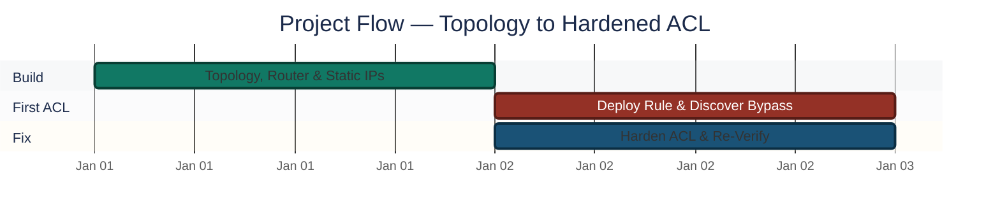
<p align="center"><em>Colors distinguish each build stage — all stages complete.</em></p>

---

<a id="build-process"></a>
## 🔵 Build Process

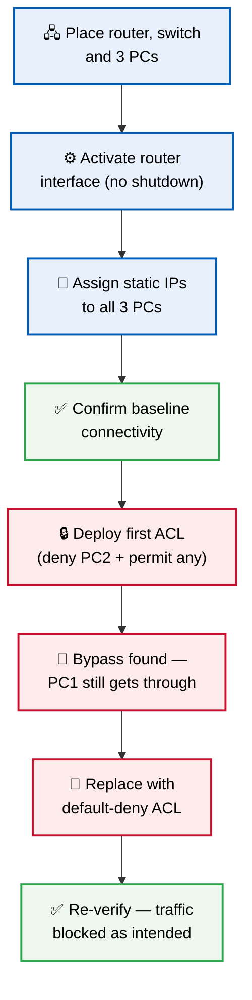

### Phase 1 — Workspace Setup ✅
Opened Cisco Packet Tracer to a blank workspace, ready to place devices.

<p align="center">
  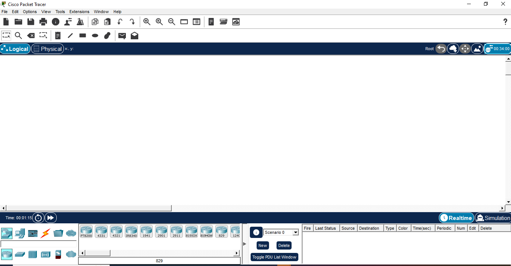<br>
  <em>Phase 1 — Blank Packet Tracer workspace</em>
</p>

### Phase 2 — Network Topology Design ✅
Placed the core devices and connected them:

- **1 Router** (2911 model) — controls the network
- **1 Switch** (2960 model) — connects the end devices
- **3 PCs** (PC0, PC1, PC2)

Connected everything with Copper Straight-Through cables: each PC to a separate switch port, and the switch to the router's GigabitEthernet 0/0 port. At this stage the router-switch link showed **red link lights** — router was not yet active.

<p align="center">
  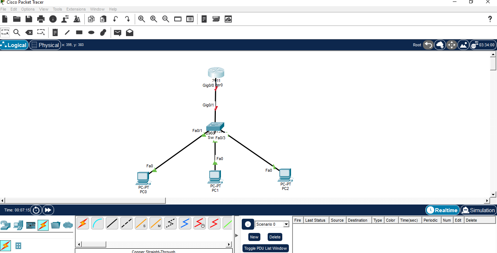<br>
  <em>Phase 2 — Router, switch, and 3 PCs connected</em>
</p>

### Phase 3 — Router Configuration ✅

```text
enable
configure terminal
interface gigabitEthernet 0/0
ip address 192.168.1.1 255.255.255.0
no shutdown
exit
exit
show ip route
```

`no shutdown` activated the interface — link lights turned green immediately. `show ip route` confirmed the network as directly connected in the routing table.

<p align="center">
  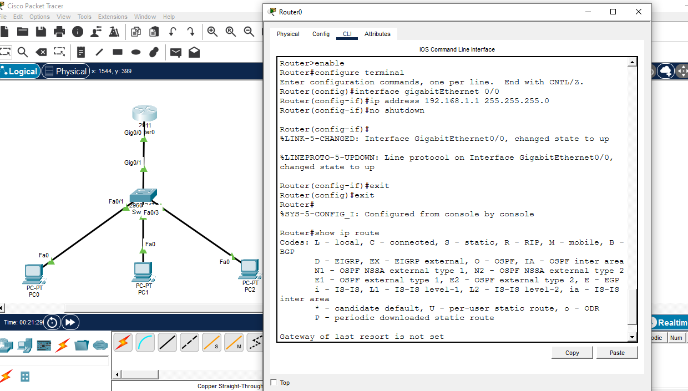<br>
  <em>Phase 3 — Router interface activated, routing table verified</em>
</p>

### Phase 4 — Static IP Assignment on PCs ✅
Assigned static IPs to each PC through Desktop > IP Configuration:

| Device | IP Address | Subnet Mask | Gateway |
|---|---|---|---|
| PC0 | 192.168.1.10 | 255.255.255.0 | 192.168.1.1 |
| PC1 | 192.168.1.20 | 255.255.255.0 | 192.168.1.1 |
| PC2 | 192.168.1.30 | 255.255.255.0 | 192.168.1.1 |

<p align="center">
  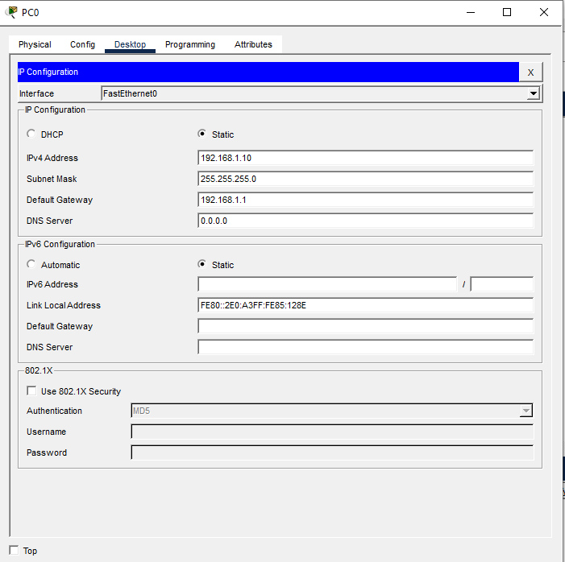<br>
  <em>Phase 4 — Static IP configuration on all 3 PCs</em>
</p>

### Phase 5 — Connectivity Test ✅
Opened PC0's Command Prompt and ran `ping 192.168.1.1`. Got 4 successful replies — confirmed the network was fully functional before adding any security rules.

<p align="center">
  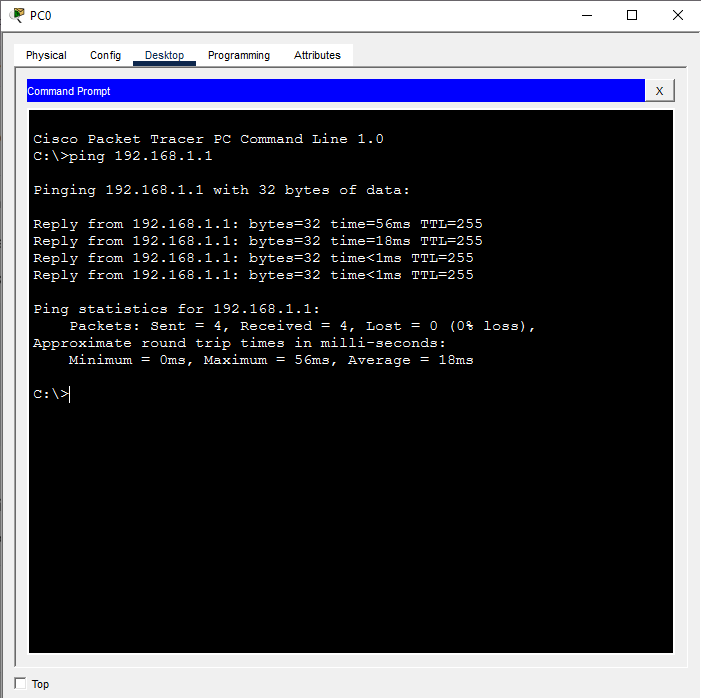<br>
  <em>Phase 5 — Initial connectivity test, pre-firewall</em>
</p>

### Phase 6 — First Firewall Rule ✅
Went back to the router CLI to add a password and a basic ACL intended to block PC2 (`192.168.1.30`):

```text
enable
configure terminal
enable secret MySecurePass123
access-list 10 deny host 192.168.1.30
access-list 10 permit any
interface gigabitEthernet 0/0
ip access-group 10 in
```

<p align="center">
  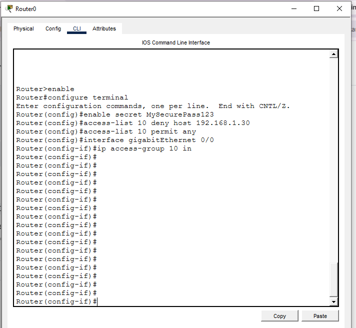<br>
  <em>Phase 6 — First ACL rule blocking PC2</em>
</p>

### Phase 7 — Error: Firewall Bypass ❌
Tested the rule from PC1 (`192.168.1.20`), expecting it to behave like a locked-down network. Ran `ping 192.168.1.1` from PC1 — **it succeeded.**

**Why:** The ACL only explicitly denied PC2 (`192.168.1.30`). The line `access-list 10 permit any` meant every other host — including PC1 — was allowed straight through. The rule did exactly what it was written to do; the mistake was assuming it would restrict the network more broadly than it actually did.

<p align="center">
  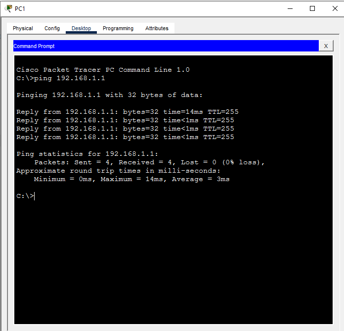<br>
  <em>Phase 7 — Bypass discovered: PC1 ping succeeds unexpectedly</em>
</p>

### Phase 8 — Fix: Hardened ACL ✅
Returned to the router CLI, removed the old rule, and replaced it with a default-deny rule to close the gap:

```text
enable
configure terminal
no access-list 10
access-list 10 deny any
interface gigabitEthernet 0/0
ip access-group 10 in
```

<p align="center">
  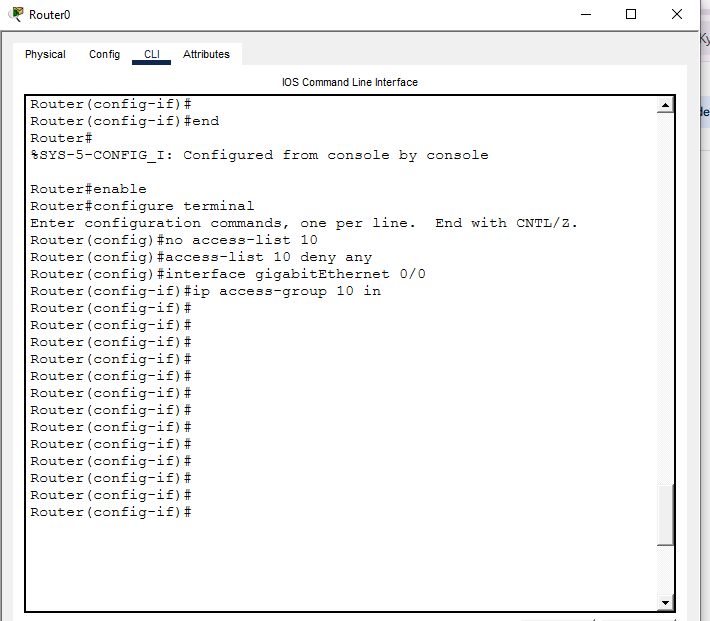<br>
  <em>Phase 8 — Hardened ACL with default-deny rule</em>
</p>

### Phase 9 — Final Verification ✅
Re-tested from PC1 with `ping 192.168.1.1` a third time. This time it failed with `Destination host unreachable` — confirming the hardened rule now blocked traffic as intended.

<p align="center">
  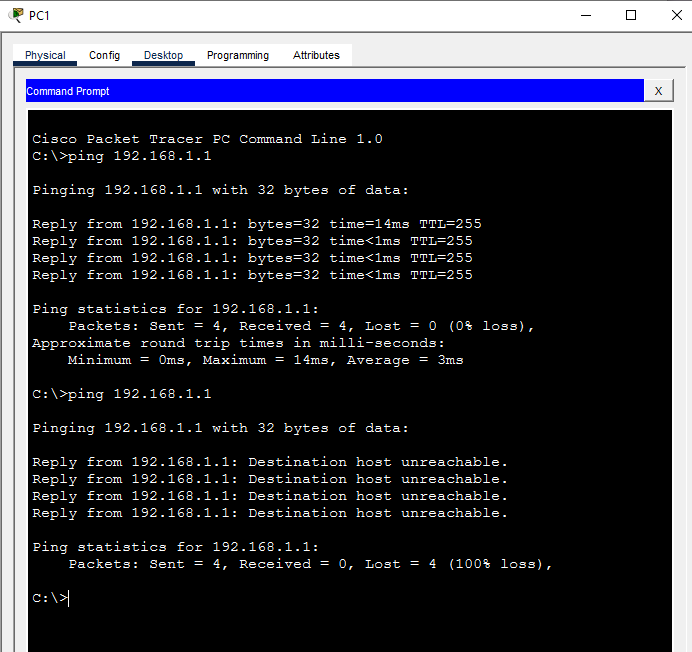<br>
  <em>Phase 9 — Final verification: ping blocked as intended</em>
</p>

🎯 **Result:** Baseline connectivity confirmed, a real ACL scope error caught through testing (not assumed), and the fix independently re-verified.

---

<a id="findings-summary"></a>
## 🌟 Findings Summary

| 🛡️ Layer | ✅ Status | 📌 Detail |
|---|---|---|
| Baseline connectivity | Verified | PC0 → router, 4/4 replies before any ACL |
| First ACL (`deny PC2` + `permit any`) | Flawed | PC1 (untested host) bypassed the rule |
| Hardened ACL (`deny any`) | Verified | PC1 re-test failed as intended — gap closed |

---

<a id="what-i-got-wrong"></a>
## ⚠️ What I Got Wrong

- Assumed an ACL that denied one specific host (PC2) would tighten security for the whole network. It didn't — `permit any` at the end of the list meant every other host, including PC1, stayed fully open.
- Only tested the host expected to fail (PC2 was never re-tested directly in this sequence) instead of also testing a host that should have still been allowed, which is what exposed the gap.

---

<a id="challenges-fixes"></a>
## ⚠️ Challenges & Fixes

| ❌ Challenge | ✅ Fix |
|---|---|
| First ACL blocked only the named host, left everything else open by default | Replaced with `access-list 10 deny any` for a true default-deny posture |
| Router-switch link showed red lights after cabling | Ran `no shutdown` on GigabitEthernet 0/0 to activate the interface |
| Initial testing only covered the host expected to fail | Added a second test on a host that should still pass, to confirm actual rule scope |

---

<a id="scope-limitations"></a>
## 🚧 Scope & Limitations

- **Simulated environment only:** Built and tested in Cisco Packet Tracer, not on physical hardware.
- **Single subnet:** No VLAN segmentation in this project — that's covered separately in Project 10.
- **Basic ACL only:** Standard numbered ACL (source-based); no extended ACL, NAT, or routing protocol configuration included.

---

<a id="key-lesson"></a>
## 🧠 Key Lesson

ACLs are explicit, not assumed. Every host not specifically denied is implicitly permitted unless a default-deny rule is added. **Testing only the host you expect to block isn't enough** — you also need to test a host that should still pass, to confirm the rule's actual scope matches your intended scope. This is one of the most common real-world firewall misconfigurations: admins block the few things they thought of and leave everything else open by default.

---

## 🌍 Real-World Application

This is the exact failure mode behind many real network security incidents — a firewall or ACL that looks restrictive on paper but has an overly broad default-allow behavior underneath. Network engineers and SOC analysts both need to verify ACL/firewall scope by testing edge cases, not just the obvious target, before trusting a rule is doing what it's supposed to.

---

<a id="skills-demonstrated"></a>
## 🛠️ Skills Demonstrated

- Building a router/switch/end-device topology from scratch in Packet Tracer
- Router CLI configuration: interface activation, static IP assignment, `enable secret`
- Writing and deploying numbered ACLs, including default-deny hardening
- Diagnosing a firewall rule that "looks right" but doesn't behave as scoped
- Validating security rules against both the expected-fail case and an expected-pass case

---

<a id="screenshot-index"></a>
## 🖼️ Screenshot Index

| # | File | Shows |
|:---:|---|---|
| 1 | `1_Cisco_Packet_Tracer_Workspace.PNG` | Blank Packet Tracer workspace |
| 2 | `2_Network_Topology_Design.PNG` | Router, switch, and 3 PCs connected |
| 3 | `3_Router_IP_and_Routing_Table.PNG` | Router interface activated, routing table verified |
| 4 | `4_PC_IP_Configuration.PNG` | Static IP configuration on all 3 PCs |
| 5 | `5_Ping_Success_Test.PNG` | Initial connectivity test, pre-firewall |
| 6 | `6_Router_First_Firewall_Rules.PNG` | First ACL rule blocking PC2 |
| 7 | `7_PC1_Firewall_Bypass_Ping_Success.PNG` | Bypass discovered — PC1 ping succeeds unexpectedly |
| 8 | `8_Router_Firewall_Fix_Commands.PNG` | Hardened ACL with default-deny rule |
| 9 | `9_Firewall_Block_Success.PNG` | Final verification — ping blocked as intended |

---

<a id="repo-structure"></a>
## 📁 Repo Structure

```text
1-Foundational-Projects/project-02-cisco-infrastructure-secure-routing/
|-- README.md
|-- Project 2.pkt
`-- screenshots/
    |-- 1_Cisco_Packet_Tracer_Workspace.PNG
    |-- 2_Network_Topology_Design.PNG
    |-- 3_Router_IP_and_Routing_Table.PNG
    |-- 4_PC_IP_Configuration.PNG
    |-- 5_Ping_Success_Test.PNG
    |-- 6_Router_First_Firewall_Rules.PNG
    |-- 7_PC1_Firewall_Bypass_Ping_Success.PNG
    |-- 8_Router_Firewall_Fix_Commands.PNG
    `-- 9_Firewall_Block_Success.PNG
```

<div align="center">

🌐 **[Cisco Packet Tracer](https://www.netacad.com/courses/packet-tracer)** · 🔒 **[Cisco ACL Guide](https://www.cisco.com/c/en/us/support/docs/security/ios-firewall/23602-confaccesslists.html)**

</div>
