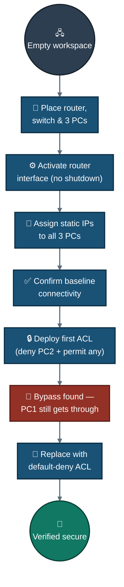
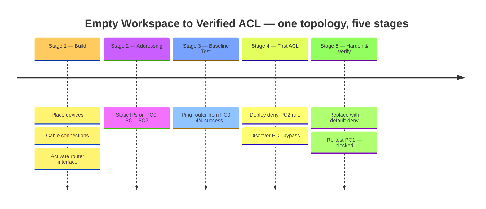
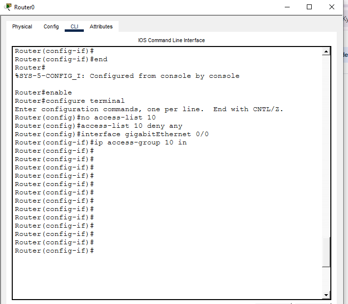
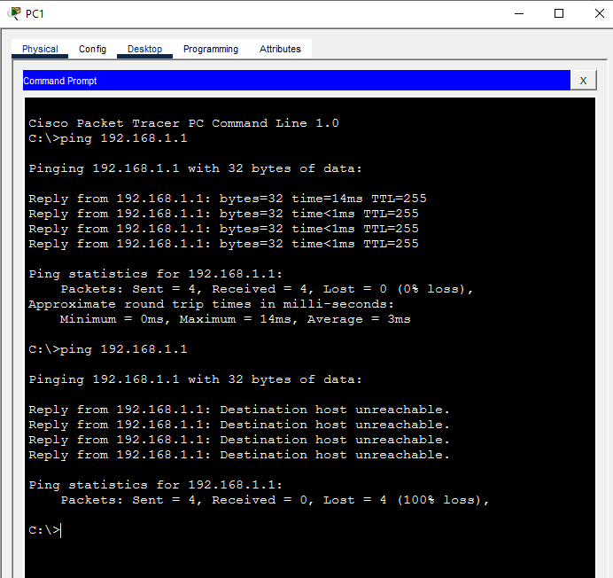

<div align="center">

# 🌐 Cisco Infrastructure & Secure Routing

**Project 02 of 10 — Foundational Projects — Network Infrastructure & Security**

Router & Switch Configuration, Static IP Assignment, and Access Control List Hardening on a 3-PC Small Company Network — Cisco Packet Tracer Build, ACL Bypass Discovery, and Default-Deny Fix


Nine steps run end-to-end in Cisco Packet Tracer, building a small company network from a blank workspace to a hardened, verified firewall: router and switch placement, interface activation, static IP assignment, a baseline connectivity test, a first Access Control List that looked right but wasn't, the bypass that testing exposed, and the default-deny rule that closed the gap.

> [!NOTE]
> **Project 10** in this portfolio builds directly on this same topology, adding VLAN segmentation, VTP synchronization, and further security hardening.

</div>

---

## 📑 Table of Contents

1. [At a Glance](#at-a-glance)
2. [Project Background](#project-background)
3. [Tools & Technologies](#tools-technologies)
4. [Lab Environment](#lab-environment)
5. [Network Build Map](#network-build-map)
6. [Simulated Issues](#simulated-issues)
7. [Build & Harden Timeline](#build-harden-timeline)
8. [Module 1 — Open the Workspace](#module-1)
9. [Module 2 — Design the Network Topology](#module-2)
10. [Module 3 — Configure the Router Interface](#module-3)
11. [Module 4 — Assign Static IPs to PCs](#module-4)
12. [Module 5 — Test Baseline Connectivity](#module-5)
13. [Module 6 — Deploy the First ACL Rule](#module-6)
14. [Module 7 — Investigate the ACL Bypass](#module-7)
15. [Module 8 — Harden the ACL](#module-8)
16. [Module 9 — Final Verification](#module-9)
17. [Coverage Snapshot](#coverage-snapshot)
18. [Command Summary](#command-summary)
19. [Challenges & Fixes](#challenges-fixes)
20. [Scope & Limitations](#scope-limitations)
21. [What I Learned](#what-i-learned)
22. [Skills Demonstrated](#skills-demonstrated)
23. [Screenshot Index](#screenshot-index)
24. [Repo Structure](#repo-structure)

---

<a id="at-a-glance"></a>
## 📊 At a Glance

<div align="center">

| 🖥️ End Devices | 🧩 Modules | 🔒 ACL Rules Written | 🖼️ Screenshots |
|:---:|:---:|:---:|:---:|
| **3 (PC0, PC1, PC2)** | **9** | **2 (1 flawed, 1 fixed)** | **9** |

</div>

---

<a id="project-background"></a>
## 📖 Project Background

This project starts where a real small-business network build starts — an empty workspace — and works forward through the same order an IT tech would follow on-site: place and cable the hardware, bring the router interface up, hand out static addressing, prove the network works before touching security, then deploy an Access Control List. The ACL didn't work as assumed on the first pass, and rather than presenting only a clean end state, the bypass was found through testing a host that wasn't the explicit target, diagnosed, and closed with a default-deny rule — then re-verified independently.

| Module Group | Focus |
|---|---|
| 🖧 **Build (Modules 1–2)** | Workspace setup, device placement, and cabling |
| ⚙️ **Addressing (Modules 3–4)** | Router interface activation, static IP assignment across 3 PCs |
| ✅ **Baseline Test (Module 5)** | Confirm connectivity before any security rule exists |
| 🔒 **First ACL & Bypass (Modules 6–7)** | Deploy a host-specific ACL, then discover it doesn't restrict the network the way it looks like it should |
| 🔧 **Hardening & Verification (Modules 8–9)** | Replace with a default-deny rule, re-test the same host that bypassed it |

> [!NOTE]
> The bypass in Module 7 was not staged — it was found by testing a host that wasn't the ACL's explicit target, which is exactly the gap a real firewall audit is meant to catch.

---

<a id="tools-technologies"></a>
## 🛠️ Tools & Technologies

| Tool | Purpose |
|------|---------|
| 🖧 Cisco Packet Tracer | Network simulation environment |
| 🔀 Cisco 2911 Router | Interface configuration, static routing, ACL enforcement |
| 🔌 Cisco 2960 Switch | End-device connectivity |
| ⌨️ Router CLI | Interface activation, `enable secret`, ACL configuration |
| 🖥️ PC Desktop IP Configuration | Static IP, subnet mask, and gateway assignment |
| 🔎 Command Prompt (`ping`) | Connectivity and ACL-scope verification |

---

<a id="lab-environment"></a>
## 🖧 Lab Environment


| Item | Detail |
|------|--------|
| Router | Cisco 2911 |
| Switch | Cisco 2960 |
| End Devices | 3× PC (PC0, PC1, PC2) |
| Cabling | Copper Straight-Through |
| Router Interface | GigabitEthernet 0/0 — `192.168.1.1/24` |

---

<a id="network-build-map"></a>
## 🗺️ Network Build Map


```mermaid
%%{init: {'theme': 'base', 'themeVariables': {'fontSize': '15px'}, 'flowchart': {'nodeSpacing': 24, 'rankSpacing': 40, 'padding': 10}}}%%
flowchart TB
    START(("🖧<br/>Empty workspace")):::top
    START --> TOPO["🧩 Place router,<br/>switch & 3 PCs"]:::step
    TOPO --> IFACE["⚙️ Activate router<br/>interface (no shutdown)"]:::step
    IFACE --> IPS["🧾 Assign static IPs<br/>to all 3 PCs"]:::step
    IPS --> BASE["✅ Confirm baseline<br/>connectivity"]:::step
    BASE --> ACL1["🔒 Deploy first ACL<br/>(deny PC2 + permit any)"]:::step
    ACL1 --> BYPASS["🚨 Bypass found —<br/>PC1 still gets through"]:::alert
    BYPASS --> ACL2["🔧 Replace with<br/>default-deny ACL"]:::step
    ACL2 --> ROOT(("🎯<br/>Verified secure")):::bottom

    classDef top fill:#2C3E50,stroke:#16202A,stroke-width:2px,color:#FFFFFF
    classDef step fill:#1A5276,stroke:#0B2E43,stroke-width:2px,color:#FFFFFF
    classDef alert fill:#943126,stroke:#571C16,stroke-width:2px,color:#FFFFFF
    classDef bottom fill:#117864,stroke:#083D33,stroke-width:2px,color:#FFFFFF
    linkStyle default stroke:#5D6D7E,stroke-width:2px
```
<p align="center"><em>Each build stage feeds the next — the ACL bypass is flagged in red because it's the one stage that didn't behave as assumed on the first pass.</em></p>

---

<a id="simulated-issues"></a>
## 🐛 Simulated Issues

| # | Issue | Type |
|---|-------|------|
| 1 | Router-switch link showing red lights after cabling | Inactive interface |
| 2 | First ACL only blocked its named host | ACL scope misconfiguration (default-allow gap) |
| 3 | Untested host (PC1) passing traffic that should have been restricted | Firewall bypass, found through testing |

---

<a id="build-harden-timeline"></a>
## 🔧 Build & Harden Timeline


```mermaid
%%{init: {'theme': 'base', 'themeVariables': {'fontSize': '15px'}, 'timeline': {'disableMulticolor': false}}}%%
timeline
    title Empty Workspace to Verified ACL — one topology, five stages
    Stage 1 — Build : Place devices : Cable connections : Activate router interface
    Stage 2 — Addressing : Static IPs on PC0, PC1, PC2
    Stage 3 — Baseline Test : Ping router from PC0 — 4/4 success
    Stage 4 — First ACL : Deploy deny-PC2 rule : Discover PC1 bypass
    Stage 5 — Harden & Verify : Replace with default-deny : Re-test PC1 — blocked
```
<p align="center"><em>A Mermaid timeline instead of a flowchart — five stages read left to right, from an empty workspace to a hardened, re-verified ACL.</em></p>

---

<a id="module-1"></a>
## 🖧 Module 1 — Open the Workspace

**Objective:** Open Cisco Packet Tracer to a blank workspace, ready to place devices.

### Step 1 — Open Packet Tracer ✅

```
Launch Cisco Packet Tracer
→ Confirm a blank, empty workspace
→ Ready to place router, switch, and end devices
```

<p align="center">
  <br>
  <em>Exhibit 1 — Blank Packet Tracer workspace</em>
</p>

---

<a id="module-2"></a>
## 🖧 Module 2 — Design the Network Topology

**Objective:** Place the core devices, cable them, and confirm the physical layer is up.

### Step 2 — Place & Cable Devices ✅

```
Place:
  1× Router (Cisco 2911)
  1× Switch (Cisco 2960)
  3× PC (PC0, PC1, PC2)

Connect with Copper Straight-Through cables:
  Each PC → a separate switch port
  Switch → Router GigabitEthernet 0/0

→ At this stage: router-switch link shows RED link lights
   (router interface not yet active)
```

<p align="center">
  <br>
  <em>Exhibit 2 — Router, switch, and 3 PCs connected; link lights still red</em>
</p>

---

<a id="module-3"></a>
## ⚙️ Module 3 — Configure the Router Interface

**Objective:** Activate the router's interface and assign it an IP address.

### Step 3 — Configure Router Interface ✅

```
enable
configure terminal
interface gigabitEthernet 0/0
ip address 192.168.1.1 255.255.255.0
no shutdown
exit
exit
show ip route
```

```
→ "no shutdown" activates the interface — link lights turn GREEN immediately
→ "show ip route" confirms the network as directly connected
```

<p align="center">
  <br>
  <em>Exhibit 3 — Router interface activated, routing table verified</em>
</p>

---

<a id="module-4"></a>
## 🧾 Module 4 — Assign Static IPs to PCs

**Objective:** Assign static addressing to all three end devices.

### Step 4 — Assign Static IPs ✅

```
PC → Desktop → IP Configuration → Static
```

| Device | IP Address | Subnet Mask | Gateway |
|---|---|---|---|
| PC0 | 192.168.1.10 | 255.255.255.0 | 192.168.1.1 |
| PC1 | 192.168.1.20 | 255.255.255.0 | 192.168.1.1 |
| PC2 | 192.168.1.30 | 255.255.255.0 | 192.168.1.1 |

<p align="center">
  <br>
  <em>Exhibit 4 — Static IP configuration on all 3 PCs</em>
</p>

---

<a id="module-5"></a>
## ✅ Module 5 — Test Baseline Connectivity

**Objective:** Confirm the network works fully before adding any security rules.

### Step 5 — Ping the Router from PC0 ✅

```
PC0 → Command Prompt
ping 192.168.1.1

→ Reply from 192.168.1.1: bytes=32 time<1ms TTL=255  (×4)
→ 4/4 successful replies — network fully functional pre-firewall
```

<p align="center">
  <br>
  <em>Exhibit 5 — Initial connectivity test, pre-firewall</em>
</p>

---

<a id="module-6"></a>
## 🔒 Module 6 — Deploy the First ACL Rule

**Objective:** Add a router password and a firewall rule intended to block PC2.

### Step 6 — Deploy First ACL ✅

```
enable
configure terminal
enable secret MySecurePass123
access-list 10 deny host 192.168.1.30
access-list 10 permit any
interface gigabitEthernet 0/0
ip access-group 10 in
```

<p align="center">
  <br>
  <em>Exhibit 6 — First ACL rule blocking PC2</em>
</p>

---

<a id="module-7"></a>
## 🚨 Module 7 — Investigate the ACL Bypass

**Objective:** Test a host that wasn't the ACL's explicit target, to confirm the rule's real scope.

### Step 7 — Test PC1 (Not the Named Target) ❌

```
PC1 → Command Prompt
ping 192.168.1.1

→ Reply from 192.168.1.1: bytes=32 time<1ms TTL=255  (×4)
→ UNEXPECTED: ping succeeded — PC1 was never explicitly denied
```

```
Root cause:
  "access-list 10 deny host 192.168.1.30" only denies PC2.
  "access-list 10 permit any" allows every other host — PC1 included.
  The rule did exactly what it was written to do; the assumption that
  it would restrict the network more broadly was the actual error.
```

<p align="center">
  <br>
  <em>Exhibit 7 — Bypass discovered: PC1 ping succeeds unexpectedly</em>
</p>

---

<a id="module-8"></a>
## 🔧 Module 8 — Harden the ACL

**Objective:** Replace the host-specific rule with a default-deny rule to close the gap.

### Step 8 — Replace with Default-Deny ✅

```
enable
configure terminal
no access-list 10
access-list 10 deny any
interface gigabitEthernet 0/0
ip access-group 10 in
```

<p align="center">
  <br>
  <em>Exhibit 8 — Hardened ACL with default-deny rule</em>
</p>

---

<a id="module-9"></a>
## ✅ Module 9 — Final Verification

**Objective:** Re-test the same host that previously bypassed the ACL, to confirm the fix.

### Step 9 — Re-test PC1 ✅

```
PC1 → Command Prompt
ping 192.168.1.1

→ Request timed out. / Destination host unreachable.
→ Confirmed: hardened rule now blocks traffic as intended
```

<p align="center">
  <br>
  <em>Exhibit 9 — Final verification: ping blocked as intended</em>
</p>

---

<a id="coverage-snapshot"></a>
## 🌟 Coverage Snapshot

| 🛡️ Layer | ✅ Status | 📌 Detail |
|---|---|---|
| Workspace & topology | Live | Router, switch, 3 PCs placed and cabled (Exhibit 1–2) |
| Router interface | Proven | GigabitEthernet 0/0 activated, routing table verified (Exhibit 3) |
| Static addressing | Proven | All 3 PCs assigned static IP/mask/gateway (Exhibit 4) |
| Baseline connectivity | Proven | PC0 → router, 4/4 replies pre-firewall (Exhibit 5) |
| First ACL deployed | Proven | Host-specific deny rule applied inbound (Exhibit 6) |
| Bypass identified | Proven | PC1 (untested host) passed traffic unexpectedly (Exhibit 7) |
| ACL hardened | Proven | Default-deny rule replaces host-specific rule (Exhibit 8) |
| Fix re-verified | Proven | PC1 re-test confirms traffic now blocked (Exhibit 9) |

---

<a id="command-summary"></a>
## 📟 Command Summary

| Command | Purpose |
|---------|---------|
| `interface gigabitEthernet 0/0` | Enter the router's Gig 0/0 interface configuration |
| `ip address 192.168.1.1 255.255.255.0` | Assign the router interface's IP and subnet mask |
| `no shutdown` | Activate the interface (turns link lights green) |
| `show ip route` | Confirm the network is directly connected |
| `enable secret <password>` | Set the router's privileged-mode password |
| `access-list 10 deny host <ip>` | Deny a specific host in a numbered standard ACL |
| `access-list 10 permit any` | Permit all other traffic (leaves a default-allow gap) |
| `access-list 10 deny any` | Default-deny — blocks all traffic not otherwise permitted |
| `ip access-group 10 in` | Apply ACL 10 to inbound traffic on an interface |
| `no access-list 10` | Remove an existing numbered ACL |
| `ping <ip>` | Test connectivity / verify ACL scope from a PC |

---

<a id="challenges-fixes"></a>
## ⚠️ Challenges & Fixes

| ❌ Challenge | ✅ Solution |
|---|---|
| Router-switch link showed red lights after cabling | Ran `no shutdown` on GigabitEthernet 0/0 to activate the interface |
| First ACL blocked only the named host, left everything else open by default | Replaced with `access-list 10 deny any` for a true default-deny posture |
| Initial testing only covered the host expected to fail (PC2) | Added a second test on PC1 — a host that should still have passed — which exposed the real scope of the rule |

---

<a id="scope-limitations"></a>
## 🚧 Scope & Limitations

- **Simulated environment only:** built and tested in Cisco Packet Tracer, not on physical hardware.
- **Single subnet:** no VLAN segmentation in this project — that's covered separately in Project 10.
- **Basic ACL only:** standard numbered ACL (source-based); no extended ACL, NAT, or routing protocol configuration included.

---

<a id="what-i-learned"></a>
## 🧠 What I Learned

- **ACLs are explicit, not assumed.** Every host not specifically denied is implicitly permitted unless a default-deny rule is added — the first ACL did exactly what it was written to do, not what it looked like it should do.
- **Testing only the host you expect to block isn't enough.** The bypass only surfaced because PC1 — a host that should have still passed — was tested alongside PC2. Testing solely the intended target would have missed the gap entirely.
- **Interface activation is easy to overlook.** Red link lights after cabling are a physical-layer symptom with a one-line fix (`no shutdown`) — worth checking before assuming a deeper connectivity problem.
- **Verification has to touch the host that exposed the problem, not just the one the rule was written for.** Re-testing PC1 specifically — not PC2 — is what confirms the fix actually closed the gap.

---

<a id="skills-demonstrated"></a>
## 🛠️ Skills Demonstrated

- Building a router/switch/end-device topology from scratch in Packet Tracer
- Router CLI configuration: interface activation, static IP assignment, `enable secret`
- Writing and deploying numbered ACLs, including default-deny hardening
- Diagnosing a firewall rule that "looks right" but doesn't behave as scoped
- Validating security rules against both the expected-fail case and an expected-pass case

---

<a id="screenshot-index"></a>
## 🖼️ Screenshot Index

| # | File | Shows |
|:---:|---|---|
| 1 | `1_Cisco_Packet_Tracer_Workspace.PNG` | Blank Packet Tracer workspace |
| 2 | `2_Network_Topology_Design.PNG` | Router, switch, and 3 PCs connected |
| 3 | `3_Router_IP_and_Routing_Table.PNG` | Router interface activated, routing table verified |
| 4 | `4_PC_IP_Configuration.PNG` | Static IP configuration on all 3 PCs |
| 5 | `5_Ping_Success_Test.PNG` | Initial connectivity test, pre-firewall |
| 6 | `6_Router_First_Firewall_Rules.PNG` | First ACL rule blocking PC2 |
| 7 | `7_PC1_Firewall_Bypass_Ping_Success.PNG` | Bypass discovered — PC1 ping succeeds unexpectedly |
| 8 | `8_Router_Firewall_Fix_Commands.PNG` | Hardened ACL with default-deny rule |
| 9 | `9_Firewall_Block_Success.PNG` | Final verification — ping blocked as intended |

---

<a id="repo-structure"></a>
## 📁 Repo Structure

```text
1-Foundational-Projects/project-02-cisco-infrastructure-secure-routing/
|-- README.md
|-- Project 2.pkt
`-- screenshots/
    |-- 1_Cisco_Packet_Tracer_Workspace.PNG
    |-- 2_Network_Topology_Design.PNG
    |-- 3_Router_IP_and_Routing_Table.PNG
    |-- 4_PC_IP_Configuration.PNG
    |-- 5_Ping_Success_Test.PNG
    |-- 6_Router_First_Firewall_Rules.PNG
    |-- 7_PC1_Firewall_Bypass_Ping_Success.PNG
    |-- 8_Router_Firewall_Fix_Commands.PNG
    `-- 9_Firewall_Block_Success.PNG
```

<div align="center">

🌐 **[Cisco Packet Tracer](https://www.netacad.com/courses/packet-tracer)** · 🔒 **[Cisco ACL Guide](https://www.cisco.com/c/en/us/support/docs/security/ios-firewall/23602-confaccesslists.html)**

</div>
