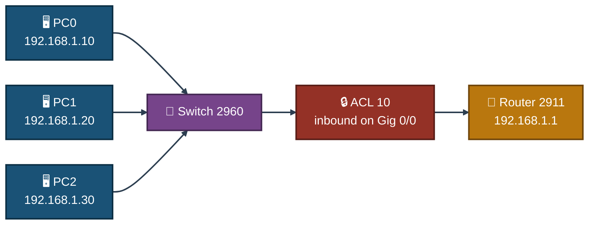
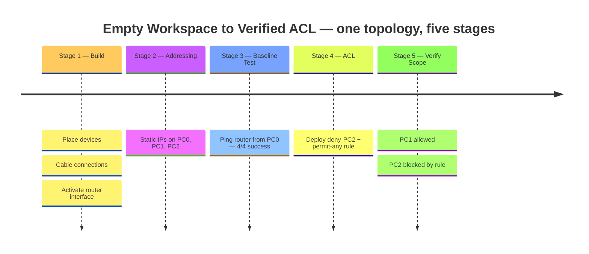

<div align="center">

# 🌐 Cisco Infrastructure & Secure Routing

**Project 02 of 10 — Foundational Projects — Network Infrastructure & Security**

Router & Switch Configuration, Static IP Assignment, and Access Control List Configuration on a 3-PC Small Company Network — Cisco Packet Tracer Build and Host-Specific ACL Verification


Eight steps run end-to-end in Cisco Packet Tracer, building a small company network from a blank workspace to a tested ACL: router and switch placement, interface activation, static IP assignment, a baseline connectivity test, a standard numbered ACL that blocks one host (PC2), and a test on PC1 that shows the rule leaves other hosts allowed. PC2's block follows from the deny rule.

> [!NOTE]
> **Project 10** in this portfolio builds directly on this same topology, adding VLAN segmentation, VTP synchronization, and further security hardening.

</div>

---

## 📑 Table of Contents

1. [At a Glance](#at-a-glance)
2. [Project Background](#project-background)
3. [Tools & Technologies](#tools-technologies)
4. [Lab Environment](#lab-environment)
5. [Network Build Map](#network-build-map)
6. [Simulated Issues](#simulated-issues)
7. [Build & Verify Timeline](#build-harden-timeline)
8. [Module 1 — Open the Workspace](#module-1)
9. [Module 2 — Design the Network Topology](#module-2)
10. [Module 3 — Configure the Router Interface](#module-3)
11. [Module 4 — Assign Static IPs to PCs](#module-4)
12. [Module 5 — Test Baseline Connectivity](#module-5)
13. [Module 6 — Deploy the ACL Rule](#module-6)
14. [Module 7 — Test PC1 (Allowed)](#module-7)
15. [Module 8 — PC2 (Blocked by Rule)](#module-8)
16. [Coverage Snapshot](#coverage-snapshot)
17. [Command Summary](#command-summary)
18. [Challenges & Fixes](#challenges-fixes)
19. [Scope & Limitations](#scope-limitations)
20. [What I Learned](#what-i-learned)
21. [Skills Demonstrated](#skills-demonstrated)
22. [Screenshot Index](#screenshot-index)
23. [Repo Structure](#repo-structure)

---

<a id="at-a-glance"></a>
## 📊 At a Glance

<div align="center">

| 🖥️ End Devices | 🧩 Modules | 🔒 ACL Rules Written | 🖼️ Screenshots |
|:---:|:---:|:---:|:---:|
| **3 (PC0, PC1, PC2)** | **8** | **2 (1 deny, 1 permit)** | **7** |

</div>

---

<a id="project-background"></a>
## 📖 Project Background

This project starts where a real small-business network build starts — an empty workspace — and works forward through the same order an IT tech would follow on-site: place and cable the hardware, bring the router interface up, hand out static addressing, prove the network works before touching security, then deploy an Access Control List. I configured a standard numbered ACL to block a specific host, PC2 (192.168.1.30), while allowing other hosts. I tested PC1 to confirm that other hosts were still permitted. PC2's block follows directly from the deny rule. This demonstrated that ACL rules must be understood according to their exact scope rather than assumed to affect the entire network.

| Module Group | Focus |
|---|---|
| 🖧 **Build (Modules 1–2)** | Workspace setup, device placement, and cabling |
| ⚙️ **Addressing (Modules 3–4)** | Router interface activation, static IP assignment across 3 PCs |
| ✅ **Baseline Test (Module 5)** | Confirm connectivity before any security rule exists |
| 🔒 **ACL Deployment (Module 6)** | Deploy a host-specific ACL that blocks PC2 and permits all other hosts |
| 🎯 **Scope Testing (Modules 7–8)** | Test PC1 (allowed); PC2's block explained from the rule |

> [!NOTE]
> Testing a host that is not named in the rule is what shows an ACL's exact scope. Testing only the blocked host would not show whether other hosts are still permitted.

---

<a id="tools-technologies"></a>
## 🛠️ Tools & Technologies

| Tool | Purpose |
|------|---------|
| 🖧 Cisco Packet Tracer | Network simulation environment |
| 🔀 Cisco 2911 Router | Interface configuration, static routing, ACL enforcement |
| 🔌 Cisco 2960 Switch | End-device connectivity |
| ⌨️ Router CLI | Interface activation, `enable secret`, ACL configuration |
| 🖥️ PC Desktop IP Configuration | Static IP, subnet mask, and gateway assignment |
| 🔎 Command Prompt (`ping`) | Connectivity and ACL-scope verification |

---

<a id="lab-environment"></a>
## 🖧 Lab Environment


| Item | Detail |
|------|--------|
| Router | Cisco 2911 |
| Switch | Cisco 2960 |
| End Devices | 3× PC (PC0, PC1, PC2) |
| Cabling | Copper Straight-Through |
| Router Interface | GigabitEthernet 0/0 — `192.168.1.1/24` |

---

<a id="network-build-map"></a>
## 🗺️ Network Build Map


```mermaid
%%{init: {'theme': 'base', 'themeVariables': {'fontSize': '16px'}, 'flowchart': {'nodeSpacing': 34, 'rankSpacing': 46, 'padding': 12}}}%%
flowchart LR
    PC0["🖥️ PC0<br/>192.168.1.10"]:::pc --> SW["🔌 Switch 2960"]:::sw
    PC1["🖥️ PC1<br/>192.168.1.20"]:::pc --> SW
    PC2["🖥️ PC2<br/>192.168.1.30"]:::pc --> SW
    SW --> ACL["🔒 ACL 10<br/>inbound on Gig 0/0"]:::acl
    ACL --> RT["🔀 Router 2911<br/>192.168.1.1"]:::rt
    classDef pc fill:#1A5276,stroke:#0B2E43,stroke-width:2px,color:#FFFFFF
    classDef sw fill:#76448A,stroke:#432752,stroke-width:2px,color:#FFFFFF
    classDef rt fill:#B9770E,stroke:#6E4409,stroke-width:2px,color:#FFFFFF
    classDef acl fill:#943126,stroke:#571C16,stroke-width:2px,color:#FFFFFF
    linkStyle default stroke:#2C3E50,stroke-width:2px
```
<p align="center"><em>All three PCs reach the router through the switch. Traffic is checked by ACL 10 (inbound on the router's Gig 0/0) before the router accepts it.</em></p>

---

<a id="simulated-issues"></a>
## 🐛 Simulated Issues

| # | Issue | Type |
|---|-------|------|
| 1 | Router-switch link showing red lights after cabling | Inactive interface |
| 2 | Assumed the ACL might restrict more than the one named host | ACL scope assumption, checked through testing |

---

<a id="build-harden-timeline"></a>
## 🔧 Build & Verify Timeline


```mermaid
%%{init: {'theme': 'base', 'themeVariables': {'fontSize': '15px'}, 'timeline': {'disableMulticolor': false}}}%%
timeline
    title Empty Workspace to Verified ACL — one topology, five stages
    Stage 1 — Build : Place devices : Cable connections : Activate router interface
    Stage 2 — Addressing : Static IPs on PC0, PC1, PC2
    Stage 3 — Baseline Test : Ping router from PC0 — 4/4 success
    Stage 4 — ACL : Deploy deny-PC2 + permit-any rule
    Stage 5 — Verify Scope : PC1 allowed : PC2 blocked by rule
```
<p align="center"><em>A Mermaid timeline instead of a flowchart — five stages read left to right, from an empty workspace to a host-specific ACL with its scope checked on PC1.</em></p>

---

<a id="module-1"></a>
## 🖧 Module 1 — Open the Workspace

**Objective:** Open Cisco Packet Tracer to a blank workspace, ready to place devices.

### Step 1 — Open Packet Tracer ✅

```
Launch Cisco Packet Tracer
→ Confirm a blank, empty workspace
→ Ready to place router, switch, and end devices
```

<p align="center">
  <br>
  <em>Exhibit 1 — Blank Packet Tracer workspace</em>
</p>

---

<a id="module-2"></a>
## 🖧 Module 2 — Design the Network Topology

**Objective:** Place the core devices, cable them, and confirm the physical layer is up.

### Step 2 — Place & Cable Devices ✅

```
Place:
  1× Router (Cisco 2911)
  1× Switch (Cisco 2960)
  3× PC (PC0, PC1, PC2)

Connect with Copper Straight-Through cables:
  Each PC → a separate switch port
  Switch → Router GigabitEthernet 0/0

→ At this stage: router-switch link shows RED link lights
   (router interface not yet active)
```

<p align="center">
  <br>
  <em>Exhibit 2 — Router, switch, and 3 PCs connected; link lights still red</em>
</p>

---

<a id="module-3"></a>
## ⚙️ Module 3 — Configure the Router Interface

**Objective:** Activate the router's interface and assign it an IP address.

### Step 3 — Configure Router Interface ✅

```
enable
configure terminal
interface gigabitEthernet 0/0
ip address 192.168.1.1 255.255.255.0
no shutdown
exit
exit
show ip route
```

```
→ "no shutdown" activates the interface — link lights turn GREEN immediately
→ "show ip route" confirms the network as directly connected
```

<p align="center">
  <br>
  <em>Exhibit 3 — Router interface activated, routing table verified</em>
</p>

---

<a id="module-4"></a>
## 🧾 Module 4 — Assign Static IPs to PCs

**Objective:** Assign static addressing to all three end devices.

### Step 4 — Assign Static IPs ✅

```
PC → Desktop → IP Configuration → Static
```

| Device | IP Address | Subnet Mask | Gateway |
|---|---|---|---|
| PC0 | 192.168.1.10 | 255.255.255.0 | 192.168.1.1 |
| PC1 | 192.168.1.20 | 255.255.255.0 | 192.168.1.1 |
| PC2 | 192.168.1.30 | 255.255.255.0 | 192.168.1.1 |

<p align="center">
  <br>
  <em>Exhibit 4 — Static IP configuration on all 3 PCs</em>
</p>

---

<a id="module-5"></a>
## ✅ Module 5 — Test Baseline Connectivity

**Objective:** Confirm the network works fully before adding any security rules.

### Step 5 — Ping the Router from PC0 ✅

```
PC0 → Command Prompt
ping 192.168.1.1

→ Reply from 192.168.1.1: bytes=32 time<1ms TTL=255  (×4)
→ 4/4 successful replies — network fully functional pre-firewall
```

<p align="center">
  <br>
  <em>Exhibit 5 — Initial connectivity test, pre-firewall</em>
</p>

---

<a id="module-6"></a>
## 🔒 Module 6 — Deploy the ACL Rule

**Objective:** Add a router password and a firewall rule intended to block PC2.

### Step 6 — Deploy the ACL ✅

```
enable
configure terminal
enable secret MySecurePass123
access-list 10 deny host 192.168.1.30
access-list 10 permit any
interface gigabitEthernet 0/0
ip access-group 10 in
```

<p align="center">
  <br>
  <em>Exhibit 6 — ACL blocking PC2 and permitting all other hosts</em>
</p>

**How the rule works:**

- `access-list 10 deny host 192.168.1.30` blocks traffic from PC2 only.
- `access-list 10 permit any` allows traffic from every other host (PC0 and PC1).
- `ip access-group 10 in` applies the ACL to traffic entering Gig 0/0.
- A standard ACL checks only the source address, and rules are read top to bottom.

---

<a id="module-7"></a>
## ✅ Module 7 — Test PC1 (Allowed)

**Objective:** Test a host that is not named in the ACL, to confirm other hosts are still permitted.

### Step 7 — Ping the Router from PC1 ✅

```
PC1 → Command Prompt
ping 192.168.1.1

→ Reply from 192.168.1.1: bytes=32 time<1ms TTL=255  (×4)
→ Allowed — PC1 is not named in the ACL, so "permit any" lets it through
```

<p align="center">
  <br>
  <em>Exhibit 7 — PC1 ping succeeds: the ACL only affects the named host</em>
</p>

---

<a id="module-8"></a>
## 🚫 Module 8 — PC2 (Blocked by Rule)

**Objective:** Explain why the host named in the ACL is blocked.

### Step 8 — PC2 Under the ACL

```
access-list 10 deny host 192.168.1.30   ← PC2's address matches this rule first
→ PC2's traffic into Gig 0/0 is denied before "permit any" is reached
→ Expected: ping 192.168.1.1 from PC2 gets no replies
```

```
Result:
  PC2 (named in the rule)      → blocked by the deny line (Exhibit 6 shows the rule)
  PC1 (not named in the rule)  → allowed (Exhibit 7)
  The ACL blocks only the specified host and permits all others.
```

---

<a id="coverage-snapshot"></a>
## 🌟 Coverage Snapshot

| 🛡️ Layer | ✅ Status | 📌 Detail |
|---|---|---|
| Workspace & topology | Live | Router, switch, 3 PCs placed and cabled (Exhibit 1–2) |
| Router interface | Proven | GigabitEthernet 0/0 activated, routing table verified (Exhibit 3) |
| Static addressing | Proven | All 3 PCs assigned static IP/mask/gateway (Exhibit 4) |
| Baseline connectivity | Proven | PC0 → router, 4/4 replies pre-firewall (Exhibit 5) |
| ACL deployed | Proven | Host-specific deny rule + permit any applied inbound (Exhibit 6) |
| Allowed host verified | Proven | PC1 (not named in the rule) still reaches the router (Exhibit 7) |
| Blocked host | By rule | PC2 matches the deny line, so its traffic is dropped (Exhibit 6) |

---

<a id="command-summary"></a>
## 📟 Command Summary

| Command | Purpose |
|---------|---------|
| `interface gigabitEthernet 0/0` | Enter the router's Gig 0/0 interface configuration |
| `ip address 192.168.1.1 255.255.255.0` | Assign the router interface's IP and subnet mask |
| `no shutdown` | Activate the interface (turns link lights green) |
| `show ip route` | Confirm the network is directly connected |
| `enable secret <password>` | Set the router's privileged-mode password |
| `access-list 10 deny host <ip>` | Deny a specific host in a numbered standard ACL |
| `access-list 10 permit any` | Permit all other traffic (every host not denied above) |
| `ip access-group 10 in` | Apply ACL 10 to inbound traffic on an interface |
| `ping <ip>` | Test connectivity / verify ACL scope from a PC |

---

<a id="challenges-fixes"></a>
## ⚠️ Challenges & Fixes

| ❌ Challenge | ✅ Solution |
|---|---|
| Router-switch link showed red lights after cabling | Ran `no shutdown` on GigabitEthernet 0/0 to activate the interface |
| Assumed the ACL might restrict more than the named host | Tested PC1 (not named in the rule) to confirm the rule's exact scope |

---

<a id="scope-limitations"></a>
## 🚧 Scope & Limitations

- **Simulated environment only:** built and tested in Cisco Packet Tracer, not on physical hardware.
- **Single subnet:** no VLAN segmentation in this project — that's covered separately in Project 10.
- **PC2 block explained, not separately tested:** it follows from the deny rule shown in Exhibit 6.
- **Basic ACL only:** standard numbered ACL (source-based); no extended ACL, NAT, or routing protocol configuration included.

---

<a id="what-i-learned"></a>
## 🧠 What I Learned

- **ACLs are explicit, not assumed.** A rule only affects what it names. With `permit any` at the end, every host not denied is still allowed — the ACL did exactly what it was written to do.
- **Test a host the rule does not name.** PC1 showed the exact scope of the rule. Testing only the blocked host would not show whether other hosts are still permitted.
- **Interface activation is easy to overlook.** Red link lights after cabling are a physical-layer symptom with a one-line fix (`no shutdown`) — worth checking before assuming a deeper connectivity problem.

---

<a id="skills-demonstrated"></a>
## 🛠️ Skills Demonstrated

- Building a router/switch/end-device topology from scratch in Packet Tracer
- Router CLI configuration: interface activation, static IP assignment, `enable secret`
- Writing and deploying a standard numbered ACL that blocks one host
- Understanding the exact scope of a firewall rule
- Testing an ACL against a host that is not named in the rule

---

<a id="screenshot-index"></a>
## 🖼️ Screenshot Index

| # | File | Shows |
|:---:|---|---|
| 1 | `1_Cisco_Packet_Tracer_Workspace.PNG` | Blank Packet Tracer workspace |
| 2 | `2_Network_Topology_Design.PNG` | Router, switch, and 3 PCs connected |
| 3 | `3_Router_IP_and_Routing_Table.PNG` | Router interface activated, routing table verified |
| 4 | `4_PC_IP_Configuration.PNG` | Static IP configuration on all 3 PCs |
| 5 | `5_Ping_Success_Test.PNG` | Initial connectivity test, pre-firewall |
| 6 | `6_Router_First_Firewall_Rules.PNG` | ACL blocking PC2, permitting all other hosts |
| 7 | `7_PC1_Firewall_Bypass_Ping_Success.PNG` | PC1 ping succeeds — allowed by `permit any` |

---

<a id="repo-structure"></a>
## 📁 Repo Structure

```text
1-Foundational-Projects/project-02-cisco-infrastructure-secure-routing/
|-- README.md
|-- Project 2.pkt
`-- screenshots/
    |-- 1_Cisco_Packet_Tracer_Workspace.PNG
    |-- 2_Network_Topology_Design.PNG
    |-- 3_Router_IP_and_Routing_Table.PNG
    |-- 4_PC_IP_Configuration.PNG
    |-- 5_Ping_Success_Test.PNG
    |-- 6_Router_First_Firewall_Rules.PNG
    `-- 7_PC1_Firewall_Bypass_Ping_Success.PNG
```

<div align="center">

🌐 **[Cisco Packet Tracer](https://www.netacad.com/courses/packet-tracer)** · 🔒 **[Cisco ACL Guide](https://www.cisco.com/c/en/us/support/docs/security/ios-firewall/23602-confaccesslists.html)**

</div>
