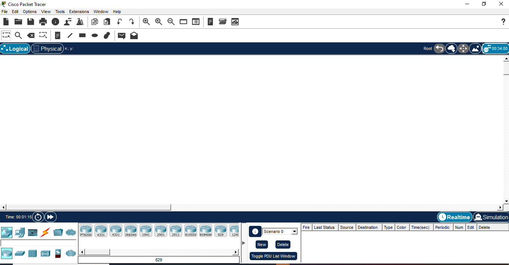
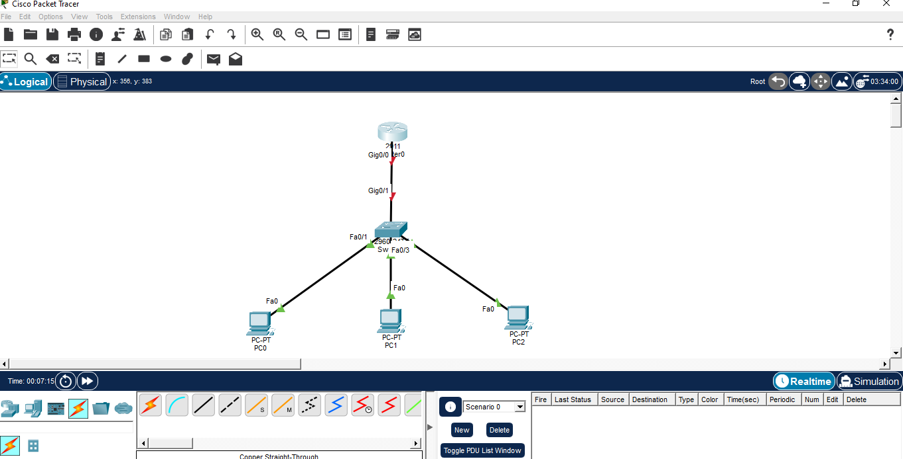
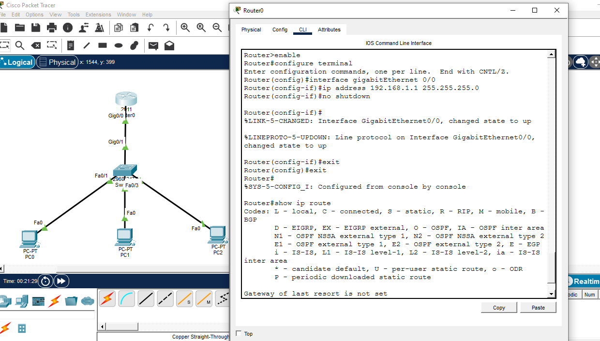
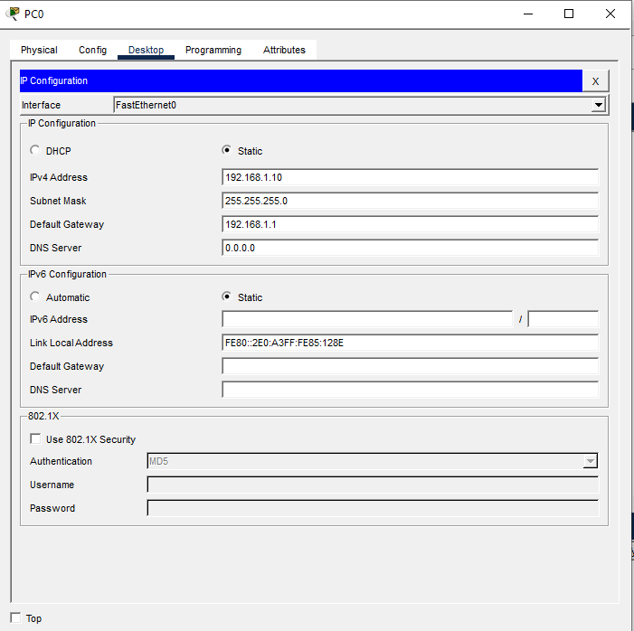
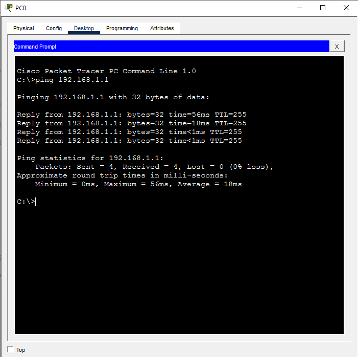
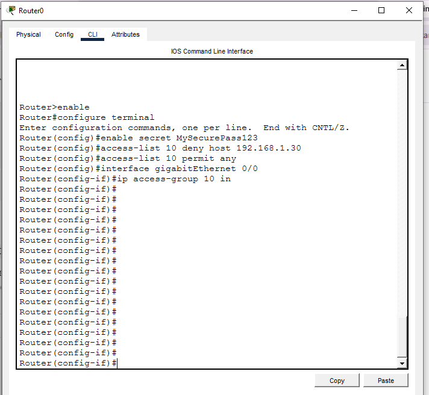
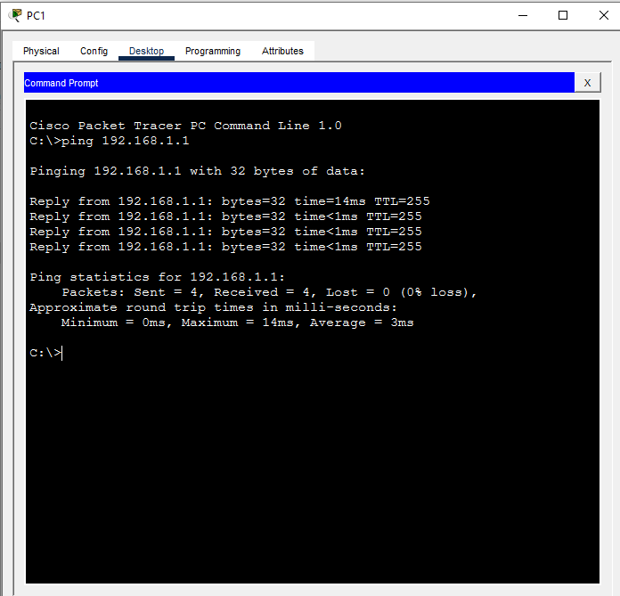

# 🌐 Project 02 — Index
### Cisco Infrastructure & Secure Routing
**Project 02 of 10 — Foundational Projects**

**Quick guide to every step and screenshot in this project.**

### [📖 Open the full README](README.md)

---

| 🧩 Modules | 🖼️ Screenshots | 🔒 ACL Rule Lines | 🎯 Hosts Tested |
|:---:|:---:|:---:|:---:|
| **8** | **7** | **2** | **1** |

🧩 <b>Lab:</b> Router 2911 + Switch 2960 + 3 PCs · Cisco Packet Tracer

---

## 📑 Step Index

| # | Step | Module | Result | Evidence |
|:---:|---|:---:|---|:---:|
| 1 | Open the workspace | 🔵 Module 1 | Blank Packet Tracer workspace ready | [Exhibit 1](#ex1) |
| 2 | Design the topology | 🔵 Module 2 | Router, switch, 3 PCs cabled; link lights red | [Exhibit 2](#ex2) |
| 3 | Configure router interface | 🟠 Module 3 | Gig0/0 activated, routing table verified | [Exhibit 3](#ex3) |
| 4 | Assign static IPs | 🟠 Module 4 | PC0/PC1/PC2 addressed on 192.168.1.0/24 | [Exhibit 4](#ex4) |
| 5 | Test baseline connectivity | 🟢 Module 5 | PC0 → router, 4/4 replies | [Exhibit 5](#ex5) |
| 6 | Deploy the ACL | 🔴 Module 6 | `deny host 192.168.1.30` + `permit any` | [Exhibit 6](#ex6) |
| 7 | Test PC1 (not named in the ACL) | 🟢 Module 7 | PC1 → router succeeds (allowed) | [Exhibit 7](#ex7) |
| 8 | PC2 under the ACL | 🔴 Module 8 | Denied by `deny host 192.168.1.30` (by rule) | [Exhibit 6](#ex6) |

---

## 🔵 Module 1–2 — Build the Topology

Exhibits 1 to 2.

<table>
<tr>
<td align="center" valign="top" width="50%">

 <b>Exhibit 1 — Blank workspace</b>
 Packet Tracer opened, ready to place devices
</td>
<td align="center" valign="top" width="50%">

 <b>Exhibit 2 — Topology cabled</b>
 Router, switch, 3 PCs connected; link lights still red
</td>
</tr>
</table>

---

## 🟠 Module 3–4 — Router & Addressing

Exhibits 3 to 4.

<table>
<tr>
<td align="center" valign="top" width="50%">

 <b>Exhibit 3 — Interface activated</b>
 <code>no shutdown</code> run; routing table confirmed
</td>
<td align="center" valign="top" width="50%">

 <b>Exhibit 4 — Static IPs assigned</b>
 PC0, PC1, PC2 addressed on 192.168.1.0/24
</td>
</tr>
</table>

---

## 🟢 Module 5 — Baseline Test

Exhibit 5.

<table>
<tr>
<td align="center" valign="top" width="50%">

 <b>Exhibit 5 — Pre-firewall connectivity</b>
 PC0 → router, 4/4 replies before any ACL
</td>
<td></td>
</tr>
</table>

---

## 🔴 Module 6 — Deploy the ACL

Exhibit 6.

<table>
<tr>
<td align="center" valign="top" width="50%">

 <b>Exhibit 6 — ACL deployed</b>
 <code>deny host 192.168.1.30</code> + <code>permit any</code>
</td>
<td></td>
</tr>
</table>

---

## 🟢 Module 7–8 — Check the ACL Scope

Exhibit 7.

<table>
<tr>
<td align="center" valign="top" width="50%">

 <b>Exhibit 7 — PC1 allowed</b>
 PC1 is not named in the rule, so it gets through
</td>
<td></td>
</tr>
</table>

---

## 🎯 Verification Checklist

| Check | Method | Module | Status |
|:---:|---|---|:---:|
| Interface activated | `no shutdown`, `show ip route` | Module 3 | ✅ Confirmed |
| Static IPs assigned | Desktop → IP Configuration | Module 4 | ✅ Confirmed |
| Baseline connectivity | `ping` from PC0 | Module 5 | ✅ Confirmed |
| Non-target host still allowed | `ping` from PC1 | Module 7 | ✅ Confirmed (allowed) |
| Target host blocked | Follows from the deny rule | Module 8 | ✅ By rule (Exhibit 6) |

> [!NOTE]
> PC1 (allowed) shows the ACL does not affect unnamed hosts. PC2's block is explained from the rule.

---

[⬆️ Back to top](#top) &nbsp;·&nbsp; [📖 Full README](README.md)

🌐 **[Cisco Packet Tracer](https://www.netacad.com/courses/packet-tracer)** · 🔒 **[Cisco ACL Guide](https://www.cisco.com/c/en/us/support/docs/security/ios-firewall/23602-confaccesslists.html)**

