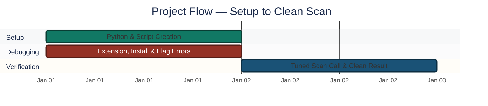
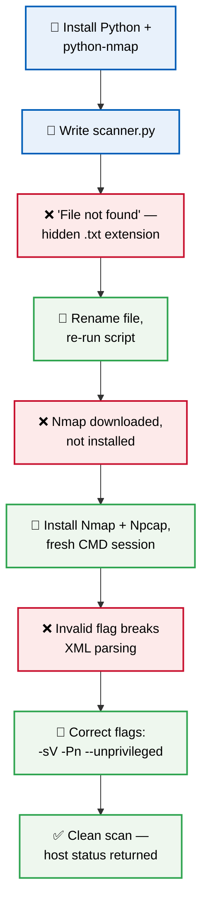
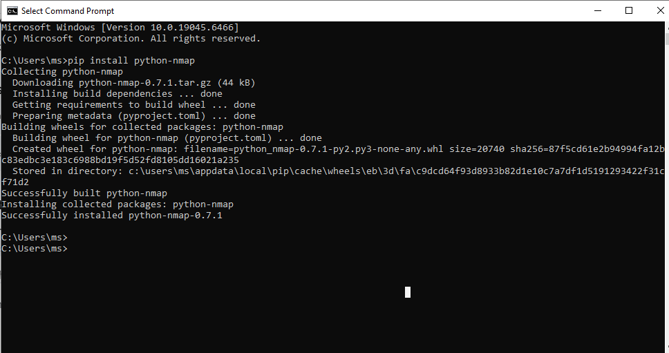
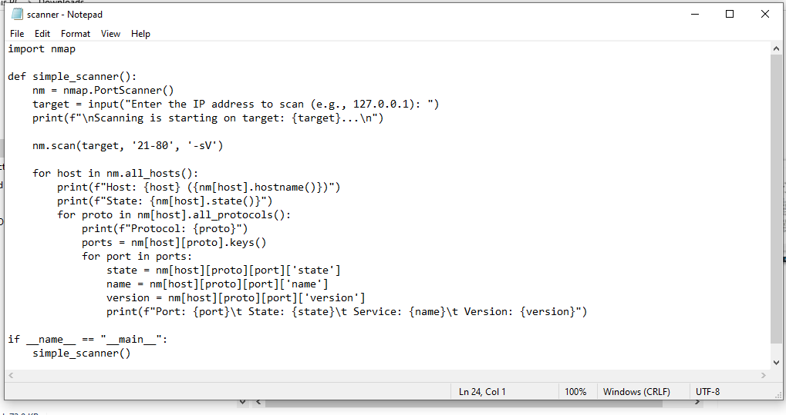
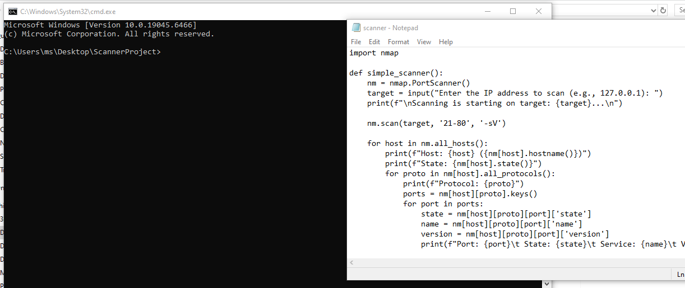
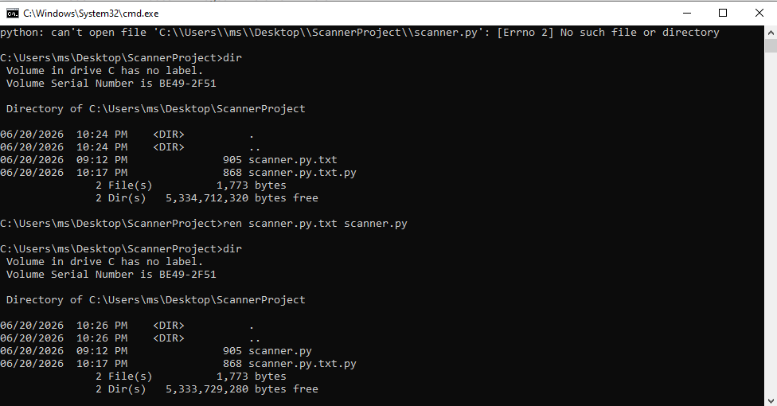
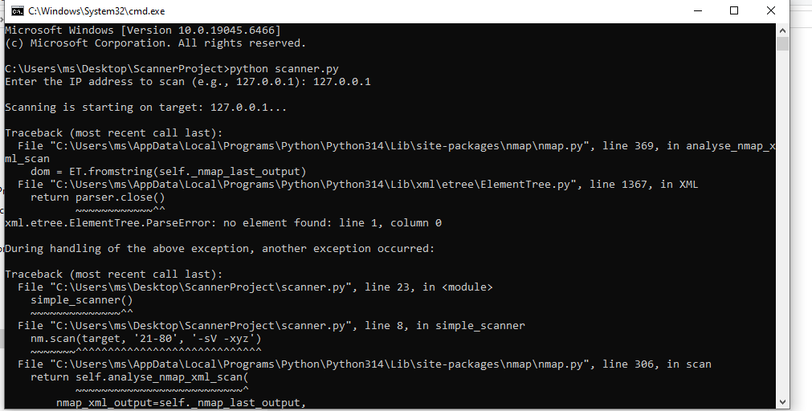
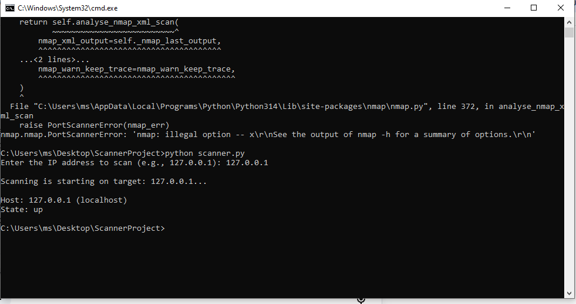

<div align="center">

# 🔍 Automated Port & Service Scanner

**Project 03 of 10 — Foundational Projects**

Tool Development (Python + Nmap)


A Python script that automates port scanning through Nmap — open ports, host status and running service versions printed automatically, instead of typing Nmap commands and reading raw terminal output by hand every time. Built through four real environment errors, each diagnosed and fixed in sequence.

> [!NOTE]
> This project focuses on **automating a scan** with a Python script. Project 7 (Nmap Port Scan Reconnaissance) is a different skill — correctly **interpreting** scan results (filtered vs. open) rather than scripting the scan itself.

</div>

---

## 📑 Table of Contents

1. [At a Glance](#at-a-glance)
2. [Project Background](#project-background)
3. [Environment](#environment)
4. [Project Flow](#project-flow)
5. [Build Process](#build-process)
6. [Findings Summary](#findings-summary)
7. [What I Got Wrong](#what-i-got-wrong)
8. [Challenges & Fixes](#challenges-fixes)
9. [Scope & Limitations](#scope-limitations)
10. [Key Lesson](#key-lesson)
11. [Skills Demonstrated](#skills-demonstrated)
12. [Screenshot Index](#screenshot-index)
13. [Repo Structure](#repo-structure)

---

<a id="at-a-glance"></a>
## 📊 At a Glance

| 🧩 Phases | 🖼️ Screenshots | 🐛 Errors Hit & Fixed | 🎯 Final Result |
|:---:|:---:|:---:|:---:|
| **7** | **6** | **3** | **Clean scan, no errors** |

---

<a id="project-background"></a>
## 📖 Project Background

A Python script that automates port scanning using **Nmap**, so a scan can be run and **open ports, host status, and running service versions** are printed automatically — removing the need to manually type Nmap commands and read raw terminal output every time.

The build hit three real environment errors along the way (a hidden file extension, a half-finished Nmap install, and an invalid scan flag) — each is documented as it happened, not smoothed over.

---

<a id="environment"></a>
## 🖧 Environment

| Item | Value |
|---|---|
| **Language** | Python 3.14 |
| **Scan Engine** | Nmap |
| **Packet Driver** | Npcap (required by Nmap on Windows) |
| **Python-to-Nmap Bridge** | `python-nmap` library |
| **Script** | `scanner.py` |
| **Test Target** | `127.0.0.1` (localhost) |

---

<a id="project-flow"></a>
## ⏱️ Project Flow


<p align="center"><em>Colors distinguish each build stage — all stages complete.</em></p>

---

<a id="build-process"></a>
## 🔵 Build Process



### Phase 1 — Environment Setup ✅
Installed Python with PATH enabled, then installed the `python-nmap` library:

```text
pip install python-nmap
```

<p align="center">
  <br>
  <em>Phase 1 — Python installed successfully</em>
</p>

### Phase 2 — Script Creation ✅
Wrote the initial version of `scanner.py` and saved it in a project folder. *(This version did not yet include the `--unprivileged` flag — that was added later in Phase 6 as part of fixing the Nmap scan error.)*

[View final scanner.py](./scanner.py)

<p align="center">
  <br>
  <em>Phase 2 — scanner.py code in Notepad</em>
</p>

### Phase 3 — Error: Hidden File Extension ❌
Running `python scanner.py` failed with "file not found." Used `dir` to inspect the folder and found **Windows had silently saved the file as `scanner.py.txt`** instead of `scanner.py`.

<p align="center">
  <br>
  <em>Phase 3 — Hidden .txt extension discovered via dir</em>
</p>

**Fix:** Ran this command, which removed the `.txt` extension and corrected the filename:

```text
ren scanner.py.txt scanner.py
```

<p align="center">
  <br>
  <em>Fix — File renamed correctly to scanner.py</em>
</p>

### Phase 4 — Error: Nmap Not Installed / Stale PATH ❌
Script ran but failed because **Nmap was only downloaded, not installed**. Installed Nmap and Npcap as administrator. After install, a second error (`'python' is not recognized`) appeared because the open CMD session hadn't refreshed its PATH.

**Fix:** Closed the old CMD window, opened a new one in the project folder.

> No screenshot available for this specific error — it occurred during an earlier run and was resolved before the lab was redone.

### Phase 5 — Error: Invalid Nmap Argument ❌
While testing different scan arguments during a later run, ran the script with an invalid flag (`-xyz`). This caused Nmap to return no valid output, which the `python-nmap` library couldn't parse:

```text
xml.etree.ElementTree.ParseError: no element found: line 1, column 0
```

<p align="center">
  <br>
  <em>Phase 5 — Invalid flag error before fix</em>
</p>

**Fix:** Replaced the invalid flag with the correct, valid Nmap arguments (`-Pn --unprivileged`) in Phase 6.

### Phase 6 — Scan Configuration ✅
Adjusted the scan call to avoid Windows network adapter interference:

```python
nm.scan(target, '21-80', '-sV -Pn --unprivileged')
```

| Flag | Purpose |
|---|---|
| `-sV` | Detect service versions |
| `-Pn` | Skip host discovery ping |
| `--unprivileged` | Avoid requiring raw socket permissions |

### Phase 7 — Result ✅

```text
Host: 127.0.0.1 (localhost)
State: up
```

**Script successfully returned host status without errors.**

<p align="center">
  <br>
  <em>Phase 7 — Successful scan result on localhost</em>
</p>

🎯 **Result:** Three real environment errors caught and fixed in sequence — the scanner now runs clean against localhost with service-version detection enabled.

---

<a id="findings-summary"></a>
## 🌟 Findings Summary

| 🐛 Error | 🔍 Root Cause | ✅ Fix |
|---|---|---|
| "File not found" | Windows saved `scanner.py` as `scanner.py.txt` | Renamed with `ren scanner.py.txt scanner.py` |
| Nmap not found | Installer was downloaded, never actually installed | Ran the Nmap + Npcap installer as administrator |
| `'python' not recognized` | Old CMD session had a stale PATH | Opened a fresh CMD session in the project folder |
| XML parse error | Invalid scan flag (`-xyz`) returned no parseable output | Replaced with valid flags: `-sV -Pn --unprivileged` |

---

<a id="what-i-got-wrong"></a>
## ⚠️ What I Got Wrong

- Assumed the Nmap installer being **downloaded** meant it was **installed** — it wasn't. The error message at that stage didn't make the difference obvious.
- Assumed the script file was named correctly without checking. Windows had silently saved it as `scanner.py.txt` instead of `scanner.py`, hiding the real extension.
- Spent time suspecting the Python code itself was wrong, before checking these two basic environment issues first.

---

<a id="challenges-fixes"></a>
## ⚠️ Challenges & Fixes

| ❌ Challenge | ✅ Fix |
|---|---|
| Hidden `.txt` extension caused a false "file not found" | Verified the real filename with `dir`, renamed with `ren` |
| Nmap appeared installed but wasn't; PATH was stale after install | Ran the installer as administrator, then opened a fresh CMD session |
| Invalid Nmap flag broke XML parsing in `python-nmap` | Swapped in valid, tested flags (`-sV -Pn --unprivileged`) |

---

<a id="scope-limitations"></a>
## 🚧 Scope & Limitations

- **Localhost only:** Current scan target is `127.0.0.1`; no real subnet or test VM scanned yet.
- **No vulnerability correlation:** Detects open ports and service versions only — does not cross-reference against a CVE database.
- **Windows-specific fixes:** The PATH/extension issues documented here are Windows behaviors; a Linux/macOS build would hit different environment quirks.

---

<a id="key-lesson"></a>
## 🧠 Key Lesson

When a script fails right after installing new software, **check two things first**: whether the software **actually finished installing** (not just downloaded), and whether the current terminal session **has the updated PATH**. Most "tool not found" errors at this stage are **environment issues, not syntax errors**.

---

## 🌍 Real-World Application

A scanner like this is the starting point for **automated asset discovery** — running scheduled scans across a network range and flagging new open ports or unexpected services. The current version would need two upgrades before real use: **scanning beyond localhost** (a real subnet or test VM), and **cross-referencing detected service versions against a CVE database** (e.g. via `--script vuln`) to move from port detection to actual vulnerability detection.

---

<a id="skills-demonstrated"></a>
## 🛠️ Skills Demonstrated

- Wrapping an external CLI tool (Nmap) inside a Python automation script
- Diagnosing environment-level failures (PATH, hidden extensions, incomplete installs) separately from code-level bugs
- Reading and correcting Nmap scan flags based on actual error output, not guesswork
- Structuring a scan call for reliability on Windows (`-Pn`, `--unprivileged`)
- Documenting a debugging sequence transparently, including dead ends

---

<a id="screenshot-index"></a>
## 🖼️ Screenshot Index

| # | File | Shows |
|:---:|---|---|
| 1 | `1_Python_Installation.PNG` | Python installed successfully |
| 2 | `2_Scanner_Code.PNG` | scanner.py code in Notepad |
| 3 | `3_Extension_Error_Check.PNG` | Hidden `.txt` extension discovered via `dir` |
| 4 | `4_File_Renamed_Fix.PNG` | File renamed correctly to `scanner.py` |
| 5 | `5_Nmap_Path_Error.PNG` | Nmap/PATH error before fix |
| 6 | `6_Final_Scan_Success.PNG` | Successful scan result on localhost |

---

<a id="repo-structure"></a>
## 📁 Repo Structure

```text
1-Foundational-Projects/project-03-automated-port-scanner/
|-- README.md
|-- scanner.py
`-- screenshots/
    |-- 1_Python_Installation.PNG
    |-- 2_Scanner_Code.PNG
    |-- 3_Extension_Error_Check.PNG
    |-- 4_File_Renamed_Fix.PNG
    |-- 5_Nmap_Path_Error.PNG
    `-- 6_Final_Scan_Success.PNG
```

<div align="center">

🔍 **[Nmap Documentation](https://nmap.org/book/man.html)** · 🐍 **[python-nmap on PyPI](https://pypi.org/project/python-nmap/)**

</div>
