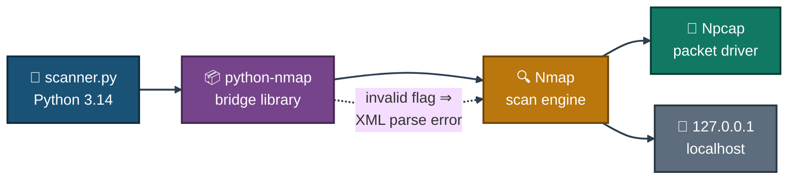
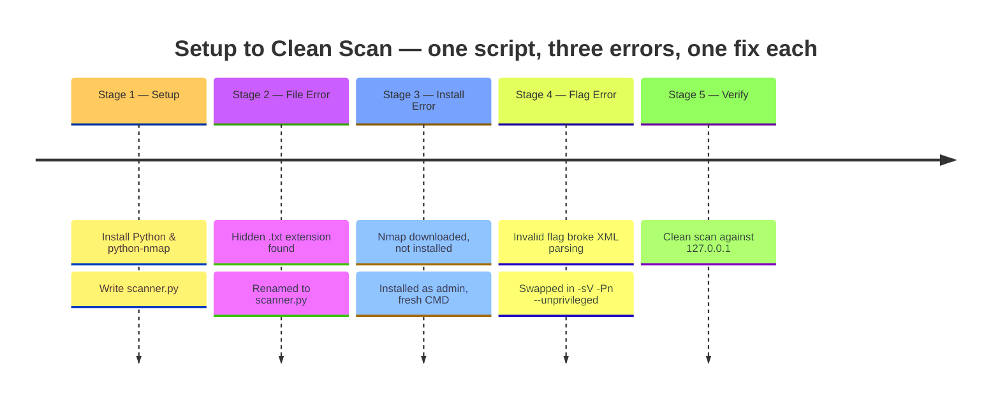
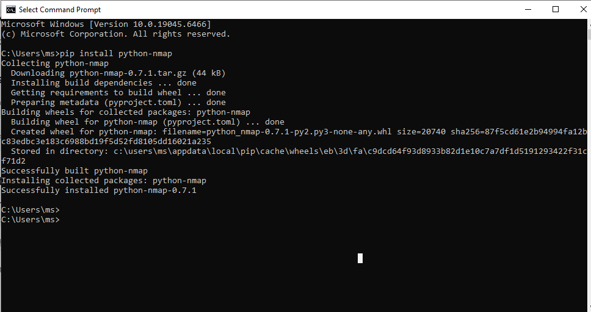
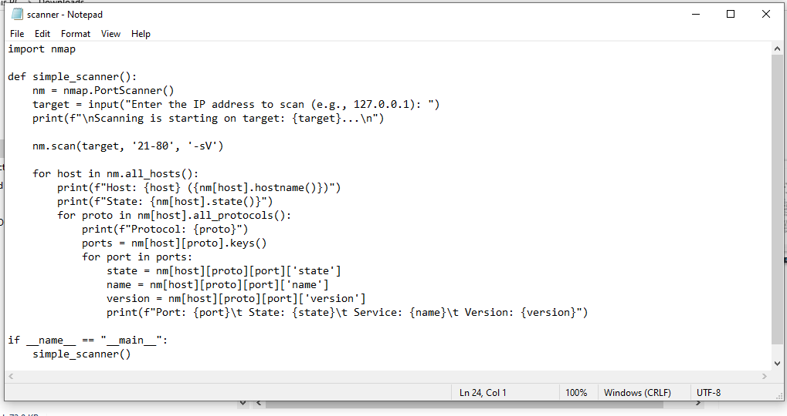
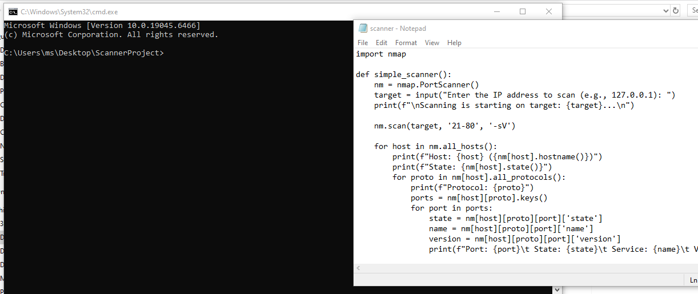
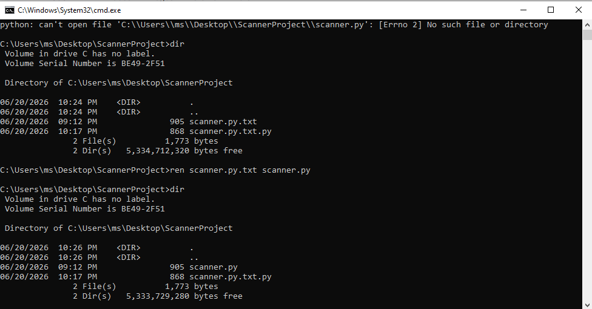
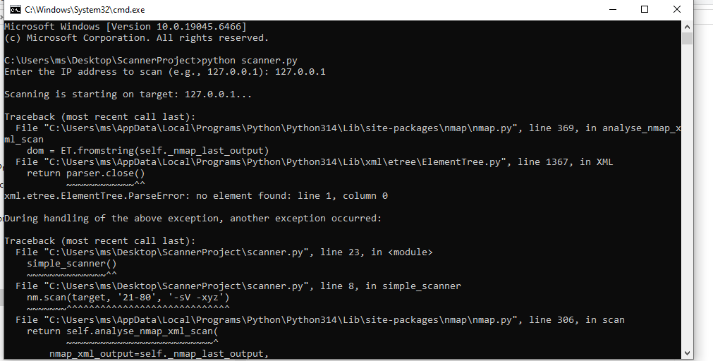
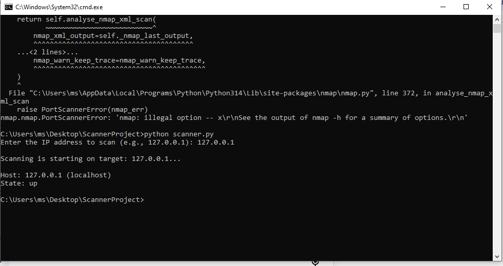

<div align="center">

# 🔍 Automated Port & Service Scanner

**Project 03 of 10 — Foundational Projects — Tool Development (Python + Nmap)**

Python-Automated Port Scanning with Service-Version Detection — python-nmap Bridge, Npcap Driver, and Three Real Environment Errors Diagnosed and Fixed on Windows


Seven steps run end-to-end, building a Python script that wraps Nmap so open ports, host status, and running service versions print automatically — no typing raw Nmap commands or reading terminal output by hand. Three real environment errors were hit and fixed in sequence along the way: a hidden file extension, a half-finished Nmap install, and an invalid scan flag.

> [!NOTE]
> This project focuses on **automating a scan** with a Python script. Project 07 (Nmap Port Scan Reconnaissance) is a different skill — correctly **interpreting** scan results (filtered vs. open) rather than scripting the scan itself.

</div>

---

## 📑 Table of Contents

1. [At a Glance](#at-a-glance)
2. [Project Background](#project-background)
3. [Tools & Technologies](#tools-technologies)
4. [Environment](#environment)
5. [Scan Pipeline Map](#scan-pipeline-map)
6. [Errors Hit](#errors-hit)
7. [Build Timeline](#build-timeline)
8. [Module 1 — Install Python & python-nmap](#module-1)
9. [Module 2 — Write scanner.py](#module-2)
10. [Module 3 — Diagnose the Hidden File Extension](#module-3)
11. [Module 4 — Install Nmap & Refresh PATH](#module-4)
12. [Module 5 — Diagnose the Invalid Scan Flag](#module-5)
13. [Module 6 — Configure the Scan Call](#module-6)
14. [Module 7 — Verify Clean Scan](#module-7)
15. [Coverage Snapshot](#coverage-snapshot)
16. [Command Summary](#command-summary)
17. [Challenges & Fixes](#challenges-fixes)
18. [Scope & Limitations](#scope-limitations)
19. [What I Learned](#what-i-learned)
20. [Skills Demonstrated](#skills-demonstrated)
21. [Screenshot Index](#screenshot-index)
22. [Repo Structure](#repo-structure)

---

<a id="at-a-glance"></a>
## 📊 At a Glance

<div align="center">

| 🧩 Modules | 🐛 Errors Hit & Fixed | 🎯 Final Result | 🖼️ Screenshots |
|:---:|:---:|:---:|:---:|
| **7** | **3** | **Clean scan, no errors** | **6** |

</div>

---

<a id="project-background"></a>
## 📖 Project Background

This project wraps **Nmap** inside a Python script so a scan can be run and its results — open ports, host status, and running service versions — print automatically, instead of typing raw Nmap commands and reading terminal output by hand every time. The build hit three real environment errors along the way — a hidden file extension, a half-finished Nmap install, and an invalid scan flag — each one documented as it happened, not smoothed over.

| Module Group | Focus |
|---|---|
| 🐍 **Setup (Modules 1–2)** | Install Python and the `python-nmap` bridge library, write the initial script |
| 🧰 **Environment Errors (Modules 3–4)** | Hidden `.txt` extension, incomplete Nmap install, stale PATH |
| 🔧 **Scan Errors & Fix (Modules 5–6)** | Invalid flag breaking XML parsing, then a correctly tuned scan call |
| ✅ **Verification (Module 7)** | Clean scan against localhost with service-version detection enabled |

> [!NOTE]
> No screenshot exists for the Nmap-not-installed error in Module 4 — it occurred during an earlier run and was resolved before the lab was redone. It's documented from memory rather than omitted.

---

<a id="tools-technologies"></a>
## 🛠️ Tools & Technologies

| Tool | Purpose |
|------|---------|
| 🐍 Python 3.14 | Scripting language for the automation wrapper |
| 🔍 Nmap | Underlying port/service scan engine |
| 🧩 Npcap | Packet driver Nmap requires on Windows |
| 📦 `python-nmap` | Python-to-Nmap bridge library |
| ⌨️ CMD | Running the script, renaming files, verifying PATH |

---

<a id="environment"></a>
## 🖧 Environment


| Item | Detail |
|------|--------|
| Language | Python 3.14 |
| Scan Engine | Nmap |
| Packet Driver | Npcap (required by Nmap on Windows) |
| Python-to-Nmap Bridge | `python-nmap` library |
| Script | `scanner.py` |
| Test Target | `127.0.0.1` (localhost) |

---

<a id="scan-pipeline-map"></a>
## 🗺️ Scan Pipeline Map


```mermaid
%%{init: {'theme': 'base', 'themeVariables': {'fontSize': '16px'}, 'flowchart': {'nodeSpacing': 34, 'rankSpacing': 46, 'padding': 12}}}%%
flowchart LR
    PY["🐍 scanner.py<br/>Python 3.14"]:::py --> LIB["📦 python-nmap<br/>bridge library"]:::lib
    LIB --> NMAP["🔍 Nmap<br/>scan engine"]:::nmap
    NMAP --> NPCAP["🧩 Npcap<br/>packet driver"]:::drv
    NMAP --> TARGET["🎯 127.0.0.1<br/>localhost"]:::target
    LIB -.->|"invalid flag ⇒<br/>XML parse error"| NMAP
    classDef py fill:#1A5276,stroke:#0B2E43,stroke-width:2px,color:#FFFFFF
    classDef lib fill:#76448A,stroke:#432752,stroke-width:2px,color:#FFFFFF
    classDef nmap fill:#B9770E,stroke:#6E4409,stroke-width:2px,color:#FFFFFF
    classDef drv fill:#117864,stroke:#083D33,stroke-width:2px,color:#FFFFFF
    classDef target fill:#5D6D7E,stroke:#2C3844,stroke-width:2px,color:#FFFFFF
    linkStyle default stroke:#2C3E50,stroke-width:2px
```
<p align="center"><em>The script calls python-nmap, which drives Nmap through Npcap against the target — the dashed line marks exactly where an invalid scan flag broke XML parsing in Module 5.</em></p>

---

<a id="errors-hit"></a>
## 🐛 Errors Hit

| # | Error | Type |
|---|-------|------|
| 1 | "File not found" running `scanner.py` | Hidden `.txt` extension saved by Windows |
| 2 | Nmap downloaded but not installed, then `'python' not recognized` | Incomplete install + stale PATH in old CMD session |
| 3 | `xml.etree.ElementTree.ParseError: no element found` | Invalid Nmap flag (`-xyz`) broke `python-nmap`'s XML parsing |

---

<a id="build-timeline"></a>
## 🔧 Build Timeline


```mermaid
%%{init: {'theme': 'base', 'themeVariables': {'fontSize': '15px'}, 'timeline': {'disableMulticolor': false}}}%%
timeline
    title Setup to Clean Scan — one script, three errors, one fix each
    Stage 1 — Setup : Install Python & python-nmap : Write scanner.py
    Stage 2 — File Error : Hidden .txt extension found : Renamed to scanner.py
    Stage 3 — Install Error : Nmap downloaded, not installed : Installed as admin, fresh CMD
    Stage 4 — Flag Error : Invalid flag broke XML parsing : Swapped in -sV -Pn --unprivileged
    Stage 5 — Verify : Clean scan against 127.0.0.1
```
<p align="center"><em>A Mermaid timeline instead of a flowchart — five stages read left to right, each pairing the error found with the fix that resolved it.</em></p>

---

<a id="module-1"></a>
## 🐍 Module 1 — Install Python & python-nmap

**Objective:** Install Python with PATH enabled, then install the bridge library Nmap will be called through.

### Step 1 — Install Python & python-nmap ✅

```
Install Python (PATH enabled during setup)

pip install python-nmap
```

<p align="center">
  <br>
  <em>Exhibit 1 — Python installed successfully</em>
</p>

---

<a id="module-2"></a>
## 📝 Module 2 — Write scanner.py

**Objective:** Write the initial version of the automation script.

### Step 2 — Write the Script ✅

```
Write scanner.py in a project folder
→ This version did not yet include the --unprivileged flag —
  that was added later in Module 6 as part of fixing the scan error
```

[View final scanner.py](./scanner.py)

<p align="center">
  <br>
  <em>Exhibit 2 — scanner.py code in Notepad</em>
</p>

---

<a id="module-3"></a>
## ❌ Module 3 — Diagnose the Hidden File Extension

**Objective:** Find out why `python scanner.py` fails with "file not found."

### Step 3 — Inspect the Real Filename ✅

```
python scanner.py
→ Error: file not found

dir
→ Reveals Windows silently saved the file as
  "scanner.py.txt" instead of "scanner.py"
```

<p align="center">
  <br>
  <em>Exhibit 3 — Hidden .txt extension discovered via dir</em>
</p>

**Fix:**

```
ren scanner.py.txt scanner.py
```

<p align="center">
  <br>
  <em>Exhibit 3 (fix) — File renamed correctly to scanner.py</em>
</p>

---

<a id="module-4"></a>
## ❌ Module 4 — Install Nmap & Refresh PATH

**Objective:** Fix the script failing because Nmap was only downloaded, not installed.

### Step 4 — Install Nmap + Npcap, Refresh PATH ✅

```
→ Script ran but failed: Nmap was only downloaded, not installed
→ Installed Nmap and Npcap as administrator

→ Second error appeared: 'python' is not recognized
   (old CMD session hadn't refreshed its PATH)

→ Fix: closed the old CMD window, opened a new one
   in the project folder
```

```
> No screenshot available for this specific error — it occurred
  during an earlier run and was resolved before the lab was redone.
```

---

<a id="module-5"></a>
## ❌ Module 5 — Diagnose the Invalid Scan Flag

**Objective:** Find out why the scan call breaks Nmap's XML output.

### Step 5 — Identify the Invalid Flag ✅

```
nm.scan(target, '21-80', '-xyz')

→ Nmap returns no valid output
→ python-nmap cannot parse it:

xml.etree.ElementTree.ParseError: no element found: line 1, column 0
```

<p align="center">
  <br>
  <em>Exhibit 5 — Invalid flag error before fix</em>
</p>

---

<a id="module-6"></a>
## 🔧 Module 6 — Configure the Scan Call

**Objective:** Replace the invalid flag with valid, tested Nmap arguments.

### Step 6 — Set the Correct Flags ✅

```python
nm.scan(target, '21-80', '-sV -Pn --unprivileged')
```

| Flag | Purpose |
|---|---|
| `-sV` | Detect service versions |
| `-Pn` | Skip host discovery ping |
| `--unprivileged` | Avoid requiring raw socket permissions |

---

<a id="module-7"></a>
## ✅ Module 7 — Verify Clean Scan

**Objective:** Confirm the scanner runs against localhost with no errors.

### Step 7 — Run the Final Scan ✅

```
python scanner.py

→ Host: 127.0.0.1 (localhost)
→ State: up
→ Script successfully returned host status without errors
```

<p align="center">
  <br>
  <em>Exhibit 7 — Successful scan result on localhost</em>
</p>

---

<a id="coverage-snapshot"></a>
## 🌟 Coverage Snapshot

| 🛡️ Layer | ✅ Status | 📌 Detail |
|---|---|---|
| Python & library setup | Live | Python and `python-nmap` installed (Exhibit 1) |
| Script written | Proven | Initial `scanner.py` created (Exhibit 2) |
| Hidden extension diagnosed | Proven | Real filename confirmed via `dir` (Exhibit 3) |
| File renamed | Proven | `.txt` extension removed with `ren` (Exhibit 3 fix) |
| Nmap install fixed | Proven | Installed as admin, fresh CMD opened (Module 4) |
| Invalid flag diagnosed | Proven | XML parse error traced to `-xyz` (Exhibit 5) |
| Scan call corrected | Proven | `-sV -Pn --unprivileged` applied (Module 6) |
| Clean scan verified | Proven | Localhost scan returns host status with no errors (Exhibit 7) |

---

<a id="command-summary"></a>
## 📟 Command Summary

| Command | Purpose |
|---------|---------|
| `pip install python-nmap` | Install the Python-to-Nmap bridge library |
| `python scanner.py` | Run the scanner script |
| `dir` | Inspect actual filenames in the folder |
| `ren scanner.py.txt scanner.py` | Remove a hidden `.txt` extension |
| `nm.scan(target, ports, flags)` | Run an Nmap scan through `python-nmap` |
| `-sV` | Detect service versions on open ports |
| `-Pn` | Skip host discovery ping |
| `--unprivileged` | Run without requiring raw socket permissions |

---

<a id="challenges-fixes"></a>
## ⚠️ Challenges & Fixes

| ❌ Challenge | ✅ Fix |
|---|---|
| Hidden `.txt` extension caused a false "file not found" | Verified the real filename with `dir`, renamed with `ren` |
| Nmap appeared installed but wasn't; PATH was stale after install | Ran the installer as administrator, then opened a fresh CMD session |
| Invalid Nmap flag broke XML parsing in `python-nmap` | Swapped in valid, tested flags (`-sV -Pn --unprivileged`) |

---

<a id="scope-limitations"></a>
## 🚧 Scope & Limitations

- **Localhost only:** current scan target is `127.0.0.1`; no real subnet or test VM scanned yet.
- **No vulnerability correlation:** detects open ports and service versions only — does not cross-reference against a CVE database.
- **Windows-specific fixes:** the PATH/extension issues documented here are Windows behaviors; a Linux/macOS build would hit different environment quirks.

---

<a id="what-i-learned"></a>
## 🧠 What I Learned

- **"Downloaded" and "installed" aren't the same thing.** The Nmap installer being downloaded didn't mean it was actually installed — the error message at that stage didn't make the difference obvious.
- **A file's real name is worth verifying, not assuming.** Windows had silently saved the script as `scanner.py.txt` instead of `scanner.py`, hiding the real extension until `dir` was used to check.
- **Environment issues come before code issues in the debugging order.** Time was spent suspecting the Python code itself was wrong, before checking these two basic environment issues first.
- **A terminal session doesn't refresh its own PATH.** After installing new software, a stale CMD session can still fail to recognize it — opening a fresh session is the fix, not reinstalling.
- **An invalid flag doesn't always fail loudly.** Nmap returning no parseable output looked like a `python-nmap` bug at first, but traced back to a single bad flag (`-xyz`).

---

## 🌍 Real-World Application

A scanner like this is the starting point for automated asset discovery — running scheduled scans across a network range and flagging new open ports or unexpected services. The current version would need two upgrades before real use: scanning beyond localhost (a real subnet or test VM), and cross-referencing detected service versions against a CVE database (e.g. via `--script vuln`) to move from port detection to actual vulnerability detection.

---

<a id="skills-demonstrated"></a>
## 🛠️ Skills Demonstrated

- Wrapping an external CLI tool (Nmap) inside a Python automation script
- Diagnosing environment-level failures (PATH, hidden extensions, incomplete installs) separately from code-level bugs
- Reading and correcting Nmap scan flags based on actual error output, not guesswork
- Structuring a scan call for reliability on Windows (`-Pn`, `--unprivileged`)
- Documenting a debugging sequence transparently, including dead ends

---

<a id="screenshot-index"></a>
## 🖼️ Screenshot Index

| # | File | Shows |
|:---:|---|---|
| 1 | `1_Python_Installation.PNG` | Python installed successfully |
| 2 | `2_Scanner_Code.PNG` | scanner.py code in Notepad |
| 3 | `3_Extension_Error_Check.PNG` | Hidden `.txt` extension discovered via `dir` |
| 4 | `4_File_Renamed_Fix.PNG` | File renamed correctly to `scanner.py` |
| 5 | `5_Nmap_Path_Error.PNG` | Nmap/PATH error before fix |
| 6 | `6_Final_Scan_Success.PNG` | Successful scan result on localhost |

---

<a id="repo-structure"></a>
## 📁 Repo Structure

```text
1-Foundational-Projects/project-03-automated-port-scanner/
|-- README.md
|-- scanner.py
`-- screenshots/
    |-- 1_Python_Installation.PNG
    |-- 2_Scanner_Code.PNG
    |-- 3_Extension_Error_Check.PNG
    |-- 4_File_Renamed_Fix.PNG
    |-- 5_Nmap_Path_Error.PNG
    `-- 6_Final_Scan_Success.PNG
```

<div align="center">

🔍 **[Nmap Documentation](https://nmap.org/book/man.html)** · 🐍 **[python-nmap on PyPI](https://pypi.org/project/python-nmap/)**

</div>
