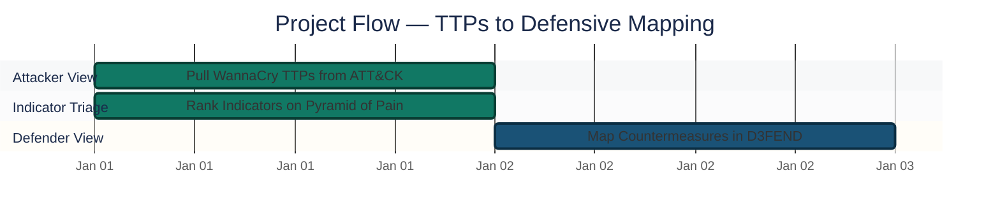
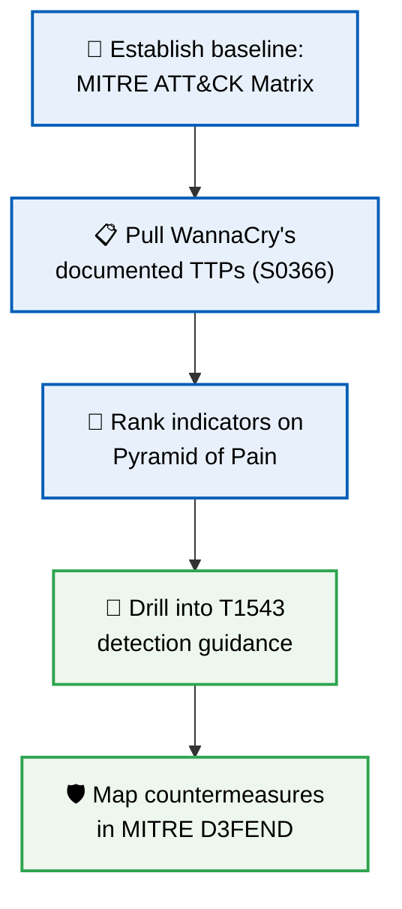
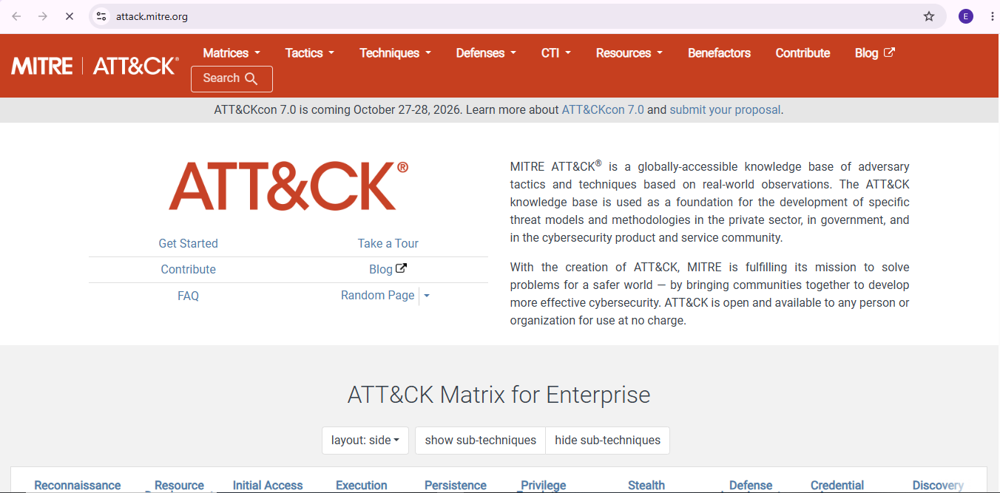
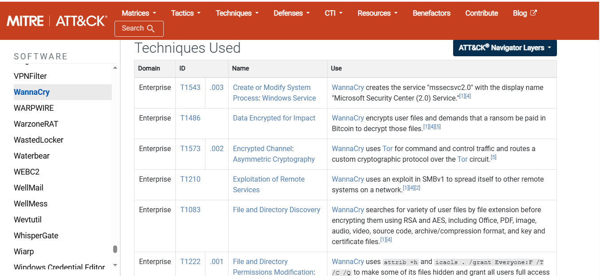
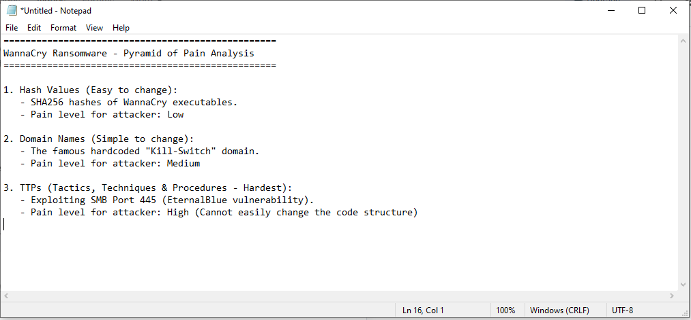
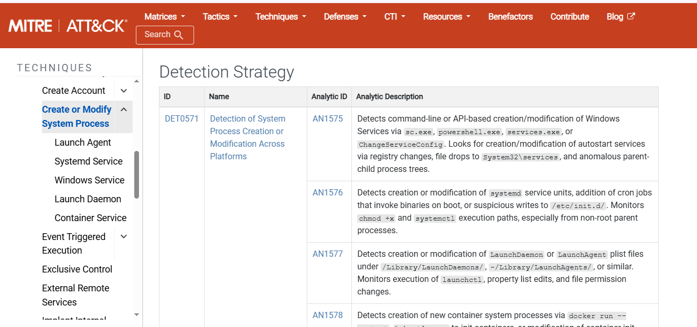
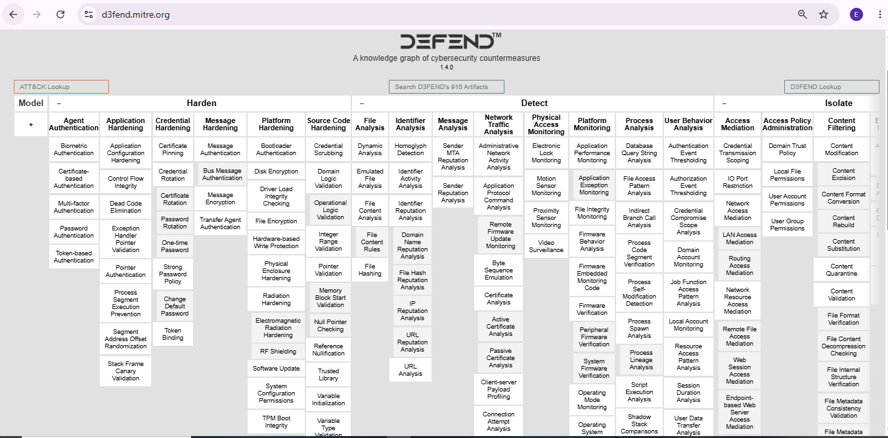
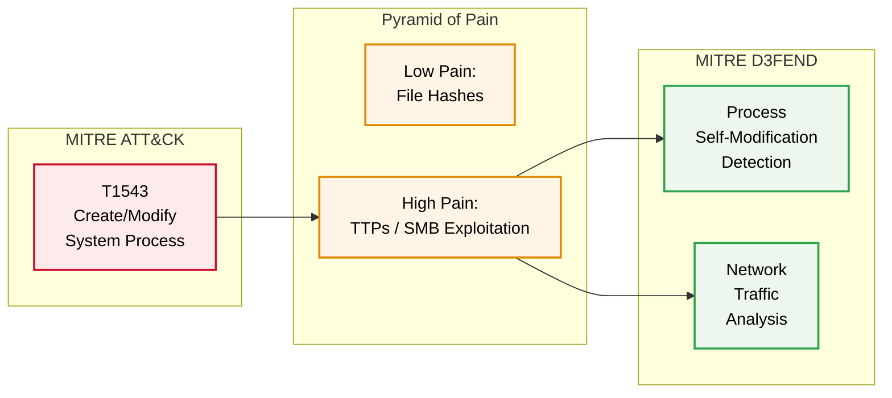

<div align="center">

# 🦠 Threat Framework Mapping — WannaCry Ransomware Case Study

**Project 04 of 10 — Foundational Projects**

Threat Intelligence & Framework Analysis


The 2017 WannaCry ransomware attack mapped across three industry frameworks — MITRE ATT&CK for attacker techniques, the Pyramid of Pain for indicator durability, and MITRE D3FEND for defensive countermeasures — to move past "what happened" and into how a SOC would actually detect and stop it.

</div>

---

## 📑 Table of Contents

1. [At a Glance](#at-a-glance)
2. [Project Background](#project-background)
3. [Environment](#environment)
4. [Project Flow](#project-flow)
5. [Analysis Walkthrough](#analysis-walkthrough)
6. [Findings Summary](#findings-summary)
7. [Framework Mapping](#framework-mapping)
8. [What I Got Wrong](#what-i-got-wrong)
9. [Challenges & Fixes](#challenges-fixes)
10. [Scope & Limitations](#scope-limitations)
11. [Key Takeaways](#key-takeaways)
12. [Skills Demonstrated](#skills-demonstrated)
13. [Screenshot Index](#screenshot-index)
14. [Repo Structure](#repo-structure)

---

<a id="at-a-glance"></a>
## 📊 At a Glance

| 🧩 Phases | 🖼️ Screenshots | 🗺️ Frameworks Used | 🎯 Malware Analyzed |
|:---:|:---:|:---:|:---:|
| **5** | **5** | **3** | **WannaCry (S0366)** |

---

<a id="project-background"></a>
## 📖 Project Background

The 2017 **WannaCry ransomware** attack analyzed by mapping it across three industry-standard frameworks:

- **MITRE ATT&CK Matrix** — the attacker's techniques
- **Pyramid of Pain** — how hard each type of indicator is for an attacker to change
- **MITRE D3FEND** — the defensive countermeasures that actually stop each technique

The goal was to go beyond "what happened" and build out how a SOC would actually detect and stop this specific attack — not just describe it.

---

<a id="environment"></a>
## 🖧 Environment

| Item | Value |
|---|---|
| **Malware Analyzed** | WannaCry Ransomware (2017) |
| **MITRE Software ID** | S0366 |
| **Primary Technique Drilled** | T1543 — Create or Modify System Process |
| **Attack Vector** | Unpatched SMB (port 445) |
| **Frameworks** | MITRE ATT&CK, Pyramid of Pain, MITRE D3FEND |

---

<a id="project-flow"></a>
## ⏱️ Project Flow


<p align="center"><em>Colors distinguish each analysis stage — all stages complete.</em></p>

---

<a id="analysis-walkthrough"></a>
## 🔵 Analysis Walkthrough

**Objective:** Take a known threat, map its techniques to a standard framework, identify which indicators are durable versus disposable, and translate that into concrete detection logic — not just "block this hash."



### Phase 1 — Establishing the Baseline ✅
Opened the MITRE ATT&CK Framework's official database to use as the reference point for the investigation — the global matrix of known adversary tactics and techniques.

<p align="center">
  <br>
  <em>Phase 1 — MITRE ATT&CK Matrix homepage / baseline reference</em>
</p>

### Phase 2 — Extracting WannaCry's Technical Profile ✅
Navigated to the Software database and located WannaCry's profile (**ID: S0366**) to pull its documented Tactics, Techniques, and Procedures (TTPs) — the specific actions the malware took to spread and lock down systems.

<p align="center">
  <br>
  <em>Phase 2 — WannaCry's profile (S0366) and documented TTPs</em>
</p>

### Phase 3 — Mapping Indicators to the Pyramid of Pain ✅
Categorized WannaCry's known indicators — file hashes, network domains, and TTPs — against the Pyramid of Pain model. File hashes sit at the bottom (easy for an attacker to change); the malware's actual operational behavior, like exploiting SMB port 445, sits at the top (hardest for an attacker to change, highest "pain" if blocked).

<p align="center">
  <br>
  <em>Phase 3 — WannaCry indicators mapped to the Pyramid of Pain</em>
</p>

### Phase 4 — Drilling Into Detection Strategy ✅
Drilled into technique **T1543** (Create or Modify System Process) to pull the specific detection guidance: monitoring for unusual use of system utilities like `sc.exe` and `powershell.exe`, which WannaCry abuses to create a fake service (`mssecsvc2.0`) for persistence.

<p align="center">
  <br>
  <em>Phase 4 — T1543 detection strategy: process monitoring guidance</em>
</p>

### Phase 5 — Mapping Defensive Countermeasures ✅
Switched from the attacker's perspective to the defender's by opening the MITRE D3FEND matrix. Mapped specific architectural controls relevant to this attack — process self-modification detection and network traffic analysis — to the techniques identified in the earlier phases.

<p align="center">
  <br>
  <em>Phase 5 — Defensive countermeasures mapped from D3FEND</em>
</p>

🎯 **Result:** A single piece of malware mapped end-to-end — attacker TTPs, indicator durability, and concrete defensive controls — rather than any one framework used in isolation.

---

<a id="findings-summary"></a>
## 🌟 Findings Summary

| 🛡️ Layer | 📌 Finding |
|---|---|
| Attack vector | Unpatched SMB (port 445) — patching alone closes the primary spread mechanism |
| Weakest indicator | File hashes — trivial for an attacker to change |
| Strongest indicator | Behavioral (unauthorized process/service creation) — hard to alter without changing how the malware operates |
| Persistence mechanism | Fake service `mssecsvc2.0`, created via `sc.exe` / `powershell.exe` |

---

<a id="framework-mapping"></a>
## 🎯 Framework Mapping



| Layer | Element | Detail |
|---|---|---|
| Attacker (ATT&CK) | [T1543](https://attack.mitre.org/techniques/T1543/) | Create or Modify System Process |
| Indicator (Pyramid of Pain) | TTP-level (SMB exploitation) | High pain to change — durable detection target |
| Defender (D3FEND) | Process self-modification detection, network traffic analysis | Maps directly back to T1543 behavior |

---

<a id="what-i-got-wrong"></a>
## ⚠️ What I Got Wrong

Tried using MITRE ATT&CK's internal search bar to look up WannaCry by name. It returned "No Results" instead of the expected match. Had to go around it by navigating directly to the Software database and locating the entry by its ID (S0366) instead of by name search.

---

<a id="challenges-fixes"></a>
## ⚠️ Challenges & Fixes

| ❌ Challenge | ✅ Fix |
|---|---|
| Name search for "WannaCry" in ATT&CK returned no results | Navigated directly to the Software database and located it by ID (S0366) |
| Indicators looked equally useful at first glance | Ranked them explicitly on the Pyramid of Pain to separate weak (hashes) from durable (TTPs) signals |

---

<a id="scope-limitations"></a>
## 🚧 Scope & Limitations

- **Desk-based framework analysis:** No live malware sample, sandbox detonation, or endpoint telemetry — this maps public documentation, not original research.
- **Single malware family:** Covers WannaCry only; the same three-framework method would need to be repeated per threat for a broader library.
- **No deployed detection rules:** Identifies what should be monitored (e.g. `sc.exe`, `powershell.exe` abuse) but does not implement the actual SIEM rule — see Project 04 (Advanced) for a hands-on custom-rule build.

---

<a id="key-takeaways"></a>
## 🧠 Key Takeaways

- WannaCry's core weakness for defenders is its reliance on an **unpatched network protocol (SMB)** to spread laterally — patching alone closes the primary attack vector.
- Chasing file hashes is a weak detection strategy since attackers can change them trivially. Detecting the malware's **behavior** (unauthorized process creation, anomalous service creation) is far more durable, because that's harder for an attacker to alter without changing how the malware fundamentally operates.
- Mapping a single piece of malware across ATT&CK, Pyramid of Pain, and D3FEND together — rather than using one framework in isolation — gives a more complete picture: what it did, why some indicators are weak, and what specifically stops it.

---

## 🌍 Real-World Application

This is the core workflow of a Threat Intelligence or Detection Engineering role: take a known threat, map its techniques to a standard framework, identify which indicators are durable versus disposable, and translate that into concrete detection logic a SOC can actually deploy — specific processes, ports, or behaviors to alert on, not just "block this hash."

---

<a id="skills-demonstrated"></a>
## 🛠️ Skills Demonstrated

- Navigating and extracting TTPs from the MITRE ATT&CK Software database
- Ranking indicators by durability using the Pyramid of Pain model
- Translating an attacker technique into concrete, monitorable behavior (process/service creation)
- Cross-referencing attacker techniques against MITRE D3FEND defensive countermeasures
- Synthesizing three separate frameworks into one coherent threat profile

---

<a id="screenshot-index"></a>
## 🖼️ Screenshot Index

| # | File | Shows |
|:---:|---|---|
| 1 | `SS-1_Mitre_Attack_Framework_Home.PNG` | MITRE ATT&CK Matrix homepage / baseline reference |
| 2 | `SS-2_WannaCry_Technique_Mapping.PNG` | WannaCry's profile (S0366) and documented TTPs |
| 3 | `SS-3_Pyramid_of_Pain_Notes.PNG` | WannaCry indicators mapped to the Pyramid of Pain |
| 4 | `SS-4_WannaCry_Detection_Controls.PNG` | T1543 detection strategy — process monitoring guidance |
| 5 | `SS-5_Mitre_D3fend_Defensive_Matrix.PNG` | Defensive countermeasures mapped from D3FEND |

---

<a id="repo-structure"></a>
## 📁 Repo Structure

```text
1-Foundational-Projects/project-04-threat-framework-mapping-wannacry/
|-- README.md
`-- screenshots/
    |-- SS-1_Mitre_Attack_Framework_Home.PNG
    |-- SS-2_WannaCry_Technique_Mapping.PNG
    |-- SS-3_Pyramid_of_Pain_Notes.PNG
    |-- SS-4_WannaCry_Detection_Controls.PNG
    `-- SS-5_Mitre_D3fend_Defensive_Matrix.PNG
```

<div align="center">

🎯 **[MITRE ATT&CK](https://attack.mitre.org/)** · 🛡️ **[MITRE D3FEND](https://d3fend.mitre.org/)** · 🔺 **[Pyramid of Pain](https://detect-respond.blogspot.com/2013/03/the-pyramid-of-pain.html)**

</div>
