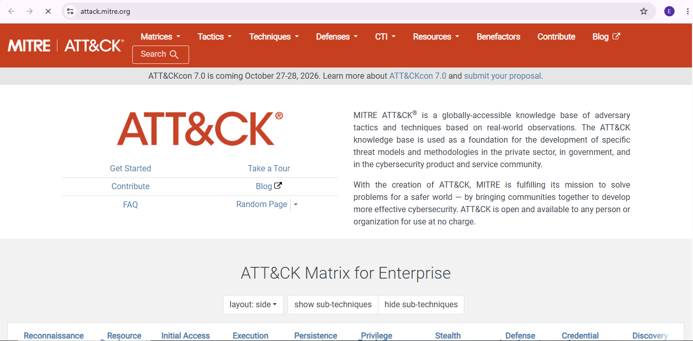
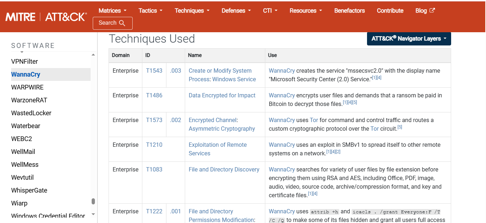
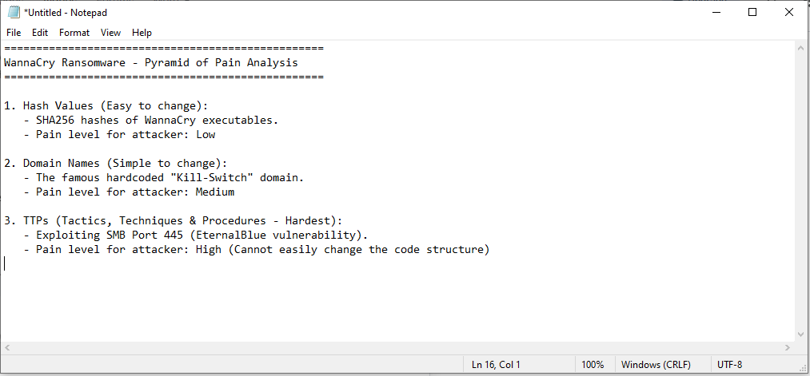
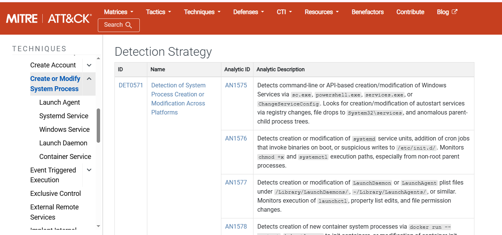
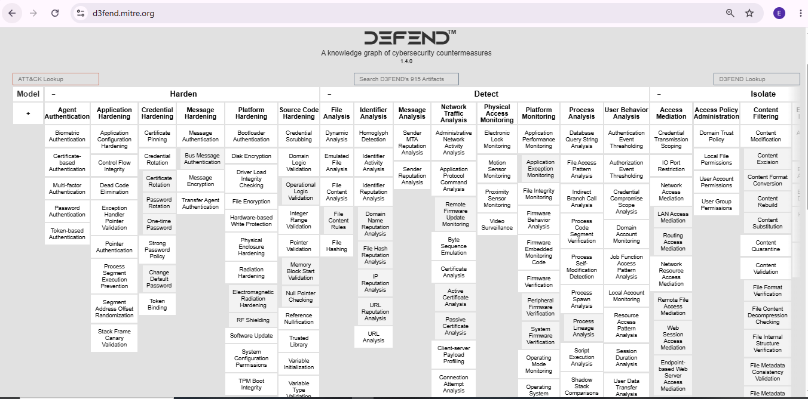

# 🦠 Project 04 — Index
### Threat Framework Mapping — WannaCry Case Study
**Project 04 of 10 — Foundational Projects**

**Quick guide to every step and screenshot in this project.**

### [📖 Open the full README](README.md)

---

| 🧩 Modules | 🖼️ Screenshots | 🗺️ Frameworks | 🎯 Malware |
|:---:|:---:|:---:|:---:|
| **5** | **5** | **3** | **WannaCry (S0366)** |

🧩 <b>Frameworks:</b> MITRE ATT&CK · Pyramid of Pain · MITRE D3FEND

---

## 📑 Step Index

| # | Step | Module | Result | Evidence |
|:---:|---|:---:|---|:---:|
| 1 | Establish the ATT&CK baseline | 🔵 Module 1 | Matrix opened as reference point | [Exhibit 1](#ex1) |
| 2 | Extract WannaCry's technical profile | 🟠 Module 2 | Located via Software DB (S0366) | [Exhibit 2](#ex2) |
| 3 | Map indicators to the Pyramid of Pain | 🟣 Module 3 | Hashes low, TTPs high | [Exhibit 3](#ex3) |
| 4 | Drill into detection strategy | 🟢 Module 4 | T1543 monitoring guidance pulled | [Exhibit 4](#ex4) |
| 5 | Map defensive countermeasures | 🔴 Module 5 | D3FEND controls mapped to T1543 | [Exhibit 5](#ex5) |

---

## 🔵 Module 1 — Baseline

Exhibit 1.

<table>
<tr>
<td align="center" valign="top" width="50%">

 <b>Exhibit 1 — ATT&CK Matrix</b>
 Homepage / baseline reference opened
</td>
<td></td>
</tr>
</table>

---

## 🟠 Module 2 — Attacker View

Exhibit 2.

<table>
<tr>
<td align="center" valign="top" width="50%">

 <b>Exhibit 2 — WannaCry TTPs</b>
 Profile S0366 located after name search failed
</td>
<td></td>
</tr>
</table>

---

## 🟣 Module 3 — Indicator Triage

Exhibit 3.

<table>
<tr>
<td align="center" valign="top" width="50%">

 <b>Exhibit 3 — Indicators ranked</b>
 File hashes vs. TTPs on the Pyramid of Pain
</td>
<td></td>
</tr>
</table>

---

## 🟢 Module 4 — Detection Drill

Exhibit 4.

<table>
<tr>
<td align="center" valign="top" width="50%">

 <b>Exhibit 4 — T1543 guidance</b>
 <code>sc.exe</code> / <code>powershell.exe</code> monitoring
</td>
<td></td>
</tr>
</table>

---

## 🔴 Module 5 — Defender View

Exhibit 5.

<table>
<tr>
<td align="center" valign="top" width="50%">

 <b>Exhibit 5 — Countermeasures mapped</b>
 D3FEND controls tied back to T1543
</td>
<td></td>
</tr>
</table>

---

## 🎯 Verification Checklist

| Check | Method | Module | Status |
|:---:|---|---|:---:|
| WannaCry located by ID after name search failed | Software DB, S0366 | Module 2 | ✅ Confirmed |
| Indicators explicitly ranked | Pyramid of Pain | Module 3 | ✅ Confirmed |
| Detection guidance pulled for T1543 | ATT&CK technique page | Module 4 | ✅ Confirmed |
| Countermeasures mapped back to T1543 | D3FEND matrix | Module 5 | ✅ Confirmed |

> [!NOTE]
> ATT&CK's search bar returned "No Results" for "WannaCry" — the entry was found by navigating directly to the Software database by ID (S0366) instead.

---

[⬆️ Back to top](#top) &nbsp;·&nbsp; [📖 Full README](README.md)

🎯 **[MITRE ATT&CK](https://attack.mitre.org/)** · 🛡️ **[MITRE D3FEND](https://d3fend.mitre.org/)** · 🔺 **[Pyramid of Pain](https://detect-respond.blogspot.com/2013/03/the-pyramid-of-pain.html)**

