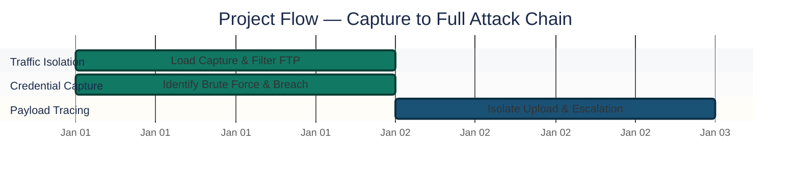
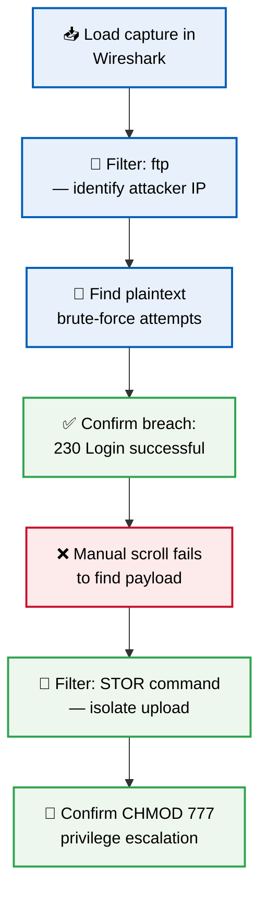
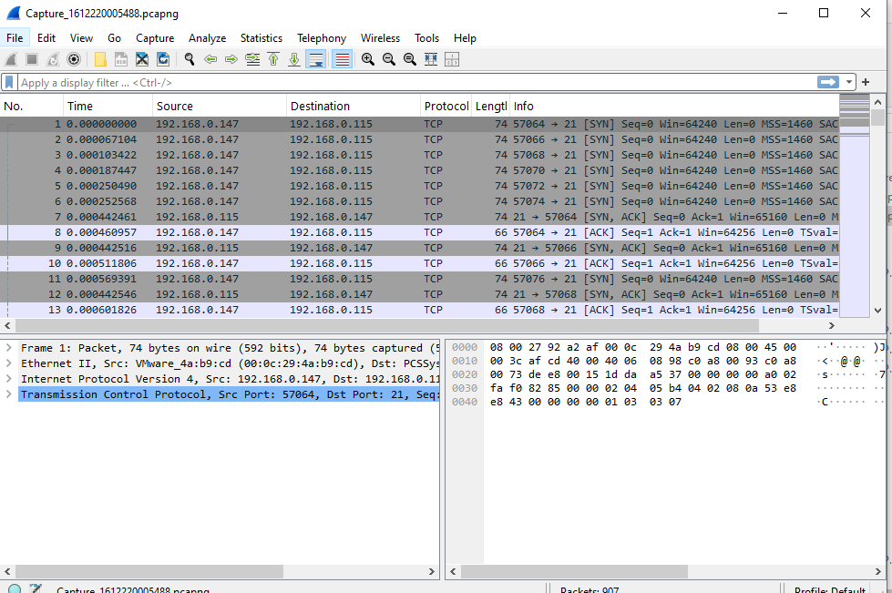
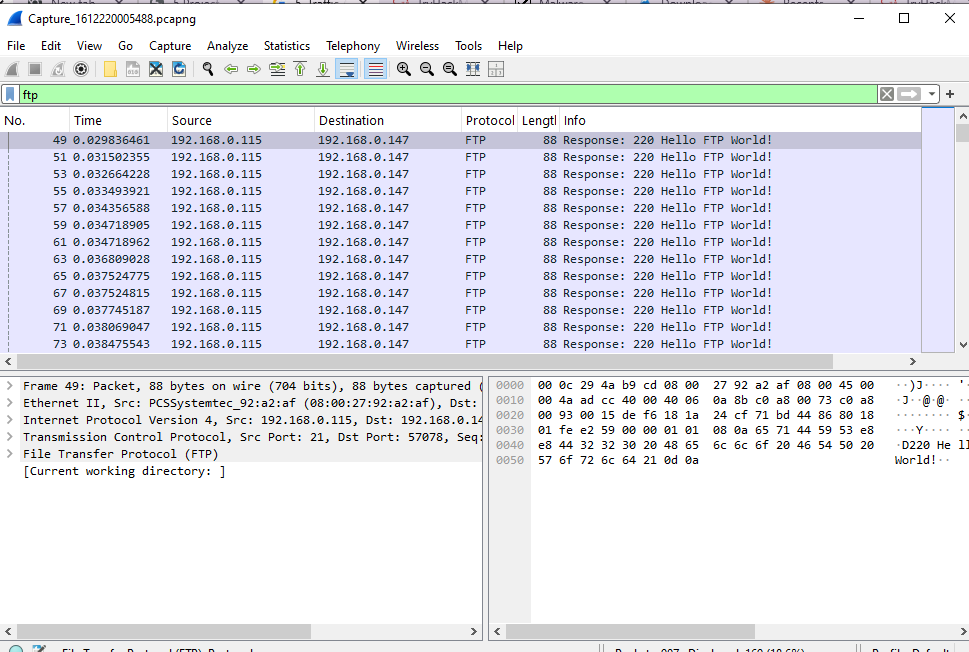
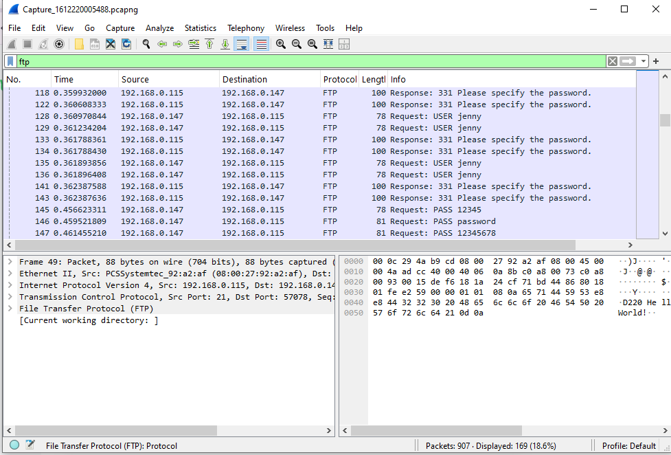
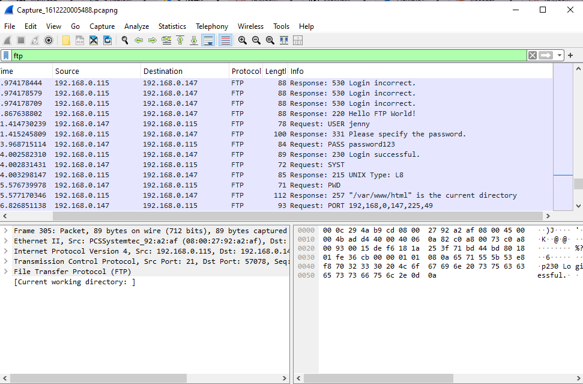
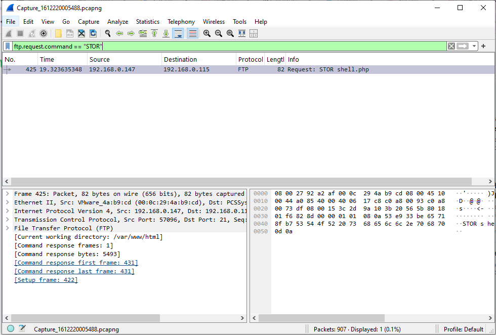
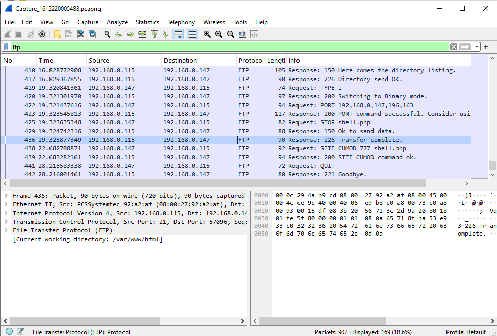
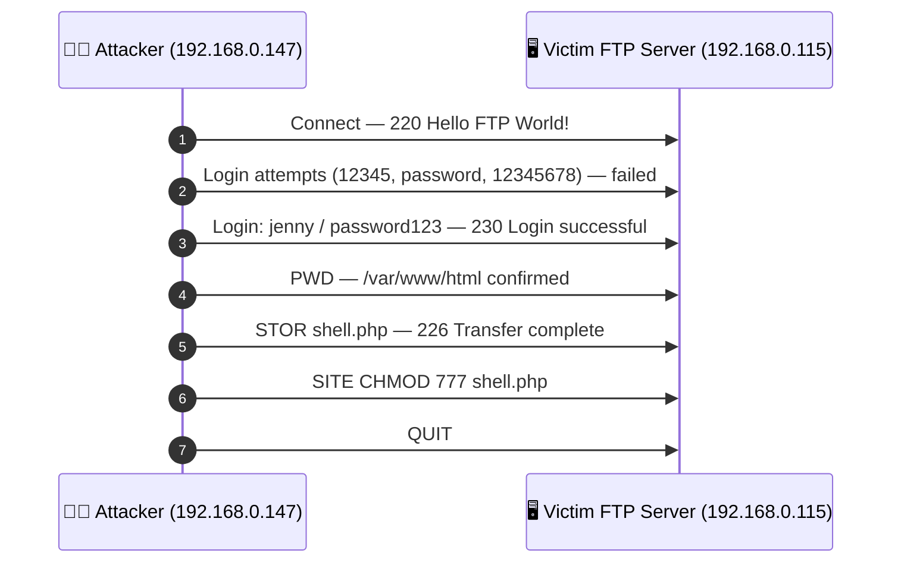

<div align="center">

# 🕵️ Network Forensics — FTP Brute Force & Malware Upload Detection

**Project 05 of 10 — Foundational Projects**

Network Forensics (Wireshark)


A full attack chain reconstructed from a raw packet capture — connection, credential brute-forcing, malware upload, and privilege escalation — using nothing but Wireshark filters. The goal: read traffic the way a SOC analyst would during an incident, not rely on summarized alerts.

</div>

---

## 📑 Table of Contents

1. [At a Glance](#at-a-glance)
2. [Project Background](#project-background)
3. [Environment](#environment)
4. [Project Flow](#project-flow)
5. [Investigation Walkthrough](#investigation-walkthrough)
6. [Findings Summary](#findings-summary)
7. [Attack Chain](#attack-chain)
8. [What I Got Wrong](#what-i-got-wrong)
9. [Challenges & Fixes](#challenges-fixes)
10. [Scope & Limitations](#scope-limitations)
11. [Key Lesson](#key-lesson)
12. [Skills Demonstrated](#skills-demonstrated)
13. [Screenshot Index](#screenshot-index)
14. [Repo Structure](#repo-structure)

---

<a id="at-a-glance"></a>
## 📊 At a Glance

| 🧩 Phases | 🖼️ Screenshots | 🔑 Credentials Captured | 🚩 Malicious File Traced |
|:---:|:---:|:---:|:---:|
| **7** | **6** | **1 (password123)** | **shell.php** |

---

<a id="project-background"></a>
## 📖 Project Background

A packet capture analyzed to **reconstruct a full attack chain** — from the moment an attacker connects, through credential brute-forcing, to malware upload and permission escalation — using only Wireshark filters.

The goal was to practice reading raw network traffic the way a SOC analyst would during an incident investigation, instead of relying on summarized alerts.

---

<a id="environment"></a>
## 🖧 Environment

| Item | Value |
|---|---|
| **Analysis Tool** | Wireshark |
| **Lab Source** | TryHackMe — "h4cked" room |
| **Capture File** | `capture.pcapng` |
| **Attacker IP** | `192.168.0.147` |
| **Victim IP** | `192.168.0.115` |
| **Protocol Analyzed** | FTP (plaintext) |

---

<a id="project-flow"></a>
## ⏱️ Project Flow


<p align="center"><em>Colors distinguish each investigation stage — all stages complete.</em></p>

---

<a id="investigation-walkthrough"></a>
## 🔵 Investigation Walkthrough

**Objective:** Given a packet capture, reconstruct what the attacker actually did — initial access method, credentials used, files dropped, and persistence/escalation steps — purely from traffic evidence.



### Phase 1 — Finding a Usable Lab File ✅
Needed a real attack capture to analyze. Most malware analysis rooms on TryHackMe are paid. Found a free room called **"h4cked"** instead, which provides a network capture file directly in Task 1 — no extra setup required.

### Phase 2 — Loading the Capture in Wireshark ✅
Opened Wireshark, went to **File > Open**, and loaded the capture file. Thousands of raw packets appeared immediately — too many to scan manually.

<p align="center">
  <br>
  <em>Phase 2 — Capture file loaded, raw packets visible</em>
</p>

### Phase 3 — Isolating the Attacker's Traffic ✅
With thousands of packets on screen, applied the filter:

```text
ftp
```

This isolated all FTP-related packets. Found a server response: `220 Hello FTP World!` — confirming an open FTP port and an active connection.

**Result:** Attacker IP identified as `192.168.0.147`. Victim machine IP: `192.168.0.115`.

<p align="center">
  <br>
  <em>Phase 3 — FTP filter applied, attacker IP identified</em>
</p>

### Phase 4 — Capturing the Brute Force Attempt ✅
FTP sends credentials in plaintext, so anything the attacker types is visible. Scrolled through the filtered packets and found repeated login attempts:

- Username: `jenny`
- Failed password attempts: `12345`, `password`, `12345678`

<p align="center">
  <br>
  <em>Phase 4 — Brute-force login attempts captured in plaintext</em>
</p>

### Phase 5 — Confirming the Breach ✅
Continued scrolling and found packet #305: `230 Login successful`. The correct password was `password123`. Immediately after login, the attacker ran `PWD` and the server confirmed the working directory: `/var/www/html` — the main web folder on a Linux server.

<p align="center">
  <br>
  <em>Phase 5 — Successful login and working directory confirmed</em>
</p>

### Phase 6 — Error: Manual Scrolling Failed to Find the Payload ❌
Knew the attacker had likely uploaded a malicious file after gaining access, but the surrounding traffic volume was too high to spot it by scrolling.

**Fix:** Replaced manual scrolling with a targeted filter:

```text
ftp.request.command == "STOR"
```

`STOR` is the FTP command for uploading a file. This filter cut out all unrelated traffic and surfaced packet #425 directly: `Request: STOR shell.php` — a PHP web shell backdoor.

<p align="center">
  <br>
  <em>Phase 6 — STOR shell.php: malware upload command isolated</em>
</p>

### Phase 7 — Confirming Upload and Privilege Escalation ✅
Cleared the command-specific filter and went back to the simple `ftp` filter to check the final packets.

- Packet #436: `226 Transfer complete` — confirms `shell.php` finished uploading.
- Packet #438: `SITE CHMOD 777 shell.php` — attacker set full read/write/execute permissions on the uploaded file so it could be run from the browser.
- Attacker then issued `QUIT` and disconnected.

<p align="center">
  <br>
  <em>Phase 7 — Upload completion and CHMOD 777 privilege escalation</em>
</p>

🎯 **Result:** Full attack chain reconstructed from raw traffic alone — access, credentials, payload, and escalation — each step tied to a specific packet.

---

<a id="findings-summary"></a>
## 🌟 Findings Summary

| 🔍 Element | 📌 Finding |
|---|---|
| Attacker IP | `192.168.0.147` |
| Victim IP | `192.168.0.115` |
| Valid credentials | `jenny` / `password123` (after 3 failed guesses) |
| Working directory post-login | `/var/www/html` |
| Malicious file uploaded | `shell.php` (PHP web shell) |
| Privilege escalation | `SITE CHMOD 777 shell.php` |

---

<a id="attack-chain"></a>
## 🎯 Attack Chain



| Rule ID (analogy) | Element | Tactic |
|:---:|---|---|
| — | Plaintext brute force | Credential Access |
| — | `STOR shell.php` upload | Persistence / Initial Access |
| — | `CHMOD 777` | Privilege Escalation |

---

<a id="what-i-got-wrong"></a>
## ⚠️ What I Got Wrong

- Tried to find the uploaded malware file by manually scrolling through traffic instead of filtering for the exact FTP command (`STOR`) that performs file uploads. Wasted time scanning packets that had nothing to do with the upload.
- Didn't filter by command type early — `ftp` alone was good enough to find the attacker, but not precise enough to isolate one specific action in a busy capture.

---

<a id="challenges-fixes"></a>
## ⚠️ Challenges & Fixes

| ❌ Challenge | ✅ Fix |
|---|---|
| Thousands of raw packets, too many to scan manually | Applied a broad `ftp` filter first to isolate relevant traffic |
| Manual scrolling failed to locate the uploaded payload | Switched to a command-specific filter: `ftp.request.command == "STOR"` |
| Most TryHackMe malware-analysis rooms required payment | Used the free "h4cked" room, which ships a usable capture file directly |

---

<a id="scope-limitations"></a>
## 🚧 Scope & Limitations

- **Single protocol:** Analysis covers FTP traffic only; the capture may contain other protocols not examined here.
- **Static capture, not live traffic:** Investigation is retrospective, on a pre-recorded `.pcapng` file — not a live packet-capture response.
- **Lab environment:** Traffic originates from a TryHackMe training room, not a production incident.

---

<a id="key-lesson"></a>
## 🧠 Key Lesson

When a capture has a high volume of traffic, **don't scroll — filter by the specific protocol command tied to the action you're looking for** (e.g. `ftp.request.command == "STOR"` for uploads). A broad filter like `ftp` narrows things down; a command-specific filter pinpoints the exact packet.

This is also a direct illustration of why **FTP should not be used in production environments** — every credential and file transfer in this capture was sitting in plaintext. SFTP or FTPS would have hidden all of this from an attacker doing the same traffic capture.

---

## 🌍 Real-World Application

This is the core skill of incident response and SOC Tier 1/2 work: given a packet capture (from a SIEM alert, IDS trigger, or post-breach investigation), reconstruct what the attacker actually did — initial access method, credentials used, files dropped, and persistence/escalation steps — purely from traffic evidence. The same filter-driven approach scales to larger captures; the only difference is volume, not method.

---

<a id="skills-demonstrated"></a>
## 🛠️ Skills Demonstrated

- Reading raw packet captures in Wireshark without relying on pre-built alerts
- Applying broad protocol filters (`ftp`) and then narrowing to command-specific filters (`STOR`)
- Extracting plaintext credentials and reconstructing a brute-force sequence
- Tracing a full attack chain from initial access through payload delivery to privilege escalation
- Recognizing protocol-level security weaknesses (plaintext FTP) from direct traffic evidence

---

<a id="screenshot-index"></a>
## 🖼️ Screenshot Index

| # | File | Shows |
|:---:|---|---|
| 1 | `1_Wireshark_File_Open_Success.PNG` | Capture file loaded, raw packets visible |
| 2 | `2_FTP_Traffic_Filtered.PNG` | FTP filter applied, attacker IP identified |
| 3 | `3_Hacker_Credentials_Found.PNG` | Brute-force login attempts captured in plaintext |
| 4 | `4_Hacker_Login_Success_and_Directory.PNG` | Successful login and working directory confirmed |
| 5 | `5_Malware_File_Upload_Detected.PNG` | `STOR shell.php` — malware upload command isolated |
| 6 | `6_Malware_Transfer_Complete_and_Permissions.PNG` | Upload completion and `CHMOD 777` privilege escalation |

---

<a id="repo-structure"></a>
## 📁 Repo Structure

```text
1-Foundational-Projects/project-05-network-forensics-wireshark/
|-- README.md
|-- capture.pcapng
`-- screenshots/
    |-- 1_Wireshark_File_Open_Success.PNG
    |-- 2_FTP_Traffic_Filtered.PNG
    |-- 3_Hacker_Credentials_Found.PNG
    |-- 4_Hacker_Login_Success_and_Directory.PNG
    |-- 5_Malware_File_Upload_Detected.PNG
    `-- 6_Malware_Transfer_Complete_and_Permissions.PNG
```

<div align="center">

🕵️ **[TryHackMe — h4cked Room](https://tryhackme.com/room/hacked)** · 🦈 **[Wireshark Docs](https://www.wireshark.org/docs/)** · 📜 **[RFC 959 — FTP](https://www.rfc-editor.org/rfc/rfc959)**

</div>
