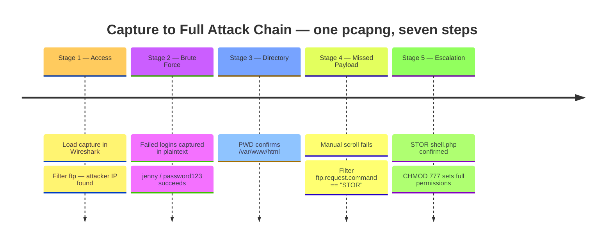
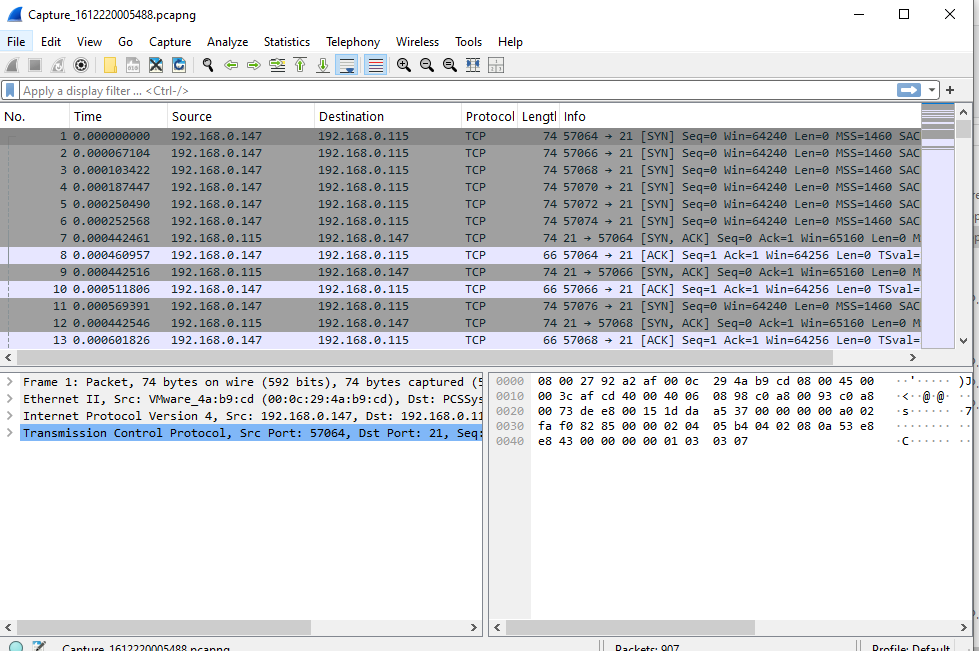
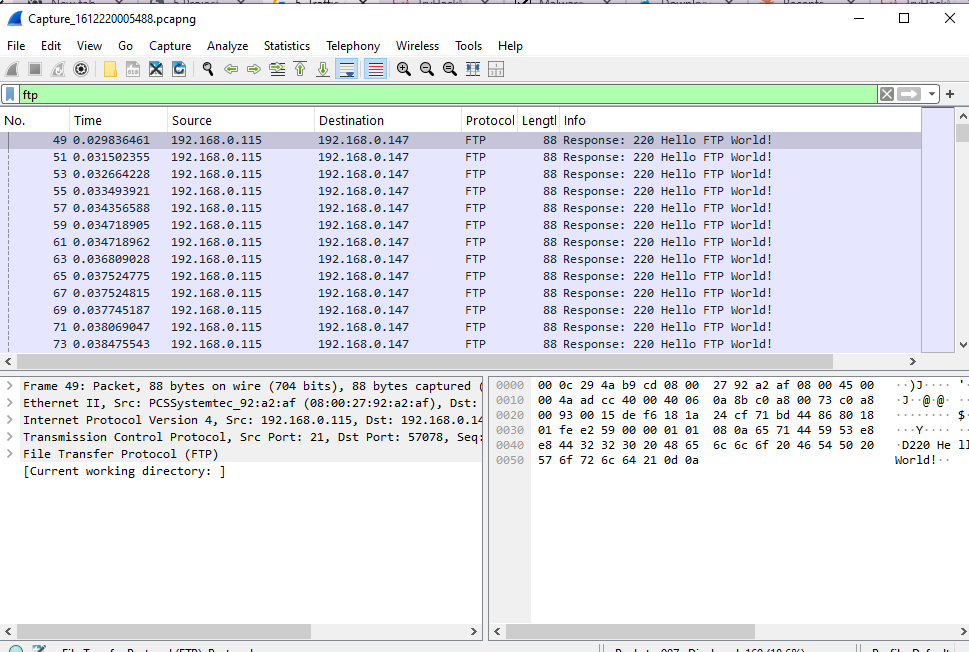
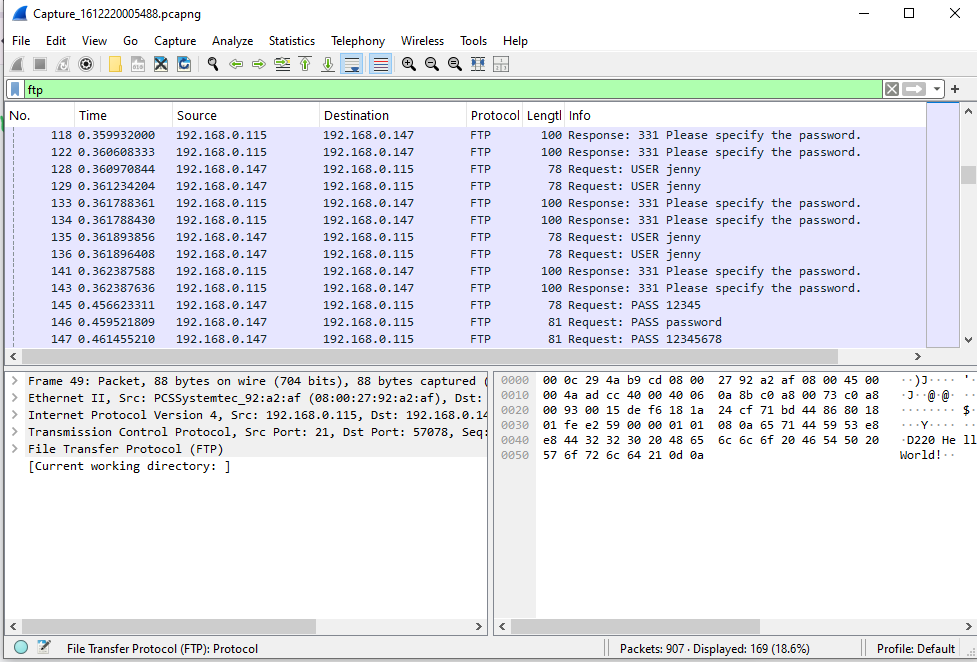
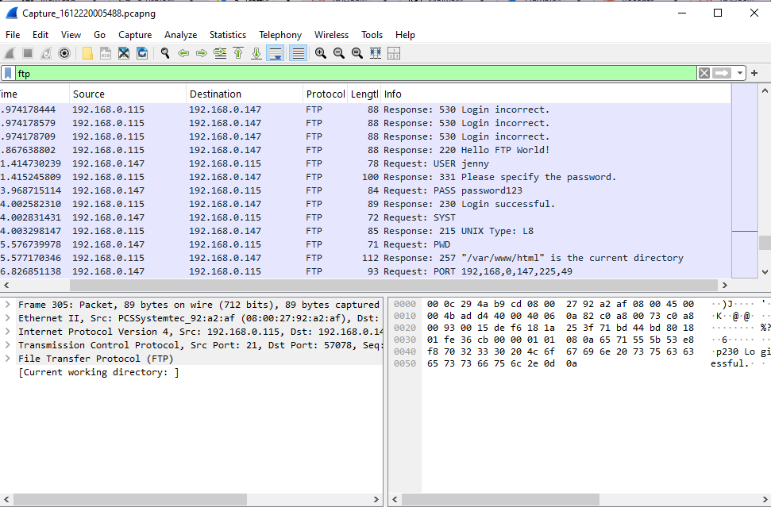
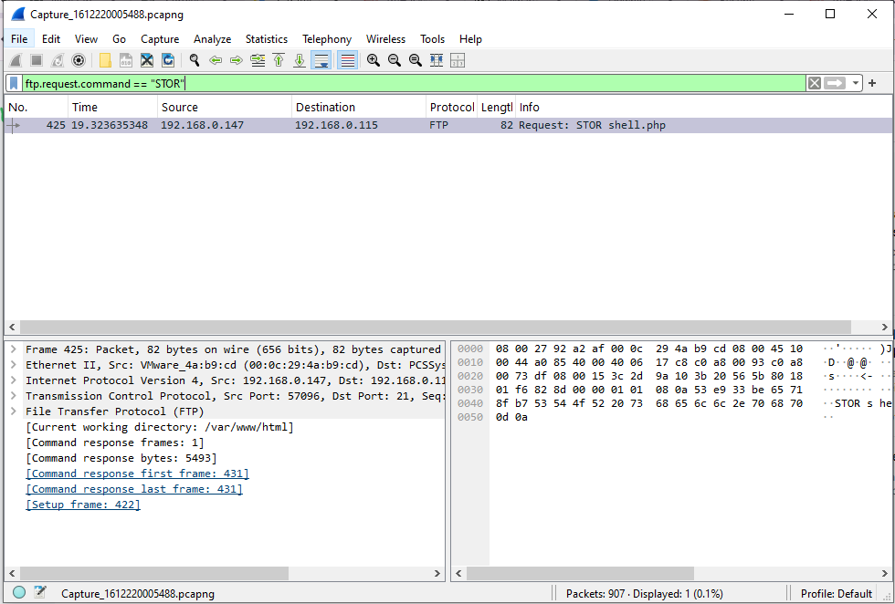
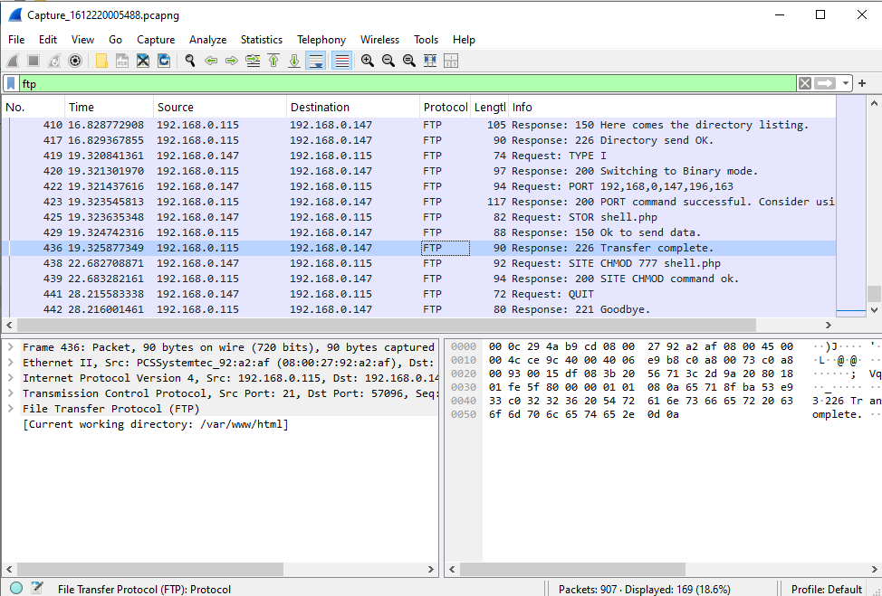
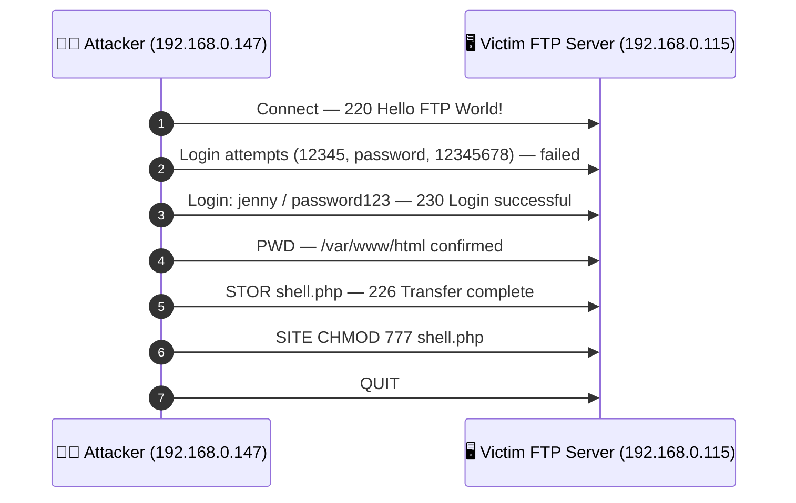

<div align="center">

# 🕵️ Network Forensics — FTP Brute Force & Malware Upload Detection

**Project 05 of 10 — Foundational Projects — Network Forensics (Wireshark)**

Full Attack Chain Reconstructed from a Raw Packet Capture — Connection, Credential Brute-Forcing, Malware Upload, and Privilege Escalation, Using Nothing but Wireshark Filters


Seven steps run end-to-end against a raw `.pcapng` capture, reconstructing an entire attack purely from traffic evidence — no summarized alerts. A broad protocol filter finds the attacker; a command-specific filter is what actually surfaces the malware upload manual scrolling couldn't find.

</div>

---

## 📑 Table of Contents

1. [At a Glance](#at-a-glance)
2. [Project Background](#project-background)
3. [Tools & Technologies](#tools-technologies)
4. [Environment](#environment)
5. [Network Forensics Map](#network-forensics-map)
6. [Investigation Challenges](#investigation-challenges)
7. [Investigation Timeline](#investigation-timeline)
8. [Module 1 — Find a Usable Lab File](#module-1)
9. [Module 2 — Load the Capture in Wireshark](#module-2)
10. [Module 3 — Isolate the Attacker's Traffic](#module-3)
11. [Module 4 — Capture the Brute-Force Attempt](#module-4)
12. [Module 5 — Confirm the Breach](#module-5)
13. [Module 6 — Diagnose the Missing Payload](#module-6)
14. [Module 7 — Confirm Upload & Privilege Escalation](#module-7)
15. [Coverage Snapshot](#coverage-snapshot)
16. [Attack Chain](#attack-chain)
17. [Filter Summary](#filter-summary)
18. [Challenges & Fixes](#challenges-fixes)
19. [Scope & Limitations](#scope-limitations)
20. [What I Learned](#what-i-learned)
21. [Skills Demonstrated](#skills-demonstrated)
22. [Screenshot Index](#screenshot-index)
23. [Repo Structure](#repo-structure)

---

<a id="at-a-glance"></a>
## 📊 At a Glance

<div align="center">

| 🧩 Modules | 🔑 Credentials Captured | 🚩 Malicious File Traced | 🖼️ Screenshots |
|:---:|:---:|:---:|:---:|
| **7** | **1 (password123)** | **shell.php** | **6** |

</div>

---

<a id="project-background"></a>
## 📖 Project Background

This project takes a raw packet capture and reconstructs the full attack chain behind it — connection, credential brute-forcing, malware upload, and privilege escalation — using nothing but Wireshark filters. The goal is to read traffic the way a SOC analyst would during an incident, not rely on summarized alerts.

| Module Group | Focus |
|---|---|
| 📥 **Access (Modules 1–3)** | Find a usable capture, load it, and isolate the attacker's FTP traffic |
| 🔑 **Credential Capture (Modules 4–5)** | Extract plaintext brute-force attempts and confirm the successful login |
| 🎯 **Payload Tracing (Modules 6–7)** | Diagnose why manual scrolling missed the upload, then confirm it and the escalation that followed |

> [!NOTE]
> Most TryHackMe malware-analysis rooms are paid. The free **"h4cked"** room was used instead — it ships a usable capture file directly in Task 1, no extra setup required.

---

<a id="tools-technologies"></a>
## 🛠️ Tools & Technologies

| Tool | Purpose |
|------|---------|
| 🦈 Wireshark | Packet capture analysis and filtering |
| 📁 `capture.pcapng` | The raw traffic file under investigation |
| 🎯 TryHackMe ("h4cked" room) | Free lab source providing the capture |
| 🔎 Display filters (`ftp`, `ftp.request.command`) | Isolating attacker traffic and specific FTP commands |

---

<a id="environment"></a>
## 🖧 Environment


| Item | Detail |
|------|--------|
| Analysis Tool | Wireshark |
| Lab Source | TryHackMe — "h4cked" room |
| Capture File | `capture.pcapng` |
| Attacker IP | `192.168.0.147` |
| Victim IP | `192.168.0.115` |
| Protocol Analyzed | FTP (plaintext) |

---

<a id="network-forensics-map"></a>
## 🗺️ Network Forensics Map


```mermaid
%%{init: {'theme': 'base', 'themeVariables': {'fontSize': '16px'}, 'flowchart': {'nodeSpacing': 34, 'rankSpacing': 46, 'padding': 12}}}%%
flowchart LR
    ATT["🧑‍💻 Attacker<br/>192.168.0.147"]:::att --> FTP["📡 FTP Server<br/>192.168.0.115"]:::srv
    FTP --> DIR["📁 /var/www/html<br/>working directory"]:::dir
    DIR --> FILE["🚩 shell.php<br/>uploaded"]:::file
    FILE --> PERM["🔓 CHMOD 777<br/>escalated"]:::perm
    ATT -.->|"❌ brute force:<br/>12345, password, 12345678"| FTP
    FTP -.->|"✅ 230 Login successful<br/>jenny / password123"| DIR
    DIR -.->|"❌ manual scroll<br/>misses upload"| FILE
    classDef att fill:#943126,stroke:#571C16,stroke-width:2px,color:#FFFFFF
    classDef srv fill:#1A5276,stroke:#0B2E43,stroke-width:2px,color:#FFFFFF
    classDef dir fill:#76448A,stroke:#432752,stroke-width:2px,color:#FFFFFF
    classDef file fill:#B9770E,stroke:#6E4409,stroke-width:2px,color:#FFFFFF
    classDef perm fill:#117864,stroke:#083D33,stroke-width:2px,color:#FFFFFF
    linkStyle default stroke:#2C3E50,stroke-width:2px
```
<p align="center"><em>The attacker moves from connection to brute force, into the web directory, then drops and escalates a malicious file — the dashed lines mark where the brute force succeeded and where manual scrolling failed to find the payload.</em></p>

---

<a id="investigation-challenges"></a>
## 🐛 Investigation Challenges

| # | Challenge | Type |
|---|-------|------|
| 1 | Thousands of raw packets, too many to scan manually | Traffic volume |
| 2 | Manual scrolling failed to locate the uploaded payload | Wrong investigation method (broad filter, not command-specific) |
| 3 | Most TryHackMe malware-analysis rooms require payment | Lab-source constraint |

---

<a id="investigation-timeline"></a>
## 🔎 Investigation Timeline


```mermaid
%%{init: {'theme': 'base', 'themeVariables': {'fontSize': '15px'}, 'timeline': {'disableMulticolor': false}}}%%
timeline
    title Capture to Full Attack Chain — one pcapng, seven steps
    Stage 1 — Access : Load capture in Wireshark : Filter ftp — attacker IP found
    Stage 2 — Brute Force : Failed logins captured in plaintext : jenny / password123 succeeds
    Stage 3 — Directory : PWD confirms /var/www/html
    Stage 4 — Missed Payload : Manual scroll fails : Filter ftp.request.command == "STOR"
    Stage 5 — Escalation : STOR shell.php confirmed : CHMOD 777 sets full permissions
```
<p align="center"><em>A Mermaid timeline instead of a flowchart — five stages read left to right, from loading the capture to confirming the privilege escalation.</em></p>

---

<a id="module-1"></a>
## 📥 Module 1 — Find a Usable Lab File

**Objective:** Find a free, real attack capture to analyze.

### Step 1 — Locate a Free Capture ✅

```
Most TryHackMe malware-analysis rooms are paid.

→ Found the free "h4cked" room instead
→ Provides a network capture file directly in Task 1 —
  no extra setup required
```

---

<a id="module-2"></a>
## 📂 Module 2 — Load the Capture in Wireshark

**Objective:** Open the capture file and confirm it loads.

### Step 2 — Open the Capture ✅

```
Wireshark → File > Open → select capture.pcapng

→ Thousands of raw packets appear immediately —
  too many to scan manually
```

<p align="center">
  <br>
  <em>Exhibit 1 — Capture file loaded, raw packets visible</em>
</p>

---

<a id="module-3"></a>
## 🔎 Module 3 — Isolate the Attacker's Traffic

**Objective:** Cut the noise down to just the relevant protocol.

### Step 3 — Apply the FTP Filter ✅

```
ftp

→ Isolates all FTP-related packets
→ Server response found: "220 Hello FTP World!"
   (confirms an open FTP port and an active connection)

→ Attacker IP identified: 192.168.0.147
→ Victim IP identified: 192.168.0.115
```

<p align="center">
  <br>
  <em>Exhibit 2 — FTP filter applied, attacker IP identified</em>
</p>

---

<a id="module-4"></a>
## 🔑 Module 4 — Capture the Brute-Force Attempt

**Objective:** Extract the plaintext login attempts.

### Step 4 — Read the Credential Attempts ✅

```
FTP sends credentials in plaintext — anything the attacker
types is visible in the filtered packets.

Username: jenny
Failed password attempts: 12345, password, 12345678
```

<p align="center">
  <br>
  <em>Exhibit 3 — Brute-force login attempts captured in plaintext</em>
</p>

---

<a id="module-5"></a>
## ✅ Module 5 — Confirm the Breach

**Objective:** Find the successful login and the attacker's first action after access.

### Step 5 — Confirm Login Success ✅

```
Packet #305: 230 Login successful
→ Correct password: password123

Immediately after login:
PWD → server confirms working directory: /var/www/html
   (the main web folder on a Linux server)
```

<p align="center">
  <br>
  <em>Exhibit 4 — Successful login and working directory confirmed</em>
</p>

---

<a id="module-6"></a>
## ❌ Module 6 — Diagnose the Missing Payload

**Objective:** Find out why manual scrolling can't locate the uploaded malware.

### Step 6 — Switch to a Command-Specific Filter ✅

```
→ Knew a malicious file was likely uploaded after access,
  but traffic volume was too high to spot it by scrolling

Fix:
ftp.request.command == "STOR"

→ STOR is the FTP command for uploading a file
→ Cuts out all unrelated traffic
→ Surfaces packet #425 directly:
   "Request: STOR shell.php" — a PHP web shell backdoor
```

<p align="center">
  <br>
  <em>Exhibit 5 — STOR shell.php: malware upload command isolated</em>
</p>

---

<a id="module-7"></a>
## 🚨 Module 7 — Confirm Upload & Privilege Escalation

**Objective:** Verify the upload completed and check what the attacker did next.

### Step 7 — Verify Completion & Escalation ✅

```
Cleared the command-specific filter, returned to: ftp

Packet #436: 226 Transfer complete
   → shell.php finished uploading

Packet #438: SITE CHMOD 777 shell.php
   → attacker set full read/write/execute permissions
     so it could be run from the browser

Attacker then issued QUIT and disconnected.
```

<p align="center">
  <br>
  <em>Exhibit 6 — Upload completion and CHMOD 777 privilege escalation</em>
</p>

---

<a id="coverage-snapshot"></a>
## 🌟 Coverage Snapshot

| 🛡️ Layer | ✅ Status | 📌 Detail |
|---|---|---|
| Lab file sourced | Live | Free "h4cked" room capture used |
| Capture loaded | Proven | `capture.pcapng` opened in Wireshark (Exhibit 1) |
| Attacker traffic isolated | Proven | `ftp` filter identifies attacker IP (Exhibit 2) |
| Brute force captured | Proven | Plaintext failed attempts read directly (Exhibit 3) |
| Breach confirmed | Proven | `230 Login successful`, directory confirmed (Exhibit 4) |
| Payload located | Proven | `STOR shell.php` isolated via command filter (Exhibit 5) |
| Escalation confirmed | Proven | Transfer complete + `CHMOD 777` verified (Exhibit 6) |

---

<a id="attack-chain"></a>
## 🎯 Attack Chain


```mermaid
sequenceDiagram
    autonumber
    participant A as 🧑‍💻 Attacker (192.168.0.147)
    participant V as 🖥️ Victim FTP Server (192.168.0.115)

    A->>V: Connect — 220 Hello FTP World!
    A->>V: Login attempts (12345, password, 12345678) — failed
    A->>V: Login: jenny / password123 — 230 Login successful
    A->>V: PWD — /var/www/html confirmed
    A->>V: STOR shell.php — 226 Transfer complete
    A->>V: SITE CHMOD 777 shell.php
    A->>V: QUIT
```

| Element | Tactic |
|---|---|
| Plaintext brute force | Credential Access |
| `STOR shell.php` upload | Persistence / Initial Access |
| `CHMOD 777` | Privilege Escalation |

---

<a id="filter-summary"></a>
## 📟 Filter Summary

| Filter | Purpose |
|---------|---------|
| `ftp` | Isolate all FTP protocol traffic |
| `ftp.request.command == "STOR"` | Isolate file-upload commands specifically |
| `File > Open` | Load a `.pcapng` capture file in Wireshark |

---

<a id="challenges-fixes"></a>
## ⚠️ Challenges & Fixes

| ❌ Challenge | ✅ Fix |
|---|---|
| Thousands of raw packets, too many to scan manually | Applied a broad `ftp` filter first to isolate relevant traffic |
| Manual scrolling failed to locate the uploaded payload | Switched to a command-specific filter: `ftp.request.command == "STOR"` |
| Most TryHackMe malware-analysis rooms required payment | Used the free "h4cked" room, which ships a usable capture file directly |

---

<a id="scope-limitations"></a>
## 🚧 Scope & Limitations

- **Single protocol:** analysis covers FTP traffic only; the capture may contain other protocols not examined here.
- **Static capture, not live traffic:** investigation is retrospective, on a pre-recorded `.pcapng` file — not a live packet-capture response.
- **Lab environment:** traffic originates from a TryHackMe training room, not a production incident.

---

<a id="what-i-learned"></a>
## 🧠 What I Learned

- **When a capture has high traffic volume, don't scroll — filter by the specific protocol command tied to the action you're looking for.** A broad filter like `ftp` narrows things down; a command-specific filter (`ftp.request.command == "STOR"`) pinpoints the exact packet.
- **A broad filter finds the actor; a narrow filter finds the action.** `ftp` alone was enough to find the attacker's IP, but not precise enough to isolate one specific step in a busy capture — time was wasted scrolling before switching filters.
- **FTP's plaintext design is the vulnerability, not just the vector.** Every credential and file transfer in this capture was sitting in plaintext — SFTP or FTPS would have hidden all of this from an attacker doing the same traffic capture.
- **A full attack chain is reconstructable from traffic alone**, tied packet-by-packet to a specific action: connection, brute force, breach, upload, and escalation — no summarized alert needed.

---

## 🌍 Real-World Application

This is the core skill of incident response and SOC Tier 1/2 work: given a packet capture (from a SIEM alert, IDS trigger, or post-breach investigation), reconstruct what the attacker actually did — initial access method, credentials used, files dropped, and persistence/escalation steps — purely from traffic evidence. The same filter-driven approach scales to larger captures; the only difference is volume, not method.

---

<a id="skills-demonstrated"></a>
## 🛠️ Skills Demonstrated

- Reading raw packet captures in Wireshark without relying on pre-built alerts
- Applying broad protocol filters (`ftp`) and then narrowing to command-specific filters (`STOR`)
- Extracting plaintext credentials and reconstructing a brute-force sequence
- Tracing a full attack chain from initial access through payload delivery to privilege escalation
- Recognizing protocol-level security weaknesses (plaintext FTP) from direct traffic evidence

---

<a id="screenshot-index"></a>
## 🖼️ Screenshot Index

| # | File | Shows |
|:---:|---|---|
| 1 | `1_Wireshark_File_Open_Success.PNG` | Capture file loaded, raw packets visible |
| 2 | `2_FTP_Traffic_Filtered.PNG` | FTP filter applied, attacker IP identified |
| 3 | `3_Hacker_Credentials_Found.PNG` | Brute-force login attempts captured in plaintext |
| 4 | `4_Hacker_Login_Success_and_Directory.PNG` | Successful login and working directory confirmed |
| 5 | `5_Malware_File_Upload_Detected.PNG` | `STOR shell.php` — malware upload command isolated |
| 6 | `6_Malware_Transfer_Complete_and_Permissions.PNG` | Upload completion and `CHMOD 777` privilege escalation |

---

<a id="repo-structure"></a>
## 📁 Repo Structure

```text
1-Foundational-Projects/project-05-network-forensics-wireshark/
|-- README.md
|-- capture.pcapng
`-- screenshots/
    |-- 1_Wireshark_File_Open_Success.PNG
    |-- 2_FTP_Traffic_Filtered.PNG
    |-- 3_Hacker_Credentials_Found.PNG
    |-- 4_Hacker_Login_Success_and_Directory.PNG
    |-- 5_Malware_File_Upload_Detected.PNG
    `-- 6_Malware_Transfer_Complete_and_Permissions.PNG
```

<div align="center">

🕵️ **[TryHackMe — h4cked Room](https://tryhackme.com/room/hacked)** · 🦈 **[Wireshark Docs](https://www.wireshark.org/docs/)** · 📜 **[RFC 959 — FTP](https://www.rfc-editor.org/rfc/rfc959)**

</div>
