<div align="center">

# 🚨 SIEM Alert Triage — SOC Simulator

**Project 06 of 10 — Foundational Projects**

SIEM & Alert Triage


Two phishing-pattern alerts, same surface presentation — "email with external link" — triaged to opposite verdicts using nothing but SIEM log evidence: a False Positive backed by internal ticket history, and a True Positive backed by a confirmed firewall click-through.

</div>

---

## 📑 Table of Contents

1. [At a Glance](#at-a-glance)
2. [Project Background](#project-background)
3. [Environment](#environment)
4. [Project Flow](#project-flow)
5. [Triage Walkthrough](#triage-walkthrough)
6. [Findings Summary](#findings-summary)
7. [Verdict Comparison](#verdict-comparison)
8. [Challenges & Fixes](#challenges-fixes)
9. [Scope & Limitations](#scope-limitations)
10. [Key Lesson](#key-lesson)
11. [Skills Demonstrated](#skills-demonstrated)
12. [Screenshot Index](#screenshot-index)
13. [Repo Structure](#repo-structure)

---

<a id="at-a-glance"></a>
## 📊 At a Glance

| 🧩 Phases | 🖼️ Screenshots | 🎫 Alerts Triaged | ⚖️ Verdicts |
|:---:|:---:|:---:|:---:|
| **9** | **12** | **2** | **1 False Positive · 1 True Positive** |

---

<a id="project-background"></a>
## 📖 Project Background

Worked as a Tier 1 SOC Analyst inside TryHackMe's **SOC Simulator** (Scenario 1 — Introduction to Phishing). The job: investigate incoming alerts using SIEM logs and decide, with evidence, whether each one was a **True Positive** (real threat) or a **False Positive** (false alarm) — then document the verdict and any required action.

---

<a id="environment"></a>
## 🖧 Environment

| Item | Value |
|---|---|
| **Simulator** | TryHackMe SOC Simulator |
| **Scenario** | Scenario 1 — Introduction to Phishing |
| **SIEM** | Splunk |
| **Alerts in Queue** | 5 pending |
| **Alerts Triaged** | 2 (8818, 8817) |

---

<a id="project-flow"></a>
## ⏱️ Project Flow

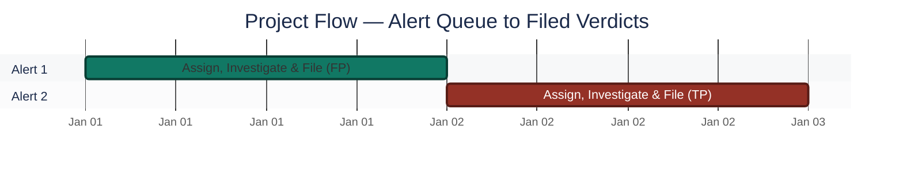
<p align="center"><em>Colors distinguish each alert's triage path — both filed.</em></p>

---

<a id="triage-walkthrough"></a>
## 🔵 Triage Walkthrough

**Objective:** Pivot from "this looks suspicious" to a documented, evidence-backed verdict using SIEM log data — not the surface appearance of the alert.

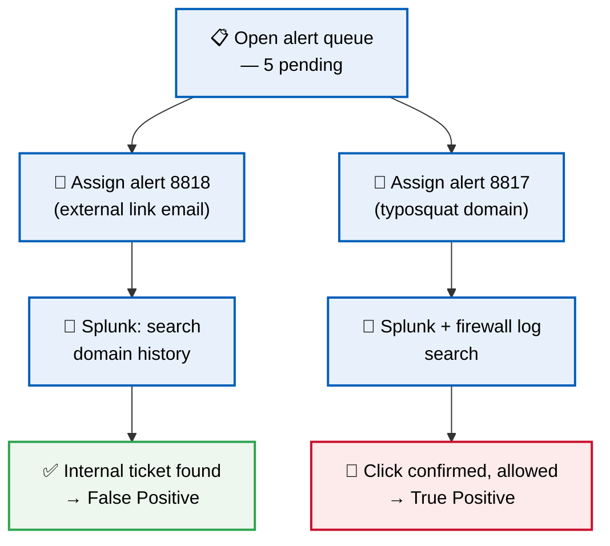

### Phase 1 — Opening the Simulator ✅
Launched the SOC Simulator and confirmed Scenario 1 (Introduction to Phishing) loaded correctly.

<p align="center">
  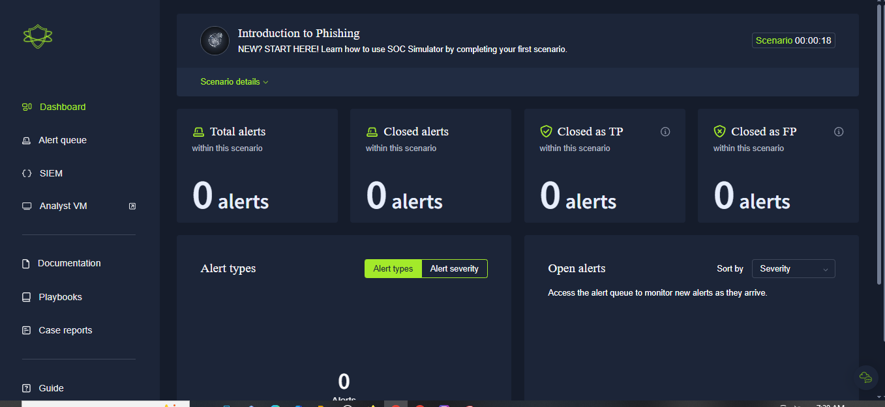<br>
  <em>Phase 1 — SOC Simulator loaded, Scenario 1 ready</em>
</p>

### Phase 2 — Reviewing the Alert Queue ✅
Opened the alert queue — 5 pending alerts waiting. Picked up the first one:

- **Alert ID:** 8818
- **Alert Rule:** Inbound Email Containing Suspicious External Link
- **Severity:** Medium

<p align="center">
  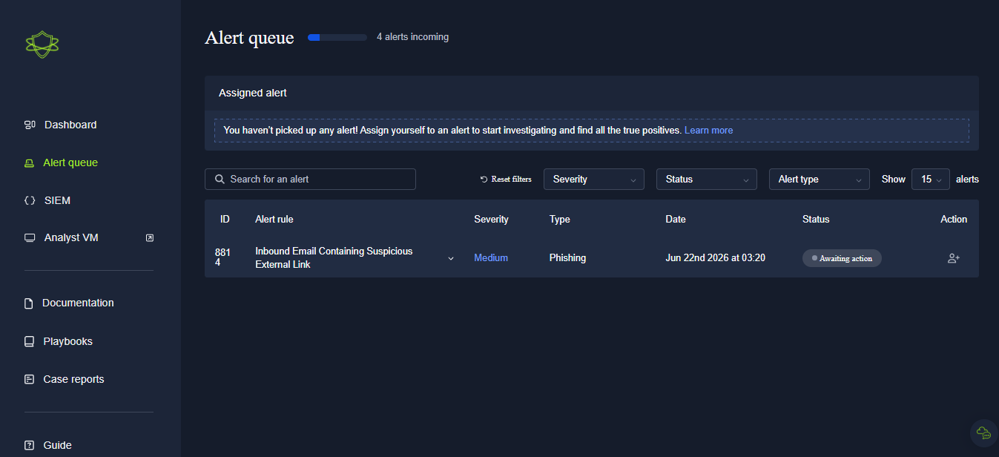<br>
  <em>Phase 2 — Alert queue, 5 pending alerts</em>
</p>

### Phase 3 — Assigning the Alert ✅
Assigned Alert 8818 to myself to begin the investigation.

<p align="center">
  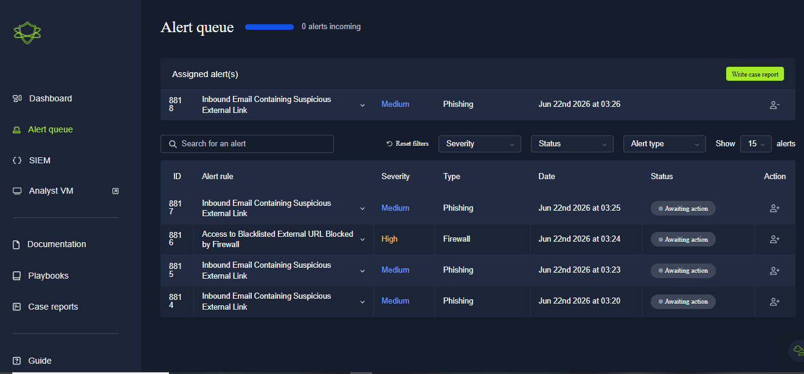<br>
  <em>Phase 3 — Alert 8818 assigned for investigation</em>
</p>

### Phase 4 — Reviewing Alert Details ✅
Opened the raw email data:

| Field | Value |
|---|---|
| Sender | `onboarding@hrconnex.thm` |
| Recipient | `j.garcia@thetrydaily.thm` |
| Subject | Action Required: Finalize Your Onboarding Profile |
| Link | `https://hrconnex.thm` |

On the surface, this looked like a generic phishing pattern — an email with an external link. Not enough on its own to call a verdict either way.

<p align="center">
  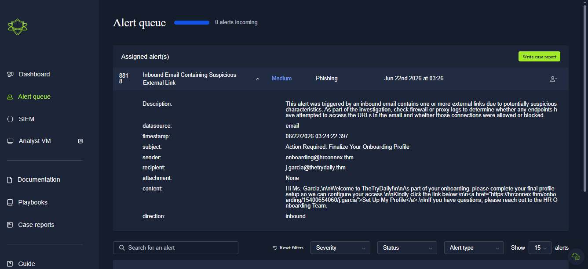<br>
  <em>Phase 4 — Raw email data for Alert 8818</em>
</p>

### Phase 5 — SIEM Investigation: Domain History ✅
Searched `hrconnex.thm` in Splunk to check for prior activity tied to this domain.

<p align="center">
  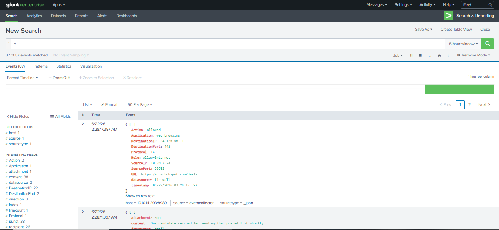<br>
  <em>Phase 5 — Splunk search for hrconnex.thm</em>
</p>

Found two internal emails:

- An employee (`h.harris`) had filed an IT ticket explaining that a new hire (`j.garcia`) hadn't received the onboarding link from the company's third-party HR provider, `hrconnex.thm`.
- This confirmed the domain and email were legitimate, business-approved communication — not phishing.

<p align="center">
  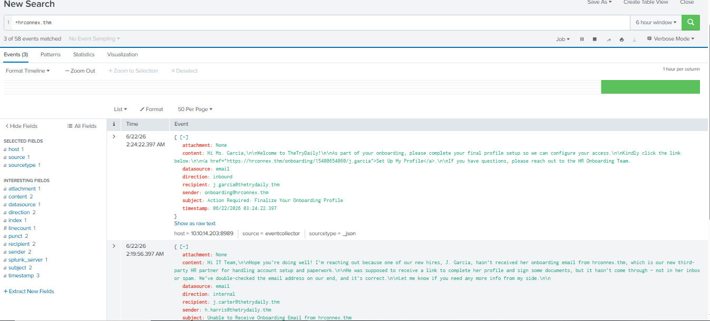<br>
  <em>Phase 5 — Internal ticket history confirming legitimacy</em>
</p>

### Phase 6 — Filing the Case Report (Alert 1) ✅
Filled out the case report and marked Alert 8818 as a **False Positive** — a legitimate HR onboarding email, confirmed by internal ticket history.

<p align="center">
  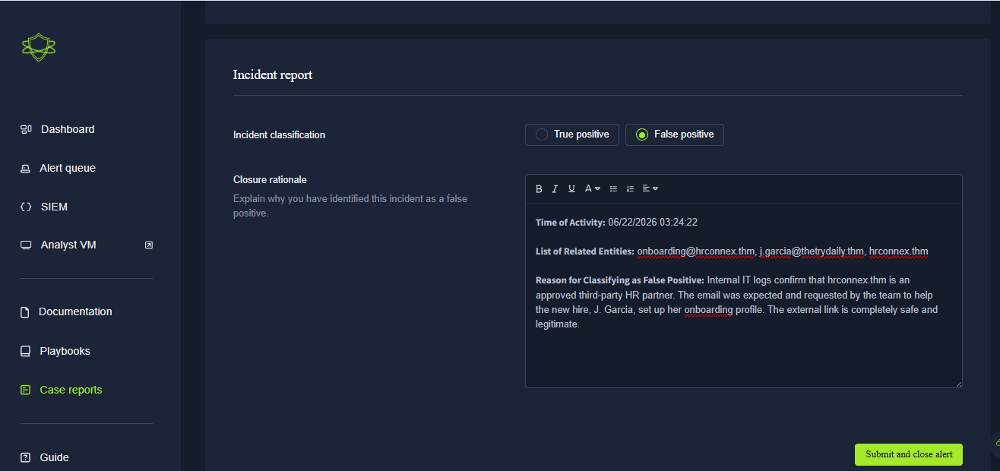<br>
  <em>Phase 6 — Case report being completed for Alert 8818</em>
</p>
<p align="center">
  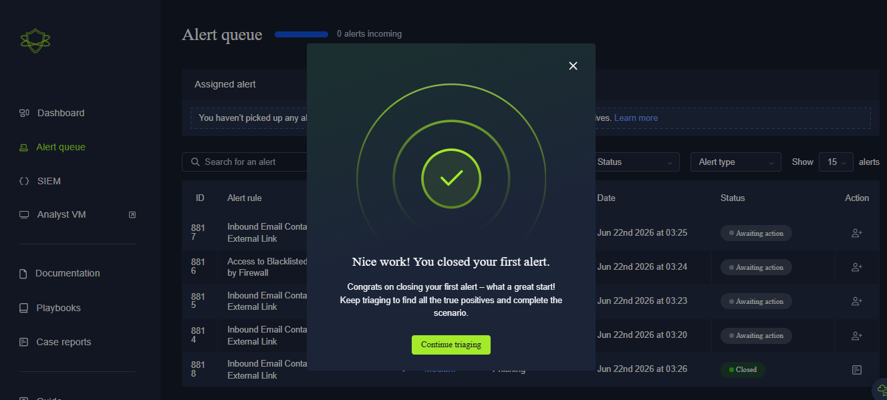<br>
  <em>Phase 6 — False Positive verdict submitted</em>
</p>

### Phase 7 — Second Alert: Typosquat Phishing Domain ✅
Opened the next alert:

| Field | Value |
|---|---|
| Alert ID | 8817 |
| Sender | `no-reply@m1crosoftsupport.co` (note the "1" replacing the "i" — a typosquatting domain) |
| Subject | Unusual Sign-In Activity on Your Microsoft Account |
| Link | `https://m1crosoftsupport.co` |

<p align="center">
  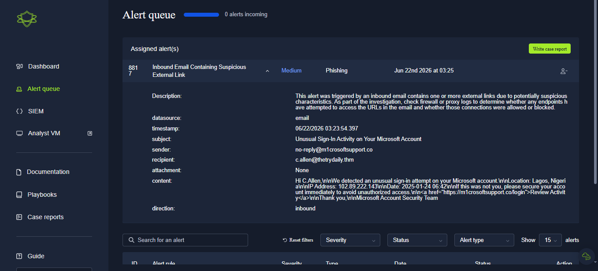<br>
  <em>Phase 7 — Alert 8817: typosquat phishing domain details</em>
</p>

### Phase 8 — SIEM Investigation: Confirming the Click ✅
Searched the fake domain in Splunk and found 2 related events.

<p align="center">
  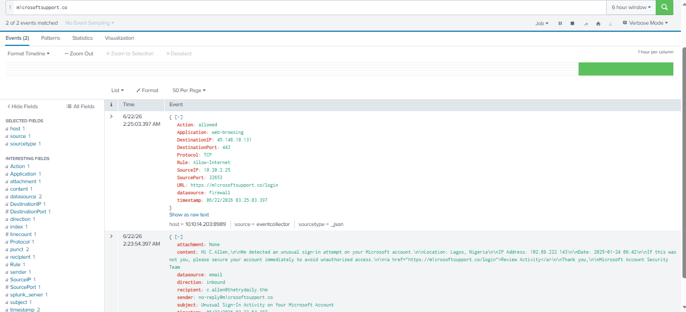<br>
  <em>Phase 8 — Splunk search for m1crosoftsupport.co</em>
</p>

Checked the firewall logs directly and found an employee had actually clicked the link:

- **Source IP:** `10.20.2.25` (internal employee machine)
- **Firewall Action:** `allowed`

This confirmed the click went through — a real **True Positive**.

<p align="center">
  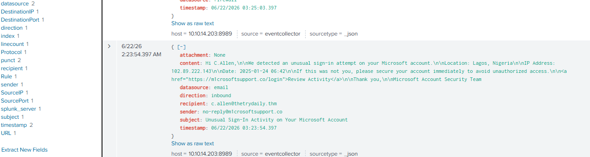<br>
  <em>Phase 8 — Firewall log confirming the malicious click</em>
</p>

### Phase 9 — Filing the Case Report (Alert 2) ✅
Submitted the final case report:

- **Verdict:** True Positive
- **Escalate:** Yes
- **Remediation:** Isolate the affected machine (`10.20.2.25`) from the network, force a password reset for the employee

<p align="center">
  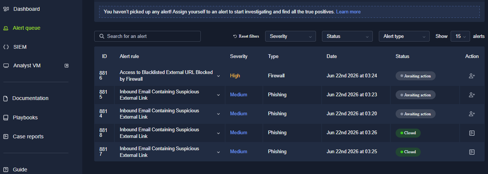<br>
  <em>Phase 9 — True Positive verdict, escalation, and remediation steps</em>
</p>

🎯 **Result:** Two alerts, identical surface pattern, opposite evidence-backed verdicts — one closed, one escalated with concrete remediation steps.

---

<a id="findings-summary"></a>
## 🌟 Findings Summary

| 🎫 Alert | 🔍 Domain | 📌 Evidence | ⚖️ Verdict |
|---|---|---|---|
| 8818 | `hrconnex.thm` | Internal IT ticket confirms expected HR onboarding email | False Positive |
| 8817 | `m1crosoftsupport.co` | Firewall log shows `allowed` click from `10.20.2.25` | True Positive |

---

<a id="verdict-comparison"></a>
## ⚖️ Verdict Comparison

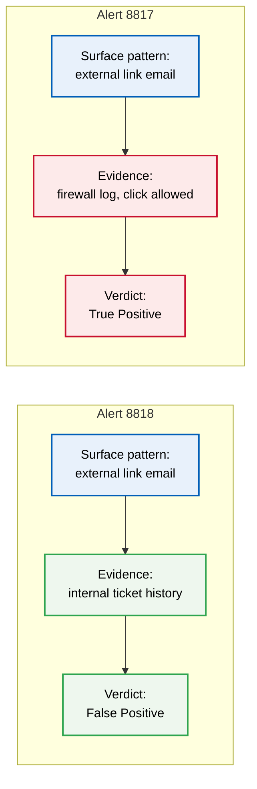

| Alert | Escalated? | Remediation |
|:---:|:---:|---|
| 8818 | No | None — closed as False Positive |
| 8817 | Yes | Isolate `10.20.2.25`, force password reset |

---

<a id="challenges-fixes"></a>
## ⚠️ Challenges & Fixes

| ❌ Challenge | ✅ Fix |
|---|---|
| Both alerts looked identical at the surface level ("external link email") | Pivoted to Splunk log search on each domain instead of judging from the alert description |
| Alert 8817's sender domain used a subtle typosquat ("1" for "i") | Cross-checked the domain string directly rather than relying on the display name |
| Needed proof the phishing link was actually clicked, not just received | Checked firewall logs for the source IP and confirmed action was `allowed` |

---

<a id="scope-limitations"></a>
## 🚧 Scope & Limitations

- **Simulated SOC environment:** TryHackMe's SOC Simulator, not a live production SIEM queue.
- **Two of five alerts triaged:** Only Alerts 8818 and 8817 are documented here; the remaining 3 in the queue were not part of this scope.
- **Single scenario:** Covers Scenario 1 (Introduction to Phishing) only.

---

<a id="key-lesson"></a>
## 🧠 Key Lesson

Both alerts started with the exact same surface-level pattern — "email with external link." The verdict came down entirely to what the SIEM logs and firewall data showed, not how the email looked. Alert 1's domain had internal ticket history backing it as legitimate; Alert 2's domain showed a firewall log confirming the user actually clicked through. Surface impressions are a starting point, not a verdict — the SIEM pivot is what actually decides True Positive vs False Positive.

---

## 🌍 Real-World Application

This is the daily core of Tier 1 SOC work: high alert volume, most of it benign, but the real threats need to be caught and escalated fast with clear evidence. Knowing how to pivot from an alert to log data — instead of guessing from the alert description alone — is what separates a useful analyst from one who either escalates everything (alert fatigue for the whole team) or dismisses everything (a missed real breach).

---

<a id="skills-demonstrated"></a>
## 🛠️ Skills Demonstrated

- Tier 1 SOC alert triage workflow: assign, investigate, verdict, report
- Pivoting from an alert description to SIEM log evidence in Splunk
- Spotting typosquatting domains hidden behind a plausible sender display name
- Correlating firewall action logs (`allowed`/`denied`) to confirm actual user impact
- Writing an evidence-backed case report with clear escalation and remediation steps

---

<a id="screenshot-index"></a>
## 🖼️ Screenshot Index

| # | File | Shows |
|:---:|---|---|
| 1 | `SS1_Introduction_to_Phishing_Dashboard.PNG` | SOC Simulator loaded, Scenario 1 ready |
| 2 | `SS2_Introduction_to_Phishing_Alert_Queue.PNG` | Alert queue, 5 pending alerts |
| 3 | `SS3_Assigned_Alert.PNG` | Alert 8818 assigned for investigation |
| 4 | `SS4_Alert_Details.PNG` | Raw email data for Alert 8818 |
| 5 | `SS5_SIEM_Search.PNG` | Splunk search for `hrconnex.thm` |
| 6 | `SS6_SIEM_Results.PNG` | Internal ticket history confirming legitimacy |
| 7 | `SS7_Filling_Case_Report.PNG` | Case report being completed for Alert 8818 |
| 8 | `SS8_Case_Report_Submitted.PNG` | False Positive verdict submitted |
| 9 | `SS9_Second_Alert_Details.PNG` | Alert 8817 — typosquat phishing domain details |
| 10 | `SS10_SIEM_Phishing_Search.PNG` | Splunk search for `m1crosoftsupport.co` |
| 11 | `SS11_SIEM_Phishing_Proof.PNG` | Firewall log confirming the malicious click |
| 12 | `SS12_True_Positive_Submitted.PNG` | True Positive verdict, escalation, and remediation steps |

---

<a id="repo-structure"></a>
## 📁 Repo Structure

```text
1-Foundational-Projects/project-06-siem-alert-triage/
|-- README.md
`-- screenshots/
    |-- SS1_Introduction_to_Phishing_Dashboard.PNG
    |-- SS2_Introduction_to_Phishing_Alert_Queue.PNG
    |-- SS3_Assigned_Alert.PNG
    |-- SS4_Alert_Details.PNG
    |-- SS5_SIEM_Search.PNG
    |-- SS6_SIEM_Results.PNG
    |-- SS7_Filling_Case_Report.PNG
    |-- SS8_Case_Report_Submitted.PNG
    |-- SS9_Second_Alert_Details.PNG
    |-- SS10_SIEM_Phishing_Search.PNG
    |-- SS11_SIEM_Phishing_Proof.PNG
    `-- SS12_True_Positive_Submitted.PNG
```

<div align="center">

🚨 **[TryHackMe SOC Simulator](https://tryhackme.com/module/soc-simulator)**

</div>
