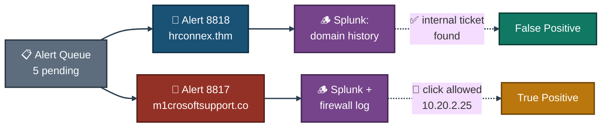
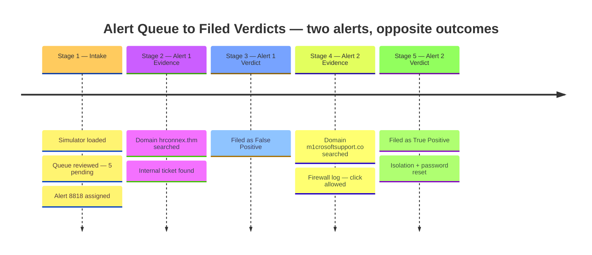
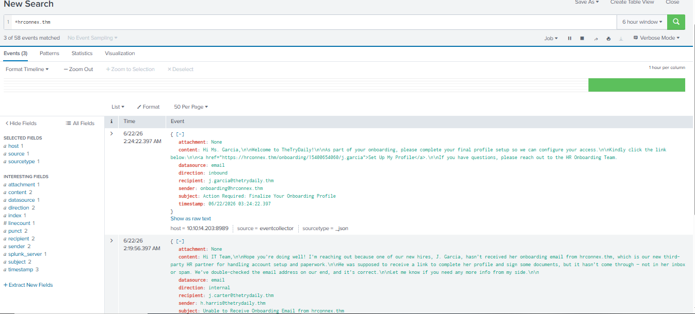
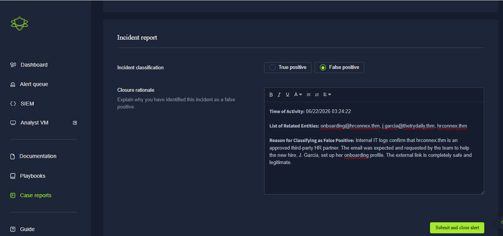
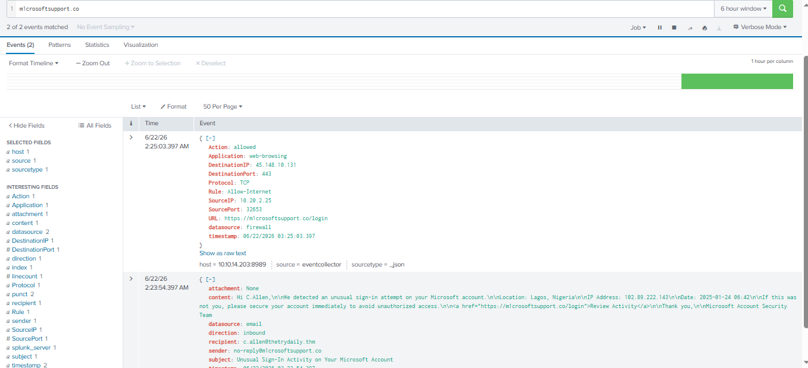
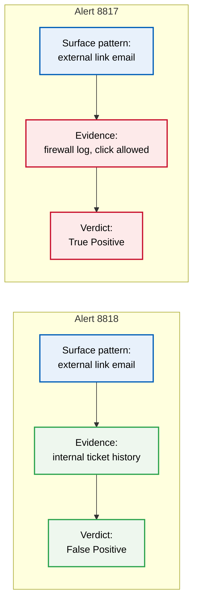

<div align="center">

# 🚨 SIEM Alert Triage — SOC Simulator

**Project 06 of 10 — Foundational Projects — SIEM & Alert Triage**

Two Phishing-Pattern Alerts, Same Surface Presentation, Triaged to Opposite Verdicts Using Splunk Log Evidence — A False Positive Backed by Ticket History, and a True Positive Backed by a Confirmed Firewall Click-Through


Nine steps run end-to-end inside TryHackMe's SOC Simulator, triaging two alerts that look identical on the surface — "email with external link" — to opposite, evidence-backed verdicts: one closed as a False Positive on internal ticket history, one escalated as a True Positive on a confirmed firewall click-through.

</div>

---

## 📑 Table of Contents

1. [At a Glance](#at-a-glance)
2. [Project Background](#project-background)
3. [Tools & Technologies](#tools-technologies)
4. [Environment](#environment)
5. [Triage Map](#triage-map)
6. [Investigation Challenges](#investigation-challenges)
7. [Triage Timeline](#triage-timeline)
8. [Module 1 — Open the Simulator](#module-1)
9. [Module 2 — Review the Alert Queue](#module-2)
10. [Module 3 — Assign the Alert](#module-3)
11. [Module 4 — Review Alert Details](#module-4)
12. [Module 5 — Investigate Domain History](#module-5)
13. [Module 6 — File the Case Report (Alert 1)](#module-6)
14. [Module 7 — Open the Second Alert](#module-7)
15. [Module 8 — Confirm the Click](#module-8)
16. [Module 9 — File the Case Report (Alert 2)](#module-9)
17. [Coverage Snapshot](#coverage-snapshot)
18. [Verdict Comparison](#verdict-comparison)
19. [Challenges & Fixes](#challenges-fixes)
20. [Scope & Limitations](#scope-limitations)
21. [What I Learned](#what-i-learned)
22. [Skills Demonstrated](#skills-demonstrated)
23. [Screenshot Index](#screenshot-index)
24. [Repo Structure](#repo-structure)

---

<a id="at-a-glance"></a>
## 📊 At a Glance

<div align="center">

| 🧩 Modules | 🎫 Alerts Triaged | ⚖️ Verdicts | 🖼️ Screenshots |
|:---:|:---:|:---:|:---:|
| **9** | **2** | **1 False Positive · 1 True Positive** | **12** |

</div>

---

<a id="project-background"></a>
## 📖 Project Background

This project works as a Tier 1 SOC Analyst inside TryHackMe's **SOC Simulator** (Scenario 1 — Introduction to Phishing). The job: investigate incoming alerts using SIEM logs and decide, with evidence, whether each one is a **True Positive** (real threat) or a **False Positive** (false alarm) — then document the verdict and any required action.

| Module Group | Focus |
|---|---|
| 📋 **Intake (Modules 1–4)** | Load the simulator, review the queue, assign and open Alert 8818 |
| 🔎 **Alert 1 Investigation (Modules 5–6)** | Pivot to Splunk domain history, file the False Positive verdict |
| 🎫 **Alert 2 Investigation (Modules 7–9)** | Open the typosquat alert, confirm the click via firewall logs, file the True Positive verdict |

---

<a id="tools-technologies"></a>
## 🛠️ Tools & Technologies

| Tool | Purpose |
|------|---------|
| 🚨 TryHackMe SOC Simulator | Alert queue, case assignment, and reporting interface |
| 🪵 Splunk | SIEM log search for domain and event history |
| 🧱 Firewall Logs | Confirming whether a malicious link was actually clicked |
| 📝 Case Report | Documenting verdict, escalation, and remediation |

---

<a id="environment"></a>
## 🖧 Environment


| Item | Value |
|---|---|
| Simulator | TryHackMe SOC Simulator |
| Scenario | Scenario 1 — Introduction to Phishing |
| SIEM | Splunk |
| Alerts in Queue | 5 pending |
| Alerts Triaged | 2 (8818, 8817) |

---

<a id="triage-map"></a>
## 🗺️ Triage Map


```mermaid
%%{init: {'theme': 'base', 'themeVariables': {'fontSize': '16px'}, 'flowchart': {'nodeSpacing': 34, 'rankSpacing': 46, 'padding': 12}}}%%
flowchart LR
    Q["📋 Alert Queue<br/>5 pending"]:::queue --> A1["🎫 Alert 8818<br/>hrconnex.thm"]:::a1
    Q --> A2["🎫 Alert 8817<br/>m1crosoftsupport.co"]:::a2
    A1 --> SPLUNK1["🪵 Splunk:<br/>domain history"]:::splunk
    A2 --> SPLUNK2["🪵 Splunk +<br/>firewall log"]:::splunk
    SPLUNK1 -.->|"✅ internal ticket<br/>found"| FP["False Positive"]:::fp
    SPLUNK2 -.->|"🚨 click allowed<br/>10.20.2.25"| TP["True Positive"]:::tp
    classDef queue fill:#5D6D7E,stroke:#2C3844,stroke-width:2px,color:#FFFFFF
    classDef a1 fill:#1A5276,stroke:#0B2E43,stroke-width:2px,color:#FFFFFF
    classDef a2 fill:#943126,stroke:#571C16,stroke-width:2px,color:#FFFFFF
    classDef splunk fill:#76448A,stroke:#432752,stroke-width:2px,color:#FFFFFF
    classDef fp fill:#117864,stroke:#083D33,stroke-width:2px,color:#FFFFFF
    classDef tp fill:#B9770E,stroke:#6E4409,stroke-width:2px,color:#FFFFFF
    linkStyle default stroke:#2C3E50,stroke-width:2px
```
<p align="center"><em>Both alerts start from the same queue with the same surface pattern — the dashed lines show exactly what SIEM evidence sent each one to its opposite verdict.</em></p>

---

<a id="investigation-challenges"></a>
## 🐛 Investigation Challenges

| # | Challenge | Type |
|---|-------|------|
| 1 | Both alerts looked identical at the surface level ("external link email") | Surface pattern indistinguishable without log evidence |
| 2 | Alert 8817's sender domain used a subtle typosquat ("1" for "i") | Visual deception in the sender display name |
| 3 | Needed proof the phishing link was actually clicked, not just received | Evidence gap between alert and impact |

---

<a id="triage-timeline"></a>
## 🔎 Triage Timeline


```mermaid
%%{init: {'theme': 'base', 'themeVariables': {'fontSize': '15px'}, 'timeline': {'disableMulticolor': false}}}%%
timeline
    title Alert Queue to Filed Verdicts — two alerts, opposite outcomes
    Stage 1 — Intake : Simulator loaded : Queue reviewed — 5 pending : Alert 8818 assigned
    Stage 2 — Alert 1 Evidence : Domain hrconnex.thm searched : Internal ticket found
    Stage 3 — Alert 1 Verdict : Filed as False Positive
    Stage 4 — Alert 2 Evidence : Domain m1crosoftsupport.co searched : Firewall log — click allowed
    Stage 5 — Alert 2 Verdict : Filed as True Positive : Isolation + password reset
```
<p align="center"><em>A Mermaid timeline instead of a flowchart — five stages read left to right, pairing each alert's evidence with the verdict it produced.</em></p>

---

<a id="module-1"></a>
## 📋 Module 1 — Open the Simulator

**Objective:** Launch the SOC Simulator and confirm the scenario loaded correctly.

### Step 1 — Load Scenario 1 ✅

```
Launch TryHackMe SOC Simulator
→ Confirm Scenario 1 (Introduction to Phishing) loaded correctly
```

<p align="center">
  <br>
  <em>Exhibit 1 — SOC Simulator loaded, Scenario 1 ready</em>
</p>

---

<a id="module-2"></a>
## 📋 Module 2 — Review the Alert Queue

**Objective:** Review the pending alert queue and pick up the first case.

### Step 2 — Open the Queue ✅

```
Alert queue — first alert listed, 4 more incoming (5 in total by Exhibit 3)

Picked up first alert:
  Alert ID: 8818
  Alert Rule: Inbound Email Containing Suspicious External Link
  Severity: Medium
```

<p align="center">
  <br>
  <em>Exhibit 2 — Alert queue loading: first alert (8814) listed, 4 more incoming</em>
</p>

---

<a id="module-3"></a>
## 🎫 Module 3 — Assign the Alert

**Objective:** Assign Alert 8818 to begin the investigation.

### Step 3 — Assign to Self ✅

```
Assign Alert 8818 to self → begin investigation
```

<p align="center">
  <br>
  <em>Exhibit 3 — Alert 8818 assigned for investigation</em>
</p>

---

<a id="module-4"></a>
## 📄 Module 4 — Review Alert Details

**Objective:** Read the raw email data before drawing any conclusion.

### Step 4 — Read the Raw Email Data ✅

```
Sender:    onboarding@hrconnex.thm
Recipient: j.garcia@thetrydaily.thm
Subject:   Action Required: Finalize Your Onboarding Profile
Link:      https://hrconnex.thm

→ On the surface: a generic phishing pattern
  (email with external link) — not enough on its own
  to call a verdict either way
```

<p align="center">
  <br>
  <em>Exhibit 4 — Raw email data for Alert 8818</em>
</p>

---

<a id="module-5"></a>
## 🔎 Module 5 — Investigate Domain History

**Objective:** Pivot to SIEM log evidence to check the domain's history.

### Step 5 — Search Splunk for the Domain ✅

```
Splunk search: hrconnex.thm
```

<p align="center">
  <br>
  <em>Exhibit 5 — Splunk search <code>*</code> (all events, 87 matched) before narrowing to the domain</em>
</p>

```
Search matched 3 events (Exhibit 5 results); the internal one:
  - Employee h.harris filed an IT ticket explaining that
    new hire j.garcia hadn't received the onboarding link
    from the company's third-party HR provider, hrconnex.thm

→ Confirms the domain and email are legitimate,
  business-approved communication — not phishing
```

<p align="center">
  <br>
  <em>Exhibit 5 (results) — Search <code>*hrconnex.thm</code>: 3 of 58 events, including the internal IT email that names hrconnex.thm as the HR partner</em>
</p>

---

<a id="module-6"></a>
## ✅ Module 6 — File the Case Report (Alert 1)

**Objective:** Document the verdict for Alert 8818.

### Step 6 — Submit the Verdict ✅

```
Case report: Alert 8818
Verdict: False Positive
Reason: Legitimate HR onboarding email, confirmed by
        internal ticket history
```

<p align="center">
  <br>
  <em>Exhibit 6 — Case report being completed for Alert 8818</em>
</p>
<p align="center">
  <br>
  <em>Exhibit 6 (submitted) — False Positive verdict submitted; Alert 8818 now shows Closed</em>
</p>

---

<a id="module-7"></a>
## 🎫 Module 7 — Open the Second Alert

**Objective:** Open Alert 8817 and read its details before investigating.

### Step 7 — Read Alert 8817 ✅

```
Alert ID: 8817
Sender:   no-reply@m1crosoftsupport.co
          (note the "1" replacing the "i" — a typosquatting domain)
Subject:  Unusual Sign-In Activity on Your Microsoft Account
Link:     https://m1crosoftsupport.co
```

<p align="center">
  <br>
  <em>Exhibit 7 — Alert 8817: typosquat phishing domain details</em>
</p>

---

<a id="module-8"></a>
## 🚨 Module 8 — Confirm the Click

**Objective:** Determine whether the phishing link was actually clicked.

### Step 8 — Search Splunk & Firewall Logs ✅

```
Splunk search: m1crosoftsupport.co
→ 2 related events found
```

<p align="center">
  <br>
  <em>Exhibit 8 — Splunk search for m1crosoftsupport.co: the firewall event shows Action allowed from 10.20.2.25</em>
</p>

```
Checked firewall logs directly:
  Source IP: 10.20.2.25 (internal employee machine)
  Firewall Action: allowed

→ Confirms the click went through — a real True Positive
```

<p align="center">
  <br>
  <em>Exhibit 8 (continued) — Same search scrolled down to the phishing email event</em>
</p>

---

<a id="module-9"></a>
## ✅ Module 9 — File the Case Report (Alert 2)

**Objective:** Document the verdict, escalation, and remediation for Alert 8817.

### Step 9 — Submit the Verdict & Remediation ✅

```
Case report: Alert 8817
Verdict:     True Positive
Escalate:    Yes
Remediation: Isolate 10.20.2.25 from the network,
             force a password reset for the employee
```

<p align="center">
  <br>
  <em>Exhibit 9 — Alert queue showing Alert 8817 and Alert 8818 both Closed</em>
</p>

---

<a id="coverage-snapshot"></a>
## 🌟 Coverage Snapshot

| 🛡️ Layer | ✅ Status | 📌 Detail |
|---|---|---|
| Simulator loaded | Live | Scenario 1 confirmed ready (Exhibit 1) |
| Alert queue reviewed | Proven | Queue loading in Exhibit 2; 5 alerts by Exhibit 3; Alert 8818 picked up |
| Alert 1 assigned | Proven | Alert 8818 assigned to self (Exhibit 3) |
| Alert 1 details reviewed | Proven | Raw email data read, surface pattern noted (Exhibit 4) |
| Alert 1 evidence found | Proven | Internal ticket confirms legitimacy (Exhibit 5) |
| Alert 1 verdict filed | Proven | False Positive submitted (Exhibit 6) |
| Alert 2 opened | Proven | Typosquat domain identified (Exhibit 7) |
| Alert 2 click confirmed | Proven | Firewall log shows `allowed` (Exhibit 8) |
| Alert 2 verdict filed | Documented | Alert 8817 shown Closed (Exhibit 9); the True Positive report text is not shown in a screenshot |

---

<a id="verdict-comparison"></a>
## ⚖️ Verdict Comparison


```mermaid
flowchart LR
    subgraph A1["Alert 8818"]
        S1["Surface pattern:<br/>external link email"]
        E1["Evidence:<br/>internal ticket history"]
        V1["Verdict:<br/>False Positive"]
    end
    subgraph A2["Alert 8817"]
        S2["Surface pattern:<br/>external link email"]
        E2["Evidence:<br/>firewall log, click allowed"]
        V2["Verdict:<br/>True Positive"]
    end
    S1 --> E1 --> V1
    S2 --> E2 --> V2

    classDef neutral fill:#e8f1fb,stroke:#005EB8,stroke-width:2px,color:#000
    classDef safe fill:#eef7ee,stroke:#2ea44f,stroke-width:2px,color:#000
    classDef danger fill:#fdeaea,stroke:#C8102E,stroke-width:2px,color:#000
    class S1,S2 neutral
    class E1,V1 safe
    class E2,V2 danger
```

| Alert | Escalated? | Remediation |
|:---:|:---:|---|
| 8818 | No | None — closed as False Positive |
| 8817 | Yes | Isolate `10.20.2.25`, force password reset |

---

<a id="challenges-fixes"></a>
## ⚠️ Challenges & Fixes

| ❌ Challenge | ✅ Fix |
|---|---|
| Both alerts looked identical at the surface level ("external link email") | Pivoted to Splunk log search on each domain instead of judging from the alert description |
| Alert 8817's sender domain used a subtle typosquat ("1" for "i") | Cross-checked the domain string directly rather than relying on the display name |
| Needed proof the phishing link was actually clicked, not just received | Checked firewall logs for the source IP and confirmed action was `allowed` |

---

<a id="scope-limitations"></a>
## 🚧 Scope & Limitations

- **Simulated SOC environment:** TryHackMe's SOC Simulator, not a live production SIEM queue.
- **Two of five alerts triaged:** only Alerts 8818 and 8817 are documented here; the remaining 3 in the queue were not part of this scope.
- **Single scenario:** covers Scenario 1 (Introduction to Phishing) only.

---

<a id="what-i-learned"></a>
## 🧠 What I Learned

- **Surface impressions are a starting point, not a verdict.** Both alerts began with the exact same pattern — "email with external link" — and only diverged once SIEM and firewall evidence came in.
- **A domain string deserves closer reading than a sender display name.** Alert 8817's typosquat (`m1crosoftsupport.co`) only stood out once the raw domain was checked character by character.
- **"Received" and "clicked" are different levels of evidence.** Confirming a phishing email existed wasn't enough — the firewall log showing the click was `allowed` is what actually justified a True Positive and escalation.
- **Internal ticket history is legitimate evidence, not just a convenient excuse.** Alert 8818's internal HR ticket gave a concrete, verifiable reason the traffic was expected — not just an assumption that it "looked fine."

---

## 🌍 Real-World Application

This is the daily core of Tier 1 SOC work: high alert volume, most of it benign, but the real threats need to be caught and escalated fast with clear evidence. Knowing how to pivot from an alert to log data — instead of guessing from the alert description alone — is what separates a useful analyst from one who either escalates everything (alert fatigue for the whole team) or dismisses everything (a missed real breach).

---

<a id="skills-demonstrated"></a>
## 🛠️ Skills Demonstrated

- Tier 1 SOC alert triage workflow: assign, investigate, verdict, report
- Pivoting from an alert description to SIEM log evidence in Splunk
- Spotting typosquatting domains hidden behind a plausible sender display name
- Correlating firewall action logs (`allowed`/`denied`) to confirm actual user impact
- Writing an evidence-backed case report with clear escalation and remediation steps

---

<a id="screenshot-index"></a>
## 🖼️ Screenshot Index

| # | File | Shows |
|:---:|---|---|
| 1 | `SS1_Introduction_to_Phishing_Dashboard.PNG` | SOC Simulator loaded, Scenario 1 ready |
| 2 | `SS2_Introduction_to_Phishing_Alert_Queue.PNG` | Alert queue loading, 4 alerts incoming |
| 3 | `SS3_Assigned_Alert.PNG` | Alert 8818 assigned for investigation |
| 4 | `SS4_Alert_Details.PNG` | Raw email data for Alert 8818 |
| 5 | `SS5_SIEM_Search.PNG` | Splunk search `*` — 87 events, before filtering by domain |
| 6 | `SS6_SIEM_Results.PNG` | Search `*hrconnex.thm` — 3 events, incl. the internal IT email naming the HR partner |
| 7 | `SS7_Filling_Case_Report.PNG` | Case report being completed for Alert 8818 |
| 8 | `SS8_Case_Report_Submitted.PNG` | False Positive verdict submitted; Alert 8818 shows Closed |
| 9 | `SS9_Second_Alert_Details.PNG` | Alert 8817 — typosquat phishing domain details |
| 10 | `SS10_SIEM_Phishing_Search.PNG` | Splunk search for `m1crosoftsupport.co` — firewall event shows Action allowed, source 10.20.2.25 |
| 11 | `SS11_SIEM_Phishing_Proof.PNG` | Same search scrolled down to the phishing email event |
| 12 | `SS12_True_Positive_Submitted.PNG` | Alert queue showing Alert 8817 and Alert 8818 both Closed |

---

<a id="repo-structure"></a>
## 📁 Repo Structure

```text
1-Foundational-Projects/project-06-siem-alert-triage/
|-- README.md
`-- screenshots/
    |-- SS1_Introduction_to_Phishing_Dashboard.PNG
    |-- SS2_Introduction_to_Phishing_Alert_Queue.PNG
    |-- SS3_Assigned_Alert.PNG
    |-- SS4_Alert_Details.PNG
    |-- SS5_SIEM_Search.PNG
    |-- SS6_SIEM_Results.PNG
    |-- SS7_Filling_Case_Report.PNG
    |-- SS8_Case_Report_Submitted.PNG
    |-- SS9_Second_Alert_Details.PNG
    |-- SS10_SIEM_Phishing_Search.PNG
    |-- SS11_SIEM_Phishing_Proof.PNG
    `-- SS12_True_Positive_Submitted.PNG
```

<div align="center">

🚨 **[TryHackMe SOC Simulator](https://tryhackme.com/module/soc-simulator)**

</div>
