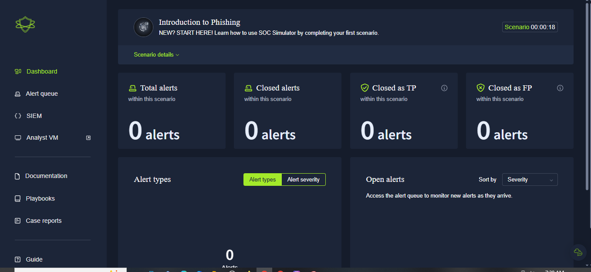
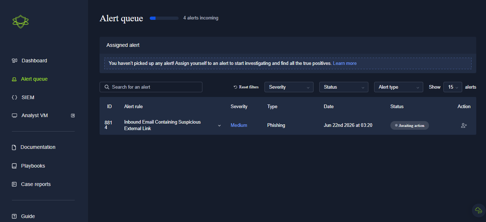
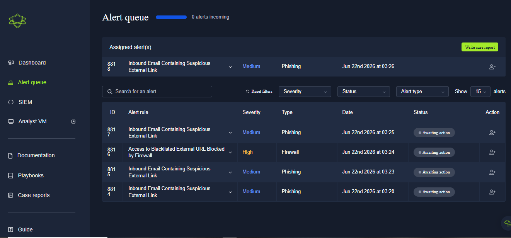
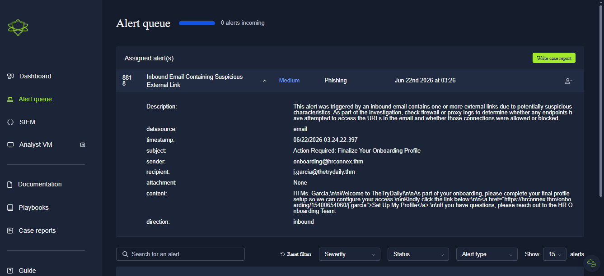
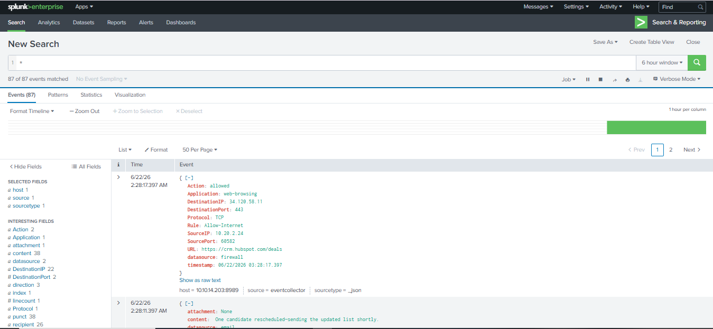
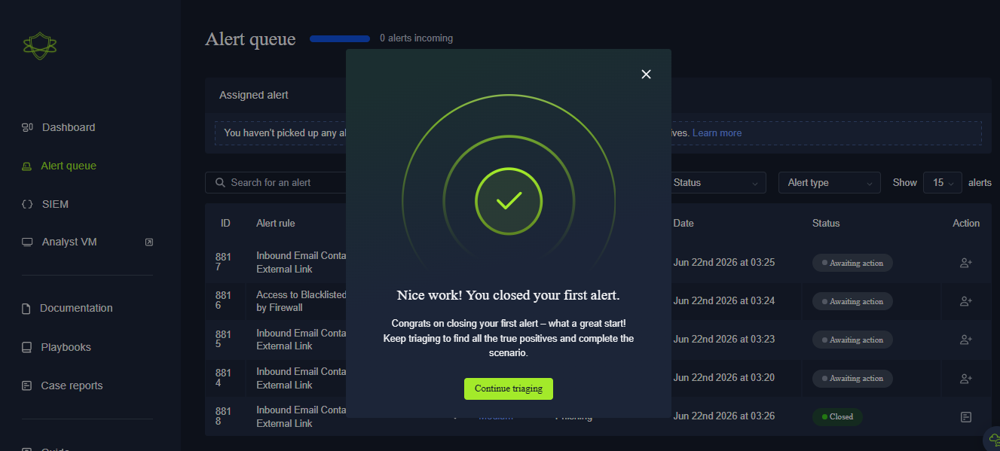
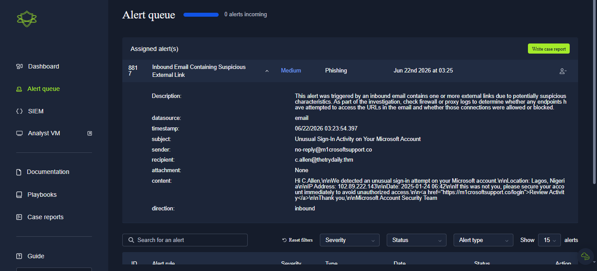
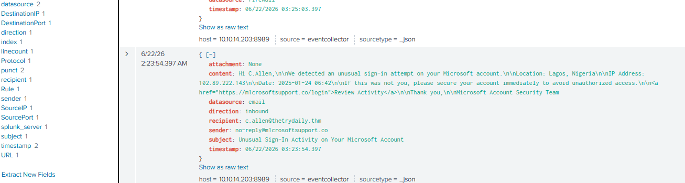
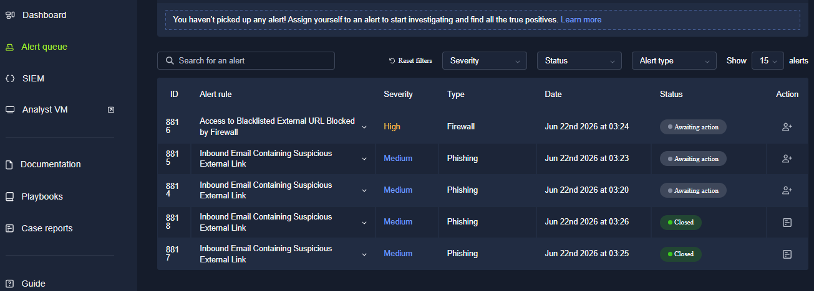

# 🚨 Project 06 — Index
### SIEM Alert Triage — SOC Simulator
**Project 06 of 10 — Foundational Projects**

**Quick guide to every step and screenshot in this project.**

### [📖 Open the full README](README.md)

---

| 🧩 Modules | 🖼️ Screenshots | 🎫 Alerts Triaged | ⚖️ Verdicts |
|:---:|:---:|:---:|:---:|
| **9** | **12** | **2** | **1 FP · 1 TP** |

🧩 <b>Lab:</b> TryHackMe SOC Simulator · Splunk · Scenario 1 (Phishing)

---

## 📑 Step Index

| # | Step | Module | Result | Evidence |
|:---:|---|:---:|---|:---:|
| 1 | Open the simulator | 🔵 Module 1 | Scenario 1 loaded | [Exhibit 1](#ex1) |
| 2 | Review the alert queue | 🔵 Module 2 | Alert 8818 picked up | [Exhibit 2](#ex2) |
| 3 | Assign the alert | 🟠 Module 3 | Assigned to self | [Exhibit 3](#ex3) |
| 4 | Review alert details | 🟠 Module 4 | Raw email data read | [Exhibit 4](#ex4) |
| 5 | Investigate domain history | 🟢 Module 5 | Internal ticket found | [Exhibit 5](#ex5) |
| 6 | File case report — Alert 1 | 🟢 Module 6 | False Positive submitted | [Exhibit 6](#ex6) |
| 7 | Open the second alert | 🟣 Module 7 | Typosquat domain identified | [Exhibit 7](#ex7) |
| 8 | Confirm the click | 🔴 Module 8 | Firewall log shows `allowed` | [Exhibit 8](#ex8) |
| 9 | File case report — Alert 2 | 🟢 Module 9 | True Positive + escalation | [Exhibit 9](#ex9) |

---

## 🔵 Module 1–2 — Intake

Exhibits 1 to 2.

<table>
<tr>
<td align="center" valign="top" width="50%">

 <b>Exhibit 1 — Simulator loaded</b>
 Scenario 1 ready
</td>
<td align="center" valign="top" width="50%">

 <b>Exhibit 2 — Alert queue</b>
 5 pending alerts
</td>
</tr>
</table>

---

## 🟠 Module 3–4 — Assign & Review

Exhibits 3 to 4.

<table>
<tr>
<td align="center" valign="top" width="50%">

 <b>Exhibit 3 — Alert 8818 assigned</b>
 Investigation begins
</td>
<td align="center" valign="top" width="50%">

 <b>Exhibit 4 — Raw email data</b>
 hrconnex.thm onboarding email
</td>
</tr>
</table>

---

## 🟢 Module 5–6 — Alert 1 Investigation

Exhibits 5 to 6.

<table>
<tr>
<td align="center" valign="top" width="50%">

 <b>Exhibit 5 — Splunk search</b>
 Internal ticket confirms legitimacy
</td>
<td align="center" valign="top" width="50%">

 <b>Exhibit 6 — Verdict filed</b>
 False Positive submitted
</td>
</tr>
</table>

---

## 🟣🔴 Module 7–8 — Alert 2 Investigation

Exhibits 7 to 8.

<table>
<tr>
<td align="center" valign="top" width="50%">

 <b>Exhibit 7 — Typosquat domain</b>
 <code>m1crosoftsupport.co</code>
</td>
<td align="center" valign="top" width="50%">

 <b>Exhibit 8 — Click confirmed</b>
 Firewall log: action <code>allowed</code>
</td>
</tr>
</table>

---

## 🟢 Module 9 — Verdict Filed

Exhibit 9.

<table>
<tr>
<td align="center" valign="top" width="50%">

 <b>Exhibit 9 — True Positive</b>
 Escalated; isolation + password reset
</td>
<td></td>
</tr>
</table>

---

## 🎯 Verification Checklist

| Check | Method | Module | Status |
|:---:|---|---|:---:|
| Alert 1 evidence found | Splunk domain search | Module 5 | ✅ Confirmed |
| Alert 1 verdict filed | Case report | Module 6 | ✅ Confirmed (FP) |
| Alert 2 typosquat identified | Domain string review | Module 7 | ✅ Confirmed |
| Alert 2 click confirmed | Firewall log | Module 8 | ✅ Confirmed |
| Alert 2 escalated with remediation | Case report | Module 9 | ✅ Confirmed (TP) |

> [!NOTE]
> Both alerts shared the identical surface pattern ("external link email") — only SIEM/firewall evidence separated the False Positive from the True Positive.

---

[⬆️ Back to top](#top) &nbsp;·&nbsp; [📖 Full README](README.md)

🚨 **[TryHackMe SOC Simulator](https://tryhackme.com/module/soc-simulator)**

