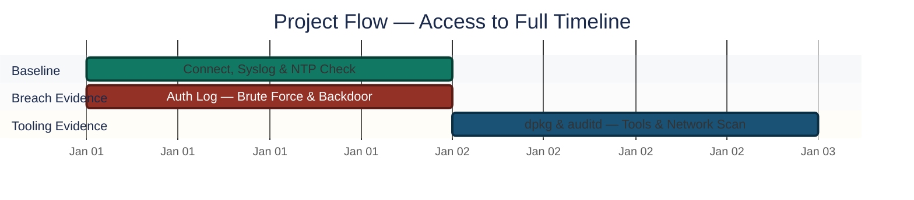
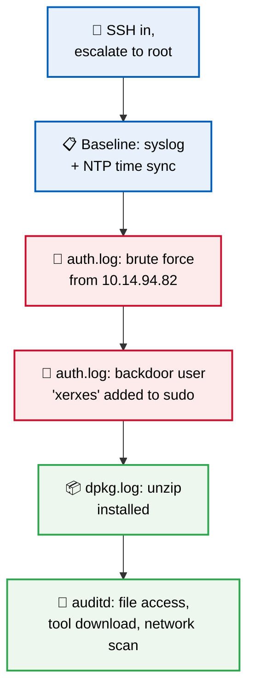
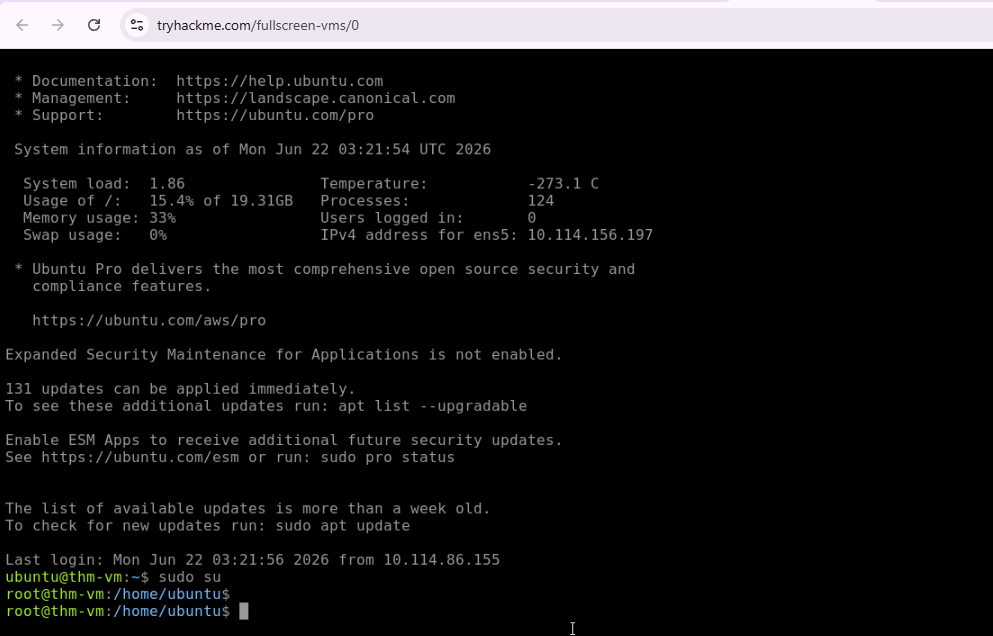
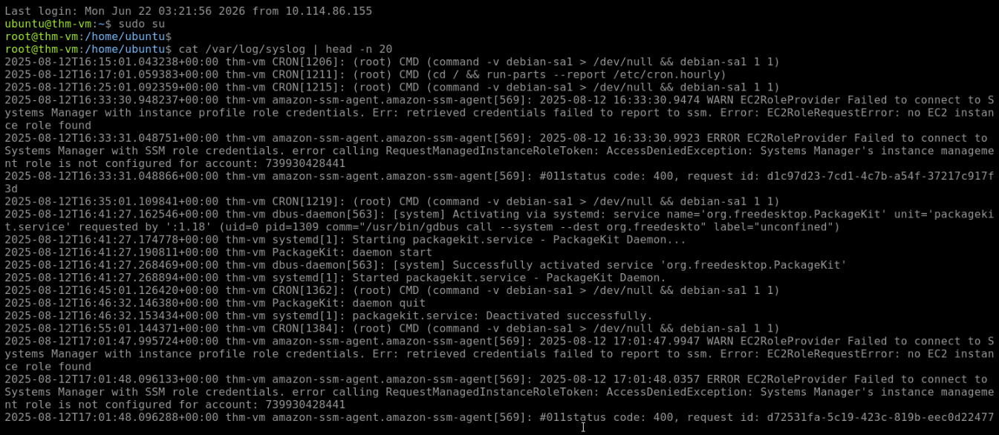
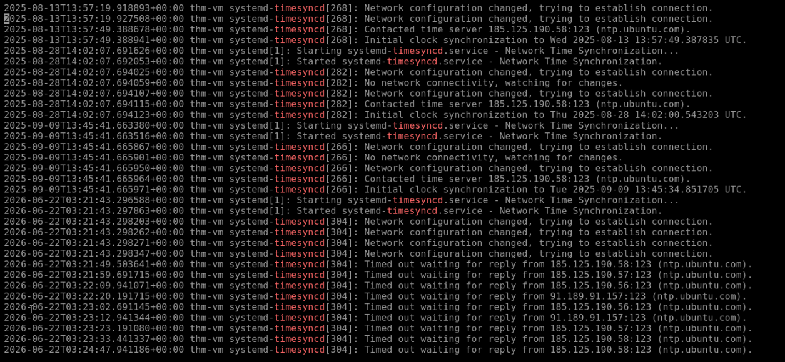
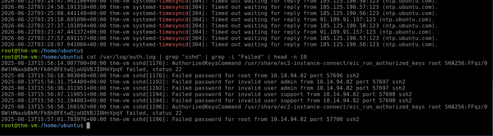
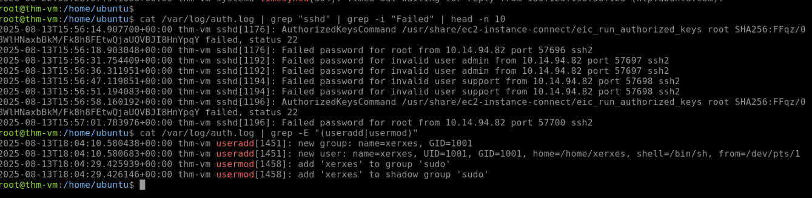
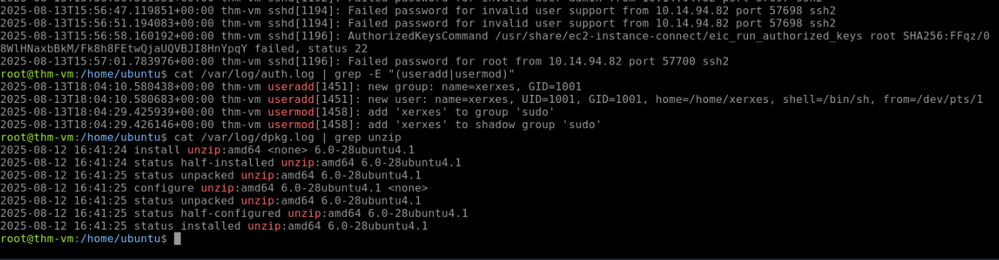
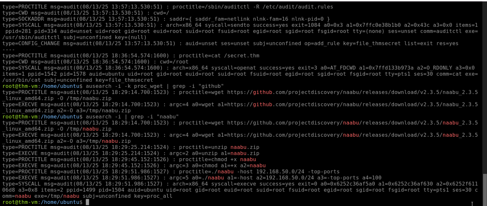

<div align="center">

# 🐧 Linux Log Analysis & Forensics — SOC Investigation

**Project 07 of 10 — Foundational Projects**

Linux Forensics & Log Analysis


A compromised Linux machine investigated using nothing but its own built-in log files — no SIEM, no EDR dashboard. The full attacker timeline reconstructed by correlating four separate log sources, each holding only a fragment of the story.

</div>

---

## 📑 Table of Contents

1. [At a Glance](#at-a-glance)
2. [Project Background](#project-background)
3. [Environment](#environment)
4. [Project Flow](#project-flow)
5. [Investigation Walkthrough](#investigation-walkthrough)
6. [Findings Summary](#findings-summary)
7. [Attack Timeline](#attack-timeline)
8. [Challenges & Fixes](#challenges-fixes)
9. [Scope & Limitations](#scope-limitations)
10. [Key Lesson](#key-lesson)
11. [Skills Demonstrated](#skills-demonstrated)
12. [Screenshot Index](#screenshot-index)
13. [Repo Structure](#repo-structure)

---

<a id="at-a-glance"></a>
## 📊 At a Glance

| 🧩 Phases | 🖼️ Screenshots | 📜 Log Sources Correlated | 🎯 Attack Stages Reconstructed |
|:---:|:---:|:---:|:---:|
| **7** | **7** | **4** | **4** |

---

<a id="project-background"></a>
## 📖 Project Background

A compromised Linux machine investigated using only its **built-in log files** — no SIEM, no EDR dashboard — to reconstruct the attacker's full timeline: how they got in, what they did once inside, and what tools they used to move further.

This is core Linux host forensics: the kind of investigation a SOC analyst runs directly on a server after a suspected breach, using nothing but plaintext logs and audit records.

---

<a id="environment"></a>
## 🖧 Environment

| Item | Value |
|---|---|
| **Access Method** | SSH, escalated to root (`sudo su`) |
| **Core Tools** | Linux CLI (`grep`, `cat`, `head`) |
| **Audit Tool** | `auditd` / `ausearch` |
| **Log Sources** | `syslog`, `auth.log`, `dpkg.log`, `auditd` records |
| **Attacker IP** | `10.14.94.82` |
| **Backdoor Account** | `xerxes` (added to `sudo` group) |

---

<a id="project-flow"></a>
## ⏱️ Project Flow


<p align="center"><em>Colors distinguish each investigation stage — all stages complete.</em></p>

---

<a id="investigation-walkthrough"></a>
## 🔵 Investigation Walkthrough

**Objective:** Reconstruct a full attacker timeline by correlating multiple Linux log sources — no single log tells the whole story on its own.



### Phase 1 — Machine Connection & Root Access ✅
Connected to the target machine via SSH and ran `sudo su` to get root access, needed to read the protected log files.

<p align="center">
  <br>
  <em>Phase 1 — SSH connection and root access established</em>
</p>

### Phase 2 — Syslog Analysis ✅
Ran `cat /var/log/syslog | head -n 20` to check overall system health. Found Amazon SSM agent access errors — system-level noise, not directly malicious, but useful baseline context.

<p align="center">
  <br>
  <em>Phase 2 — System health check via syslog</em>
</p>

### Phase 3 — NTP Time Sync Check ✅
Checked time synchronization logs to confirm the system clock source — important for trusting timestamps in the rest of the investigation. The logs confirmed the machine contacted `ntp.ubuntu.com` to sync its clock.

<p align="center">
  <br>
  <em>Phase 3 — NTP time sync source confirmed</em>
</p>

### Phase 4 — Auth Log Investigation: Brute Force Attack Found ✅
Checked `/var/log/auth.log` for authentication activity. Found the attacker's entry point: IP `10.14.94.82` running automated password-guessing attempts against `root`, `admin`, and `support` accounts.

<p align="center">
  <br>
  <em>Phase 4 — Brute force attempts from 10.14.94.82</em>
</p>

### Phase 5 — Backdoor User Creation Found ✅
Filtered `auth.log` for `useradd`/`usermod` events. Found that after breaking in, the attacker created a new account (`xerxes`) and added it to the `sudo` group — a backdoor with full admin rights.

<p align="center">
  <br>
  <em>Phase 5 — Backdoor user xerxes added to sudo group</em>
</p>

### Phase 6 — Malicious Software Installation Check ✅
Checked `/var/log/dpkg.log` (Debian package manager logs). Found the attacker installed `unzip` (version `6.0-28ubuntu4.1`) — used to extract a downloaded archive.

<p align="center">
  <br>
  <em>Phase 6 — unzip installation found in dpkg logs</em>
</p>

### Phase 7 — Auditd Analysis: Hacker Tools & Network Scan ✅
Used `ausearch` to dig into audit-level events:

- A sensitive file, `secret.thm`, was opened at `08/13/25 18:36:54`
- The attacker used `wget` to download `naabu_2.3.5_linux_amd64.zip` from GitHub — a network scanning tool
- That tool was then used to scan the internal network range `192.168.50.0/24`

<p align="center">
  <br>
  <em>Phase 7 — File access timestamp, tool download, and network scan range</em>
</p>

🎯 **Result:** A full attacker timeline reconstructed purely from correlated log evidence — brute force, backdoor account, tool download, and internal network scan.

---

<a id="findings-summary"></a>
## 🌟 Findings Summary

| 📜 Log Source | 🔍 What It Revealed |
|---|---|
| `auth.log` | Brute-force entry point (`10.14.94.82`) and backdoor account (`xerxes`) |
| `dpkg.log` | Installation of `unzip` — tool used to extract a downloaded archive |
| `auditd` / `ausearch` | Sensitive file access, `wget` tool download, and internal network scan |
| `syslog` / NTP | Baseline system health and trusted timestamp source |

---

<a id="attack-timeline"></a>
## 🎯 Attack Timeline

```mermaid
sequenceDiagram
    autonumber
    participant A as 🧑‍💻 Attacker (10.14.94.82)
    participant H as 🖥️ Linux Host

    A->>H: Brute-force login attempts (root, admin, support)
    A->>H: Successful login
    A->>H: useradd xerxes; usermod -aG sudo xerxes
    A->>H: apt install unzip
    A->>H: wget naabu_2.3.5_linux_amd64.zip (GitHub)
    A->>H: Open secret.thm (08/13/25 18:36:54)
    A->>H: Run naabu scan against 192.168.50.0/24
```

| Stage | Evidence Source | Finding |
|:---:|---|---|
| 1. Initial Access | `auth.log` | Brute force from `10.14.94.82` |
| 2. Persistence | `auth.log` | Backdoor account `xerxes` added to `sudo` |
| 3. Tooling | `dpkg.log` + `auditd` | `unzip` installed; `naabu` downloaded via `wget` |
| 4. Discovery | `auditd` | Internal network scan against `192.168.50.0/24` |

---

<a id="challenges-fixes"></a>
## ⚠️ Challenges & Fixes

| ❌ Challenge | ✅ Fix |
|---|---|
| No single log contained the full attack story | Correlated `auth.log`, `dpkg.log`, `syslog`, and `auditd` together |
| Needed to trust the timeline's timestamps | Verified NTP sync source before relying on log timestamps |
| Attacker activity was mixed in with routine system noise (e.g. SSM agent errors) | Filtered logs with `grep`/`head` to separate signal from baseline noise |

---

<a id="scope-limitations"></a>
## 🚧 Scope & Limitations

- **Post-compromise, log-based only:** No memory forensics or disk imaging — investigation is limited to what the existing log files captured.
- **Single host:** Covers one compromised Linux machine, not a multi-host lateral-movement investigation.
- **No SIEM/EDR correlation:** Deliberately done via raw CLI log analysis, distinct from the SIEM/dashboard-based triage in other projects.

---

<a id="key-lesson"></a>
## 🧠 Key Lesson

No single log told the full story. `auth.log` showed the break-in and the backdoor account, `dpkg.log` showed the tool installation, and `auditd` showed the file access and network scan — each one only a fragment. The actual attacker timeline (brute force → backdoor account → tool download → internal network scan) only became clear by correlating evidence across all of them. Real Linux host forensics is rarely a single log lookup; it's piecing together a timeline from multiple sources.

---

## 🌍 Real-World Application

This is exactly what a SOC or IR analyst does when a Linux server is suspected of compromise: pull `auth.log`, `dpkg.log`, `syslog`, and `auditd` records, and reconstruct what happened step by step. Knowing where each piece of evidence lives — and that you need more than one log source to confirm a full attack chain — is a foundational Linux security skill, distinct from the SIEM/dashboard-based triage in other projects.

---

<a id="skills-demonstrated"></a>
## 🛠️ Skills Demonstrated

- Navigating and filtering plaintext Linux logs (`/var/log`) via CLI (`grep`, `cat`, `head`)
- Using `auditd`/`ausearch` to pull detailed file access and process execution evidence
- Identifying brute-force login patterns directly from `auth.log`
- Spotting backdoor account creation and privilege escalation (`sudo` group addition)
- Correlating evidence across multiple independent log sources into one coherent timeline

---

<a id="screenshot-index"></a>
## 🖼️ Screenshot Index

| # | File | Shows |
|:---:|---|---|
| 1 | `SS1_Linux_Logs_Connection.PNG` | SSH connection and root access established |
| 2 | `SS2_Syslog_Analysis.PNG` | System health check via syslog |
| 3 | `SS3_Syslog_Timesync.PNG` | NTP time sync source confirmed |
| 4 | `SS4_Auth_Failed_Logins.PNG` | Brute force attempts from `10.14.94.82` |
| 5 | `SS5_Auth_Sudo_User.PNG` | Backdoor user `xerxes` added to sudo group |
| 6 | `SS6_Package_Manager_Logs.PNG` | `unzip` installation found in dpkg logs |
| 7 | `SS7_Auditd_Analysis.PNG` | File access timestamp, tool download, and network scan range |

---

<a id="repo-structure"></a>
## 📁 Repo Structure

```text
1-Foundational-Projects/project-07-linux-log-analysis-forensics/
|-- README.md
`-- screenshots/
    |-- SS1_Linux_Logs_Connection.PNG
    |-- SS2_Syslog_Analysis.PNG
    |-- SS3_Syslog_Timesync.PNG
    |-- SS4_Auth_Failed_Logins.PNG
    |-- SS5_Auth_Sudo_User.PNG
    |-- SS6_Package_Manager_Logs.PNG
    `-- SS7_Auditd_Analysis.PNG
```

<div align="center">

🐧 **[TryHackMe — Linux Logging for SOC](https://tryhackme.com/room/linuxloggingforsoc)**

</div>
