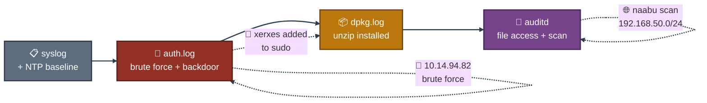
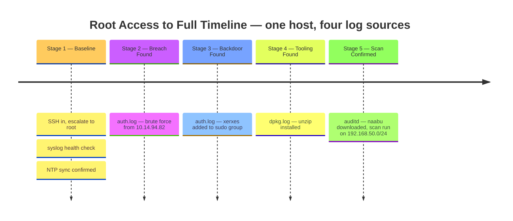
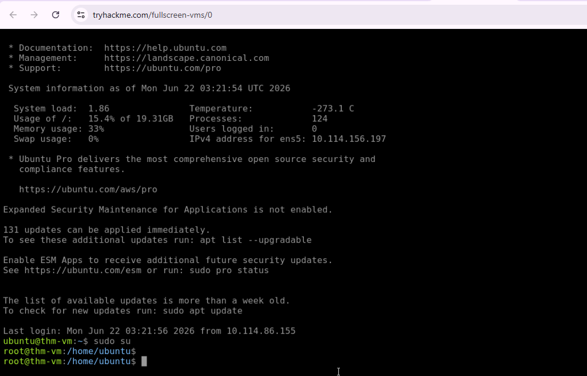
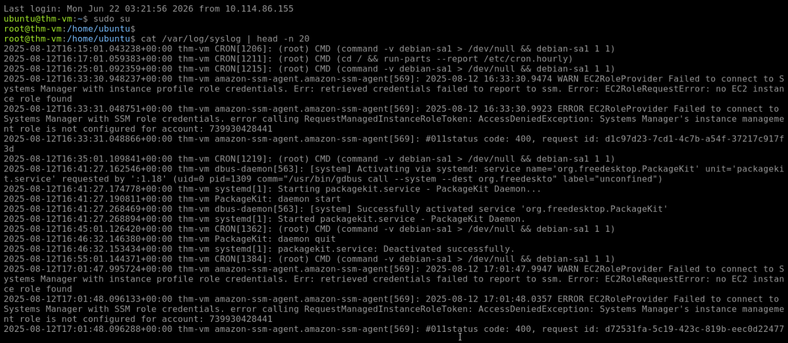
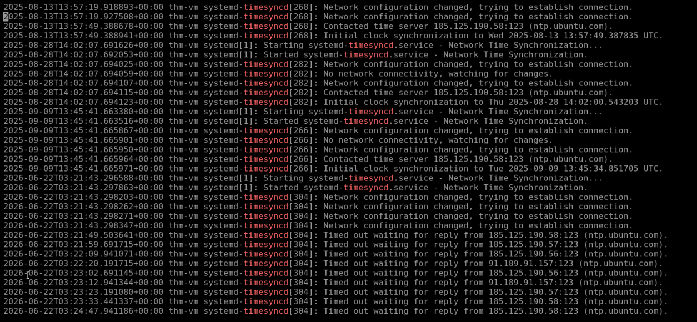
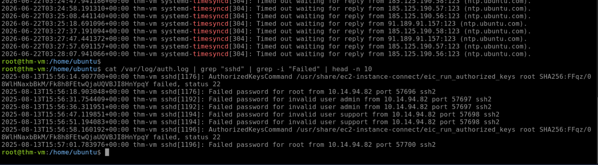
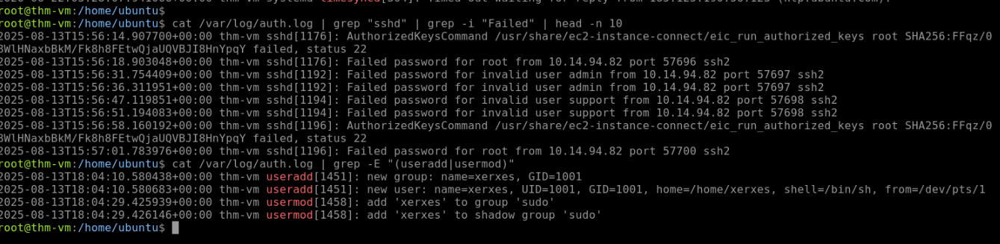
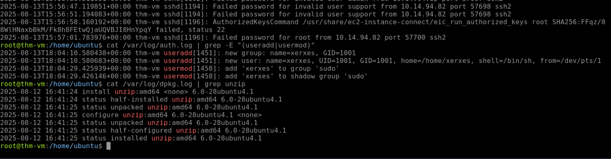
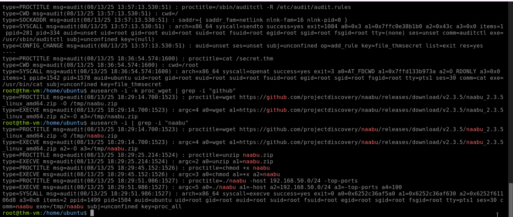

<div align="center">

# 🐧 Linux Log Analysis & Forensics — SOC Investigation

**Project 07 of 10 — Foundational Projects — Linux Forensics & Log Analysis**

A Compromised Linux Host Investigated Using Nothing but Its Own Built-In Logs — Brute Force, Backdoor Account, Tool Download, and Internal Network Scan Reconstructed by Correlating Four Log Sources


Seven steps run end-to-end against a compromised Linux machine, no SIEM or EDR dashboard involved. The full attacker timeline is reconstructed by correlating four separate log sources — each holding only a fragment of the story on its own.

</div>

---

## 📑 Table of Contents

1. [At a Glance](#at-a-glance)
2. [Project Background](#project-background)
3. [Tools & Technologies](#tools-technologies)
4. [Environment](#environment)
5. [Log Correlation Map](#log-correlation-map)
6. [Investigation Challenges](#investigation-challenges)
7. [Investigation Timeline](#investigation-timeline)
8. [Module 1 — Connect & Escalate to Root](#module-1)
9. [Module 2 — Analyze Syslog](#module-2)
10. [Module 3 — Check NTP Time Sync](#module-3)
11. [Module 4 — Investigate Auth Log for Brute Force](#module-4)
12. [Module 5 — Find the Backdoor User](#module-5)
13. [Module 6 — Check Package Manager Logs](#module-6)
14. [Module 7 — Analyze Auditd Records](#module-7)
15. [Coverage Snapshot](#coverage-snapshot)
16. [Attack Timeline](#attack-timeline)
17. [Log Source Summary](#log-source-summary)
18. [Challenges & Fixes](#challenges-fixes)
19. [Scope & Limitations](#scope-limitations)
20. [What I Learned](#what-i-learned)
21. [Skills Demonstrated](#skills-demonstrated)
22. [Screenshot Index](#screenshot-index)
23. [Repo Structure](#repo-structure)

---

<a id="at-a-glance"></a>
## 📊 At a Glance

<div align="center">

| 🧩 Modules | 📜 Log Sources Correlated | 🎯 Attack Stages Reconstructed | 🖼️ Screenshots |
|:---:|:---:|:---:|:---:|
| **7** | **4** | **4** | **7** |

</div>

---

<a id="project-background"></a>
## 📖 Project Background

This project investigates a compromised Linux machine using only its **built-in log files** — no SIEM, no EDR dashboard — to reconstruct the attacker's full timeline: how they got in, what they did once inside, and what tools they used to move further. This is core Linux host forensics: the kind of investigation a SOC analyst runs directly on a server after a suspected breach, using nothing but plaintext logs and audit records.

| Module Group | Focus |
|---|---|
| 🔑 **Baseline (Modules 1–3)** | Connect, establish root access, confirm system health and trusted timestamps |
| 🚨 **Breach Evidence (Modules 4–5)** | Find the brute-force entry point and the backdoor account it created |
| 🔎 **Tooling Evidence (Modules 6–7)** | Trace the installed tool and the internal network scan it was used for |

---

<a id="tools-technologies"></a>
## 🛠️ Tools & Technologies

| Tool | Purpose |
|------|---------|
| 🔑 SSH + `sudo su` | Remote access and root escalation |
| ⌨️ `grep` / `cat` / `head` | Filtering and reading plaintext log files |
| 📋 `syslog` | Baseline system health and NTP time sync |
| 🔐 `auth.log` | Authentication events — brute force, user/group changes |
| 📦 `dpkg.log` | Debian package manager — software installation history |
| 🔎 `auditd` / `ausearch` | File access, process execution, and network activity audit records |

---

<a id="environment"></a>
## 🖧 Environment


| Item | Value |
|---|---|
| Access Method | SSH, escalated to root (`sudo su`) |
| Core Tools | Linux CLI (`grep`, `cat`, `head`) |
| Audit Tool | `auditd` / `ausearch` |
| Log Sources | `syslog`, `auth.log`, `dpkg.log`, `auditd` records |
| Attacker IP | `10.14.94.82` |
| Backdoor Account | `xerxes` (added to `sudo` group) |

---

<a id="log-correlation-map"></a>
## 🗺️ Log Correlation Map


```mermaid
%%{init: {'theme': 'base', 'themeVariables': {'fontSize': '16px'}, 'flowchart': {'nodeSpacing': 34, 'rankSpacing': 46, 'padding': 12}}}%%
flowchart LR
    SYS["📋 syslog<br/>+ NTP baseline"]:::sys --> AUTH["🔐 auth.log<br/>brute force + backdoor"]:::auth
    AUTH --> DPKG["📦 dpkg.log<br/>unzip installed"]:::dpkg
    DPKG --> AUD["🔎 auditd<br/>file access + scan"]:::aud
    AUTH -.->|"🚨 10.14.94.82<br/>brute force"| AUTH
    AUTH -.->|"🚪 xerxes added<br/>to sudo"| DPKG
    AUD -.->|"🌐 naabu scan<br/>192.168.50.0/24"| AUD
    classDef sys fill:#5D6D7E,stroke:#2C3844,stroke-width:2px,color:#FFFFFF
    classDef auth fill:#943126,stroke:#571C16,stroke-width:2px,color:#FFFFFF
    classDef dpkg fill:#B9770E,stroke:#6E4409,stroke-width:2px,color:#FFFFFF
    classDef aud fill:#76448A,stroke:#432752,stroke-width:2px,color:#FFFFFF
    linkStyle default stroke:#2C3E50,stroke-width:2px
```
<p align="center"><em>Each log source hands off to the next — syslog sets the trusted baseline, auth.log shows the break-in and backdoor, dpkg.log shows the tool install, and auditd ties it to the actual network scan.</em></p>

---

<a id="investigation-challenges"></a>
## 🐛 Investigation Challenges

| # | Challenge | Type |
|---|-------|------|
| 1 | No single log contained the full attack story | Evidence fragmentation across 4 sources |
| 2 | Needed to trust the timeline's timestamps | Required verifying NTP sync before relying on log times |
| 3 | Attacker activity mixed in with routine system noise (e.g. SSM agent errors) | Signal-to-noise filtering |

---

<a id="investigation-timeline"></a>
## 🔎 Investigation Timeline


```mermaid
%%{init: {'theme': 'base', 'themeVariables': {'fontSize': '15px'}, 'timeline': {'disableMulticolor': false}}}%%
timeline
    title Root Access to Full Timeline — one host, four log sources
    Stage 1 — Baseline : SSH in, escalate to root : syslog health check : NTP sync confirmed
    Stage 2 — Breach Found : auth.log — brute force from 10.14.94.82
    Stage 3 — Backdoor Found : auth.log — xerxes added to sudo group
    Stage 4 — Tooling Found : dpkg.log — unzip installed
    Stage 5 — Scan Confirmed : auditd — naabu downloaded, scan run on 192.168.50.0/24
```
<p align="center"><em>A Mermaid timeline instead of a flowchart — five stages read left to right, from establishing root access to confirming the internal network scan.</em></p>

---

<a id="module-1"></a>
## 🔑 Module 1 — Connect & Escalate to Root

**Objective:** Establish access to the target machine with the permissions needed to read protected logs.

### Step 1 — SSH In & Escalate ✅

```
ssh <target>
sudo su

→ Root access established — needed to read protected log files
```

<p align="center">
  <br>
  <em>Exhibit 1 — SSH connection and root access established</em>
</p>

---

<a id="module-2"></a>
## 📋 Module 2 — Analyze Syslog

**Objective:** Check overall system health as a baseline before hunting for malicious activity.

### Step 2 — Review Syslog ✅

```
cat /var/log/syslog | head -n 20

→ Found Amazon SSM agent access errors —
  system-level noise, not directly malicious,
  but useful baseline context
```

<p align="center">
  <br>
  <em>Exhibit 2 — System health check via syslog</em>
</p>

---

<a id="module-3"></a>
## ⏱️ Module 3 — Check NTP Time Sync

**Objective:** Confirm the system clock source before trusting any log timestamps.

### Step 3 — Verify Time Sync ✅

```
Check time synchronization logs

→ Confirmed machine contacted ntp.ubuntu.com to sync its clock
→ Timestamps in the rest of the investigation can be trusted
```

<p align="center">
  <br>
  <em>Exhibit 3 — NTP time sync source confirmed</em>
</p>

---

<a id="module-4"></a>
## 🚨 Module 4 — Investigate Auth Log for Brute Force

**Objective:** Find the attacker's entry point.

### Step 4 — Search Auth Log ✅

```
grep <pattern> /var/log/auth.log

→ Attacker entry point: 10.14.94.82
→ Automated password-guessing attempts against
  root, admin, and support accounts
```

<p align="center">
  <br>
  <em>Exhibit 4 — Brute force attempts from 10.14.94.82</em>
</p>

---

<a id="module-5"></a>
## 🚪 Module 5 — Find the Backdoor User

**Objective:** Determine what the attacker did immediately after breaking in.

### Step 5 — Filter for Account Changes ✅

```
grep -E "useradd|usermod" /var/log/auth.log

→ New account created: xerxes
→ Added to the sudo group — backdoor with full admin rights
```

<p align="center">
  <br>
  <em>Exhibit 5 — Backdoor user xerxes added to sudo group</em>
</p>

---

<a id="module-6"></a>
## 📦 Module 6 — Check Package Manager Logs

**Objective:** Find what software the attacker installed.

### Step 6 — Review dpkg.log ✅

```
cat /var/log/dpkg.log

→ unzip (version 6.0-28ubuntu4.1) installed
→ Used to extract a downloaded archive
```

<p align="center">
  <br>
  <em>Exhibit 6 — unzip installation found in dpkg logs</em>
</p>

---

<a id="module-7"></a>
## 🔎 Module 7 — Analyze Auditd Records

**Objective:** Correlate file access, tool download, and network activity via audit records.

### Step 7 — Run ausearch ✅

```
ausearch <options>

→ Sensitive file "secret.thm" opened at 08/13/25 18:36:54
→ wget used to download naabu_2.3.5_linux_amd64.zip (GitHub)
   — a network scanning tool
→ That tool used to scan the internal network range
   192.168.50.0/24
```

<p align="center">
  <br>
  <em>Exhibit 7 — File access timestamp, tool download, and network scan range</em>
</p>

---

<a id="coverage-snapshot"></a>
## 🌟 Coverage Snapshot

| 🛡️ Layer | ✅ Status | 📌 Detail |
|---|---|---|
| Root access established | Live | SSH + `sudo su` confirmed (Exhibit 1) |
| System baseline reviewed | Proven | syslog health check completed (Exhibit 2) |
| Timestamp trust confirmed | Proven | NTP sync source verified (Exhibit 3) |
| Brute force identified | Proven | `10.14.94.82` found in auth.log (Exhibit 4) |
| Backdoor account found | Proven | `xerxes` added to sudo (Exhibit 5) |
| Tool installation found | Proven | `unzip` in dpkg.log (Exhibit 6) |
| Network scan confirmed | Proven | `naabu` download + scan range in auditd (Exhibit 7) |

---

<a id="attack-timeline"></a>
## 🎯 Attack Timeline

```mermaid
sequenceDiagram
    autonumber
    participant A as 🧑‍💻 Attacker (10.14.94.82)
    participant H as 🖥️ Linux Host

    A->>H: Brute-force login attempts (root, admin, support)
    A->>H: Successful login
    A->>H: useradd xerxes; usermod -aG sudo xerxes
    A->>H: apt install unzip
    A->>H: wget naabu_2.3.5_linux_amd64.zip (GitHub)
    A->>H: Open secret.thm (08/13/25 18:36:54)
    A->>H: Run naabu scan against 192.168.50.0/24
```

| Stage | Evidence Source | Finding |
|:---:|---|---|
| 1. Initial Access | `auth.log` | Brute force from `10.14.94.82` |
| 2. Persistence | `auth.log` | Backdoor account `xerxes` added to `sudo` |
| 3. Tooling | `dpkg.log` + `auditd` | `unzip` installed; `naabu` downloaded via `wget` |
| 4. Discovery | `auditd` | Internal network scan against `192.168.50.0/24` |

---

<a id="log-source-summary"></a>
## 📟 Log Source Summary

| Log Source | What It Revealed |
|---|---|
| `syslog` / NTP | Baseline system health and trusted timestamp source |
| `auth.log` | Brute-force entry point (`10.14.94.82`) and backdoor account (`xerxes`) |
| `dpkg.log` | Installation of `unzip` — tool used to extract a downloaded archive |
| `auditd` / `ausearch` | Sensitive file access, `wget` tool download, and internal network scan |

---

<a id="challenges-fixes"></a>
## ⚠️ Challenges & Fixes

| ❌ Challenge | ✅ Fix |
|---|---|
| No single log contained the full attack story | Correlated `auth.log`, `dpkg.log`, `syslog`, and `auditd` together |
| Needed to trust the timeline's timestamps | Verified NTP sync source before relying on log timestamps |
| Attacker activity was mixed in with routine system noise (e.g. SSM agent errors) | Filtered logs with `grep`/`head` to separate signal from baseline noise |

---

<a id="scope-limitations"></a>
## 🚧 Scope & Limitations

- **Post-compromise, log-based only:** no memory forensics or disk imaging — investigation is limited to what the existing log files captured.
- **Single host:** covers one compromised Linux machine, not a multi-host lateral-movement investigation.
- **No SIEM/EDR correlation:** deliberately done via raw CLI log analysis, distinct from the SIEM/dashboard-based triage in other projects.

---

<a id="what-i-learned"></a>
## 🧠 What I Learned

- **No single log tells the full story.** `auth.log` showed the break-in and the backdoor account, `dpkg.log` showed the tool installation, and `auditd` showed the file access and network scan — each one only a fragment. The actual timeline only became clear by correlating evidence across all of them.
- **Timestamps are only as trustworthy as their sync source.** Confirming NTP sync before relying on log timestamps is a small step that protects the credibility of the entire timeline.
- **Routine noise and real evidence sit in the same log.** SSM agent errors in syslog looked similar in volume to genuinely relevant events — filtering with `grep`/`head` was necessary to separate the two.
- **A backdoor account is a concrete, durable finding.** Unlike a single IP or hash, `xerxes` being added to `sudo` is direct evidence of persistence that has to be manually removed, not just blocked.

---

## 🌍 Real-World Application

This is exactly what a SOC or IR analyst does when a Linux server is suspected of compromise: pull `auth.log`, `dpkg.log`, `syslog`, and `auditd` records, and reconstruct what happened step by step. Knowing where each piece of evidence lives — and that you need more than one log source to confirm a full attack chain — is a foundational Linux security skill, distinct from the SIEM/dashboard-based triage in other projects.

---

<a id="skills-demonstrated"></a>
## 🛠️ Skills Demonstrated

- Navigating and filtering plaintext Linux logs (`/var/log`) via CLI (`grep`, `cat`, `head`)
- Using `auditd`/`ausearch` to pull detailed file access and process execution evidence
- Identifying brute-force login patterns directly from `auth.log`
- Spotting backdoor account creation and privilege escalation (`sudo` group addition)
- Correlating evidence across multiple independent log sources into one coherent timeline

---

<a id="screenshot-index"></a>
## 🖼️ Screenshot Index

| # | File | Shows |
|:---:|---|---|
| 1 | `SS1_Linux_Logs_Connection.PNG` | SSH connection and root access established |
| 2 | `SS2_Syslog_Analysis.PNG` | System health check via syslog |
| 3 | `SS3_Syslog_Timesync.PNG` | NTP time sync source confirmed |
| 4 | `SS4_Auth_Failed_Logins.PNG` | Brute force attempts from `10.14.94.82` |
| 5 | `SS5_Auth_Sudo_User.PNG` | Backdoor user `xerxes` added to sudo group |
| 6 | `SS6_Package_Manager_Logs.PNG` | `unzip` installation found in dpkg logs |
| 7 | `SS7_Auditd_Analysis.PNG` | File access timestamp, tool download, and network scan range |

---

<a id="repo-structure"></a>
## 📁 Repo Structure

```text
1-Foundational-Projects/project-07-linux-log-analysis-forensics/
|-- README.md
`-- screenshots/
    |-- SS1_Linux_Logs_Connection.PNG
    |-- SS2_Syslog_Analysis.PNG
    |-- SS3_Syslog_Timesync.PNG
    |-- SS4_Auth_Failed_Logins.PNG
    |-- SS5_Auth_Sudo_User.PNG
    |-- SS6_Package_Manager_Logs.PNG
    `-- SS7_Auditd_Analysis.PNG
```

<div align="center">

🐧 **[TryHackMe — Linux Logging for SOC](https://tryhackme.com/room/linuxloggingforsoc)**

</div>
