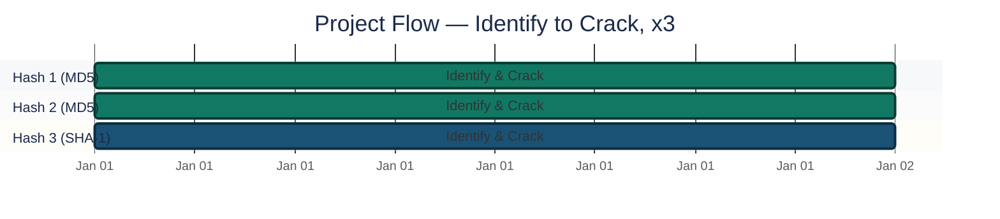
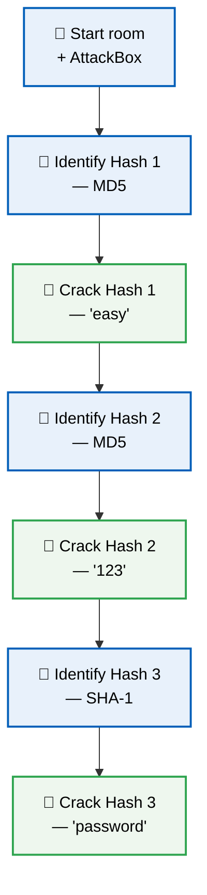
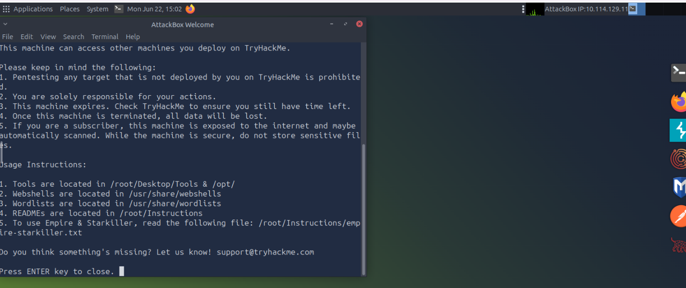
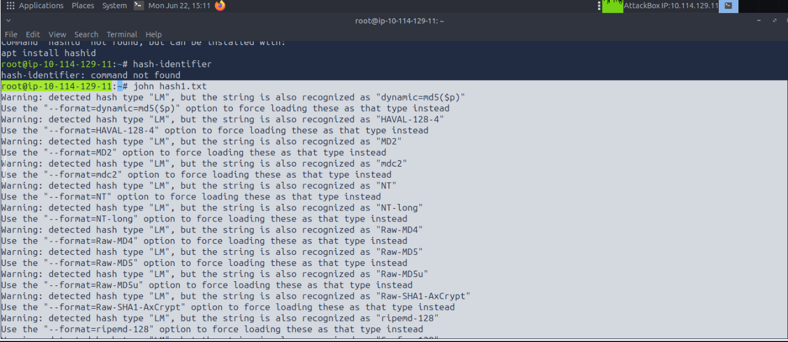
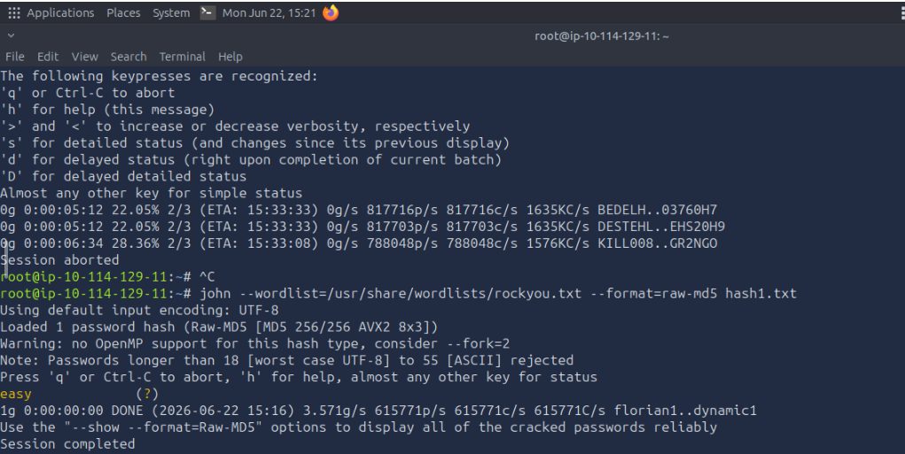
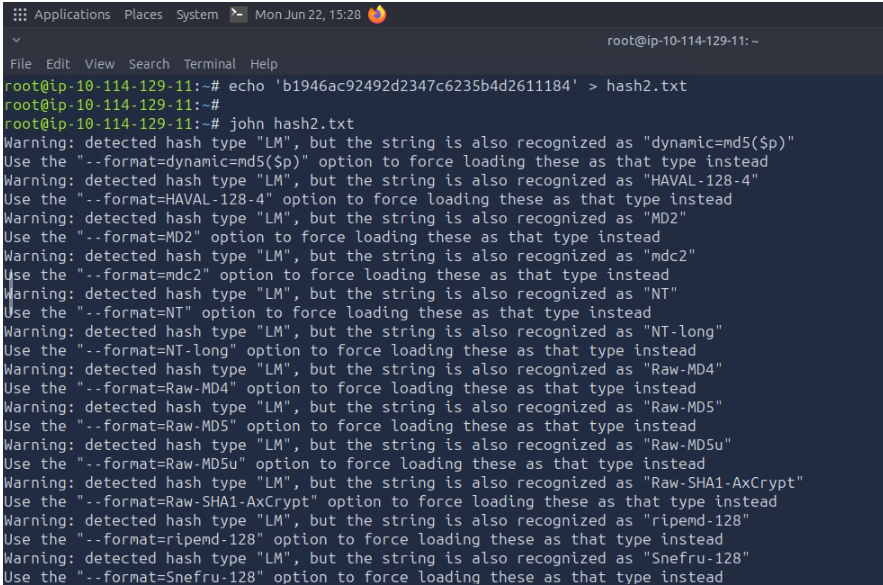
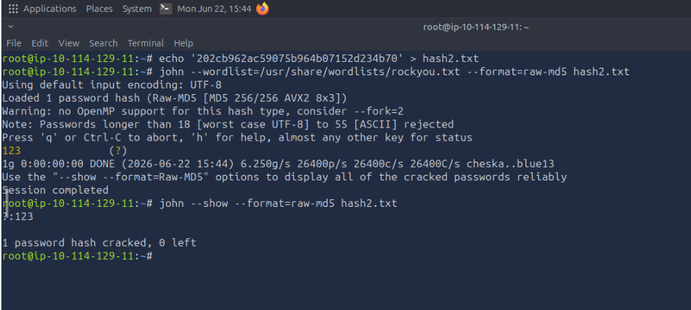
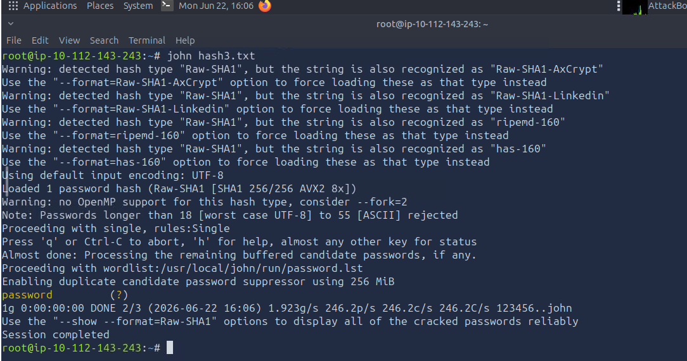
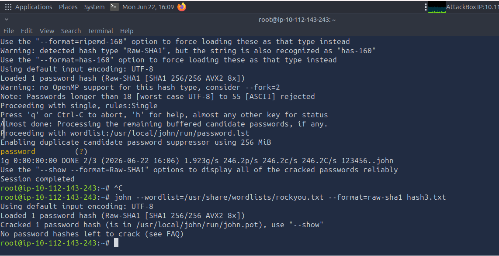
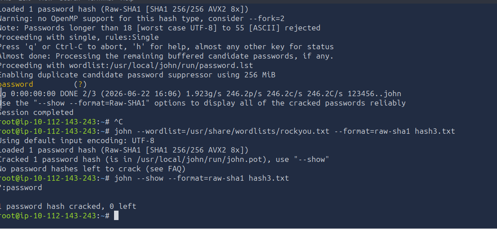

<div align="center">

# 🔓 Password Cracking & Hash Analysis

**Project 08 of 10 — Foundational Projects**

Password Security & Hash Analysis


Three password hashes identified and cracked with John the Ripper inside TryHackMe's "Crack the Hash" room — dictionary-based recovery against a real leaked-password wordlist, and a direct look at how fast weak, common passwords actually fall.

</div>

---

## 📑 Table of Contents

1. [At a Glance](#at-a-glance)
2. [Project Background](#project-background)
3. [Environment](#environment)
4. [Project Flow](#project-flow)
5. [Cracking Walkthrough](#cracking-walkthrough)
6. [Results Table](#results-table)
7. [Findings Summary](#findings-summary)
8. [Challenges & Fixes](#challenges-fixes)
9. [Scope & Limitations](#scope-limitations)
10. [Key Lesson](#key-lesson)
11. [Skills Demonstrated](#skills-demonstrated)
12. [Screenshot Index](#screenshot-index)
13. [Repo Structure](#repo-structure)

---

<a id="at-a-glance"></a>
## 📊 At a Glance

| 🧩 Phases | 🖼️ Screenshots | 🔑 Hashes Cracked | ⏱️ Avg. Crack Time |
|:---:|:---:|:---:|:---:|
| **8** | **8** | **3 / 3** | **< 1 second each** |

---

<a id="project-background"></a>
## 📖 Project Background

Three password hashes identified and cracked using **John the Ripper** inside TryHackMe's "Crack the Hash" room, to practice dictionary-based password recovery and see firsthand how quickly weak, common passwords fall to a basic wordlist attack.

---

<a id="environment"></a>
## 🖧 Environment

| Item | Value |
|---|---|
| **Lab Source** | TryHackMe — "Crack the Hash" room |
| **Hash Identification** | `hashid` / hash-identifier |
| **Cracking Tool** | John the Ripper |
| **Wordlist** | `rockyou.txt` (real leaked-breach passwords) |
| **Hashes Analyzed** | 3 (2× MD5, 1× SHA-1) |

---

<a id="project-flow"></a>
## ⏱️ Project Flow


<p align="center"><em>Colors distinguish each hash's cracking path — all three cracked.</em></p>

---

<a id="cracking-walkthrough"></a>
## 🔵 Cracking Walkthrough

**Objective:** Identify each hash's algorithm before attempting to crack it, then run a dictionary attack with a real breach-derived wordlist and record the actual recovery time.



### Phase 1 — Starting the Room ✅
Started the TryHackMe "Crack the Hash" room and AttackBox.

<p align="center">
  <br>
  <em>Phase 1 — TryHackMe room and AttackBox started</em>
</p>

### Phase 2 — Hash 1: Identification ✅
Identified the first hash's format.

```text
48bb6e862e54f2a795ffc4e541caed4d
```

Identified as **MD5** (`raw-md5`).

<p align="center">
  <br>
  <em>Phase 2 — Hash 1 identified as MD5</em>
</p>

### Phase 3 — Hash 1: Cracking ✅
Ran John the Ripper against the hash with the `rockyou.txt` wordlist. Cracked password: **`easy`**, recovered in under a second.

<p align="center">
  <br>
  <em>Phase 3 — Hash 1 cracked: password 'easy'</em>
</p>

### Phase 4 — Hash 2: Identification ✅

```text
202cb962ac59075b964b07152d234b70
```

Identified as **MD5** (`raw-md5`).

<p align="center">
  <br>
  <em>Phase 4 — Hash 2 identified as MD5</em>
</p>

### Phase 5 — Hash 2: Cracking ✅
Cracked password: **`123`**, recovered in under a second.

<p align="center">
  <br>
  <em>Phase 5 — Hash 2 cracked: password '123'</em>
</p>

### Phase 6 — Hash 3: Identification ✅

```text
5baa61e4c9b93f3f0682250b6cf8331b7ee68fd8
```

Identified as **SHA-1** (`raw-sha1`).

<p align="center">
  <br>
  <em>Phase 6 — Hash 3 identified as SHA-1</em>
</p>

### Phase 7 — Hash 3: Cracking Command ✅
Ran John the Ripper against the SHA-1 hash with the `rockyou.txt` wordlist.

<p align="center">
  <br>
  <em>Phase 7 — John the Ripper running against Hash 3 with rockyou.txt</em>
</p>

### Phase 8 — Hash 3: Cracked ✅
Cracked password: **`password`**, confirmed with `0 left` (no remaining uncracked hashes in this batch).

<p align="center">
  <br>
  <em>Phase 8 — Hash 3 cracked: password 'password', 0 left</em>
</p>

🎯 **Result:** All 3 hashes identified and cracked, each in under a second, confirming how little algorithm strength matters against a predictable password.

---

<a id="results-table"></a>
## 📋 Results Table

| Hash | Type | Cracked Password | Time to Crack |
|---|---|---|---|
| `48bb6e862e54f2a795ffc4e541caed4d` | MD5 | `easy` | < 1 second |
| `202cb962ac59075b964b07152d234b70` | MD5 | `123` | < 1 second |
| `5baa61e4c9b93f3f0682250b6cf8331b7ee68fd8` | SHA-1 | `password` | < 1 second |

---

<a id="findings-summary"></a>
## 🌟 Findings Summary

| 🛡️ Layer | ✅ Status | 📌 Detail |
|---|---|---|
| Hash identification | Confirmed | 2× MD5, 1× SHA-1 — correctly typed before cracking |
| Dictionary attack | Fully effective | `rockyou.txt` cracked all 3 hashes, 0 left uncracked |
| Algorithm strength vs. password strength | Decoupled | SHA-1 (stronger algorithm) cracked just as fast as MD5 — password predictability was the real factor |

---

<a id="challenges-fixes"></a>
## ⚠️ Challenges & Fixes

| ❌ Challenge | ✅ Fix |
|---|---|
| Needed to know the hash algorithm before choosing a crack strategy | Ran `hashid` first on each hash to confirm MD5 vs SHA-1 |
| Risk of assuming a "stronger" hash (SHA-1) meant a harder crack | Verified empirically — Hash 3 (SHA-1) cracked just as fast as the MD5 hashes |

---

<a id="scope-limitations"></a>
## 🚧 Scope & Limitations

- **Wordlist attack only:** No brute-force, rule-based mangling, or mask attacks attempted — `rockyou.txt` alone was sufficient here.
- **Unsalted hashes:** All three hashes were plain MD5/SHA-1 with no salt, which is why cracking was near-instant; salted hashes behave very differently.
- **Lab environment:** Hashes provided by a TryHackMe training room, not pulled from a live breach or engagement.

---

<a id="key-lesson"></a>
## 🧠 Key Lesson

All three passwords cracked in under a second — not because the hashing algorithm was weak, but because the underlying passwords were extremely common. `rockyou.txt` is built from real leaked password breaches, so any password that's ever shown up in a major leak gets caught almost instantly. **Crack speed has nothing to do with hash algorithm strength and everything to do with how predictable the password itself is.** A strong hash protecting a weak password is still a weak password.

---

## 🌍 Real-World Application

This is exactly what an attacker does after obtaining a leaked password database: run every hash against a wordlist like `rockyou.txt` and harvest whatever falls out instantly — which, in real breaches, is often a meaningful percentage of all accounts. For a SOC/security role, the practical takeaway is the same lesson from the defensive side: enforce real password complexity policies, monitor for credential-stuffing and brute-force attempts, and treat "the hash algorithm is strong" as no protection at all if the password behind it is common.

---

<a id="skills-demonstrated"></a>
## 🛠️ Skills Demonstrated

- Identifying hash algorithms (`hashid`) before attempting recovery
- Running dictionary-based cracking attacks with John the Ripper
- Using real breach-derived wordlists (`rockyou.txt`) to model actual attacker behavior
- Distinguishing hash algorithm strength from password strength empirically
- Translating a technical cracking exercise into a defensive password-policy takeaway

---

<a id="screenshot-index"></a>
## 🖼️ Screenshot Index

| # | File | Shows |
|:---:|---|---|
| 1 | `SS1_Room_Started.PNG` | TryHackMe room and AttackBox started |
| 2 | `SS2_Hash1_Identify.PNG` | Hash 1 identified as MD5 |
| 3 | `SS3_Hash1_Cracked.PNG` | Hash 1 cracked — password `easy` |
| 4 | `SS4_Hash2_Identify.PNG` | Hash 2 identified as MD5 |
| 5 | `SS5_Hash2_Cracked.PNG` | Hash 2 cracked — password `123` |
| 6 | `SS6_Hash3_Identify.PNG` | Hash 3 identified as SHA-1 |
| 7 | `SS7_Hash3_Crack_Command.PNG` | John the Ripper running against Hash 3 with `rockyou.txt` |
| 8 | `SS8_Hash3_Cracked.PNG` | Hash 3 cracked — password `password`, `0 left` |

---

<a id="repo-structure"></a>
## 📁 Repo Structure

```text
1-Foundational-Projects/project-08-password-cracking-hash-analysis/
|-- README.md
`-- screenshots/
    |-- SS1_Room_Started.PNG
    |-- SS2_Hash1_Identify.PNG
    |-- SS3_Hash1_Cracked.PNG
    |-- SS4_Hash2_Identify.PNG
    |-- SS5_Hash2_Cracked.PNG
    |-- SS6_Hash3_Identify.PNG
    |-- SS7_Hash3_Crack_Command.PNG
    `-- SS8_Hash3_Cracked.PNG
```

<div align="center">

🔓 **[TryHackMe — Crack the Hash](https://tryhackme.com/room/crackthehash)** · 🛠️ **[John the Ripper](https://www.openwall.com/john/)**

</div>
