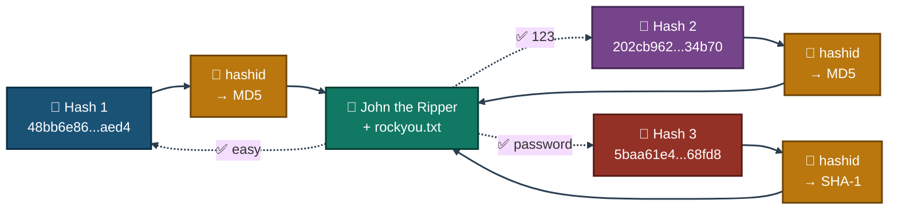
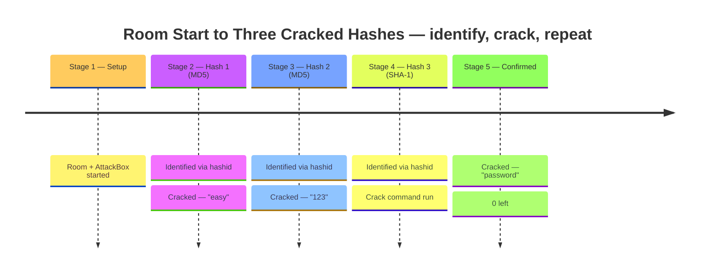
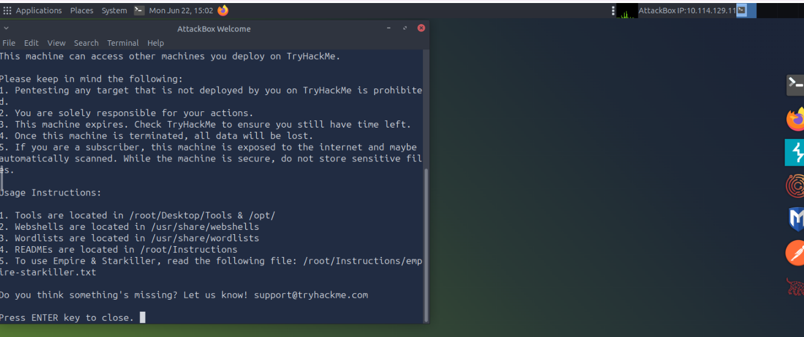
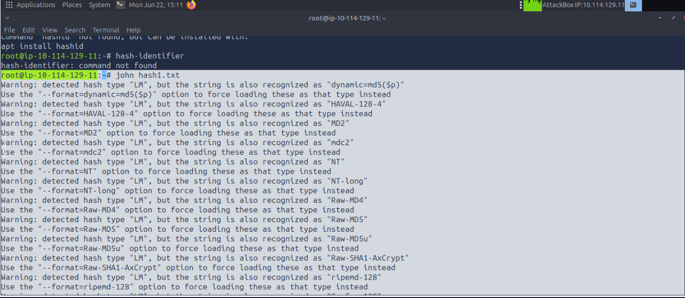
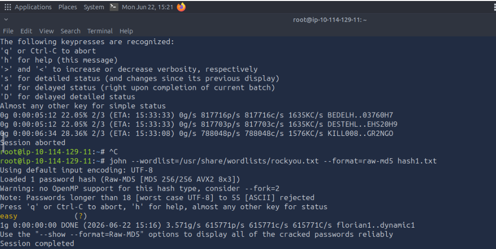
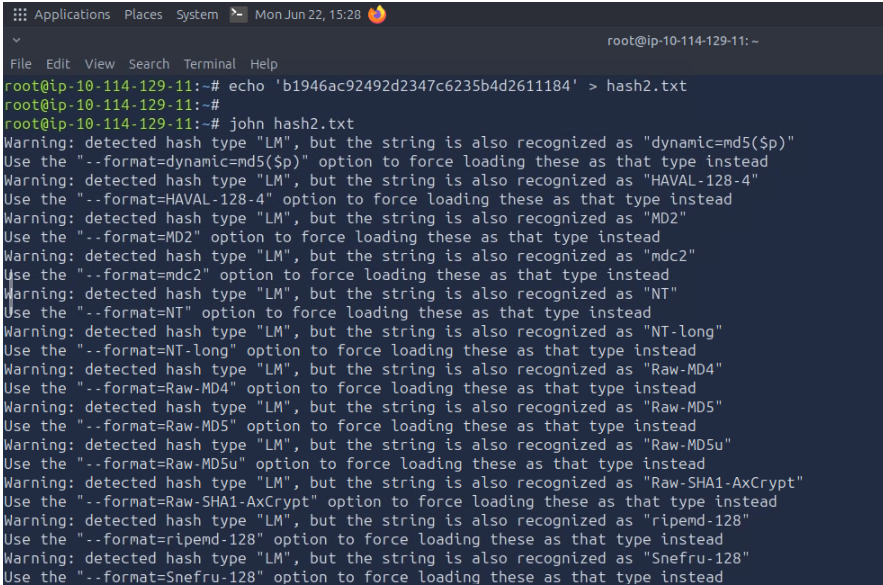
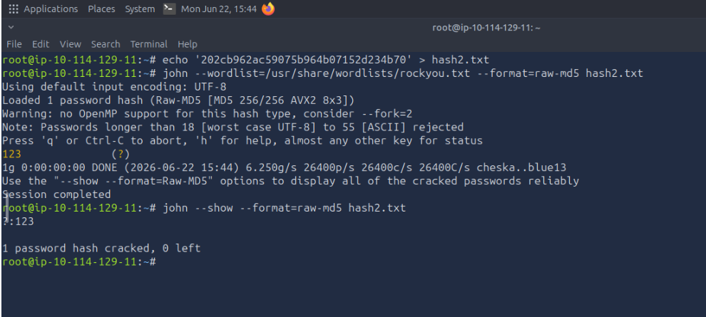
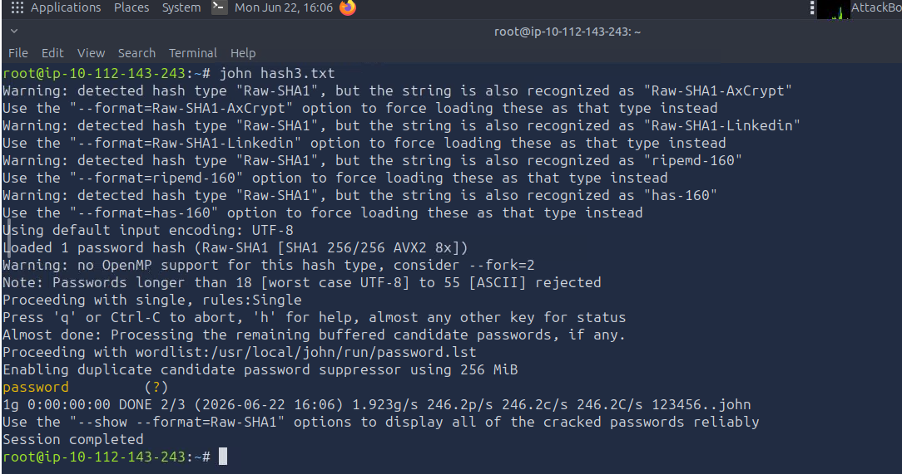
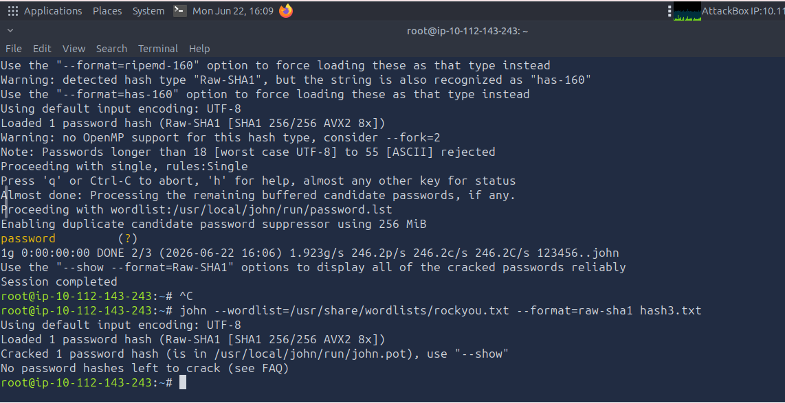
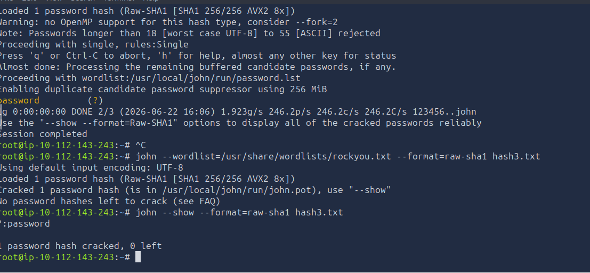

<div align="center">

# 🔓 Password Cracking & Hash Analysis

**Project 08 of 10 — Foundational Projects — Password Security & Hash Analysis**

Three Password Hashes Identified and Cracked with John the Ripper — Dictionary-Based Recovery Against a Real Leaked-Password Wordlist, and How Fast Weak Passwords Actually Fall


Eight steps run end-to-end inside TryHackMe's "Crack the Hash" room — identify each hash's algorithm, then run a dictionary attack with a real breach-derived wordlist and record the actual recovery time. All three hashes fell in under a second each.

</div>

---

## 📑 Table of Contents

1. [At a Glance](#at-a-glance)
2. [Project Background](#project-background)
3. [Tools & Technologies](#tools-technologies)
4. [Environment](#environment)
5. [Cracking Pipeline Map](#cracking-pipeline-map)
6. [Investigation Challenges](#investigation-challenges)
7. [Cracking Timeline](#cracking-timeline)
8. [Module 1 — Start the Room](#module-1)
9. [Module 2 — Identify Hash 1](#module-2)
10. [Module 3 — Crack Hash 1](#module-3)
11. [Module 4 — Identify Hash 2](#module-4)
12. [Module 5 — Crack Hash 2](#module-5)
13. [Module 6 — Identify Hash 3](#module-6)
14. [Module 7 — Run the Crack Command for Hash 3](#module-7)
15. [Module 8 — Confirm Hash 3 Cracked](#module-8)
16. [Coverage Snapshot](#coverage-snapshot)
17. [Results Table](#results-table)
18. [Challenges & Fixes](#challenges-fixes)
19. [Scope & Limitations](#scope-limitations)
20. [What I Learned](#what-i-learned)
21. [Skills Demonstrated](#skills-demonstrated)
22. [Screenshot Index](#screenshot-index)
23. [Repo Structure](#repo-structure)

---

<a id="at-a-glance"></a>
## 📊 At a Glance

<div align="center">

| 🧩 Modules | 🔑 Hashes Cracked | ⏱️ Avg. Crack Time | 🖼️ Screenshots |
|:---:|:---:|:---:|:---:|
| **8** | **3 / 3** | **< 1 second each** | **8** |

</div>

---

<a id="project-background"></a>
## 📖 Project Background

This project identifies and cracks three password hashes using **John the Ripper** inside TryHackMe's "Crack the Hash" room, to practice dictionary-based password recovery and see firsthand how quickly weak, common passwords fall to a basic wordlist attack.

| Module Group | Focus |
|---|---|
| 🚀 **Setup (Module 1)** | Start the room and AttackBox |
| 🔎 **Hash 1 (Modules 2–3)** | Identify and crack an MD5 hash |
| 🔎 **Hash 2 (Modules 4–5)** | Identify and crack a second MD5 hash |
| 🔎 **Hash 3 (Modules 6–8)** | Identify, run the crack command, and confirm a SHA-1 hash |

---

<a id="tools-technologies"></a>
## 🛠️ Tools & Technologies

| Tool | Purpose |
|------|---------|
| 🚀 TryHackMe AttackBox | Pre-configured Linux environment for the room |
| 🔎 `hashid` | Identifying a hash's algorithm before attempting to crack it |
| 🔨 John the Ripper | Dictionary-based password cracking |
| 📖 `rockyou.txt` | Real leaked-breach password wordlist |

---

<a id="environment"></a>
## 🖧 Environment


| Item | Value |
|---|---|
| Lab Source | TryHackMe — "Crack the Hash" room |
| Hash Identification | `hashid` / hash-identifier |
| Cracking Tool | John the Ripper |
| Wordlist | `rockyou.txt` (real leaked-breach passwords) |
| Hashes Analyzed | 3 (2× MD5, 1× SHA-1) |

---

<a id="cracking-pipeline-map"></a>
## 🗺️ Cracking Pipeline Map


```mermaid
%%{init: {'theme': 'base', 'themeVariables': {'fontSize': '16px'}, 'flowchart': {'nodeSpacing': 34, 'rankSpacing': 46, 'padding': 12}}}%%
flowchart LR
    H1["🔑 Hash 1<br/>48bb6e86...aed4"]:::h1 --> ID1["🔎 hashid<br/>→ MD5"]:::id
    H2["🔑 Hash 2<br/>202cb962...34b70"]:::h2 --> ID2["🔎 hashid<br/>→ MD5"]:::id
    H3["🔑 Hash 3<br/>5baa61e4...68fd8"]:::h3 --> ID3["🔎 hashid<br/>→ SHA-1"]:::id
    ID1 --> JOHN["🔨 John the Ripper<br/>+ rockyou.txt"]:::john
    ID2 --> JOHN
    ID3 --> JOHN
    JOHN -.->|"✅ easy"| H1
    JOHN -.->|"✅ 123"| H2
    JOHN -.->|"✅ password"| H3
    classDef h1 fill:#1A5276,stroke:#0B2E43,stroke-width:2px,color:#FFFFFF
    classDef h2 fill:#76448A,stroke:#432752,stroke-width:2px,color:#FFFFFF
    classDef h3 fill:#943126,stroke:#571C16,stroke-width:2px,color:#FFFFFF
    classDef id fill:#B9770E,stroke:#6E4409,stroke-width:2px,color:#FFFFFF
    classDef john fill:#117864,stroke:#083D33,stroke-width:2px,color:#FFFFFF
    linkStyle default stroke:#2C3E50,stroke-width:2px
```
<p align="center"><em>All three hashes funnel through the same identification step and the same John the Ripper + rockyou.txt attack — the dashed lines show each one falling to a common, predictable password.</em></p>

---

<a id="investigation-challenges"></a>
## 🐛 Investigation Challenges

| # | Challenge | Type |
|---|-------|------|
| 1 | Needed to know the hash algorithm before choosing a crack strategy | Identification gap |
| 2 | Risk of assuming a "stronger" hash (SHA-1) meant a harder crack | Algorithm strength vs. password strength assumption |

---

<a id="cracking-timeline"></a>
## 🔎 Cracking Timeline


```mermaid
%%{init: {'theme': 'base', 'themeVariables': {'fontSize': '15px'}, 'timeline': {'disableMulticolor': false}}}%%
timeline
    title Room Start to Three Cracked Hashes — identify, crack, repeat
    Stage 1 — Setup : Room + AttackBox started
    Stage 2 — Hash 1 (MD5) : Identified via hashid : Cracked — "easy"
    Stage 3 — Hash 2 (MD5) : Identified via hashid : Cracked — "123"
    Stage 4 — Hash 3 (SHA-1) : Identified via hashid : Crack command run
    Stage 5 — Confirmed : Cracked — "password" : 0 left
```
<p align="center"><em>A Mermaid timeline instead of a flowchart — five stages read left to right, pairing each hash's identification with its crack result.</em></p>

---

<a id="module-1"></a>
## 🚀 Module 1 — Start the Room

**Objective:** Launch the TryHackMe room and AttackBox.

### Step 1 — Start the Room ✅

```
Start TryHackMe "Crack the Hash" room + AttackBox
```

<p align="center">
  <br>
  <em>Exhibit 1 — TryHackMe room and AttackBox started</em>
</p>

---

<a id="module-2"></a>
## 🔎 Module 2 — Identify Hash 1

**Objective:** Determine Hash 1's algorithm before attempting to crack it.

### Step 2 — Run hashid on Hash 1 ✅

```
48bb6e862e54f2a795ffc4e541caed4d

hashid <hash>
→ Identified as MD5 (raw-md5)
```

<p align="center">
  <br>
  <em>Exhibit 2 — Hash 1 identified as MD5</em>
</p>

---

<a id="module-3"></a>
## 🔨 Module 3 — Crack Hash 1

**Objective:** Run John the Ripper against Hash 1 with `rockyou.txt`.

### Step 3 — Crack Hash 1 ✅

```
john --format=raw-md5 --wordlist=rockyou.txt hash1.txt

→ Cracked password: easy
→ Recovered in under a second
```

<p align="center">
  <br>
  <em>Exhibit 3 — Hash 1 cracked: password 'easy'</em>
</p>

---

<a id="module-4"></a>
## 🔎 Module 4 — Identify Hash 2

**Objective:** Determine Hash 2's algorithm.

### Step 4 — Run hashid on Hash 2 ✅

```
202cb962ac59075b964b07152d234b70

hashid <hash>
→ Identified as MD5 (raw-md5)
```

<p align="center">
  <br>
  <em>Exhibit 4 — Hash 2 identified as MD5</em>
</p>

---

<a id="module-5"></a>
## 🔨 Module 5 — Crack Hash 2

**Objective:** Run John the Ripper against Hash 2 with `rockyou.txt`.

### Step 5 — Crack Hash 2 ✅

```
john --format=raw-md5 --wordlist=rockyou.txt hash2.txt

→ Cracked password: 123
→ Recovered in under a second
```

<p align="center">
  <br>
  <em>Exhibit 5 — Hash 2 cracked: password '123'</em>
</p>

---

<a id="module-6"></a>
## 🔎 Module 6 — Identify Hash 3

**Objective:** Determine Hash 3's algorithm.

### Step 6 — Run hashid on Hash 3 ✅

```
5baa61e4c9b93f3f0682250b6cf8331b7ee68fd8

hashid <hash>
→ Identified as SHA-1 (raw-sha1)
```

<p align="center">
  <br>
  <em>Exhibit 6 — Hash 3 identified as SHA-1</em>
</p>

---

<a id="module-7"></a>
## 🔨 Module 7 — Run the Crack Command for Hash 3

**Objective:** Run John the Ripper against the SHA-1 hash.

### Step 7 — Run the Crack Command ✅

```
john --format=raw-sha1 --wordlist=rockyou.txt hash3.txt
```

<p align="center">
  <br>
  <em>Exhibit 7 — John the Ripper running against Hash 3 with rockyou.txt</em>
</p>

---

<a id="module-8"></a>
## ✅ Module 8 — Confirm Hash 3 Cracked

**Objective:** Verify the final hash cracked successfully.

### Step 8 — Confirm the Result ✅

```
→ Cracked password: password
→ Confirmed with "0 left" — no remaining uncracked
  hashes in this batch
```

<p align="center">
  <br>
  <em>Exhibit 8 — Hash 3 cracked: password 'password', 0 left</em>
</p>

---

<a id="coverage-snapshot"></a>
## 🌟 Coverage Snapshot

| 🛡️ Layer | ✅ Status | 📌 Detail |
|---|---|---|
| Room started | Live | AttackBox launched (Exhibit 1) |
| Hash 1 identified & cracked | Proven | MD5 → `easy` (Exhibits 2–3) |
| Hash 2 identified & cracked | Proven | MD5 → `123` (Exhibits 4–5) |
| Hash 3 identified | Proven | SHA-1 confirmed (Exhibit 6) |
| Hash 3 crack run | Proven | John the Ripper executed (Exhibit 7) |
| Hash 3 confirmed cracked | Proven | `password`, 0 left (Exhibit 8) |

---

<a id="results-table"></a>
## 📋 Results Table

| Hash | Type | Cracked Password | Time to Crack |
|---|---|---|---|
| `48bb6e862e54f2a795ffc4e541caed4d` | MD5 | `easy` | < 1 second |
| `202cb962ac59075b964b07152d234b70` | MD5 | `123` | < 1 second |
| `5baa61e4c9b93f3f0682250b6cf8331b7ee68fd8` | SHA-1 | `password` | < 1 second |

---

<a id="challenges-fixes"></a>
## ⚠️ Challenges & Fixes

| ❌ Challenge | ✅ Fix |
|---|---|
| Needed to know the hash algorithm before choosing a crack strategy | Ran `hashid` first on each hash to confirm MD5 vs SHA-1 |
| Risk of assuming a "stronger" hash (SHA-1) meant a harder crack | Verified empirically — Hash 3 (SHA-1) cracked just as fast as the MD5 hashes |

---

<a id="scope-limitations"></a>
## 🚧 Scope & Limitations

- **Wordlist attack only:** no brute-force, rule-based mangling, or mask attacks attempted — `rockyou.txt` alone was sufficient here.
- **Unsalted hashes:** all three hashes were plain MD5/SHA-1 with no salt, which is why cracking was near-instant; salted hashes behave very differently.
- **Lab environment:** hashes provided by a TryHackMe training room, not pulled from a live breach or engagement.

---

<a id="what-i-learned"></a>
## 🧠 What I Learned

- **Crack speed has nothing to do with hash algorithm strength and everything to do with password predictability.** SHA-1 is considered stronger than MD5, but Hash 3 cracked just as fast as the two MD5 hashes — because the password itself (`password`) was common, not because the algorithm was weak.
- **`rockyou.txt` is effective because it's real breach data, not a generic dictionary.** Any password that's ever appeared in a major leak gets caught almost instantly against it.
- **Identifying the hash type first isn't optional.** Running `hashid` before cracking avoided wasted attempts with the wrong format flag.
- **A strong hash protecting a weak password is still a weak password.** The algorithm is only one half of the defense — the other half is whether the password itself resists a wordlist at all.

---

## 🌍 Real-World Application

This is exactly what an attacker does after obtaining a leaked password database: run every hash against a wordlist like `rockyou.txt` and harvest whatever falls out instantly — which, in real breaches, is often a meaningful percentage of all accounts. For a SOC/security role, the practical takeaway is the same lesson from the defensive side: enforce real password complexity policies, monitor for credential-stuffing and brute-force attempts, and treat "the hash algorithm is strong" as no protection at all if the password behind it is common.

---

<a id="skills-demonstrated"></a>
## 🛠️ Skills Demonstrated

- Identifying hash algorithms (`hashid`) before attempting recovery
- Running dictionary-based cracking attacks with John the Ripper
- Using real breach-derived wordlists (`rockyou.txt`) to model actual attacker behavior
- Distinguishing hash algorithm strength from password strength empirically
- Translating a technical cracking exercise into a defensive password-policy takeaway

---

<a id="screenshot-index"></a>
## 🖼️ Screenshot Index

| # | File | Shows |
|:---:|---|---|
| 1 | `SS1_Room_Started.PNG` | TryHackMe room and AttackBox started |
| 2 | `SS2_Hash1_Identify.PNG` | Hash 1 identified as MD5 |
| 3 | `SS3_Hash1_Cracked.PNG` | Hash 1 cracked — password `easy` |
| 4 | `SS4_Hash2_Identify.PNG` | Hash 2 identified as MD5 |
| 5 | `SS5_Hash2_Cracked.PNG` | Hash 2 cracked — password `123` |
| 6 | `SS6_Hash3_Identify.PNG` | Hash 3 identified as SHA-1 |
| 7 | `SS7_Hash3_Crack_Command.PNG` | John the Ripper running against Hash 3 with `rockyou.txt` |
| 8 | `SS8_Hash3_Cracked.PNG` | Hash 3 cracked — password `password`, `0 left` |

---

<a id="repo-structure"></a>
## 📁 Repo Structure

```text
1-Foundational-Projects/project-08-password-cracking-hash-analysis/
|-- README.md
`-- screenshots/
    |-- SS1_Room_Started.PNG
    |-- SS2_Hash1_Identify.PNG
    |-- SS3_Hash1_Cracked.PNG
    |-- SS4_Hash2_Identify.PNG
    |-- SS5_Hash2_Cracked.PNG
    |-- SS6_Hash3_Identify.PNG
    |-- SS7_Hash3_Crack_Command.PNG
    `-- SS8_Hash3_Cracked.PNG
```

<div align="center">

🔓 **[TryHackMe — Crack the Hash](https://tryhackme.com/room/crackthehash)** · 🛠️ **[John the Ripper](https://www.openwall.com/john/)**

</div>
