<div align="center">

# 🏢 Enterprise Network VLAN & Inter-VLAN Routing

**Lab 10 — Cisco Networking Lab Portfolio**

Two-Switch Enterprise Network: VLANs, VTP, InterVLAN Routing, DHCP, SSH, Port Security & ACLs (Cisco Packet Tracer)


A two-switch enterprise network with three VLANs synchronized over VTP, InterVLAN routing through router subinterfaces, per-VLAN DHCP, a dedicated Management VLAN reachable over SSH, hardened switch ports, and an ACL that blocks ICMP from Sales to IT while leaving the reverse direction open. Every stage is backed by a screenshot, and the ACL test shows both the block and the traffic it deliberately leaves open.

> [!NOTE]
> This project builds directly on Project 02's topology (Cisco Infrastructure & Secure Routing), adding VLAN segmentation, VTP synchronization, and further security hardening on top of it.

</div>

---

## 📑 Table of Contents

1. [At a Glance](#at-a-glance)
2. [Project Background](#project-background)
3. [Tools & Technologies](#tools-technologies)
4. [Environment](#environment)
5. [Topology](#topology)
6. [VLAN Design](#vlan-design)
7. [PC IP Configuration](#pc-ip-configuration)
8. [Build Timeline](#build-timeline)
9. [Module 1 — Build the Topology](#module-1)
10. [Module 2 — VTP Configuration](#module-2)
11. [Module 3 — VLAN Ports & Trunks](#module-3)
12. [Module 4 — Port Hardening & Security](#module-4)
13. [Module 5 — Management VLAN & SSH](#module-5)
14. [Module 6 — InterVLAN Routing & DHCP](#module-6)
15. [Module 7 — ACL Configuration & Testing](#module-7)
16. [Module 8 — Final Verification & Save](#module-8)
17. [Coverage Snapshot](#coverage-snapshot)
18. [Command Summary](#command-summary)
19. [Challenges & Fixes](#challenges-fixes)
20. [Scope & Limitations](#scope-limitations)
21. [What I Learned](#what-i-learned)
22. [Skills Demonstrated](#skills-demonstrated)
23. [Screenshot Index](#screenshot-index)
24. [Repo Structure](#repo-structure)

---

<a id="at-a-glance"></a>
## 📊 At a Glance

<div align="center">

| 🧩 VLANs | 🖧 Switches | 🔀 Routing | 🔒 Security Layers | 🖼️ Screenshots | 🧱 Steps |
|:---:|:---:|:---:|:---:|:---:|:---:|
| **3** | **2 (VTP synced)** | **Router-on-a-Stick** | **4** | **21** | **21** |

</div>

---

<a id="project-background"></a>
## 📖 Project Background

This lab builds a small enterprise network end to end: three departments segmented into VLANs across two switches, kept in sync with VTP instead of configured twice, routed between by a single router's subinterfaces, addressed automatically by per-VLAN DHCP, and locked down with a management VLAN, SSH access, port security, BPDU Guard and an ACL.

| Module | Focus |
|---|---|
| 🔵 **Module 1 — Build the Topology** | Wire 1 router, 2 switches, 4 PCs and an admin PC |
| 🟢 **Module 2 — VTP Configuration** | Switch1 as VTP server, Switch2 as VTP client |
| 🟣 **Module 3 — VLAN Ports & Trunks** | Assign access ports and trunks on both switches |
| 🟠 **Module 4 — Port Hardening & Security** | Shut unused ports, enable port security, PortFast and BPDU Guard |
| 🔴 **Module 5 — Management VLAN & SSH** | VLAN 99 SVIs on both switches, SSH v2 for remote management |
| 🟤 **Module 6 — InterVLAN Routing & DHCP** | Router subinterfaces per VLAN, DHCP pools for VLAN 10 and 20 |
| ⚫ **Module 7 — ACL Configuration & Testing** | Block ICMP from VLAN 10 → VLAN 20, confirm VLAN 20 → VLAN 10 still works |
| 🟡 **Module 8 — Final Verification & Save** | SSH test, full `show` verification, save to startup-config |

> [!NOTE]
> This is a Packet Tracer simulation, not physical hardware. Command output referenced in a step is what the corresponding screenshot shows; anything not shown in a screenshot is marked 📝.

---

<a id="tools-technologies"></a>
## 🛠️ Tools & Technologies

| Tool | Purpose |
|------|---------|
| 🖥️ Cisco Packet Tracer | Network simulation |
| 🚪 Router 2911 | InterVLAN routing via subinterfaces |
| 🔀 Switch 2960 x2 | VLAN switching, VTP, port security |
| 🔗 VTP | VLAN synchronization across switches |
| 📖 DHCP | Automatic IP assignment per VLAN |
| 🔐 SSH v2 | Secure remote management |
| 🛡️ ACLs | Inter-VLAN traffic filtering |
| 🔒 Port Security | MAC-based access control |
| 🌳 BPDU Guard | STP loop prevention |

---

<a id="environment"></a>
## 🖧 Environment


**Devices:** 1 Router (2911) · 2 Switches (2960) · 4 PCs · 1 Admin PC (for SSH management)

**PCs to Switches**

| PC | Switch | Port |
|----|--------|------|
| PC0 | Switch1 | Fa0/1 |
| PC1 | Switch1 | Fa0/2 |
| PC2 | Switch2 | Fa0/1 |
| PC3 | Switch2 | Fa0/2 |
| Admin PC | Switch1 | Fa0/3 |

**Switch to Switch**

| From | To | Cable |
|------|----|-------|
| Switch1 Fa0/24 | Switch2 Fa0/24 | Copper Cross-Over |

**Router to Switches**

| Router Interface | Switch | Switch Port | Cable |
|-----------------|--------|-------------|-------|
| G0/0 | Switch1 | Fa0/23 | Copper Straight-Through |

> [!NOTE]
> Exhibit 1 shows a single router uplink: Switch2 reaches the router over the Fa0/24 trunk through Switch1. In the Packet Tracer topology the switches are labelled Switch0 and Switch1; their configured hostnames are Switch1 and Switch2, and this README uses the hostnames.

---

<a id="topology"></a>
## 🗺️ Topology

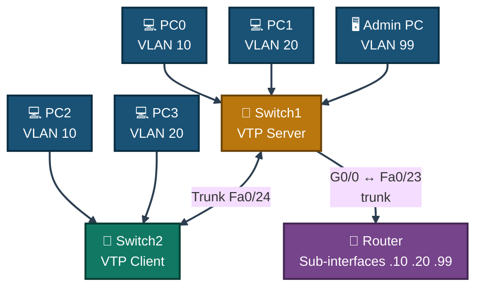
```mermaid
%%{init: {'theme': 'base', 'themeVariables': {'fontSize': '14px'}, 'flowchart': {'nodeSpacing': 24, 'rankSpacing': 34, 'padding': 8}}}%%
flowchart TB
    PC0["💻 PC0<br/>VLAN 10"]:::pc --> S1["🔀 Switch1<br/>VTP Server"]:::s1
    PC1["💻 PC1<br/>VLAN 20"]:::pc --> S1
    ADM["🖥️ Admin PC<br/>VLAN 99"]:::pc --> S1
    PC2["💻 PC2<br/>VLAN 10"]:::pc --> S2["🔀 Switch2<br/>VTP Client"]:::s2
    PC3["💻 PC3<br/>VLAN 20"]:::pc --> S2
    S1 <-->|"Trunk Fa0/24"| S2
    S1 -->|"G0/0 ↔ Fa0/23<br/>trunk"| R["🚪 Router<br/>Sub-interfaces .10 .20 .99"]:::r
    classDef pc fill:#1A5276,stroke:#0B2E43,stroke-width:2px,color:#FFFFFF
    classDef s1 fill:#B9770E,stroke:#6E4409,stroke-width:2px,color:#FFFFFF
    classDef s2 fill:#117864,stroke:#083D33,stroke-width:2px,color:#FFFFFF
    classDef r fill:#76448A,stroke:#432752,stroke-width:2px,color:#FFFFFF
    linkStyle default stroke:#2C3E50,stroke-width:2px
```
<p align="center"><em>Switch1 is the VTP server and pushes VLANs to Switch2 automatically. Switch2 reaches the router over the Fa0/24 trunk and Switch1's uplink, and the router routes between VLANs 10, 20 and 99 through subinterfaces.</em></p>

---

<a id="vlan-design"></a>
## 🗂️ VLAN Design

| VLAN | Name | Network | Gateway |
|------|------|---------|---------|
| 🟠 VLAN 10 | Sales | 192.168.10.0/24 | 192.168.10.1 |
| 🟢 VLAN 20 | IT | 192.168.20.0/24 | 192.168.20.1 |
| 🔴 VLAN 99 | Management | 192.168.99.0/24 | 192.168.99.1 |

---

<a id="pc-ip-configuration"></a>
## 💻 PC IP Configuration

| PC | VLAN | IP | Mask | Gateway |
|----|------|----|------|---------|
| PC0 | 10 | DHCP | auto | auto |
| PC1 | 20 | DHCP | auto | auto |
| PC2 | 10 | DHCP | auto | auto |
| PC3 | 20 | DHCP | auto | auto |
| Admin PC | 99 | 192.168.99.10 | 255.255.255.0 | 192.168.99.1 |

---

<a id="build-timeline"></a>
## 🔎 Build Timeline

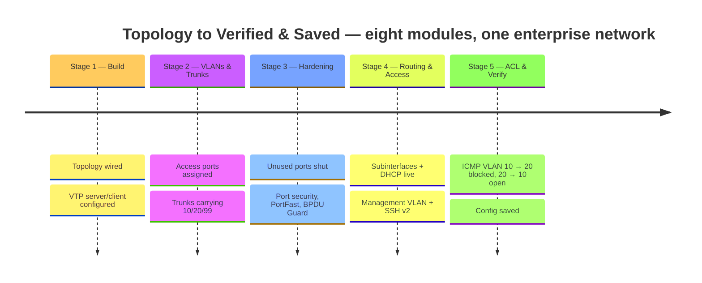
```mermaid
%%{init: {'theme': 'base', 'themeVariables': {'fontSize': '15px'}, 'timeline': {'disableMulticolor': false}}}%%
timeline
    title Topology to Verified & Saved — eight modules, one enterprise network
    Stage 1 — Build : Topology wired : VTP server/client configured
    Stage 2 — VLANs & Trunks : Access ports assigned : Trunks carrying 10/20/99
    Stage 3 — Hardening : Unused ports shut : Port security, PortFast, BPDU Guard
    Stage 4 — Routing & Access : Subinterfaces + DHCP live : Management VLAN + SSH v2
    Stage 5 — ACL & Verify : ICMP VLAN 10 → 20 blocked, 20 → 10 open : Config saved
```
<p align="center"><em>A Mermaid timeline instead of a flowchart — five stages read left to right, from the first cable to the saved, verified configuration.</em></p>

---

<a id="module-1"></a>
## 🔵 Module 1 — Build the Topology

**Objective:** Wire 1 router, 2 switches, 4 PCs and an admin PC exactly per the Environment tables.

### Step 1 — Build the Topology ✅

Set up all devices and connect cables exactly as shown above. No CLI commands in this step — this is a physical/logical wiring step done in the Packet Tracer GUI.

<p align="center">
  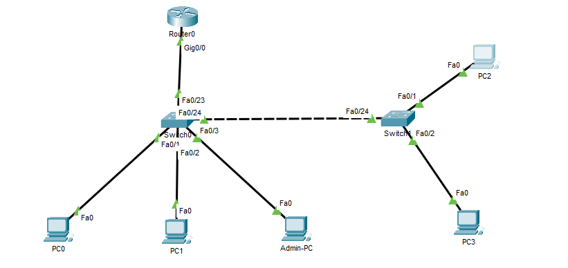<br>
  <em>Exhibit 1 — Full topology: 2 switches trunked together, Switch1 uplinked to the router on G0/0, 4 PCs plus one admin PC</em>
</p>

---

<a id="module-2"></a>
## 🟢 Module 2 — VTP Configuration

**Objective:** Make Switch1 the VTP server and Switch2 a VTP client so VLANs only need to be created once.

### Step 2 — Configure VTP on Switch1 (Server) ✅

```
Switch(config)# hostname Switch1
Switch1(config)# vtp mode server
Switch1(config)# vtp domain malaika.lab
Switch1(config)# vtp password Cisco123
Switch1(config)# do show vtp status
```

<p align="center">
  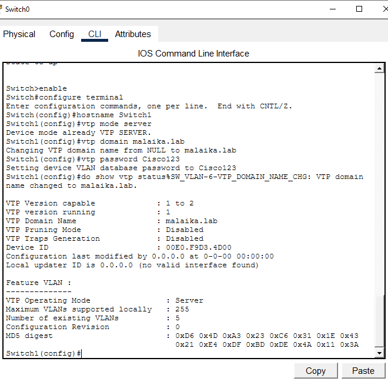<br>
  <em>Exhibit 2 — Switch1 set to VTP server mode, domain malaika.lab, running VTP version 1 (the default; version 2 was not enabled)</em>
</p>

### Step 3 — Configure VTP on Switch2 (Client) ✅

```
Switch(config)# hostname Switch2
Switch2(config)# vtp mode client
Switch2(config)# vtp domain malaika.lab
Switch2(config)# vtp password Cisco123
Switch2(config)# do show vtp status
```

<p align="center">
  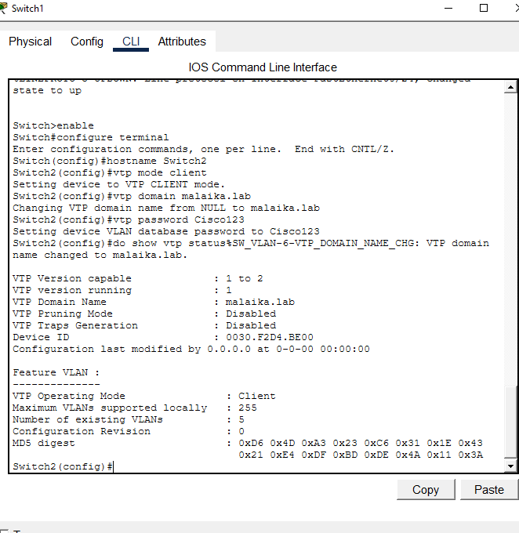<br>
  <em>Exhibit 3 — Switch2 set to VTP client mode, joined to domain malaika.lab</em>
</p>

### Step 4 — Create VLANs on Switch1 Only ✅

```
Switch1(config)# vlan 10
Switch1(config-vlan)# name Sales
Switch1(config-vlan)# exit
Switch1(config)# vlan 20
Switch1(config-vlan)# name IT
Switch1(config-vlan)# exit
Switch1(config)# vlan 99
Switch1(config-vlan)# name Management
Switch1(config-vlan)# exit
Switch1(config)# do show vlan brief
```

<p align="center">
  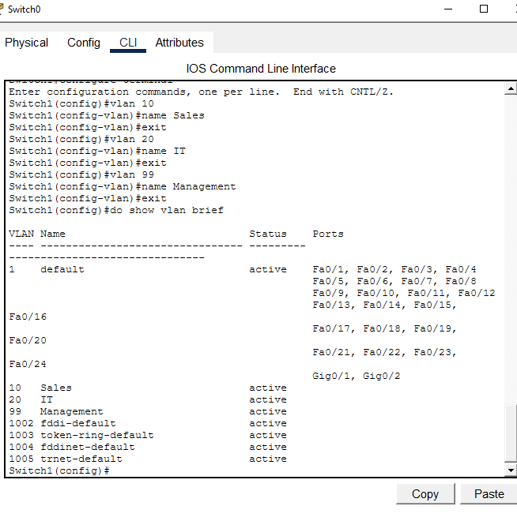<br>
  <em>Exhibit 4 — VLANs 10 (Sales), 20 (IT) and 99 (Management) created on Switch1</em>
</p>

### Step 5 — Verify VLAN Sync ⚠️

```
Switch2# show vlan brief
Switch2# show vtp status
```

<p align="center">
  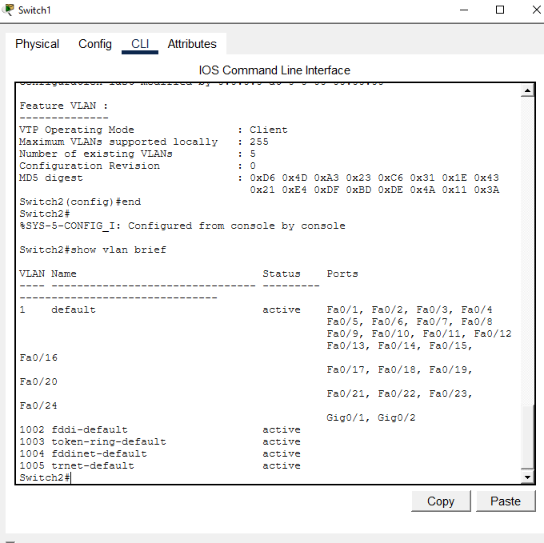<br>
  <em>Exhibit 5 — Switch2 still shows only the default VLANs (revision 0): captured before the Fa0/24 trunk was configured in Module 3</em>
</p>

> [!NOTE]
> VTP cannot synchronize until a trunk is up, so this capture predates the sync. VLANs 10, 20 and 99 appear on Switch2 in Exhibit 7, and Exhibit 20 shows the server at revision 6 with 8 VLANs.

---

<a id="module-3"></a>
## 🟣 Module 3 — VLAN Ports & Trunks

**Objective:** Assign access ports to the right VLANs on both switches and trunk the two switches together and up to the router.

### Step 6 — Configure Switch1 Ports ✅

```
Switch1(config)# interface fa0/1
Switch1(config-if)# switchport mode access
Switch1(config-if)# switchport access vlan 10
Switch1(config-if)# exit
Switch1(config)# interface fa0/2
Switch1(config-if)# switchport mode access
Switch1(config-if)# switchport access vlan 20
Switch1(config-if)# exit
Switch1(config)# interface fa0/3
Switch1(config-if)# switchport mode access
Switch1(config-if)# switchport access vlan 99
Switch1(config-if)# exit
Switch1(config)# interface fa0/23
Switch1(config-if)# switchport mode trunk
Switch1(config-if)# exit
Switch1(config)# interface fa0/24
Switch1(config-if)# switchport mode trunk
Switch1(config-if)# exit
Switch1(config)# do show vlan brief
```

<p align="center">
  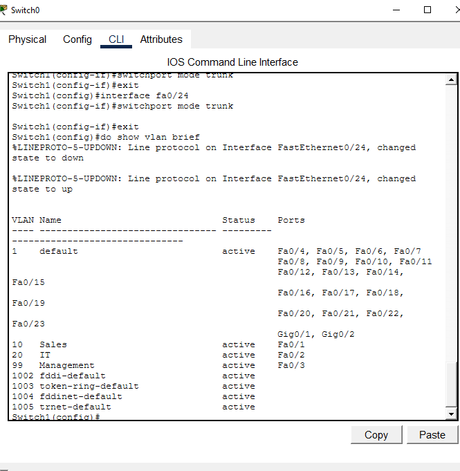<br>
  <em>Exhibit 6 — Switch1: Fa0/1–3 as access ports for VLANs 10/20/99, Fa0/23 and Fa0/24 as trunks</em>
</p>

### Step 7 — Configure Switch2 Ports ✅

```
Switch2(config)# interface fa0/1
Switch2(config-if)# switchport mode access
Switch2(config-if)# switchport access vlan 10
Switch2(config-if)# exit
Switch2(config)# interface fa0/2
Switch2(config-if)# switchport mode access
Switch2(config-if)# switchport access vlan 20
Switch2(config-if)# spanning-tree portfast
Switch2(config-if)# spanning-tree bpduguard enable
Switch2(config-if)# exit
Switch2(config)# interface fa0/23
Switch2(config-if)# switchport mode trunk
Switch2(config-if)# exit
Switch2(config)# interface fa0/24
Switch2(config-if)# switchport mode trunk
Switch2(config-if)# exit
Switch2(config)# do show vlan brief
```

<p align="center">
  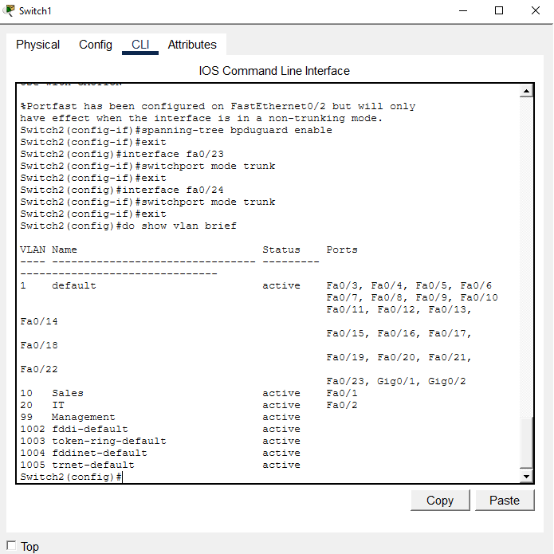<br>
  <em>Exhibit 7 — Switch2: Fa0/1–2 as access ports for VLANs 10/20 (PortFast + BPDU Guard visible on Fa0/2), Fa0/23 and Fa0/24 as trunks, and VLANs 10/20/99 now present on Switch2 via VTP</em>
</p>

---

<a id="module-4"></a>
## 🟠 Module 4 — Port Hardening & Security

**Objective:** Shut down unused ports and lock the active access ports down to one known MAC address each.

### Step 8 — Unused Ports Security ✅

```
Switch1(config)# interface range fa0/4-22
Switch1(config-if-range)# switchport access vlan 99
Switch1(config-if-range)# shutdown
Switch1(config-if-range)# exit
Switch1(config)# do show interfaces status

Switch2(config)# interface range fa0/3-22
Switch2(config-if-range)# shutdown
```

<p align="center">
  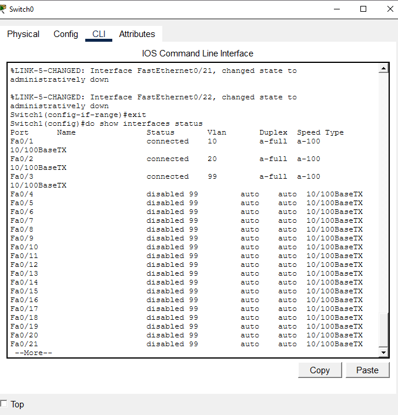<br>
  <em>Exhibit 8 — Switch1: Fa0/1–3 connected in VLANs 10/20/99, unused ports from Fa0/4 administratively down and parked in VLAN 99</em>
</p>

> 📝 Exhibit 8 shows Switch1 only. The Switch2 block (Fa0/3–22) is not screenshotted.

### Step 9 — Port Security ✅

```
Switch1(config)# interface fa0/1
Switch1(config-if)# switchport port-security
Switch1(config-if)# switchport port-security maximum 1
Switch1(config-if)# switchport port-security mac-address sticky
Switch1(config-if)# switchport port-security violation shutdown
Switch1(config-if)# exit
   (repeated for fa0/2 and fa0/3)
Switch1(config)# do show port-security
```

> 📝 Exhibit 9 shows the port-security commands entered on Switch1 Fa0/1, Fa0/2 and Fa0/3, followed by `show port-security`. Port security on Switch2 is not screenshotted. PortFast and BPDU Guard are not part of this capture; they are visible on Switch2 Fa0/2 in Exhibit 7.

<p align="center">
  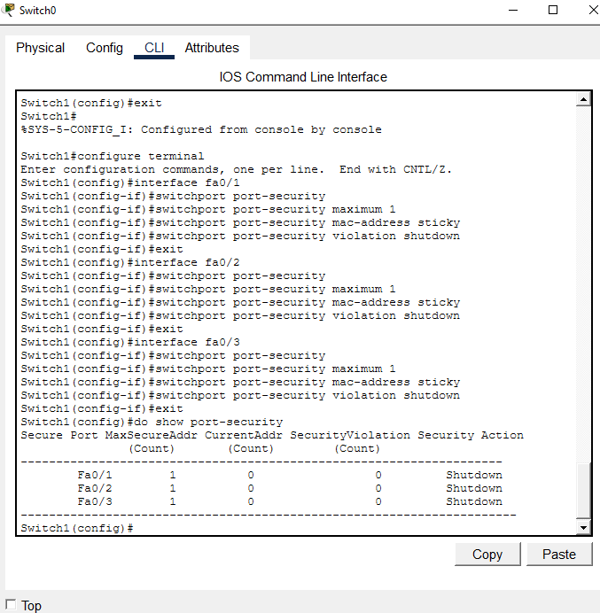<br>
  <em>Exhibit 9 — Port security on Switch1 Fa0/1–3: max 1 MAC (sticky), violation action shutdown, 0 violations so far</em>
</p>

---

<a id="module-5"></a>
## 🔴 Module 5 — Management VLAN & SSH

**Objective:** Give both switches a management IP on VLAN 99 and enable SSH v2 for remote access instead of console-only management.

### Step 10 — Management VLAN ✅

```
Switch1(config)# interface vlan 99
Switch1(config-if)# ip address 192.168.99.2 255.255.255.0
Switch1(config-if)# no shutdown
Switch1(config-if)# exit
Switch1(config)# ip default-gateway 192.168.99.1

Switch2(config)# interface vlan 99
Switch2(config-if)# ip address 192.168.99.3 255.255.255.0
Switch2(config-if)# no shutdown
Switch2(config-if)# exit
Switch2(config)# ip default-gateway 192.168.99.1
```

<p align="center">
  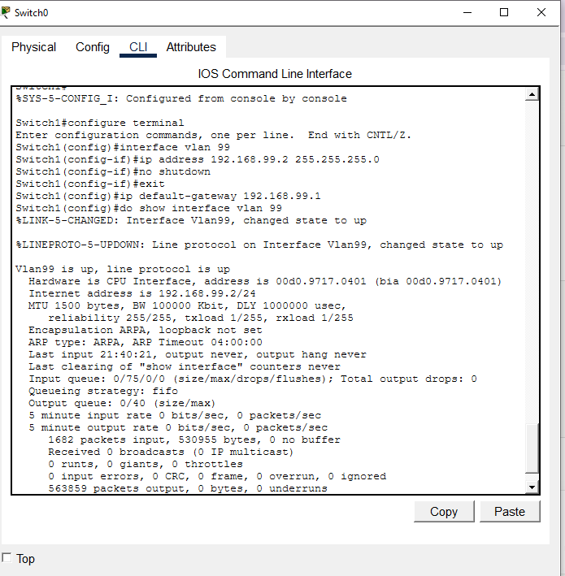<br>
  <em>Exhibit 10 — Switch1's VLAN 99 SVI up at 192.168.99.2/24 with the default gateway set; Switch2 (192.168.99.3) is shown reachable over SSH in Exhibit 19</em>
</p>

### Step 11 — SSH on Switches ✅

```
Switch1(config)# ip domain-name malaika.lab
Switch1(config)# crypto key generate rsa
   (key size: 1024)
Switch1(config)# ip ssh version 2
Switch1(config)# ip ssh time-out 60
Switch1(config)# ip ssh authentication-retries 3
Switch1(config)# username admin privilege 15 secret Cisco123
Switch1(config)# line vty 0 4
Switch1(config-line)# transport input ssh
Switch1(config-line)# login local
Switch1(config-line)# exec-timeout 5 0
Switch1(config-line)# exit
Switch1(config)# do show ip ssh
```

> 📝 The same block was repeated on Switch2 with its own hostname (Switch2's SSH login is shown working in Exhibit 19).

<p align="center">
  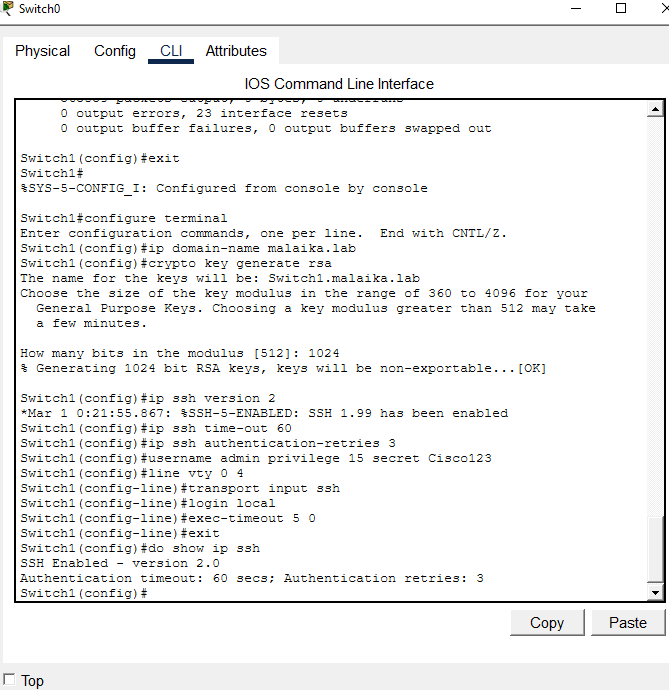<br>
  <em>Exhibit 11 — Domain malaika.lab, 1024-bit RSA key, SSH v2 with 60 s timeout and 3 retries, local login on VTY 0–4; `show ip ssh` confirms version 2.0</em>
</p>

---

<a id="module-6"></a>
## 🟤 Module 6 — InterVLAN Routing & DHCP

**Objective:** Route between VLANs with router subinterfaces and hand out addresses automatically to VLAN 10 and VLAN 20.

### Step 12 — Router Configuration ✅

```
Router(config)# interface g0/0
Router(config-if)# no shutdown
Router(config-if)# exit

Router(config)# interface g0/0.10
Router(config-subif)# encapsulation dot1Q 10
Router(config-subif)# ip address 192.168.10.1 255.255.255.0
Router(config-subif)# exit

Router(config)# interface g0/0.20
Router(config-subif)# encapsulation dot1Q 20
Router(config-subif)# ip address 192.168.20.1 255.255.255.0
Router(config-subif)# exit

Router(config)# interface g0/0.99
Router(config-subif)# encapsulation dot1Q 99
Router(config-subif)# ip address 192.168.99.1 255.255.255.0
Router(config-subif)# exit
Router(config)# do show ip interface brief
```

<p align="center">
  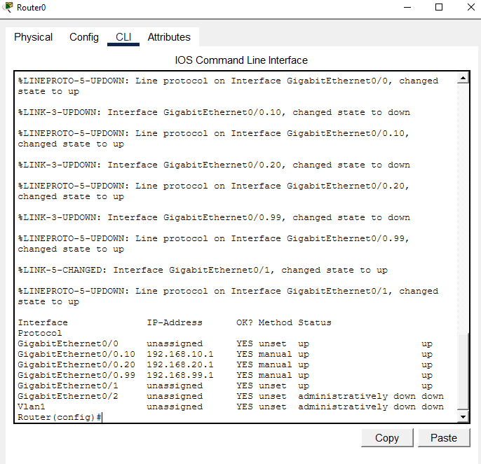<br>
  <em>Exhibit 12 — G0/0 with three dot1Q subinterfaces, one per VLAN, each holding that VLAN's gateway address, all up/up in `show ip interface brief`</em>
</p>

### Step 13 — DHCP Pools ✅

```
Router(config)# ip dhcp excluded-address 192.168.10.1 192.168.10.9
Router(config)# ip dhcp excluded-address 192.168.20.1 192.168.20.9
Router(config)# ip dhcp excluded-address 192.168.99.1 192.168.99.9

Router(config)# ip dhcp pool VLAN10-SALES
Router(dhcp-config)# network 192.168.10.0 255.255.255.0
Router(dhcp-config)# default-router 192.168.10.1
Router(dhcp-config)# dns-server 8.8.8.8
Router(dhcp-config)# exit

Router(config)# ip dhcp pool VLAN20-IT
Router(dhcp-config)# network 192.168.20.0 255.255.255.0
Router(dhcp-config)# default-router 192.168.20.1
Router(dhcp-config)# dns-server 8.8.8.8
Router(dhcp-config)# exit
Router(config)# do show ip dhcp pool
```

<p align="center">
  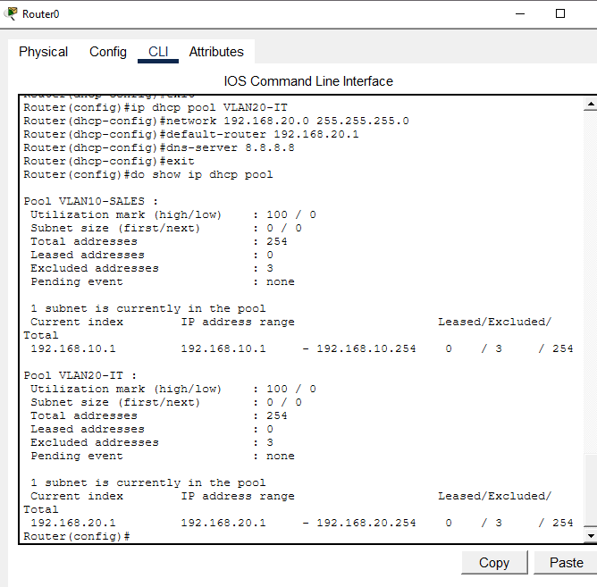<br>
  <em>Exhibit 13 — DHCP pools VLAN10-SALES and VLAN20-IT (254 addresses each, none leased yet); the first 9 addresses of each subnet are excluded, plus .1–.9 of VLAN 99, which has no pool</em>
</p>

### Step 14 — PC DHCP ✅

```
PC0 > Desktop > IP Configuration > select DHCP
```

<p align="center">
  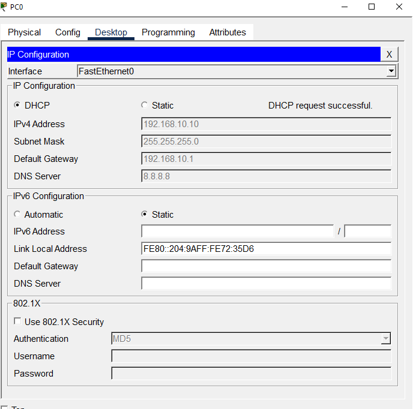<br>
  <em>Exhibit 14 — PC0 set to DHCP: "DHCP request successful", 192.168.10.10/24 from the VLAN 10 pool with gateway 192.168.10.1 and DNS 8.8.8.8</em>
</p>

### Step 15 — DHCP Binding ✅

```
Router# show ip dhcp binding
Router# show ip dhcp pool
Router# show running-config | section dhcp
```

<p align="center">
  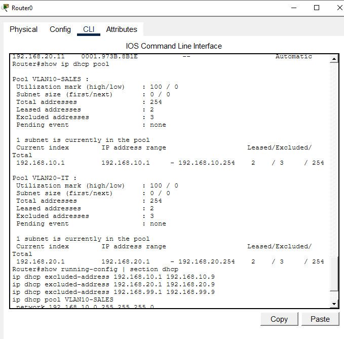<br>
  <em>Exhibit 15 — 2 leased addresses in each pool; only the tail of the binding table is on screen (e.g. 192.168.20.11, automatic), and the running-config shows the exclusions and both pools</em>
</p>

---

<a id="module-7"></a>
## ⚫ Module 7 — ACL Configuration & Testing

**Objective:** Confirm free inter-VLAN routing first, then block one direction of traffic with an ACL and prove the block only affects that direction.

### Step 16 — Pre-ACL Ping Test ✅

```
PC0> ping 192.168.10.11
PC0> ping 192.168.20.11
PC0> ping 192.168.20.10
```

<p align="center">
  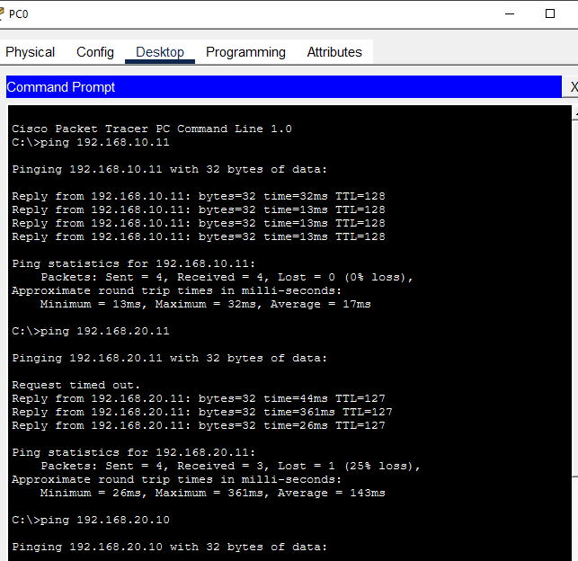<br>
  <em>Exhibit 16 — Before any ACL: the same-VLAN ping (192.168.10.11) and the cross-VLAN ping (192.168.20.11) both succeed, with the first cross-VLAN packet timing out (usually the initial ARP delay). The third ping (192.168.20.10) is cut off here; its post-ACL result is in Exhibit 18</em>
</p>

### Step 17 — ACL Configuration ✅

```
Router(config)# ip access-list extended BLOCK-SALES-TO-IT
Router(config-ext-nacl)# deny icmp 192.168.10.0 0.0.0.255 192.168.20.0 0.0.0.255
Router(config-ext-nacl)# permit ip any any
Router(config-ext-nacl)# exit

Router(config)# interface g0/0.10
Router(config-subif)# ip access-group BLOCK-SALES-TO-IT in
Router(config-subif)# exit
Router(config)# do show access-lists
```

<p align="center">
  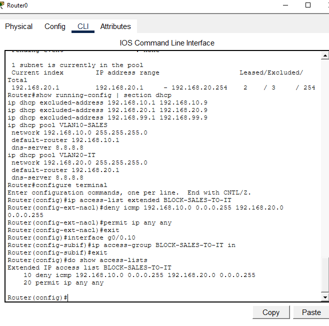<br>
  <em>Exhibit 17 — Named extended ACL BLOCK-SALES-TO-IT denies ICMP from VLAN 10 (Sales) to VLAN 20 (IT) and permits everything else, applied inbound on Gi0/0.10 where Sales traffic enters the router</em>
</p>

### Step 18 — ACL Test ✅

```
PC0> ping 192.168.20.10
   (Destination host unreachable from 192.168.10.1, 100% loss — VLAN 10 to VLAN 20 is blocked)

PC1> ping 192.168.10.11
   (3 of 4 replies, first packet timed out — VLAN 20 to VLAN 10 is still permitted)
```

<p align="center">
  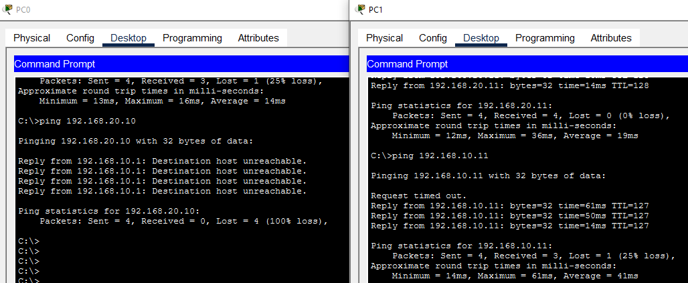<br>
  <em>Exhibit 18 — VLAN 10 → VLAN 20 now blocked (PC0: 100% loss, reported unreachable by the router), while VLAN 20 → VLAN 10 still passes (PC1)</em>
</p>

> [!NOTE]
> The deny rule matches ICMP only, so other VLAN 10 → VLAN 20 traffic (for example TCP) is still allowed by `permit ip any any`.

---

<a id="module-8"></a>
## 🟡 Module 8 — Final Verification & Save

**Objective:** Confirm SSH access works, check every layer with `show` commands, and save the configuration.

### Step 19 — SSH Test ✅

```
PC2> ssh -l admin 192.168.99.2
PC2> ssh -l admin 192.168.99.3
```

<p align="center">
  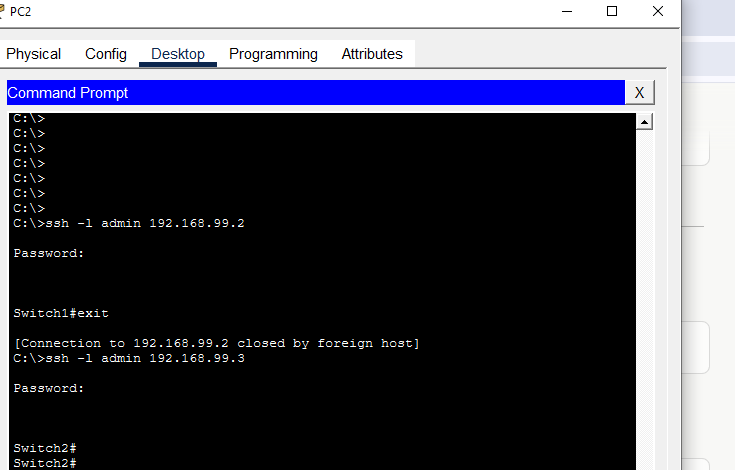<br>
  <em>Exhibit 19 — PC2 (VLAN 10) opens SSH sessions to Switch1 (192.168.99.2) and Switch2 (192.168.99.3) across the router</em>
</p>

> 📝 The SSH test was run from PC2; the Admin PC does not appear in any screenshot.

### Step 20 — Final Verification ✅

```
Switch1# show vtp status
Switch1# show spanning-tree summary
Router# show ip route
Router# show access-lists
```

<p align="center">
  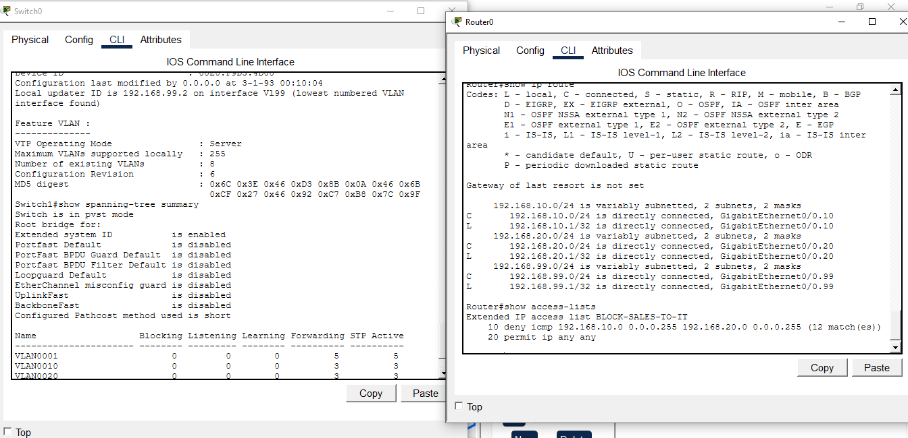<br>
  <em>Exhibit 20 — Switch1 as VTP server (revision 6, 8 VLANs, updater 192.168.99.2), spanning tree running on VLANs 1/10/20, connected routes for all three subnets on the router, and the ACL deny rule showing 12 matches</em>
</p>

### Step 21 — Save Configuration ✅

```
Switch1# copy running-config startup-config
Switch2# copy running-config startup-config
Router# copy running-config startup-config
```

<p align="center">
  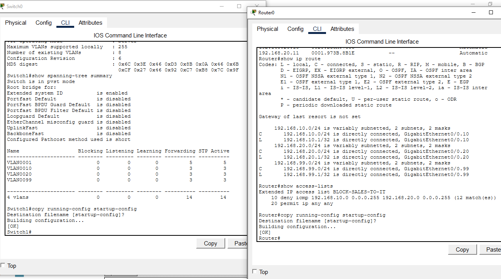<br>
  <em>Exhibit 21 — Running config saved to startup config on Switch1 and the router (Switch1 also shows spanning tree forwarding on VLANs 1/10/20/99)</em>
</p>

> 📝 The Switch2 save is not on screen.

### 🗺️ Traffic Flow After Hardening

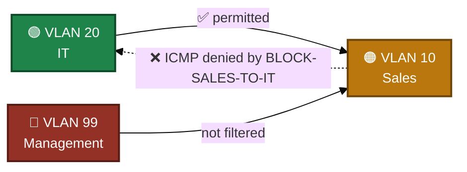
```mermaid
%%{init: {'theme': 'base', 'themeVariables': {'fontSize': '14px'}, 'flowchart': {'nodeSpacing': 24, 'rankSpacing': 34, 'padding': 8}}}%%
flowchart LR
    V20["🟢 VLAN 20<br/>IT"] -->|"✅ permitted"| V10["🟠 VLAN 10<br/>Sales"]
    V10 -.->|"❌ ICMP denied by BLOCK-SALES-TO-IT"| V20
    V99["🔴 VLAN 99<br/>Management"] -->|"not filtered"| V10
    classDef default stroke:#2C3E50,stroke-width:2px,color:#FFFFFF
    class V10 default
    style V10 fill:#B9770E,stroke:#6E4409
    style V20 fill:#1E8449,stroke:#0E4A28
    style V99 fill:#943126,stroke:#571C16
```
<p align="center"><em>The ACL is one-directional by design: IT can still reach Sales, but ICMP from Sales into IT is dropped.</em></p>

---

<a id="coverage-snapshot"></a>
## 🌟 Coverage Snapshot

| 🛡️ Layer | ✅ Status | 📌 Detail |
|---|---|---|
| Topology | Live | 2 switches, 1 router, 5 end devices wired (Exhibit 1) |
| VTP | Live | Switch1 server, Switch2 client in domain malaika.lab; VLANs created once and present on Switch2 after the trunk came up (Exhibits 2–4, 7, 20) |
| VLANs & trunks | Configured | Access ports and trunks set on both switches (Exhibits 6–7) |
| Port hardening | Configured | Switch1 unused ports shut and parked in VLAN 99, port security on Fa0/1–3 (Exhibits 8–9); PortFast + BPDU Guard seen on Switch2 Fa0/2 (Exhibit 7) |
| Management & SSH | Live | VLAN 99 SVIs reachable, SSH v2 tested from PC2 (Exhibits 10–11, 19) |
| InterVLAN routing & DHCP | Live | Subinterfaces up, DHCP leases confirmed per pool (Exhibits 12–15) |
| ACL | Proven | Pre/post test shows ICMP blocked from VLAN 10 to VLAN 20 with VLAN 20 → VLAN 10 still open; 12 matches on the deny rule (Exhibits 16–18, 20) |
| Config persistence | Proven | Saved on Switch1 and the router (Exhibit 21) |

---

<a id="command-summary"></a>
## 📟 Command Summary

| Command | Purpose |
|---------|---------|
| `vtp mode server/client` | Set VTP role |
| `vtp domain` | Set VTP domain |
| `vtp password` | Set VTP domain password |
| `vlan 10` | Create VLAN |
| `switchport mode access/trunk` | Set port mode |
| `switchport access vlan 10` | Assign port to VLAN |
| `spanning-tree portfast` | Enable PortFast |
| `spanning-tree bpduguard enable` | Enable BPDU Guard |
| `switchport port-security` | Enable port security |
| `interface vlan 99` | Create management SVI |
| `ip default-gateway` | Set switch gateway |
| `crypto key generate rsa` | Generate SSH keys |
| `ip ssh version 2` | Enable SSH v2 |
| `encapsulation dot1Q` | Tag subinterface |
| `ip dhcp pool` | Create DHCP pool |
| `ip dhcp excluded-address` | Reserve IPs |
| `ip access-list extended` | Create a named ACL |
| `deny icmp` | Block ICMP between subnets |
| `ip access-group <name> in` | Apply ACL inbound |
| `copy running-config startup-config` | Save config |

---

<a id="challenges-fixes"></a>
## ⚠️ Challenges & Fixes

| ❌ Challenge | ✅ Solution |
|---|---|
| VLANs not showing on Switch2 right after creation (Exhibit 5) | VTP only syncs over a trunk — once Fa0/24 was trunked in Module 3 the VLANs appeared (Exhibit 7); domain name and password already matched on both switches |
| PCs not getting a DHCP IP | Checked the excluded address range against the DHCP pool's network statement |
| SSH not connecting | Confirmed RSA key size 1024+ and SSH v2 enabled |
| ACL blocking the wrong traffic | Reviewed wildcard masks and the `ip access-group` direction (in/out) |
| Trunk port not passing VLANs | Verified both ends of the link were set to `switchport mode trunk` |

---

<a id="scope-limitations"></a>
## 🚧 Scope & Limitations

- **Simulation only:** Built and verified in Cisco Packet Tracer, not on physical hardware.
- **Not everything is screenshotted:** Switch2's unused-port shutdown, port security and save, PortFast/BPDU Guard on Switch1, and the Switch2 SSH commands are not captured — they are noted (📝), not shown.
- **One-directional, ICMP-only ACL:** BLOCK-SALES-TO-IT only denies ICMP from VLAN 10 → VLAN 20. Other protocols from VLAN 10, all VLAN 20 → VLAN 10 traffic, and everything to/from Management (VLAN 99) remain open. SSH to the management VLAN works from a VLAN 10 PC (Exhibit 19), so VLAN 99 is not isolated.
- **Weak-by-lab-standard SSH key:** RSA key size used is 1024 bits, adequate for the lab but below what would be used in production.
- **VTP version 1:** The lab runs the default VTP version 1; version 2 was not enabled.
- **No redundancy:** A single trunk link connects the two switches and a single uplink connects Switch1 to the router (Switch2 reaches it through Switch1) — no EtherChannel or STP redundancy path was built.

These limits are stated so the lab is read as a demonstration of the concepts, not a production security design.

---

<a id="what-i-learned"></a>
## 🧠 What I Learned

- **VTP saves repetition, but only over a working trunk.** Creating VLANs once on the server and having them appear on the client works well — but Exhibit 5 shows the client with no VLANs until the inter-switch trunk was up, and a domain-name mismatch would silently break the sync the same way.
- **DHCP pools and excluded addresses have to agree.** A pool's `network` statement defines the whole subnet; the excluded range just carves out what the pool won't hand out — get either wrong and clients don't lease.
- **ACL direction and wildcard mask are the two places test failures actually come from.** An inbound ACL on `g0/0.10` filters traffic entering the router from VLAN 10, which is why it blocks Sales → IT; the before/after ping test confirmed the block behaved as written.
- **Hardening is cumulative, not a single step.** Shutting unused ports, sticky MACs, BPDU Guard, SSH-only management and an ACL each close a different gap — none of them alone would have been enough.

---

<a id="skills-demonstrated"></a>
## 🛠️ Skills Demonstrated

- Configuring VTP server/client roles and verifying VLAN synchronization
- Assigning access ports and building trunks across two switches
- Hardening switch ports: unused-port shutdown, port security, PortFast, BPDU Guard
- Building a management VLAN with SVIs and enabling SSH v2 for remote access
- Configuring Router-on-a-Stick InterVLAN routing with dot1Q subinterfaces
- Deploying per-VLAN DHCP pools with excluded address ranges
- Writing and applying an extended ACL, then proving its exact scope with before/after tests
- Verifying an entire multi-layer configuration with `show` commands before saving

---

<a id="screenshot-index"></a>
## 🖼️ Screenshot Index

| # | File | Shows |
|:---:|---|---|
| 1 | `01-topology.PNG` | Full topology |
| 2 | `02-vtp-server.png` | Switch1 VTP server config |
| 3 | `03-vtp-client.png` | Switch2 VTP client config |
| 4 | `04-vlans-created.png` | VLANs created on Switch1 |
| 5 | `05-vtp-sync.png` | VLAN sync confirmed on Switch2 |
| 6 | `06-switch1-ports.png` | Switch1 access + trunk ports |
| 7 | `07-switch2-ports.png` | Switch2 access + trunk ports |
| 8 | `08-unused-ports.png` | Unused ports shut down |
| 9 | `09-port-security.png` | Port security on Switch1 Fa0/1–3 |
| 10 | `10-mgmt-vlan.png` | Management VLAN SVIs |
| 11 | `11-ssh-switches.png` | SSH v2 enabled on switches |
| 12 | `12-router-config.png` | Router subinterface configuration |
| 13 | `13-dhcp-pools.png` | DHCP pool configuration |
| 14 | `14-pc-dhcp.png` | PC0 DHCP lease |
| 15 | `15-dhcp-binding.png` | Router DHCP pools, leases and running-config |
| 16 | `16-pre-acl-ping.png` | Pre-ACL connectivity test |
| 17 | `17-acl-config.png` | BLOCK-SALES-TO-IT ACL configuration |
| 18 | `18-acl-test.png` | ACL test — blocked and permitted traffic |
| 19 | `19-ssh-test.png` | SSH session test from PC2 |
| 20 | `20-final-verify.png` | Final `show` verification |
| 21 | `21-save-config.png` | Saved running config to startup config |

---

<a id="repo-structure"></a>
## 📁 Repo Structure

```text
10-Enterprise-network-vlan-intervlan-routing/
|-- README.md
|-- enterprise-network-vlan-intervlan-routing.pkt
`-- screenshots/
    |-- 01-topology.PNG
    |-- 02-vtp-server.png
    |-- 03-vtp-client.png
    |-- 04-vlans-created.png
    |-- 05-vtp-sync.png
    |-- 06-switch1-ports.png
    |-- 07-switch2-ports.png
    |-- 08-unused-ports.png
    |-- 09-port-security.png
    |-- 10-mgmt-vlan.png
    |-- 11-ssh-switches.png
    |-- 12-router-config.png
    |-- 13-dhcp-pools.png
    |-- 14-pc-dhcp.png
    |-- 15-dhcp-binding.png
    |-- 16-pre-acl-ping.png
    |-- 17-acl-config.png
    |-- 18-acl-test.png
    |-- 19-ssh-test.png
    |-- 20-final-verify.png
    `-- 21-save-config.png
```

<div align="center">

🔀 **[VTP Explained](https://www.cisco.com/c/en/us/support/docs/lan-switching/vtp/98154-vtp-faq.html)** · 🔐 **[Configuring SSH on IOS](https://www.cisco.com/c/en/us/support/docs/security-vpn/secure-shell-ssh/4145-ssh.html)** · 🛡️ **[ACL Overview](https://www.cisco.com/c/en/us/support/docs/ip/access-lists/26448-ACLsamples.html)**

</div>
