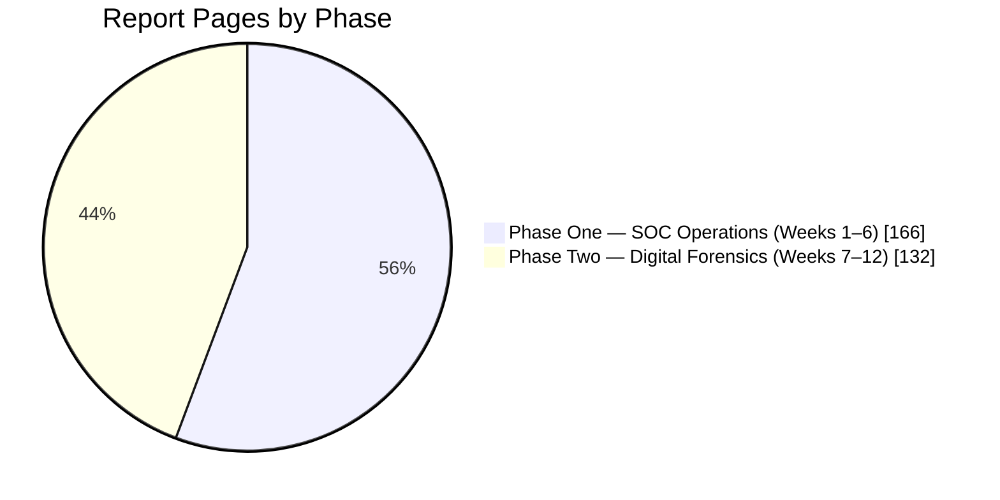

# 🧾 Executive Summary
### Blue Team Internship — Weeks 1–12
**A one-page read for recruiters and hiring managers**

### [📇 Open the index](INDEX.md) · [📖 Open the full README](README.md)

---

## 🎯 The Bottom Line

> Over 12 weeks I built and operated a working Blue Team lab, then used it to detect, analyse and investigate threats — from writing SIEM and IDS detection rules, to taking apart real malware samples, to reconstructing a data-leak case from forensic evidence. Every step is documented in a weekly report with screenshots, and every report says plainly what worked, what was verified, and what was left unfinished.

| 📄 Reports | 📚 Pages | 🗓️ Weeks | 🧭 Phases |
|:---:|:---:|:---:|:---:|
| **12** | **298** | **12** | **2** |

---

## 🧭 What Was Done, in Plain Terms

| Phase | What it means | What the reports show |
|---|---|---|
| 🔵 **One — SOC Operations** | Build the "security camera system" for a network, then teach it to recognise attacks | A SIEM collecting logs from several machines, an intrusion-detection sensor with custom rules, a managed firewall, threat-intelligence feeds, and a hands-on malware analysis |
| 🟣 **Two — Digital Forensics** | After something has happened, work out exactly what occurred, using evidence | Forensic disk images, Windows and browser traces, file shortcuts, registry and email evidence, and a filtered timeline of events |

---

## 🌟 Key Results

Figures below are taken directly from the reports.

| Area | Result |
|---|---|
| **Detection rules** | 3 custom Suricata rules written and validated; 2,737 network alerts confirmed reaching the SIEM dashboard |
| **Threat intelligence** | 20,826 threat-feed indicators loaded and wired into a live detection rule |
| **Vulnerability management** | Findings on the patched packages cut from 30 to 6 (−80%), proven by a before-and-after re-scan |
| **Malware analysis** | 2 real samples analysed statically and dynamically; 12 indicators consolidated |
| **Rule verification** | Custom detection rule matched 8 of 8 events when tested on its own, without the default ruleset |
| **Forensics** | 75 of 75 Windows shortcut (LNK) files parsed with zero errors |

---

## 🛠️ Skills That Map to a SOC Analyst Role

| Skill | Where it is shown |
|---|---|
| SIEM deployment and tuning | Weeks 1, 2, 4 |
| Writing and testing detection rules | Weeks 3, 5 |
| Network defense and firewall configuration | Weeks 3, 4 |
| Threat-intelligence enrichment and MITRE ATT&CK mapping | Week 4 |
| Vulnerability assessment and verified patching | Week 4 |
| Malware triage and indicator extraction | Week 5 |
| Forensic imaging and file-system analysis | Weeks 7, 10 |
| Windows, browser and registry artefact analysis | Weeks 8, 9, 10 |
| Timeline building and multi-source correlation | Weeks 11, 12 |
| Technical and executive reporting | Every week |

---

## ⚖️ How I Work

- **Verify, don't assume.** A fix counts only after a re-scan, a listener check, or an isolated test proves it.
- **Diagnose before fixing.** Blockers such as DNS failures, service timeouts and unreadable evidence images were traced to a root cause first.
- **Document limits honestly.** Where a task was partly finished, the report says so and explains why.

---

## 🚧 Open Items

Stated openly, as they are in the reports:

| Week | Item |
|:---:|---|
| 3 | The host-side half of a network-plus-host correlation exercise was not conclusively captured |
| 5 | The second Suricata rule's live test, the Wazuh custom rules and the incident-response plan were not completed |
| 11 | The evidence image could not be accessed, so the report gives the full methodology in place of case findings |
| 12 | USB analysis is complete; disk and memory analysis are marked pending |

---

## 📌 Where to Start

| If you have… | Read |
|:---:|---|
| **5 minutes** | Week 4 (detection stack with verification) and Week 5 (malware analysis) |
| **15 minutes** | Add Week 3 (rule writing) and Week 9 (forensic artefacts) |
| **A full review** | Follow the [index](INDEX.md) from Week 1 to Week 12 |

---

[⬆️ Back to top](#top) &nbsp;·&nbsp; [📇 Index](INDEX.md) &nbsp;·&nbsp; [📖 Full README](README.md)

