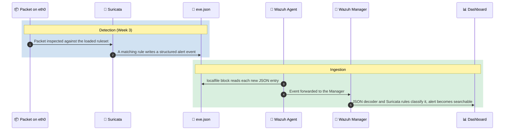
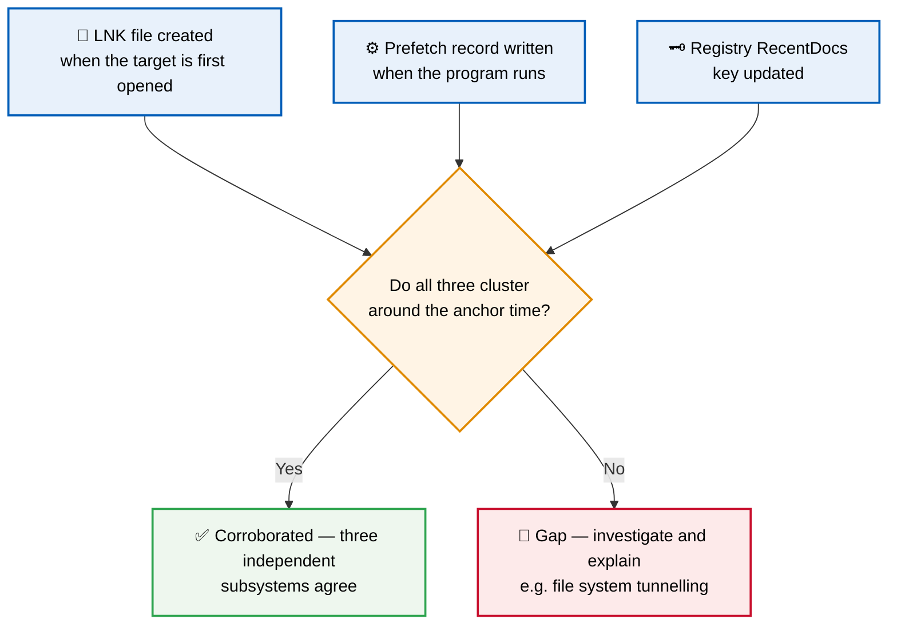
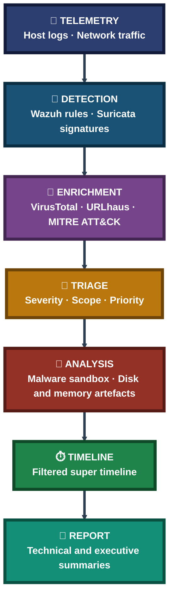

<div align="center">

# 🛡️ Blue Team Internship — Weekly Reports

**Weeks 1–12 · SOC Operations → Digital Forensics & Incident Response**

12 weekly technical reports documenting hands-on Blue Team work: SIEM, network defense, malware analysis, and forensic investigation


Twelve weeks, two phases, one lab: from standing up a SIEM in Week 1 to reconstructing a data-exfiltration case from disk, memory and USB evidence in Week 12 — every report written around what was actually run, what was actually observed, and what was honestly left unfinished.

### [📂 Jump to the reports](#reports-index)

</div>

---

## 📑 Table of Contents

1. [At a Glance](#at-a-glance)
2. [About This Folder](#about)
3. [Environment & Tools](#environment)
4. [The 12-Week Journey & Project Flow](#journey)
5. [Phase One — SOC Operations (Weeks 1–6)](#phase-one)
6. [Phase Two — Digital Forensics & IR (Weeks 7–12)](#phase-two)
7. [Coverage Snapshot](#coverage-snapshot)
8. [Detection-to-Response Pipeline](#pipeline)
9. [Verification, Not Assumption](#verification)
10. [Highlights in Numbers](#highlights)
11. [Challenges & Fixes](#challenges-fixes)
12. [Scope & Limitations](#scope-limitations)
13. [What I Learned](#what-i-learned)
14. [Skills Demonstrated](#skills-demonstrated)
15. [Reports Index](#reports-index)
16. [Repo Structure](#repo-structure)

---

<a id="at-a-glance"></a>
## 📊 At a Glance

| 📄 Reports | 📚 Total Pages | 🗓️ Weeks | 🧭 Phases |
|:---:|:---:|:---:|:---:|
| **12** | **298** | **12** | **2** |

---

<a id="about"></a>
## 📖 About This Folder

This folder holds my weekly deliverable reports from a 12-week Blue Team internship. Each report follows the same structure: an objective, the work performed, the evidence captured (screenshots and command output), an interpretation of what was observed, and a short "understanding" section explaining the concepts behind the task.

- **Phase One (Weeks 1–6) — SOC Operations:** Build a working detection lab, then extend it outward — host monitoring, network intrusion detection, a managed perimeter, threat intelligence, malware analysis, and a capstone incident-response exercise.
- **Phase Two (Weeks 7–12) — Digital Forensics & Incident Response:** Move from detecting an event to reconstructing it — disk imaging, file-system and Windows artefact analysis, browser and LNK forensics, registry and email evidence, and a final multi-source investigation.

> [!NOTE]
> Every report states plainly where a task was only partly finished and why. That is deliberate — a documented gap with a diagnosed cause is more useful than a result that only looks clean.

<div align="center">

### 🧩 Phase One — Lab Setup at a Glance

<table>
<tr>
<td align="center" valign="top" width="30%">


**🖥️ Analyst VM**<br>
<sub>Suricata sensor<br>Malware analysis lab</sub>

</td>
<td align="center" valign="middle" width="10%">

**➜**

</td>
<td align="center" valign="top" width="30%">


**Firewall Gateway**<br>
<sub>Stateful inspection<br>Routes all lab traffic</sub>

</td>
<td align="center" valign="middle" width="10%">

**➜**

</td>
<td align="center" valign="top" width="20%">

**🏠 Endpoints**<br>
<sub>Ubuntu &amp; Windows agents<br>Monitored hosts</sub>

</td>
</tr>
<tr>
<td colspan="5" align="center">

<br>
<sub>Collects logs, file-integrity events and alerts from every host — dashboards, rules and reporting live here</sub>

</td>
</tr>
</table>

### 🔎 Phase Two — Investigation Workflow at a Glance

<table>
<tr>
<td align="center" valign="top" width="22%">

**💽 Evidence**<br>
<sub>E01 disk images<br>Hash-verified first</sub>

</td>
<td align="center" valign="middle" width="6%">

**➜**

</td>
<td align="center" valign="top" width="24%">

**🗂️ Artefacts**<br>
<sub>Prefetch · LNK · Registry<br>Browser · Event logs</sub>

</td>
<td align="center" valign="middle" width="6%">

**➜**

</td>
<td align="center" valign="top" width="20%">

**⏱️ Timeline**<br>
<sub>Start big,<br>filter down</sub>

</td>
<td align="center" valign="middle" width="6%">

**➜**

</td>
<td align="center" valign="top" width="16%">

**📌 Findings**<br>
<sub>Corroborated<br>across sources</sub>

</td>
</tr>
<tr>
<td colspan="7" align="center">


<br>
<sub>Every conclusion rests on more than one independent artefact, never a single trace</sub>

</td>
</tr>
</table>

</div>

---

<a id="environment"></a>
## 🖧 Environment & Tools

| Area | Tools Used |
|---|---|
| **Virtualization & Lab** | VirtualBox, Kali Linux, Ubuntu and Windows endpoints |
| **SIEM & Endpoint Monitoring** | Wazuh (Manager, Indexer, Dashboard, agents), File Integrity Monitoring, Active Response |
| **Network Defense** | Suricata (IDS), pfSense (firewall), ipset / iptables |
| **Threat Intelligence** | VirusTotal, URLhaus feed, MITRE ATT&CK |
| **Malware Analysis** | `file`, `exiftool`, `binwalk`, `strings`, ANY.RUN sandbox |
| **Digital Forensics** | Autopsy, The Sleuth Kit, analyzeMFT, PECmd, LECmd, BrowsingHistoryView |

---

<a id="journey"></a>
## ⏱️ The 12-Week Journey

```mermaid
flowchart LR
    subgraph P1["🔵 PHASE ONE — SOC OPERATIONS"]
        direction LR
        W1["Wk 1<br/>SIEM Setup"] --> W2["Wk 2<br/>FIM & Rules"]
        W2 --> W3["Wk 3<br/>Suricata"]
        W3 --> W4["Wk 4<br/>pfSense & Intel"]
        W4 --> W5["Wk 5<br/>Malware"]
        W5 --> W6["Wk 6<br/>Capstone"]
    end
    subgraph P2["🟣 PHASE TWO — DFIR"]
        direction LR
        W7["Wk 7<br/>Disk Imaging"] --> W8["Wk 8<br/>Windows Artefacts"]
        W8 --> W9["Wk 9<br/>Browser & LNK"]
        W9 --> W10["Wk 10<br/>Registry"]
        W10 --> W11["Wk 11<br/>Email & Timeline"]
        W11 --> W12["Wk 12<br/>Final Case"]
    end
    W6 ==> W7

    classDef one fill:#e8f1fb,stroke:#005EB8,stroke-width:2px,color:#000
    classDef two fill:#f0eaf8,stroke:#6f42c1,stroke-width:2px,color:#000
    class W1,W2,W3,W4,W5,W6 one
    class W7,W8,W9,W10,W11,W12 two
```



### 📈 Project Flow

```mermaid
%%{init: { 'theme': 'base', 'themeVariables': {
  'doneTaskBkgColor':'#1A5276', 'doneTaskBorderColor':'#0B2E43',
  'critBkgColor':'#943126', 'critBorderColor':'#571C16',
  'sectionBkgColor':'#D6DBDF', 'altSectionBkgColor':'#EAECEE',
  'taskTextColor':'#FFFFFF', 'taskTextOutsideColor':'#1B2631',
  'taskTextLightColor':'#FFFFFF',
  'titleColor':'#1B2A4A', 'fontSize':'16px'
}}}%%
gantt
    title Project Flow - 12 Weeks and Two Phases
    dateFormat X
    axisFormat %s
    section Phase One - SOC Operations
    Wk 1 - SIEM Setup               :done, 0, 1
    Wk 2 - FIM and Custom Rules     :done, 1, 2
    Wk 3 - Suricata Integration     :crit, 2, 3
    Wk 4 - pfSense and Threat Intel :done, 3, 4
    Wk 5 - Malware Analysis         :crit, 4, 5
    Wk 6 - Phase One Capstone       :done, 5, 6
    section Phase Two - DFIR
    Wk 7 - Disk Imaging             :done, 6, 7
    Wk 8 - Windows Artefacts        :done, 7, 8
    Wk 9 - Browser and LNK          :done, 8, 9
    Wk 10 - Registry Analysis       :done, 9, 10
    Wk 11 - Email and Timeline      :crit, 10, 11
    Wk 12 - Final Case              :crit, 11, 12
```


<p align="center"><em>Blue bars are completed weeks. Red bars (Weeks 3, 5, 11, 12) mark weeks with a documented partial result — see <a href="#scope-limitations">Scope & Limitations</a>.</em></p>

---

<a id="phase-one"></a>
## 🔵 Phase One — SOC Operations (Weeks 1–6)

**Goal:** Build detection capability from the ground up, then wrap it in network defense, threat intelligence and a full incident-response exercise.

| Week | Focus | What the Report Covers | Report |
|:---:|---|---|:---:|
| **01** | SOC Foundations & Lab Setup | Wazuh Manager deployment, agent onboarding, and a hardware-limited install that moved to a hosted trial | [📄 PDF](REPORTS/Week01_Report.pdf) |
| **02** | FIM · Custom Rules · Log Analysis · Active Response | File integrity monitoring, custom Wazuh rules, Windows security events (4625 / 4720 / 4672), CSV export and correlated-activity timelines | [📄 PDF](REPORTS/Week02_Report.pdf) |
| **03** | Suricata IDS & Wazuh Integration | Three custom Suricata rules, `eve.json` ingestion into Wazuh, and GeoIP blocking with ipset + iptables | [📄 PDF](REPORTS/Week03_Report.pdf) |
| **04** | pfSense · Threat Intel · Vulnerability Assessment · SOC Reporting | Managed perimeter with syslog forwarding, live URLhaus feed in a CDB list, patch-and-rescan cycle, 5-panel SOC dashboard | [📄 PDF](REPORTS/Week04_Report.pdf) |
| **05** | Malware Analysis & Detection Engineering | Static and interactive dynamic analysis of two samples, IOC extraction, and a custom Suricata rule verified in isolation | [📄 PDF](REPORTS/Week05_Report.pdf) |
| **06** | Phase One Capstone | Insider-threat simulation and incident response, drawing the six weeks together | [📄 PDF](REPORTS/Week06_Report.pdf) |

### Rule Chaining Map — How a Network Alert Reaches the Dashboard



---

<a id="phase-two"></a>
## 🟣 Phase Two — Digital Forensics & Incident Response (Weeks 7–12)

**Goal:** Shift from "an alert fired" to "here is exactly what happened" — using forensic images, host artefacts and timelines as evidence.

| Week | Focus | What the Report Covers | Report |
|:---:|---|---|:---:|
| **07** | Disk Imaging & File System Analysis | E01 imaging with hash verification, NTFS alternate data streams, MACB timestamps, Sleuth Kit triage and deleted-file recovery | [📄 PDF](REPORTS/Week07_Report.pdf) |
| **08** | Windows Artefact Analysis | Windows event logs, Prefetch execution records, thumbcache and Recycle Bin analysis on a live endpoint | [📄 PDF](REPORTS/Week08_Report.pdf) |
| **09** | Browser Forensics & LNK Analysis | Chrome profile forensics, download and cookie inventories, LECmd parsing of 75 shortcut files, unified timeline | [📄 PDF](REPORTS/Week09_Report.pdf) |
| **10** | Autopsy Triage & Registry Analysis | Autopsy-based triage, artefact hunting and registry analysis on a forensic image | [📄 PDF](REPORTS/Week10_Report.pdf) |
| **11** | Email Forensics & Super Timeline | Email extraction, LNK / Prefetch / registry corroboration and the "start big, filter down" timeline method | [📄 PDF](REPORTS/Week11_Report.pdf) |
| **12** | Final Case — M57.biz Capstone | Disk, memory and USB exfiltration analysis of a data-leak case | [📄 PDF](REPORTS/Week12_Report.pdf) |

### 🔍 Analyst Note — Why Independent Artefacts Beat a Single Trace

A single artefact, even a precise one, can be altered or can be a coincidence. LNK creation, a Prefetch execution record and a registry write are recorded by three independent parts of the operating system, none of which knows about the others.



Fabricating a consistent story across three unrelated binary structures is far harder than editing a single log, which is why agreement across categories is treated as much stronger evidence than any one category alone.

---

<a id="coverage-snapshot"></a>
## 🌟 Coverage Snapshot

| 🛡️ Domain | 📌 Where It Appears | ✅ What Was Demonstrated |
|---|---|---|
| SIEM & Host Monitoring | Weeks 1, 2, 4 | Wazuh deployment, FIM, custom rules, dashboards |
| Network Detection & Defense | Weeks 3, 4 | Suricata rules, GeoIP blocking, pfSense perimeter |
| Threat Intelligence & Vulnerability Mgmt | Week 4 | Live feed in a CDB list, MITRE mapping, verified patching |
| Malware Analysis | Week 5 | Static + dynamic analysis, IOC/IOA extraction |
| Disk & File System Forensics | Weeks 7, 10 | E01 imaging, NTFS analysis, Autopsy triage |
| Windows & Browser Artefacts | Weeks 8, 9 | Prefetch, event logs, Chrome, LNK files |
| Timeline & Multi-Source Correlation | Weeks 11, 12 | Email + host artefacts + super timeline |

---

<a id="pipeline"></a>
## 🧭 Detection-to-Response Pipeline

How the twelve weeks fit together — from raw telemetry to a finished report



---

<a id="verification"></a>
## ✅ Verification, Not Assumption

A recurring rule across the reports: a step is not done until it has been proven with direct evidence.

| Check | Method | Outcome |
|---|---|---|
| Custom rule works on its own | Isolated replay with only the custom rule loaded | ✅ 8 / 8 matches (Week 5) |
| Patch actually closed the gap | Re-scan filtered to the patched packages | ✅ High-severity findings 3 → 0 (Week 4) |
| Logs really reach the SIEM | `ss` showing an active listener on UDP 514 | ✅ Confirmed (Week 4) |
| Lab is truly isolated | A failed ping after disabling the adapter at the hypervisor | ✅ Confirmed (Week 5) |
| Downloaded samples are intact | Hashes compared against published values | ✅ Match (Week 5) |

---

<a id="highlights"></a>
## 🔢 Highlights in Numbers

Figures below are taken directly from the reports.

| Week | Highlight |
|:---:|---|
| 3 | **3** custom Suricata rules validated; **2,737** Suricata alerts confirmed in the Wazuh dashboard |
| 4 | **20,826** threat-feed indicators loaded; OpenSSH findings reduced from **30 → 6 (−80%)** after a verified patch |
| 5 | **2** malware samples analysed; **12** consolidated IOC/IOA entries; custom rule matched **8 / 8** in an isolated replay |
| 9 | **75 / 75** LNK files parsed with zero errors |

---

<a id="challenges-fixes"></a>
## ⚠️ Challenges & Fixes

| ❌ Challenge | ✅ Fix |
|---|---|
| Local hardware could not run the full Wazuh stack reliably | Moved the Manager to a hosted trial rather than fighting the limit |
| DNS resolution kept failing on the Kali VM; edits to `resolv.conf` did not persist | Set DNS through NetworkManager itself, the actual source of truth |
| Suricata timed out on start while loading 50,000+ rules on low memory | Raised the systemd start timeout and freed host memory |
| A custom NULL-scan rule that looked correct did not fire | Tested against real scan traffic and reverted to the simpler `flags:0` form |
| A patched package still looked vulnerable in the dashboard | Re-scanned and filtered to the patched packages instead of trusting the install output |
| Evidence image would not open | Diagnosed whether it was a corrupted download or an access-permission problem before choosing a fix |

---

<a id="scope-limitations"></a>
## 🚧 Scope & Limitations

- **Week 3:** The Suricata half of the network + host correlation exercise succeeded; the host-side file-integrity half was not conclusively captured, and the root cause is documented.
- **Week 5:** Static and dynamic analysis and the first Suricata rule are complete and verified. The second rule's live test, the Wazuh custom rules and the incident-response plan were not finished, because the analysis machine hit hardware failure.
- **Week 11:** The evidence image could not be accessed that week, so the report documents the full methodology for each task rather than case findings.
- **Week 12:** USB scope is complete; disk and RAM analysis are marked as pending.
- **Screenshots:** Evidence lives inside each PDF. Sensitive identifiers such as API keys and internal file names have been redacted.

These gaps are marked here instead of hidden, so the reports reflect exactly what was done.

---

<a id="what-i-learned"></a>
## 🧠 What I Learned

- **A rule that parses is not a rule that works.** Detection logic has to be tested against real traffic every time.
- **Configuration is not the same as delivery.** Confirm the receiving side, not just the sending side.
- **Verify a fix by re-scanning**, not by trusting that the install command exited without error.
- **A near-empty result is still a finding** — for example, almost no readable strings pointed to a packed executable.
- **Independent artefacts that agree carry far more weight** than any single artefact alone.
- **Diagnose before you fix.** A corrupted file and a permission block look identical from the outside and need different remedies.
- **Document blockers honestly.** A gap with a diagnosed cause holds up better under review than a result that only looks clean.

---

<a id="skills-demonstrated"></a>
## 🛠️ Skills Demonstrated

- Deploying and tuning a Wazuh SIEM with FIM, custom rules, dashboards and active response
- Writing and verifying Suricata detection rules against replayed and live traffic
- Standing up a pfSense perimeter and forwarding its logs into a SIEM
- Enriching alerts with threat intelligence and mapping them to MITRE ATT&CK
- Static and dynamic malware analysis with IOC and IOA extraction
- Forensic disk imaging with hash verification and file-system analysis
- Parsing Prefetch, LNK, registry, browser and event-log artefacts
- Building filtered timelines and correlating multiple evidence sources
- Writing technical and executive summaries from the same underlying data

---

<a id="reports-index"></a>
## 📂 Reports Index

| # | Report | Phase | Pages |
|:---:|---|:---:|:---:|
| 1 | [Week 1 — SOC Foundations & Lab Setup](REPORTS/Week01_Report.pdf) | One | 27 |
| 2 | [Week 2 — FIM, Custom Rules, Log Analysis & Active Response](REPORTS/Week02_Report.pdf) | One | 37 |
| 3 | [Week 3 — Suricata IDS & Wazuh Integration](REPORTS/Week03_Report.pdf) | One | 30 |
| 4 | [Week 4 — pfSense, Threat Intel & Vulnerability Assessment](REPORTS/Week04_Report.pdf) | One | 27 |
| 5 | [Week 5 — Malware Analysis & Detection Engineering](REPORTS/Week05_Report.pdf) | One | 31 |
| 6 | [Week 6 — Phase One Capstone](REPORTS/Week06_Report.pdf) | One | 14 |
| 7 | [Week 7 — Disk Imaging & File System Analysis](REPORTS/Week07_Report.pdf) | Two | 25 |
| 8 | [Week 8 — Windows Artefact Analysis](REPORTS/Week08_Report.pdf) | Two | 23 |
| 9 | [Week 9 — Browser Forensics & LNK Analysis](REPORTS/Week09_Report.pdf) | Two | 23 |
| 10 | [Week 10 — Autopsy Triage & Registry Analysis](REPORTS/Week10_Report.pdf) | Two | 26 |
| 11 | [Week 11 — Email Forensics & Super Timeline](REPORTS/Week11_Report.pdf) | Two | 12 |
| 12 | [Week 12 — Final Case: M57.biz Capstone](REPORTS/Week12_Report.pdf) | Two | 23 |

---

<a id="repo-structure"></a>
## 📁 Repo Structure

```text
2-soc-blue-team-internship/
|-- README.md
`-- REPORTS/
    |-- Week01_Report.pdf
    |-- Week02_Report.pdf
    |-- Week03_Report.pdf
    |-- Week04_Report.pdf
    |-- Week05_Report.pdf
    |-- Week06_Report.pdf
    |-- Week07_Report.pdf
    |-- Week08_Report.pdf
    |-- Week09_Report.pdf
    |-- Week10_Report.pdf
    |-- Week11_Report.pdf
    `-- Week12_Report.pdf
```

<div align="center">

🛡️ **[Wazuh](https://wazuh.com)** · 🔎 **[Suricata](https://suricata.io)** · 🌐 **[pfSense](https://www.pfsense.org)** · 🧬 **[Autopsy](https://www.autopsy.com)** · 🧭 **[MITRE ATT&CK](https://attack.mitre.org)**

</div>
