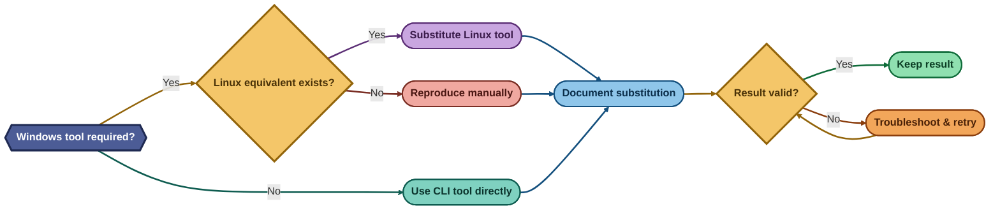
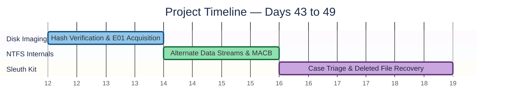

<div align="center">

# 🕵️ Project 7
### Disk Imaging, NTFS Internals & Sleuth Kit Triage
**Digital Forensics & Incident Response (DFIR)**


**A 500 MB controlled evidence source forensically imaged, hash-verified, and triaged end-to-end — E01 acquisition, NTFS Alternate Data Streams, MACB timestamp analysis, and deleted-file recovery from an orphaned MFT record — using open-source Linux tooling in place of Windows-only utilities.**

</div>

<br>

<div align="center">

## 📊 At a Glance

| 🧩 Task Blocks | 🖼️ Screenshots | 🎯 CLI Tools Used | 💰 Total Cost |
|:---:|:---:|:---:|:---:|
| **3** | **11** | **7** | **$0** |

</div>

<br>

## 🖧 Environment

| Item | Value |
|---|---|
| Host OS | Kali Linux (VirtualBox VM, 4 GB RAM) |
| Evidence Source | 500 MB loopback file, formatted NTFS (`test_drive.img`) |
| Image Format | EnCase 6 (`.E01`) |
| Case / Evidence No. | `CASE001` / `EV001` |

<br>

---

<div align="center">

## 🧭 Investigation Decision Tree

*How each Windows-only tool call in the brief was resolved on a Linux-only host*

</div>



<br>

<div align="center">

## ⏱️ Project Timeline

</div>


<p align="center"><em>Colors distinguish each project phase — all three phases are complete.</em></p>

<br>

<p align="center"></p>

<br>

---

## 🔵 Days 43–44 — Disk Imaging & Hash Verification

**Objective:** Create a forensically sound, bit-for-bit image of a source device in EnCase 6 (E01) format, verify it via MD5 hash comparison, and mount it read-only.

**Step 1 — Build the controlled evidence source** ✅
```
sudo dd if=/dev/zero of=~/test_drive.img bs=1M count=500
sudo mkfs.ntfs -Q -F ~/test_drive.img
```
`mkfs.ntfs` initially refused to run on a loopback file rather than a block device — the `-F` (force) flag was required.

**Step 2 — Hash the source before acquisition** ✅
```
sha256sum ~/test_drive.img
md5sum ~/test_drive.img
```
<p align="center"></p>

**Step 3 — Acquire the E01 image** ✅
```
sudo ewfacquire test_drive.img
```
Full chain-of-custody metadata (case number, evidence number, examiner) embedded at acquisition time.

<p align="center"></p>

**Step 4 — Independently re-verify the hash** ✅
```
sudo ewfverify test_drive.E01
```
<p align="center"></p>

**Step 5 — Mount read-only and confirm integrity** ✅
```
sudo mount -o loop,ro ~/test_drive.img /mnt/verified
```
<p align="center"></p>

🎯 **Result:** Source, acquisition, and independent re-verification MD5 all matched exactly: `fb112cc859fbaa5fe771bdc4039de728`.

| Item | MD5 |
|---|---|
| Source (pre-image) | `fb112cc859fbaa5fe771bdc4039de728` |
| Acquired image | `fb112cc859fbaa5fe771bdc4039de728` |
| ewfverify recheck | `fb112cc859fbaa5fe771bdc4039de728` |

---

## 🟢 Days 45–46 — File System Analysis & Alternate Data Streams

**Objective:** Demonstrate NTFS Alternate Data Streams end-to-end and extract the four MACB timestamps as a Windows MFT Explorer substitute.

**Step 6 — Mount with stream support** ✅
```
sudo mount -t ntfs-3g -o loop,streams_interface=windows ~/test_drive.img /mnt/testdrive
```
The default kernel-native `ntfs3` driver doesn't support `streams_interface` — switched to FUSE-based `ntfs-3g`.

**Step 7 — Create and conceal a hidden stream** ✅
```
echo "This is hidden secret data" | sudo tee /mnt/testdrive/file1.txt:hidden.txt
```
`file1.txt` stayed at 14 bytes with unchanged default content — the stream is invisible to `ls` and `cat`.

<p align="center">
  
  
</p>

**Step 8 — Recover the hidden stream by name** ✅
```
sudo cat /mnt/testdrive/file1.txt:hidden.txt
```
<p align="center"></p>

**Step 9 — Extract MACB timestamps** ✅
```
stat /mnt/testdrive/file1.txt
```
`analyzeMFT` only resolved NTFS system-file entries, not user files — `stat` was used as the working substitute.

<p align="center"></p>

🎯 **Result:** A 27-byte hidden stream held fully recoverable content while the default stream's size and content never changed — proving ADS as a real data-hiding mechanism, not a filing quirk.

| Field | Value |
|---|---|
| Default stream size | 14 bytes (unchanged) |
| Hidden stream size | 27 bytes |
| Inode | 27 |
| Birth time | Fixed at creation — most reliable timestomping indicator |

---

## 🟣 Days 47–49 — Sleuth Kit Case Setup & Initial Triage

**Objective:** Run a first-pass forensic triage on the acquired image using The Sleuth Kit CLI in place of the Autopsy GUI (4 GB RAM host, below Autopsy's minimum).

**Step 10 — Verify file system structure** ✅
```
fsstat ~/test_drive.E01
```
<p align="center"></p>

**Step 11 — Enumerate deleted files** ✅
```
fls -rd ~/test_drive.E01
```
Recovered orphaned MFT records `OrphanFile-16` through `OrphanFile-29`; original filenames unresolved because the parent directory link was removed before MFT reallocation — an expected NTFS artefact, not a tool failure.

<p align="center"></p>

**Step 12 — Recover deleted content by inode** ✅
```
icat ~/test_drive.E01 29
```
<p align="center"></p>

🎯 **Result:** `icat` recovered the exact original content — `"this will be deleted"` — from orphaned MFT record 29, confirming NTFS deletion removes the directory entry, not the underlying data.

| Category | Finding |
|---|---|
| File System | NTFS — structure intact, consistent with acquisition |
| Active Files | `file1.txt`, `file2.txt` |
| Deleted Files Recovered | 1 (`deleteme.txt`) — full content match |
| Anomaly | Orphaned filename unresolved (expected NTFS behaviour) |

<br>

---

## 📝 Project Summary

| Task Block | Tooling | Key Finding |
|---|---|---|
| Days 43–44 — Disk Imaging & Hash Verification | `ewfacquire`, `ewfverify` | Source/image/recheck MD5 identical — verified forensic copy |
| Days 45–46 — NTFS & Alternate Data Streams | `ntfs-3g`, `stat` | Hidden stream invisible to standard tools, fully recoverable |
| Days 47–49 — Sleuth Kit Triage | `fsstat`, `fls`, `icat` | Deleted file content recovered from an orphaned MFT record |

## ⚠️ Challenges & Fixes

| ❌ Challenge | ✅ Fix |
|---|---|
| `mkfs.ntfs` refused to format a loopback file | Used the `-F` (force) flag |
| Kernel-native `ntfs3` driver doesn't support Alternate Data Streams | Switched to FUSE-based `ntfs-3g` with `streams_interface=windows` |
| `analyzeMFT` only resolved NTFS system-file entries, not user files | Used `stat` directly against the mounted file as a working substitute |
| `fsstat` and `fls` both crashed with a segmentation fault on exit | Verified the crash occurred only after complete, valid output was printed — data retained, not discarded |
| No Windows host available for FTK Imager, Arsenal Image Mounter, MFT Explorer, Autopsy GUI | Substituted `ewfacquire`/`ewfverify`, a read-only loop mount, `stat`, and the Sleuth Kit CLI — documented at first use |

## 🧠 What I Learned
A hash match proves integrity, not process — write-blocking and chain-of-custody documentation still have to stand on their own. Tool substitution only holds up when it's stated plainly at the point of substitution, not silently presented as the real thing. A tool crashing on exit doesn't automatically invalidate the data it already produced. And above all: NTFS deletion removes the map, not the territory — the core fact the rest of this phase (carving, timeline reconstruction, MFT residue analysis) will build on.

## 📁 Repo Structure
```
project-07-disk-imaging-ads-sleuthkit/
├── README.md
├── WEEK_7_report.docx
└── screenshots/
    ├── 01_source_hash.png
    ├── 02_acquisition_hash_match.png
    ├── 03_image_verify.png
    ├── 04_readonly_mount.png
    ├── 05_ads_before.png
    ├── 06_ads_hidden_content.png
    ├── 07_ads_dir_r.png
    ├── 08_mft_entries.png
    ├── 09_autopsy_hash_verify.png
    ├── 10_autopsy_deleted_files.png
    └── 10b_recovered_content.png
```
