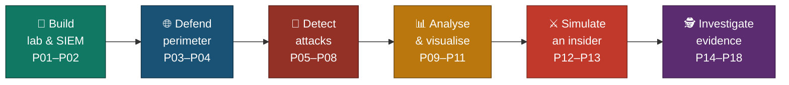

<a id="top"></a>
<div align="center">

# 🧭 Executive Summary
### Advanced Cyber Projects — Blue Team Internship Portfolio


**A one-page read of what this portfolio proves — build, detect, defend, investigate, document.**

**[📖 Full README](README.md)**

</div>

<br>

<div align="center">

<table>
<tr>
<td align="center" width="16%"><h2>18</h2>Projects</td>
<td align="center" width="16%"><h2>2</h2>Tracks</td>
<td align="center" width="16%"><h2>130</h2>Screenshots</td>
<td align="center" width="16%"><h2>7</h2>Projects with Custom Detections</td>
<td align="center" width="16%"><h2>19</h2>Tools</td>
<td align="center" width="16%"><h2>2</h2>Frameworks</td>
</tr>
</table>

</div>

---

### 💡 What This Portfolio Proves

| 🧪 Build | 🚨 Detect | 🕵️ Investigate | 🧾 Report |
|---|---|---|---|
| A working SOC lab, cloud SIEM, and pfSense perimeter — built under real hardware limits | Custom Wazuh and Suricata rules, tested against real attack traffic and mapped to MITRE ATT&CK | Malware samples, packet captures, Windows event logs, disk images, and browser and shortcut artefacts | Every project shows its evidence, and states what didn't go to plan |

---

### 🧩 The Journey — Six Stages, One Method



---

## 🔵 Track 01 · SOC Operations & Detection (P01–P13)

### 📂 🧪 Lab & SIEM
`VMware` `Ubuntu` `Wazuh Cloud` `FIM` `OpenSearch Dashboards`
> Built the lab and a cloud-hosted SIEM, added file integrity monitoring with custom rules, tuned alerts across live and simulated log sources, and designed a five-panel SOC dashboard against pre-written questions.
> **Projects** 01 · 02 · 08 · 09

### 📂 🚨 Detection & Defense
`pfSense` `Suricata` `Nmap` `wazuh-logtest` `T1110.001` `T1136.001`
> Replaced a flat lab network with a pfSense gateway and verified remote logging end to end, then wrote and tested detections for port scans, SSH brute-force, and insider activity.
> **Projects** 03 · 04 · 05 · 06 · 12

### 📂 🔎 Analysis & Intelligence
`VirusTotal` `URLhaus` `Wireshark` `ANY.RUN` `NIST SP 800-61`
> Wired a live threat feed into the SIEM, confirmed a patch by independent rescan, read five protocols packet by packet, analysed two malware samples into detection logic, and ran a red-versus-blue capstone reported against NIST IR.
> **Projects** 07 · 10 · 11 · 13

---

## 🟣 Track 02 · Digital Forensics (P14–P18)

### 📂 💽 Windows & Disk Forensics
`EvtxECmd` `PECmd` `Sleuth Kit` `E01` `NTFS`
> Parsed a live Security event log into a logon baseline, imaged and hash-verified a disk, and profiled program execution from Prefetch, Recycle Bin, and thumbcache records.
> **Projects** 14 · 15 · 16

### 📂 🕵️ Investigation
`LECmd` `BrowsingHistoryView` `Autopsy` `FTK Imager`
> Tied Chrome artefacts and Windows shortcut files into one file-access timeline, and worked a fraud-case evidence image in Autopsy.
> **Projects** 17 · 18

---

### 🌟 Headline Results

| Area | Result |
|---|---|
| Threat intelligence | 20,826 URLhaus indicators loaded; high-severity CVEs closed from 3 to 0, confirmed by rescan |
| Detection | Custom Wazuh rules mapped to `T1136.001` and `T1110.001`; a Suricata NULL-scan signature revised and loaded live with no restart |
| Dashboard | 5 panels answering 5 pre-written questions |
| Traffic | 5 protocols captured live and compared against what would flag as suspicious |
| Windows logs | 33,127 event records parsed into a logon baseline |
| Artefacts | 362 of 363 Prefetch files parsed; 75 of 75 LNK files parsed with 0 errors |
| Disk evidence | 500 MB image acquired as E01 and hash-verified; 276 deleted files found on the Mantooth image |

---

### 🧠 Capability Map

| Capability | Shown In |
|---|---|
| SIEM deployment & agent coverage | P01 · P02 |
| Custom detection engineering | P02 · P05 · P06 · P07 · P11 · P12 · P13 |
| Network perimeter & firewall logging | P03 · P04 |
| Threat intelligence & vulnerability verification | P07 |
| Traffic analysis | P10 |
| Malware analysis | P11 |
| Insider-threat simulation & incident reporting | P12 · P13 |
| Windows log & artefact forensics | P14 · P16 · P17 |
| Disk imaging & case work | P15 · P18 |

---

### 🧾 Where Things Didn't Go to Plan — and Were Documented

| Project | What Happened | How It Was Handled |
|:---:|---|---|
| 01 | Local Wazuh install blocked by RAM | Pivoted to Wazuh Cloud and one VM, documented |
| 06 | First base-rule assumption was wrong | Caught with `wazuh-logtest`, corrected |
| 08 | No real Windows host available | Events simulated and labelled as simulated |
| 12 · 13 | Deletion-detection rule had a visibility gap | Diagnosed and closed with a compensating log source |
| 15 | Windows-only tools unavailable | Five open-source substitutions, each disclosed |

---

### 🎯 Verification Snapshot

| Check | Status |
|---|:---:|
| Every project backed by screenshots and command output, not just claims | ✅ |
| Each project has its own README and a step-by-step INDEX | ✅ |
| Detections tested against real or simulated attack traffic before being called done | ✅ |
| Substitutions and gaps disclosed where they happened | ✅ |
| Scope & limitations stated in every project README | ✅ |

> [!NOTE]
> This is a summary only — full methodology, commands, and screenshots for each project live in that project's own README.

---

### 📁 Folder Structure

```text
3-Advanced-Cyber-Projects/
├── 🔵 Projects 01–13   SOC Operations & Detection
│   ├── project-01-home-soc-lab-setup/
│   ├── project-02-fim-custom-detection-rules/
│   ├── project-03-network-perimeter-defense/
│   ├── project-04-firewall-rules-configuration/
│   ├── project-05-port-scan-detection-lab/
│   ├── project-06-ssh-bruteforce-detection-lab/
│   ├── project-07-threat-intelligence-enrichment-and-vulnerability-assessment/
│   ├── project-08-siem-log-analysis-alert-tuning/
│   ├── project-09-siem-dashboard/
│   ├── project-10-network-traffic-analysis-wireshark/
│   ├── project-11-malware-analysis-incident-response/
│   ├── project-12-insider-threat-detection-system/
│   └── project-13-soc-redvsblue-capstone/
├── 🟣 Projects 14–18   Digital Forensics
│   ├── project-14-windows-event-log-analysis/
│   ├── project-15-dfir-disk-imaging/
│   ├── project-16-windows-artifacts-prefetch/
│   ├── project-17-browser-forensics-lnk-analysis/
│   └── project-18-mantooth-investigation-registry-analysis/
├── README.md
└── EXECUTIVE-SUMMARY.md   ← you are here
```

---

<div align="center">

[⬆️ Back to top](#top) &nbsp;·&nbsp; [📖 Full README](README.md)

</div>
