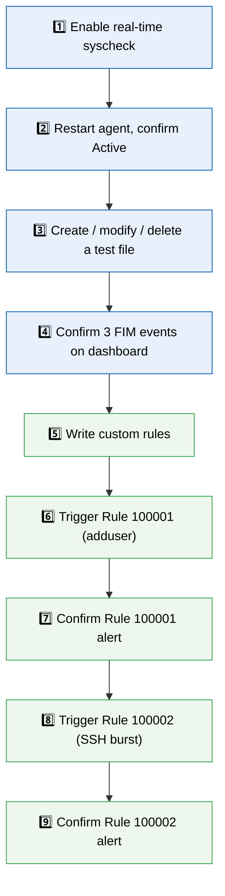

.<div align="center">

# 🛡️ Project 4
## File Integrity Monitoring & Custom Detection Rule Engineering
### SIEM Detection Engineering with Wazuh


**Real-time File Integrity Monitoring on a live Linux endpoint, tested with real create / modify / delete events, then extended with custom Wazuh detection rules mapped to MITRE ATT&CK.**

</div>

---

## 📑 Table of Contents

1. [Project Overview](#-project-overview)
2. [Environment](#-environment)
3. [Detection Pipeline](#-detection-pipeline)
4. [Module 1 — File Integrity Monitoring](#-module-1--file-integrity-monitoring-fim)
5. [Module 2 — Custom Detection Rules](#-module-2--custom-detection-rule-engineering)
6. [Results Summary](#-results-summary)
7. [Challenges & Fixes](#-challenges--fixes)
8. [What I Learned](#-what-i-learned)
9. [Repository Structure](#-repository-structure)

---

## 🎯 Project Overview

This project covers two core SIEM detection tasks on a live Ubuntu endpoint monitored by **Wazuh**:

- **File Integrity Monitoring (FIM):** Watch `/etc` and `/var/log` in real time and confirm that file changes show up on the dashboard with the correct rule IDs.
- **Custom Detection Rules:** Write rules that go beyond Wazuh's default set. Each rule is tested with real traffic, tuned with `wazuh-logtest`, and mapped to a MITRE ATT&CK technique.

### 📊 At a Glance

| 🧩 Modules | 🖼️ Screenshots | 📜 Custom Rules | 🎯 MITRE Techniques |
|:---:|:---:|:---:|:---:|
| **2** | **8** | **2 tested + 1 drafted** | **2 validated** (+1 drafted) |

---

## 🖧 Environment

| Item | Value |
|---|---|
| **SIEM Platform** | Wazuh Manager / Indexer / Dashboard |
| **Monitored Endpoint** | Ubuntu Server with Wazuh Agent |
| **Agent Config File** | `/var/ossec/etc/ossec.conf` |
| **Custom Rules File** | `/var/ossec/etc/rules/local_rules.xml` |
| **Tuning Tool** | `wazuh-logtest` |

---

## 🧭 Detection Pipeline

How a raw endpoint event becomes a tuned, MITRE-tagged alert:

```mermaid
flowchart LR
    A["🖥️ Endpoint Event<br/>(file change / auth log)"] --> B["🔎 Wazuh Agent<br/>collects the event"]
    B --> C["🧩 Decoder<br/>extracts fields"]
    C --> D["📐 Parent Rule<br/>matches"]
    D --> E["🚨 Custom Rule<br/>chains and fires"]
    E --> F["🎯 MITRE ATT&CK<br/>tag on the alert"]
    F --> G["📊 Wazuh Dashboard"]

    style A fill:#e8f1fb,stroke:#005EB8,color:#000
    style B fill:#e8f1fb,stroke:#005EB8,color:#000
    style C fill:#eef7ee,stroke:#2ea44f,color:#000
    style D fill:#eef7ee,stroke:#2ea44f,color:#000
    style E fill:#fff4e5,stroke:#e08a00,color:#000
    style F fill:#fdeaea,stroke:#C8102E,color:#000
    style G fill:#f1ecfb,stroke:#6f42c1,color:#000
```



### ⏱️ Project Flow



> 🔵 Blue = Module 1 (FIM) &nbsp;|&nbsp; 🟢 Green = Module 2 (Custom Rules) &nbsp;|&nbsp; All steps completed.

---

## 🔵 Module 1 — File Integrity Monitoring (FIM)

> **Objective:** Configure Wazuh's `syscheck` module for real-time monitoring of core system directories, generate live file events, and confirm that added, modified and deleted events are captured and shown on the dashboard.

### Step 1 — Enable real-time syscheck on the target directories ✅

```xml
<syscheck>
  <disabled>no</disabled>
  <frequency>300</frequency>
  <scan_on_start>yes</scan_on_start>
  <directories realtime="yes" report_changes="yes">/etc</directories>
  <directories realtime="yes" report_changes="no">/var/log</directories>
</syscheck>
```

- `/etc` uses `report_changes="yes"` because it holds high-value config files, so Wazuh stores the content diff of each change.
- `/var/log` uses `report_changes="no"` because it is high-volume and low-signal. Only a notification is sent, which avoids storing large diffs.

<p align="center">
  <br>
  <em>Exhibit 1 — syscheck configuration in <code>ossec.conf</code></em>
</p>

### Step 2 — Restart the agent and confirm it is Active ✅

<p align="center">
  <br>
  <em>Exhibit 2 — Wazuh agent back in <b>Active</b> status after restart</em>
</p>

### Step 3 — Generate a full file lifecycle on the monitored path ✅

```bash
touch /etc/test_file.txt              # create
echo "edit" >> /etc/test_file.txt     # modify
rm /etc/test_file.txt                 # delete
```

### Step 4 — Confirm all three events on the dashboard ✅

<p align="center">
  <br>
  <em>Exhibit 3 — Added, modified and deleted events in the File Integrity Monitoring view</em>
</p>

### 🎯 Module 1 Result

All three events appeared with the correct rule IDs and matching timestamps.

| Change | Rule ID | Rule Description |
|:---:|:---:|---|
| ➕ Added | `554` | File added to the system |
| ✏️ Modified | `550` | Integrity checksum changed |
| ❌ Deleted | `553` | File deleted |

### 🌟 Coverage Snapshot

| 🛡️ Layer | ✅ Status | 📌 Detail |
|---|:---:|---|
| File Integrity Monitoring | 🟢 Live | Real-time on `/etc`, notification-only on `/var/log` |
| Detection Rules | 🟢 2 Firing | New-user creation + SSH brute-force |
| MITRE Coverage | 🎯 2 Techniques | T1136.001 · T1110.001 |
| Untested Rule | 🟡 1 Drafted | External storage insertion. Written, but no matching endpoint to test on |

---

## 🟢 Module 2 — Custom Detection Rule Engineering

> **Objective:** Go beyond generic default SIEM rules. Write detection logic for specific threat scenarios, build it on top of existing parent rules instead of parsing raw logs from scratch, and test every rule with real traffic before trusting it.

### Step 5 — Write the custom rule set ✅

```xml
<group name="syslog,sshd,windows,">

  <!-- Rule 1: Local user account creation -->
  <rule id="100001" level="10">
    <if_sid>5501</if_sid>
    <match>new user</match>
    <description>New local user account has been created on Linux system.</description>
    <mitre><id>T1136.001</id></mitre>
  </rule>

  <!-- Rule 2: SSH brute-force detection -->
  <rule id="100002" level="12" frequency="5" timeframe="120">
    <if_matched_sid>5710</if_matched_sid>
    <same_source_ip />
    <description>SSH Brute Force attack detected from source IP.</description>
    <mitre><id>T1110.001</id></mitre>
  </rule>

  <!-- Rule 3: External storage device insertion (drafted, pending a matching endpoint) -->
  <rule id="100003" level="7">
    <if_sid>60001</if_sid>
    <field name="win.system.eventID">^2003$|^1006$</field>
    <description>External storage device insertion detected on host.</description>
    <mitre><id>T1200</id></mitre>
  </rule>

</group>
```

<p align="center">
  <br>
  <em>Exhibit 4 — Custom rules in <code>local_rules.xml</code></em>
</p>

### Step 6 — Trigger Rule 100001 with a real account-creation event ✅

```bash
sudo adduser test_user
```

<p align="center">
  <br>
  <em>Exhibit 5 — Creating a new local user on the monitored endpoint</em>
</p>

### Step 7 — Confirm Rule 100001 fires on the dashboard ✅

<p align="center">
  <br>
  <em>Exhibit 7 — Rule <code>100001</code> alert on the Wazuh dashboard</em>
</p>

### Step 8 — Trigger Rule 100002 with a real SSH brute-force burst ✅

```bash
for i in {1..10}; do ssh -o ConnectTimeout=2 -o PubkeyAuthentication=no wronguser@localhost; done
```

<p align="center">
  <br>
  <em>Exhibit 6 — Ten failed SSH attempts in a short burst</em>
</p>

### Step 9 — Confirm Rule 100002 fires on the dashboard ✅

<p align="center">
  <br>
  <em>Exhibit 8 — Rule <code>100002</code> alert on the Wazuh dashboard</em>
</p>

### 🎯 Module 2 Result

Both rules fired correctly against real triggered traffic, and each is mapped to a MITRE ATT&CK technique.

| Rule ID | Detects | MITRE Technique | Status |
|:---:|---|---|:---:|
| `100001` | Local user account creation | [T1136.001](https://attack.mitre.org/techniques/T1136/001/) — Create Account: Local Account | ✅ Tested & firing |
| `100002` | SSH brute-force | [T1110.001](https://attack.mitre.org/techniques/T1110/001/) — Brute Force: Password Guessing | ✅ Tested & firing |
| `100003` | External storage insertion | [T1200](https://attack.mitre.org/techniques/T1200/) — Hardware Additions | ⏳ Drafted, not tested |

> [!NOTE]
> **Tuning note:** `wazuh-logtest` showed that the SSH failure logs match parent rule **5710** (invalid user), not **5716** as first assumed. Rule 100002 was corrected. Using `<same_source_ip />` with `frequency="5"` and `timeframe="120"` means the rule only fires on a real burst from one source inside 2 minutes. This separates automated brute force from a normal mistyped password.

---

## 📝 Results Summary

| Module | Tooling | Key Finding |
|---|---|---|
| File Integrity Monitoring | `syscheck`, Wazuh Dashboard | Full add / modify / delete lifecycle captured with correct rule IDs |
| Custom Rule Engineering | `local_rules.xml`, `wazuh-logtest` | Two rules written, tuned on real traffic, and mapped to MITRE ATT&CK |

---

## ⚠️ Challenges & Fixes

| ❌ Challenge | ✅ Fix |
|---|---|
| The SSH brute-force rule assumed parent rule 5716 and never fired | Used `wazuh-logtest` to find the real parent rule (5710) and corrected the chain |
| Loose matching could give false positives from unrelated logins happening at the same time | Added `<same_source_ip />` next to `frequency` and `timeframe` so only a burst from one source counts |
| The USB-insertion rule had no matching endpoint to test on | Marked it clearly as untested instead of presenting it as verified |

---

## 🧠 What I Learned

- **Decoders come first.** A rule cannot read a raw log. The decoder must turn it into fields before any rule logic can run.
- **Parent rules save work.** Chaining with `if_sid` / `if_matched_sid` lets a new rule reuse fields that are already parsed.
- **`frequency` needs `timeframe`.** Without a time limit, a rule can fire on events that are days apart. The two must work together to describe a real rate.
- **Valid syntax does not mean a working rule.** The only proof is to generate real traffic and check the alert every time.

---

## 📁 Repository Structure

```text
project-04-fim-custom-detection-rules/
├── README.md
└── screenshots/
    ├── Exhibit1_FIM_syscheck_config.png
    ├── Exhibit2_agent_active_status.png
    ├── Exhibit3_FIM_all_alerts.png
    ├── Exhibit4_custom_rules_xml.png
    ├── Exhibit5_adduser_command.png
    ├── Exhibit6_ssh_bruteforce_trigger.png
    ├── Exhibit7_rule100001_alert.png
    └── Exhibit8_rule100002_alert.png
```

<div align="center">

🛡️ **Wazuh** · 🐧 **Ubuntu** · 🎯 **MITRE ATT&CK** · 🔍 **Detection Engineering**

</div>
