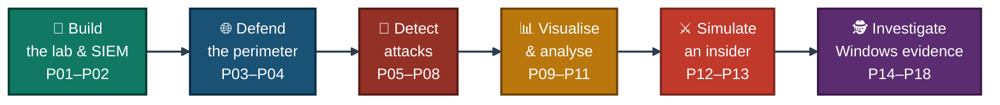
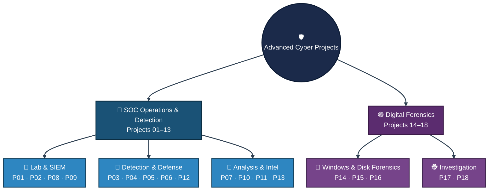

<div align="center">

# 🛡️ Advanced Cyber Projects

**Blue Team Internship Portfolio — 18 Projects**

SOC Operations · Detection Engineering · Digital Forensics & Incident Response

[](https://www.linkedin.com/in/malaika-azhar-tech)


> 📌 **Note:** This folder holds the advanced, infrastructure-focused work — SIEM detection engineering, network defense, malware analysis, and digital forensics — building on the concepts practised in [`1-Foundational-Projects`](../1-Foundational-Projects). Each project's own README states its scope and limitations.

</div>

---

## 📑 Table of Contents

1. [At a Glance](#at-a-glance)
2. [About This Folder](#about)
3. [The Learning Path](#path)
4. [Folder Structure](#structure)
5. [Track Map](#tracks)
6. [Projects Overview](#projects)
7. [Project Highlights](#highlights)
8. [Detection Engineering Across the Series](#detections)
9. [Honest Reporting Across the Series](#honest-reporting)
10. [Skills Demonstrated](#skills)
11. [Tools & Frameworks](#tools)
12. [Lab Environments](#environments)
13. [Suggested Reading Paths](#reading-paths)
14. [How to Navigate](#navigate)
15. [Connect](#connect)

---

<a id="at-a-glance"></a>
## 📊 At a Glance

| 🧩 Projects | 🗂️ Tracks | 🖼️ Screenshots | 🛠️ Tools | 📐 Frameworks |
|:---:|:---:|:---:|:---:|:---:|
| **18** | **2** | **130** | **19** | **2** |

---

<a id="about"></a>
## 📖 About This Folder

A collection of **18 hands-on projects** that follow a Blue Team internship path: building a SOC lab and SIEM, writing and tuning detections, defending the network perimeter, analysing traffic and malware, simulating an insider-threat attack, and finishing with digital forensics on Windows artefacts and disk images.

### 🎯 What These Projects Demonstrate

- **Building** — a working SOC lab and cloud SIEM under real hardware limits
- **Detecting** — custom Wazuh and Suricata rules, tested against real attack traffic and mapped to MITRE ATT&CK
- **Defending** — a pfSense perimeter with remote logging verified end-to-end
- **Investigating** — packet captures, malware samples, Windows event logs, disk images, and forensic artefacts
- **Documenting** — every project records commands, evidence, and what did not go to plan

### 📚 How Each Project Is Documented

| File | Purpose |
|---|---|
| `README.md` | Full write-up: objective, steps, commands, findings, challenges, and lessons learned |
| `INDEX.md` | Quick guide to every step and screenshot in the project |
| `screenshots/` | Numbered evidence for each step |

### 🧱 Anatomy of a Project README

Every project README follows the same layout, so any one of them can be read the same way:

| Section | What It Answers |
|---|---|
| **At a Glance** | The headline numbers for the project |
| **Project Background** | Why the project exists and what it set out to do |
| **Environment** | Platform, versions, files, and addresses used |
| **Project Flow** | The modules in order, as a timeline |
| **Modules** | Step-by-step work with evidence |
| **Challenges & Fixes** | What went wrong and how it was resolved |
| **Scope & Limitations** | What the project does and does not claim |
| **What I Learned** | The takeaways |
| **Skills Demonstrated** | The capabilities the project shows |
| **Screenshot Index** | Every exhibit and what it shows |

---

<a id="path"></a>
## 🛤️ The Learning Path

The projects are numbered in build order. Each stage builds on the one before it.


```mermaid
%%{init: {'theme': 'base', 'themeVariables': {'fontSize': '14px'}, 'flowchart': {'nodeSpacing': 26, 'rankSpacing': 40, 'padding': 8}}}%%
flowchart LR
    A["🧪 Build<br/>the lab & SIEM<br/>P01–P02"]:::s1 --> B["🌐 Defend<br/>the perimeter<br/>P03–P04"]:::s2
    B --> C["🚨 Detect<br/>attacks<br/>P05–P08"]:::s3
    C --> D["📊 Visualise<br/>& analyse<br/>P09–P11"]:::s4
    D --> E["⚔️ Simulate<br/>an insider<br/>P12–P13"]:::s5
    E --> F["🕵️ Investigate<br/>Windows evidence<br/>P14–P18"]:::s6
    classDef s1 fill:#117864,stroke:#083D33,stroke-width:2px,color:#FFFFFF
    classDef s2 fill:#1A5276,stroke:#0B2E43,stroke-width:2px,color:#FFFFFF
    classDef s3 fill:#943126,stroke:#571C16,stroke-width:2px,color:#FFFFFF
    classDef s4 fill:#B9770E,stroke:#6E4409,stroke-width:2px,color:#FFFFFF
    classDef s5 fill:#C0392B,stroke:#78281F,stroke-width:2px,color:#FFFFFF
    classDef s6 fill:#5B2C6F,stroke:#3B1A48,stroke-width:2px,color:#FFFFFF
    linkStyle default stroke:#2C3E50,stroke-width:2px
```
<p align="center"><em>From a working lab to forensic investigation: the SIEM and perimeter built early feed the detection, analysis, and forensics work that follows.</em></p>

---

<a id="structure"></a>
## 🧭 Folder Structure

```text
3-Advanced-Cyber-Projects/
│
├── project-01-home-soc-lab-setup/
├── project-02-fim-custom-detection-rules/
├── project-03-network-perimeter-defense/
├── project-04-firewall-rules-configuration/
├── project-05-port-scan-detection-lab/
├── project-06-ssh-bruteforce-detection-lab/
├── project-07-threat-intelligence-enrichment-and-vulnerability-assessment/
├── project-08-siem-log-analysis-alert-tuning/
├── project-09-siem-dashboard/
├── project-10-network-traffic-analysis-wireshark/
├── project-11-malware-analysis-incident-response/
├── project-12-insider-threat-detection-system/
├── project-13-soc-redvsblue-capstone/
├── project-14-windows-event-log-analysis/
├── project-15-dfir-disk-imaging/
├── project-16-windows-artifacts-prefetch/
├── project-17-browser-forensics-lnk-analysis/
├── project-18-mantooth-investigation-registry-analysis/
│
└── README.md   ← you are here
```

Inside each project folder:

```text
project-XX-name/
├── README.md
├── INDEX.md
└── screenshots/
```

---

<a id="tracks"></a>
## 🗺️ Track Map


```mermaid
%%{init: {'theme': 'base', 'themeVariables': {'fontSize': '15px'}, 'flowchart': {'nodeSpacing': 30, 'rankSpacing': 44, 'padding': 10}}}%%
flowchart TB
    ROOT(("🛡️<br/>Advanced Cyber Projects")):::root --> SOC["🔵 SOC Operations & Detection<br/>Projects 01–13"]:::blue
    ROOT --> DFIR["🟣 Digital Forensics<br/>Projects 14–18"]:::purple
    SOC --> S1["🧪 Lab & SIEM<br/>P01 · P02 · P08 · P09"]:::leafBlue
    SOC --> S2["🚨 Detection & Defense<br/>P03 · P04 · P05 · P06 · P12"]:::leafBlue
    SOC --> S3["🔎 Analysis & Intel<br/>P07 · P10 · P11 · P13"]:::leafBlue
    DFIR --> F1["💽 Windows & Disk Forensics<br/>P14 · P15 · P16"]:::leafPurple
    DFIR --> F2["🕵️ Investigation<br/>P17 · P18"]:::leafPurple
    classDef root fill:#1B2A4A,stroke:#0B1A33,stroke-width:2px,color:#FFFFFF
    classDef blue fill:#1A5276,stroke:#0B2E43,stroke-width:2px,color:#FFFFFF
    classDef purple fill:#5B2C6F,stroke:#3B1A48,stroke-width:2px,color:#FFFFFF
    classDef leafBlue fill:#2E86C1,stroke:#154360,stroke-width:2px,color:#FFFFFF
    classDef leafPurple fill:#76448A,stroke:#432752,stroke-width:2px,color:#FFFFFF
    linkStyle default stroke:#2C3E50,stroke-width:2px
```
<p align="center"><em>Eighteen projects across two tracks: SOC operations and detection first, then digital forensics.</em></p>

---

<a id="projects"></a>
## 📋 Projects Overview

### 🔵 Track 01 — SOC Operations & Detection

| # | Project | Focus | Key Tools |
|:---:|---|---|---|
| 01 | [Home SOC Lab Setup](./project-01-home-soc-lab-setup) | VM lab, cloud Wazuh SIEM in place of a failed local install, two live agents, real failed-login alert | VMware, Ubuntu, Wazuh Cloud |
| 02 | [Wazuh FIM & Custom Detection Rules](./project-02-fim-custom-detection-rules) | Real-time file integrity monitoring plus custom rules (account creation, SSH brute-force) | Wazuh, `wazuh-logtest`, MITRE ATT&CK |
| 03 | [Network Perimeter Defense with pfSense](./project-03-network-perimeter-defense) | Flat lab network replaced with a pfSense gateway; remote logging verified end-to-end | pfSense, Wazuh, syslog |
| 04 | [Firewall Rules Configuration on pfSense](./project-04-firewall-rules-configuration) | Remote syslog rule scoped to "Everything", delivery confirmed at the SIEM | pfSense, Wazuh, syslog |
| 05 | [Port Scan Detection Lab](./project-05-port-scan-detection-lab) | Custom Suricata signature for an Nmap NULL scan, corrected and reloaded live | Suricata, Nmap |
| 06 | [SSH BruteForce Detection Lab](./project-06-ssh-bruteforce-detection-lab) | Two custom Wazuh rules tested against real attack simulations | Wazuh, `wazuh-logtest`, MITRE ATT&CK |
| 07 | [Threat Intelligence Enrichment & Vulnerability Assessment](./project-07-threat-intelligence-enrichment-and-vulnerability-assessment) | Live threat feed via CDB list and custom rule; 3 → 0 high-severity CVEs verified by rescan | Wazuh, VirusTotal, URLhaus |
| 08 | [SIEM Log Analysis & Alert Tuning](./project-08-siem-log-analysis-alert-tuning) | Live SSH failures correlated with labelled, simulated Windows events; CSV report | Wazuh |
| 09 | [Custom SOC Dashboard Design](./project-09-siem-dashboard) | Five panels, each built against a pre-written question | Wazuh Dashboard (OpenSearch) |
| 10 | [Network Traffic Analysis (Wireshark)](./project-10-network-traffic-analysis-wireshark) | ARP, DNS, HTTP, HTTPS/TLS, ICMP — normal vs suspicious | Wireshark |
| 11 | [Malware Analysis & Incident Response](./project-11-malware-analysis-incident-response) | njRAT and Zeus/ZeroAccess samples analysed and converted into Suricata detection logic | Kali, ANY.RUN, Suricata |
| 12 | [Insider Threat Detection System](./project-12-insider-threat-detection-system) | Stage, obfuscate, exfiltrate, delete — reconstructed from log evidence | Kali, Wazuh, CyberChef |
| 13 | [SOC Red vs Blue Capstone](./project-13-soc-redvsblue-capstone) | Insider-threat attack and investigation end to end, mapped to NIST IR | Kali, Wazuh Cloud, FIM |

### 🟣 Track 02 — Digital Forensics

| # | Project | Focus | Key Tools |
|:---:|---|---|---|
| 14 | [Windows Event Log Analysis](./project-14-windows-event-log-analysis) | Live Security.evtx hashed and parsed twice; human vs background-noise logon baseline | EvtxECmd |
| 15 | [DFIR Foundations — Disk Imaging & File Systems](./project-15-dfir-disk-imaging) | E01 acquisition, NTFS ADS, MACB timestamps, deleted-file recovery | Sleuth Kit, Kali |
| 16 | [Windows Artifacts — Prefetch, Thumbcache & Recycle Bin](./project-16-windows-artifacts-prefetch) | 362 of 363 Prefetch files parsed; Recycle Bin walked by SID | PECmd |
| 17 | [Browser Forensics & LNK Analysis](./project-17-browser-forensics-lnk-analysis) | Chrome artefacts cross-referenced with 75 LNK files into one timeline | BrowsingHistoryView, LECmd |
| 18 | [Mantooth Investigation & Registry Analysis Methodology](./project-18-mantooth-investigation-registry-analysis) | Autopsy fraud-case triage on `Mantooth.E01`, plus registry analysis methodology | Autopsy, FTK Imager |

---

<a id="highlights"></a>
## 🌟 Project Highlights

Headline numbers pulled from the individual project write-ups.

| Project | Highlight |
|:---:|---|
| 01 | 1 VM, 2 live agents, 10 alert types triaged, all at $0 |
| 05 | Suricata signature iterated across 2 revisions and loaded live with no service restart |
| 07 | 20,826 URLhaus indicators loaded; high-severity CVEs closed from 3 to 0 |
| 09 | 5 dashboard panels answering 5 pre-written questions |
| 10 | 5 protocols captured live; 7 SOC ports documented |
| 11 | 2 real malware samples analysed; ET ruleset of 52,725 rules loaded in Suricata |
| 14 | 33,127 event records parsed in the second pass |
| 15 | 500 MB image acquired as E01 and hash-verified |
| 16 | 362 of 363 Prefetch files parsed; 149 `$R` / 74 `$I` Recycle Bin records |
| 17 | 75 of 75 LNK files parsed with 0 errors |
| 18 | 276 deleted files found on `Mantooth.E01` |

---

<a id="detections"></a>
## 🚨 Detection Engineering Across the Series

Detections written and tested along the way, each in its own project.

| Project | Platform | Detection |
|:---:|---|---|
| 02 | Wazuh | Custom rules for local account creation and SSH brute-force |
| 05 | Suricata | Custom signature for an Nmap NULL scan |
| 06 | Wazuh | Rule 100001 (new user, `T1136.001`) and Rule 100002 (SSH brute-force, `T1110.001`) |
| 07 | Wazuh | Custom rule backed by a CDB list of malicious URLs |
| 11 | Suricata | Custom rules written from the analysed njRAT and Zeus/ZeroAccess samples |
| 12 | Wazuh | Custom rule for the deletion stage of the insider-threat chain |
| 13 | Wazuh | Custom rule plus a compensating log source for a deletion-detection gap |

---

<a id="honest-reporting"></a>
## 🧾 Honest Reporting Across the Series

A pattern runs through these projects: when something did not work as planned, it is stated in the write-up rather than smoothed over.

| Project | What Was Disclosed |
|:---:|---|
| 01 | Local Wazuh install blocked by RAM; pivoted to Wazuh Cloud and one VM |
| 05 | First Suricata signature under-performed; revised and re-tested live |
| 06 | First assumption about the base rule ID was wrong; corrected using `wazuh-logtest` |
| 08 | Windows events were simulated, and labelled as simulated |
| 09 | 67 of 128 agents disconnected — surfaced, not filtered out |
| 12 · 13 | Deletion-detection visibility gap diagnosed and closed with a compensating log source |
| 14 | A screen-lock test returned a genuine absence, documented rather than fabricated |
| 15 | Five tool substitutions, each disclosed where it was made |
| 16 | One "no correlation found" finding reported as such |
| 18 | One case file split into two sequential labs, kept together to preserve continuity |

---

<a id="skills"></a>
## 🛠️ Skills Demonstrated

### 🔵 SOC Operations & Detection
- Building and networking a VM lab, and deploying Wazuh agents on Linux and Windows endpoints
- Writing custom Wazuh rules and testing them with `wazuh-logtest` before trusting them
- Writing and live-reloading custom Suricata signatures
- Configuring a pfSense gateway and verifying syslog delivery at the SIEM
- Enriching alerts with threat intelligence (VirusTotal, URLhaus) and verifying patches by independent rescan
- Designing a SOC dashboard panel by panel against explicit questions
- Reading packet captures and telling normal traffic from suspicious traffic
- Analysing malware statically and dynamically, and turning findings into detection logic
- Simulating and reconstructing an insider-threat attack chain, reported against NIST SP 800-61

### 🟣 Digital Forensics
- Parsing live Windows Security event logs and building a logon baseline
- Forensic disk imaging with hash verification, and NTFS analysis (ADS, MACB timestamps, deleted-file recovery)
- Profiling program execution from Prefetch, and reading Recycle Bin and thumbcache records
- Reviewing Chrome artefacts and cross-referencing them with LNK files into a timeline
- Autopsy case work on a fraud-case evidence image

---

<a id="tools"></a>
## 🧰 Tools & Frameworks

`Wazuh` · `OpenSearch Dashboards` · `pfSense` · `Suricata` · `Nmap` · `Wireshark` · `Kali Linux` · `VMware Workstation` · `VirtualBox` · `CyberChef` · `ANY.RUN` · `VirusTotal` · `URLhaus` · `EvtxECmd` · `PECmd` · `LECmd` · `Autopsy` · `FTK Imager` · `Sleuth Kit` · `MITRE ATT&CK` · `NIST SP 800-61`

---

<a id="environments"></a>
## 🖧 Lab Environments

| Area | Platform Used |
|---|---|
| Hypervisors | VMware Workstation (P01) and Oracle VirtualBox (P02) |
| SIEM | Wazuh (Manager / Indexer / Dashboard) — Wazuh Cloud in P01 and P13 |
| Firewall | pfSense Community Edition 2.7.2 (P03–P04) |
| IDS | Suricata 8.0.6 (P05, P11) |
| Attack / analysis host | Kali Linux (P11, P12, P13, P15) |
| Windows evidence | Live artefacts from a personal Windows machine (P14, P16, P17) and an E01 evidence image (P18) |

---

<a id="reading-paths"></a>
## 🧭 Suggested Reading Paths

Short routes through the folder, depending on what you want to see.

| If You Want To See | Start Here |
|---|---|
| Detection engineering | P02 → P05 → P06 |
| Network defense | P03 → P04 |
| Incident simulation end to end | P12 → P13 |
| Windows forensics | P14 → P16 → P17 |
| How a project is structured | P09 (short, two modules) |
| The full build, in order | P01 → P18 |

---

<a id="navigate"></a>
## 🧭 How to Navigate

1. Pick a project from the [Projects Overview](#projects) tables.
2. Open the project's `INDEX.md` for the step-by-step guide and screenshots, or its `README.md` for the full write-up.
3. Projects are numbered in build order — the SOC lab and SIEM (P01–P02) support the detection, defense, and analysis projects that follow, and the forensics track (P14–P18) builds on the Windows artefacts from the one before it.

---

<a id="connect"></a>
## 📫 Connect

[](https://www.linkedin.com/in/malaika-azhar-tech)
[](https://github.com/malaika-azhar)

**Location:** Pakistan
