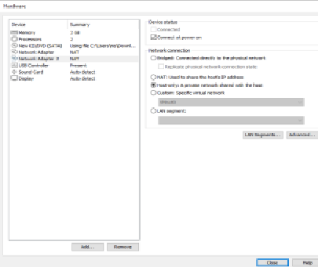
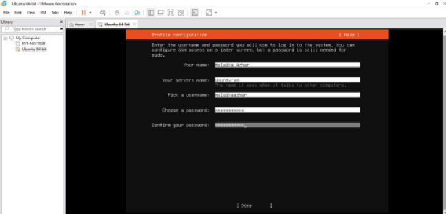
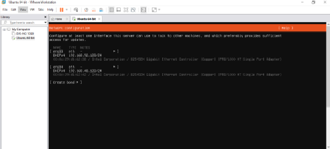
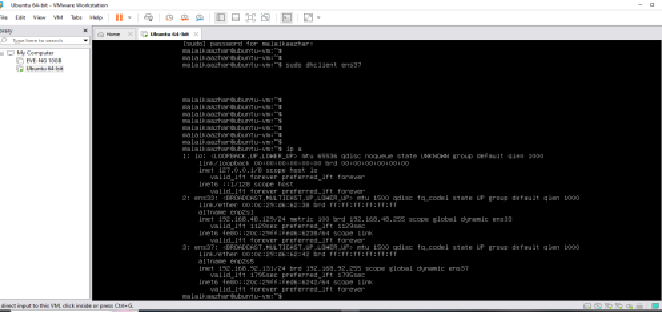
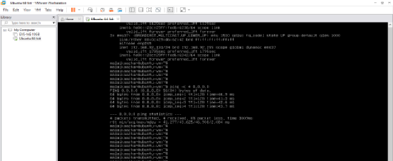
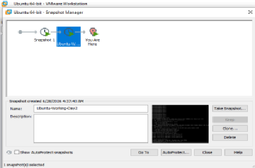
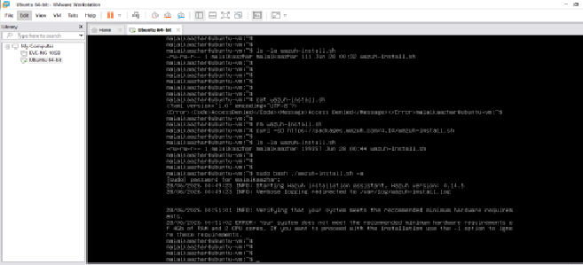
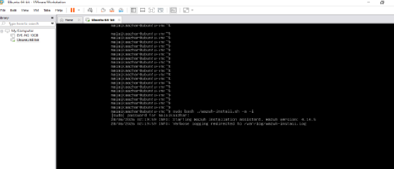
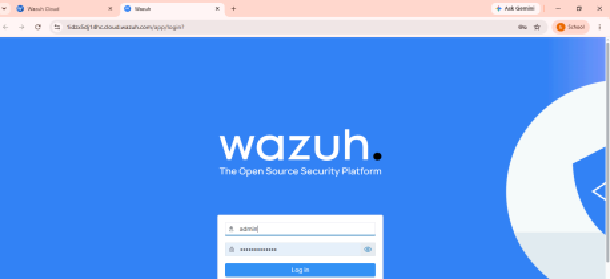

# 🛡️ Project 01 — Index
### Home SOC Lab Setup
**Project 01 of 18 — Blue Team Internship Portfolio**

**Quick guide to every step and screenshot in this project.**

### [📖 Open the full README](README.md)

---

| 🧩 Modules | 🖼️ Screenshots |
|:---:|:---:|
| **2** | **9** |

🧩 <b>Lab:</b> 1 Ubuntu Server VM · Wazuh Cloud SIEM · VMware Workstation

---

## 📑 Step Index

| # | Step | Module | Result | Evidence |
|:---:|---|:---:|---|:---:|
| 1 | Create the VM and allocate hardware | 🔵 Module 1 | Ubuntu Server 22.04.5, 2048 MB RAM, 2 CPU cores | [Exhibit 1](#ex1) |
| 2 | Profile configuration | 🔵 Module 1 | Guest profile set during VM creation | [Exhibit 2](#ex2) |
| 3 | Network configuration during install | 🔵 Module 1 | NAT + Host-only adapters configured | [Exhibit 3](#ex3) |
| 4 | IP address confirmation | 🔵 Module 1 | Both interfaces up (`192.168.48.x` / `192.168.92.x`) | [Exhibit 4](#ex4) |
| 5 | Connectivity test | 🔵 Module 1 | `ping 8.8.8.8` — 0% packet loss | [Exhibit 5](#ex5) |
| 6 | Take rollback snapshot | 🔵 Module 1 | `Ubuntu-Working-Day2` saved | [Exhibit 6](#ex6) |
| 7 | Local Wazuh install pre-flight check | 🟠 Module 2 | 2GB VM flagged below recommended minimum | [Exhibit 7](#ex7) |
| 8 | Bypass attempt with `-i` flag | 🟠 Module 2 | Installer re-run; Indexer stage still risky | [Exhibit 8](#ex8) |
| 9 | Pivot to Wazuh Cloud and log in | 🟠 Module 2 | Cloud dashboard live, no agents yet | [Exhibit 9](#ex9) |

---

## 🔵 Module 1 — VM Lab Setup

Exhibits 1 to 6.

<table>
<tr>
<td align="center" valign="top" width="50%">

 <b>Exhibit 1 — VM creation</b>
 Ubuntu Server 22.04.5, 2048 MB RAM, 2 CPU cores
</td>
<td align="center" valign="top" width="50%">

 <b>Exhibit 2 — Profile configuration</b>
 Guest profile set during VM creation
</td>
</tr>
<tr>
<td align="center" valign="top" width="50%">

 <b>Exhibit 3 — Network during install</b>
 NAT + Host-only adapters configured
</td>
<td align="center" valign="top" width="50%">

 <b>Exhibit 4 — IP confirmation</b>
 <code>ip a</code> shows both interfaces up with addresses
</td>
</tr>
<tr>
<td align="center" valign="top" width="50%">

 <b>Exhibit 5 — Connectivity test</b>
 <code>ping -c 4 8.8.8.8</code> — 0% packet loss
</td>
<td align="center" valign="top" width="50%">

 <b>Exhibit 6 — Rollback snapshot</b>
 <code>Ubuntu-Working-Day2</code> taken before Wazuh
</td>
</tr>
</table>

---

## 🟠 Module 2 — Wazuh Manager Setup

Exhibits 7 to 9.

<table>
<tr>
<td align="center" valign="top" width="50%">

 <b>Exhibit 7 — Pre-flight check fails</b>
 Installer flags the 2GB VM as below minimum
</td>
<td align="center" valign="top" width="50%">

 <b>Exhibit 8 — <code>-i</code> flag bypass</b>
 Installer re-run to skip the pre-flight check
</td>
</tr>
<tr>
<td align="center" valign="top" width="50%">

 <b>Exhibit 9 — Wazuh Cloud live</b>
 Admin login; no agents registered yet
</td>
<td></td>
</tr>
</table>

---

## 🎯 Verification Checklist

| Check | Method | Module | Status |
|:---:|---|---|:---:|
| Dual-adapter networking | `ip a` | Module 1 | ✅ Confirmed |
| Internet via NAT | `ping -c 4 8.8.8.8` | Module 1 | ✅ Confirmed |
| Local install blocked by RAM | Installer pre-flight check | Module 2 | ✅ Confirmed (documented) |
| Cloud SIEM live | Wazuh Cloud dashboard login | Module 2 | ✅ Confirmed |

> [!NOTE]
> Every substitution (one VM, Wazuh Cloud, VMware) follows the plan approved by program support. Kali Linux VM is deferred until a RAM upgrade.

---

[⬆️ Back to top](#top) &nbsp;·&nbsp; [📖 Full README](README.md)

🛡️ **[Wazuh](https://wazuh.com)** · 🖥️ **[VMware Workstation](https://www.vmware.com/products/workstation-pro.html)** · 🧭 **[MITRE ATT&CK](https://attack.mitre.org)**

