<div align="center">

# 🛡️ Home SOC Lab Setup

**Project 01 of 29 — Blue Team Internship Portfolio**

SOC Foundations · Network Traffic Basics · Wazuh SIEM Deployment


A defensive lab built from scratch on hardware that did not meet the brief's own minimum spec — one Ubuntu Server VM, a cloud-hosted Wazuh SIEM in place of a failed local install, and two live agents generating a real, verified failed-login alert. Every deviation from the original brief is recorded with the reason behind it.

</div>

---

## 📑 Table of Contents

1. [At a Glance](#at-a-glance)
2. [Project Background](#project-background)
3. [Environment](#environment)
4. [Project Flow](#project-flow)
5. [Module 1 — VM Lab Setup](#module-1)
6. [Module 2 — Wazuh Manager Setup](#module-2)
7. [Module 3 — Agent Deployment & Alert Testing](#module-3)
8. [Module 4 — Dashboard Navigation & Alert Triage](#module-4)
9. [Coverage Snapshot](#coverage-snapshot)
10. [Troubleshooting Pipeline](#troubleshooting-pipeline)
11. [Command Reference](#command-reference)
12. [Project Summary](#project-summary)
13. [Challenges & Fixes](#challenges-fixes)
14. [Scope & Limitations](#scope-limitations)
15. [What I Learned](#what-i-learned)
16. [Skills Demonstrated](#skills-demonstrated)
17. [Screenshot Index](#screenshot-index)
18. [Repo Structure](#repo-structure)

---

<a id="at-a-glance"></a>
## 📊 At a Glance

| 🖥️ VMs Built | 🔌 Agents Deployed | 🖼️ Screenshots | 📋 Alert Types Triaged | 💰 Cost |
|:---:|:---:|:---:|:---:|:---:|
| **1** | **2** | **9** | **10** | **$0** |

---

<a id="project-background"></a>
## 📖 Project Background

The brief called for a three-VM lab (Kali, a Wazuh Manager, and a Windows 10 target) each with 4GB+ RAM, and a fully local Wazuh install. My own hardware — an HP 255 G5, AMD A6-7310, 4GB total RAM, 128GB SSD — could not run that as written.

This was raised with program support before any build work started, and the following interim plan was approved:

| Plan Item | Approved Decision |
|---|---|
| Build Scope | One VM only: Ubuntu Server, allocated 2GB RAM |
| Windows Agent | Host Windows used as the Wazuh agent instead of a separate Windows 10 VM |
| Kali Linux VM | Deferred until a RAM upgrade is complete |
| Hypervisor | VMware Workstation (brief specifies VirtualBox; confirmed acceptable) |

> [!NOTE]
> Every substitution in this report follows directly from this approved plan. Where a screenshot for a step does not exist, that step is marked 📝 and described from my own notes instead.

<div align="center">

### 🧩 Lab Setup at a Glance

<table>
<tr>
<td align="center" valign="top" width="42%">


**Monitored VM**<br>
<sub>NAT + Host-only adapters<br>2048 MB RAM, 2 CPU cores</sub>

</td>
<td align="center" valign="middle" width="16%">

**➜**<br>
<sub>telemetry</sub>

</td>
<td align="center" valign="top" width="42%">


**Manager / Indexer / Dashboard**<br>
<sub>Cloud-hosted, in place of a local install</sub>

</td>
</tr>
<tr>
<td colspan="3" align="center">

**Second agent — Windows Host** (used directly, in place of a Windows 10 VM)<br>
<sub>Deployed via the dashboard's PowerShell install command</sub>

</td>
</tr>
</table>

</div>

---

<a id="environment"></a>
## 🖧 Environment

| Item | Value |
|---|---|
| **Hypervisor** | VMware Workstation |
| **Guest OS** | Ubuntu Server 22.04.5 LTS |
| **VM Resources** | 2048 MB RAM, 2 CPU cores |
| **NAT Adapter Range** | `192.168.48.x` |
| **Host-Only Adapter Range** | `192.168.92.x` |
| **Ubuntu Agent Name / IP** | `Ubuntu-server` / `192.168.92.132` |
| **Second Agent** | `Windows-Host` (host machine, PowerShell install) |
| **SIEM** | Wazuh Cloud v4.14.5 (Manager + Indexer + Dashboard) |
| **Built-in Ruleset** | 4,513 rules, grouped by syslog / firewall / windows / wazuh etc. |

> [!IMPORTANT]
> VMware's default Host-only range (`192.168.92.x`) differs from VirtualBox's typical `192.168.56.x` used in the brief. This is expected, not an error, since the brief assumes VirtualBox and this build used VMware per the approved plan.

### 🗺️ Lab Topology

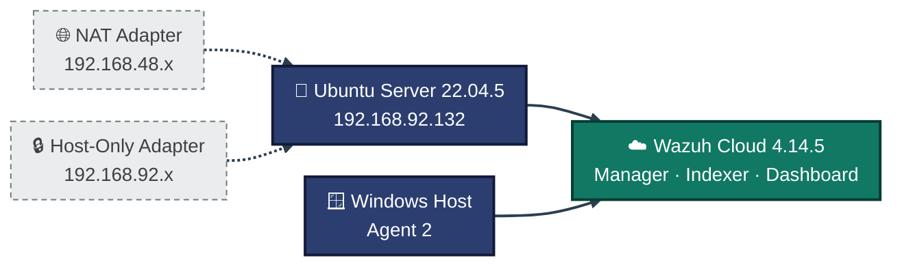
<p align="center"><em>Two agents report into one cloud-hosted Wazuh stack. The Kali VM in the original three-VM design was deferred (see Scope & Limitations).</em></p>

---

<a id="project-flow"></a>
## ⏱️ Project Flow

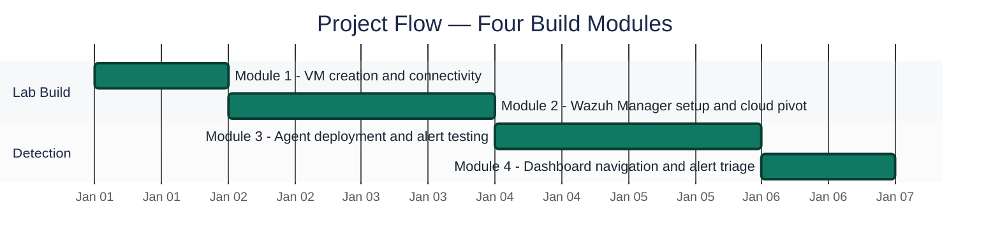
<p align="center"><em>Dates are relative sequence markers, not calendar dates from the original report. All four modules complete.</em></p>

---

<a id="module-1"></a>
## 🔵 Module 1 — VM Lab Setup

**Objective:** Build the one approved VM, confirm dual-adapter networking, and take a rollback snapshot before touching Wazuh.

### Step 1 — Create the VM and allocate hardware ✅

Created a new VM in VMware Workstation using the Ubuntu Server 22.04.5 LTS ISO. Allocated 2048 MB RAM and 2 CPU cores, with two network adapters: one NAT (internet access), one Host-only (internal lab network).

<p align="center">
  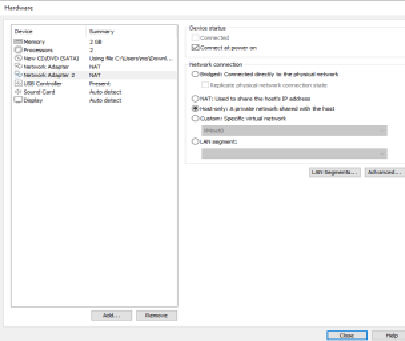<br>
  <em>Exhibit 1 — VMware Workstation VM creation: Ubuntu Server 22.04.5 LTS, 2048 MB RAM, 2 CPU cores</em>
</p>

### Step 2 — Profile configuration ✅

<p align="center">
  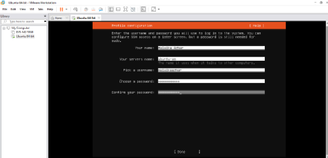<br>
  <em>Exhibit 2 — Guest profile configuration during VM creation</em>
</p>

### Step 3 — Network configuration during install ✅

<p align="center">
  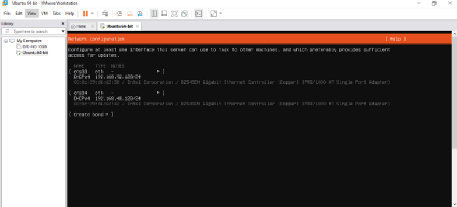<br>
  <em>Exhibit 3 — NAT + Host-only adapters configured during the Ubuntu Server install</em>
</p>

### Step 4 — IP address confirmation (post-install) ✅

After a VM rebuild, only one interface initially appeared in `ip a`. The second adapter had to be re-added in VMware settings, then manually brought up inside Ubuntu:

```
sudo ip link set ens37 up
sudo dhclient ens37
```

Both interfaces then showed correctly: one on the NAT range (`192.168.48.x`), one on the Host-only range (`192.168.92.x`).

<p align="center">
  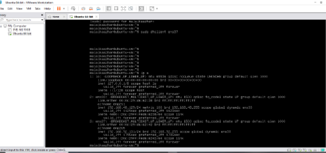<br>
  <em>Exhibit 4 — <code>ip a</code> output confirming both NAT and Host-only interfaces are up with addresses</em>
</p>

### Step 5 — Connectivity test ✅

```
ping -c 4 8.8.8.8
```

Result: 4 packets transmitted, 4 received, 0% packet loss — confirming internet access through the NAT adapter.

<p align="center">
  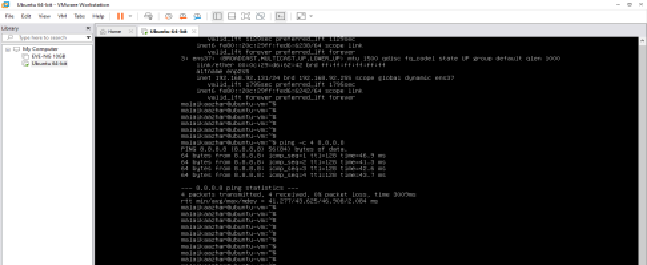<br>
  <em>Exhibit 5 — <code>ping -c 4 8.8.8.8</code>: 0% packet loss</em>
</p>

### Step 6 — Snapshot ✅

Took a snapshot named `Ubuntu-Working-Day2` once connectivity was confirmed, as a rollback point before installing Wazuh.

<p align="center">
  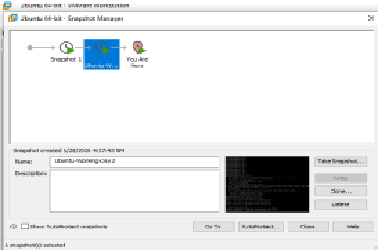<br>
  <em>Exhibit 6 — VMware snapshot <code>Ubuntu-Working-Day2</code> taken as a pre-install rollback point</em>
</p>

---

<a id="module-2"></a>
## 🟠 Module 2 — Wazuh Manager Setup

**Objective:** Install the Wazuh Manager on the local VM; when hardware limits block that, document the limit and pivot to a working alternative rather than force a result that didn't happen.

### Step 7 — Local install pre-flight check ✅

Installing the Wazuh Manager directly on the local Ubuntu VM hit a hardware wall: the 2GB VM sits below Wazuh's recommended minimum, and the installer's own pre-flight check flagged this before installation proceeded.

<p align="center">
  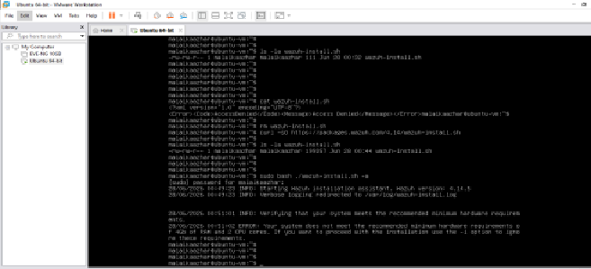<br>
  <em>Exhibit 7 — Wazuh installer pre-flight check flags the 2GB VM as below the recommended minimum</em>
</p>

### Step 8 — Bypass attempt with the `-i` flag ✅

Re-ran the installer with the documented `-i` flag to bypass the check and proceed anyway. Even past that check, the install still risked failing at the memory-intensive Indexer stage.

<p align="center">
  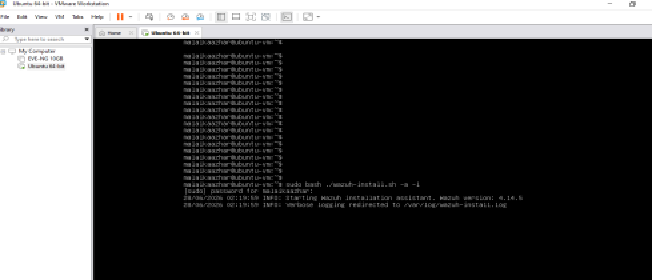<br>
  <em>Exhibit 8 — Installer re-run with <code>-i</code> to bypass the pre-flight check</em>
</p>

### Step 9 — Pivot to Wazuh Cloud and log in ✅

Rather than keep fighting the local hardware limit, I used Wazuh Cloud's free trial instead — hosting the Manager, Indexer, and Dashboard on Wazuh's own infrastructure while keeping the Ubuntu VM as the monitored endpoint. This is a deliberate, documented substitution, not a separate unrelated tool.

> [!NOTE]
> The brief's static-IP requirement assumes a self-hosted Manager. Since the Manager is cloud-hosted here, agents point at Wazuh Cloud's domain instead of a local static IP, so this specific requirement doesn't apply the same way.

<p align="center">
  <br>
  <em>Exhibit 9 — Logged into the Wazuh Cloud dashboard with the admin account; no agents registered yet, confirming the instance was live before any endpoint connected</em>
</p>

---

<a id="module-3"></a>
## 🟢 Module 3 — Agent Deployment & Alert Testing 📝

**Objective:** Deploy agents on both the Ubuntu VM and a second endpoint, and generate one real, verifiable alert end to end.

> [!NOTE]
> No screenshots were captured/retained for this module in the source report. The steps below are documented from my own notes (marked 📝) rather than left out.

### Deploying the first agent 📝

Used the dashboard's "Deploy new agent" wizard, selected the DEB amd64 package to match the Ubuntu VM, and brought the agent up with:

```
sudo systemctl daemon-reload
sudo systemctl enable wazuh-agent
sudo systemctl start wazuh-agent
```

The agent (`Ubuntu-server`, `192.168.92.132`) registered successfully and showed **Active**. Once connected, the Overview dashboard began showing real telemetry — **99 medium** and **110 low** severity alerts within 24 hours.

### Deploying the second agent — Windows Host 📝

The brief requires two connected agents. Since the Windows 10 VM was skipped per the approved hardware plan, the agent was deployed directly on the host Windows machine instead, using the dashboard's Windows deployment wizard to generate a PowerShell install command (run as Administrator). Both agents — `Ubuntu-server` and `Windows-Host` — then showed **Active** at the same time.

### Generating a real failed-login alert 📝

Getting a genuine authentication-failure event took a few attempts:

| Attempt | Result |
|---|---|
| `ssh invaliduser@localhost` | Refused outright — no SSH session reached the auth layer |
| `su invaliduser` / `su malaika` | Failed with "user does not exist" — not a real auth failure, neither was a valid account |
| `su root` with a wrong password | ✅ Worked — produced a genuine logged Authentication failure |

This showed up under Threat Hunting filtered to *Authentication failure*: **2 events recorded**, mapped under Top 10 MITRE ATT&CK to **Password Guessing** — confirming the alert pipeline correctly classified the activity, not just logged it.

Checked the general Threat Hunting overview with no filters applied: **669 total events** in the last 24 hours across both agents.

---

<a id="module-4"></a>
## 🟣 Module 4 — Dashboard Navigation & Alert Triage 📝

**Objective:** Move from setup to analyst work — pull a genuine spread of alert types and assess each on its own merits rather than by severity level alone.

> [!NOTE]
> No screenshots were captured/retained for this module in the source report. The table below is documented from my own notes (marked 📝).

Spent time in the general Threat Hunting Events view (not the File Integrity Monitoring-only tab, which only ever shows rule 550) to find a genuine spread of alert types from the Windows-Host agent. Also reviewed the Rules management page — Wazuh ships **4,513 built-in rules**, organized by group (syslog, firewall, windows, wazuh, etc.), each with its own default severity level.

### 🎯 Top 10 Alert Types Triaged

| Rule | Level | Description | My Assessment |
|:---:|:---:|---|---|
| 550 | 7 | Integrity checksum changed (most frequent) | Routine — FIM flagging file content changes, likely logs/system files updating on their own |
| 553 | 7 | File deleted | Worth a closer look, but repetition alongside 550 suggests routine log rotation, not tampering |
| 554 | 5 | File added to the system | Routine — lower severity than deletion, consistent with normal activity |
| 61104 | 3 | Service startup type changed | Low severity, but worth knowing which service before dismissing — can be used to disable security tools |
| **60602** | **9** | **Windows application error event** | **Real concern — the standout. Level 9 is meaningfully higher than everything else; this is the one I'd investigate first** |
| 60642 | 3 | Software protection service scheduled successfully | Routine — Windows' own licensing/activation service |
| 60798 | 3 | Database engine attached a database | Routine — part of a Windows service starting up |
| 60805 | 3 | Database engine starting a new instance | Routine — same startup sequence |
| 60807 | 3 | Database engine initiating recovery steps | Routine — normal recovery after a service restart |
| 60808 | 3 | Database engine replaying log file (`wins\j50.log`) | Routine — final step of the same startup/recovery sequence |

🎯 **Result:** Severity level alone didn't tell the full story — several Level 7 events were routine background noise, while the single Level 9 event stood out precisely because it was rare, not because it was the highest number on the page.

---

<a id="coverage-snapshot"></a>
## 🌟 Coverage Snapshot

| 🛡️ Area | ✅ Status | 📌 Detail |
|---|---|---|
| VM Build | Complete | One Ubuntu Server 22.04.5 VM, dual adapters, snapshot taken |
| SIEM Deployment | Substituted, complete | Local install blocked by RAM; Wazuh Cloud used instead |
| Agent Coverage | Complete (2/2 approved) | Ubuntu-server + Windows-Host, both Active |
| Alert Verification | Complete | Real failed-login alert generated and correctly classified |
| Alert Triage | Complete | Top 10 alert types reviewed and individually assessed |
| Kali Linux VM | Deferred | Blocked on a RAM upgrade, per the approved plan |

### 🧾 What the Evidence Proves

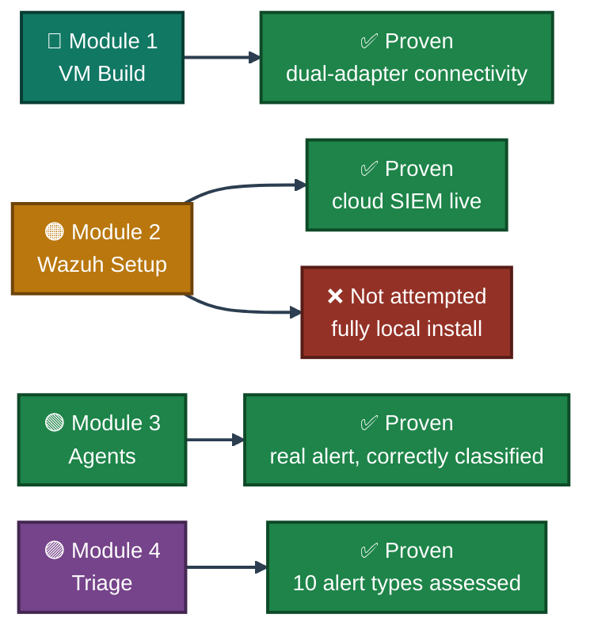

---

<a id="troubleshooting-pipeline"></a>
## 🧭 Troubleshooting Pipeline

How a hardware ceiling becomes a documented, working substitution

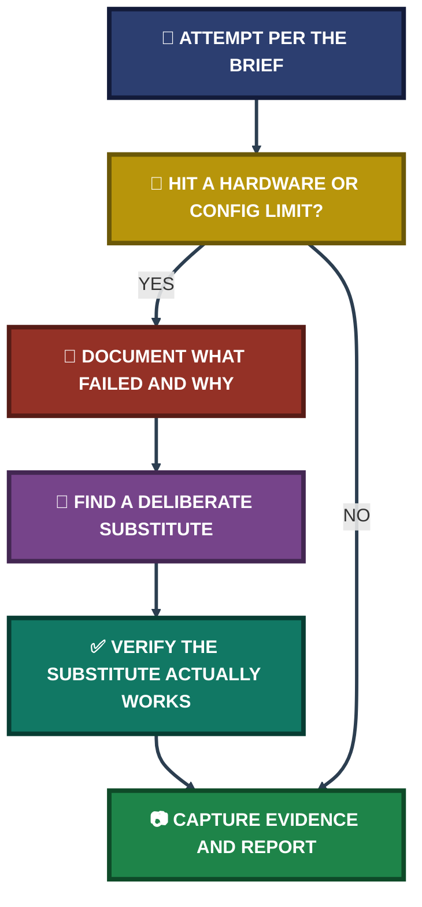

---

<a id="command-reference"></a>
## 🧰 Command Reference

| # | Command | Used In | Purpose |
|:---:|---|---|---|
| 1 | `sudo ip link set ens37 up` | Module 1 | Bring the missing second adapter up manually after a rebuild |
| 2 | `sudo dhclient ens37` | Module 1 | Request a DHCP address on the re-added adapter |
| 3 | `ping -c 4 8.8.8.8` | Module 1 | Verify outbound internet access via the NAT adapter |
| 4 | `sh wazuh-install.sh -i` | Module 2 | Bypass the installer's pre-flight hardware check |
| 5 | `sudo systemctl daemon-reload` | Module 3 | Reload systemd unit files after agent install |
| 6 | `sudo systemctl enable wazuh-agent` | Module 3 | Enable the Wazuh agent service on boot |
| 7 | `sudo systemctl start wazuh-agent` | Module 3 | Start the Wazuh agent service |
| 8 | `su root` (wrong password) | Module 3 | Deliberately trigger a genuine, loggable authentication failure |

---

<a id="project-summary"></a>
## 📝 Project Summary

| Module | Tooling | Key Outcome |
|---|---|---|
| Module 1 — VM Lab Build | VMware Workstation, Ubuntu Server 22.04.5 LTS | One working VM, dual-adapter networking confirmed, rollback snapshot taken |
| Module 2 — SIEM Deployment | Wazuh Cloud v4.14.5 | Local install blocked by hardware; cloud pivot verified live before any agent connected |
| Module 3 — Agent Coverage | Wazuh Agent (Linux + Windows) | Two agents Active simultaneously; 669 total events/24h across both |
| Module 3 — Alert Verification | `su`, Threat Hunting, MITRE ATT&CK module | Real Authentication failure generated and correctly mapped to Password Guessing |
| Module 4 — Alert Triage | Threat Hunting Events view, Rules management page | 10 distinct alert types individually assessed, not just sorted by severity |

---

<a id="challenges-fixes"></a>
## ⚠️ Challenges & Fixes

| ❌ Challenge | ✅ Fix |
|---|---|
| Hardware (4GB RAM total) below the brief's 3-VM, 4GB-each minimum | Raised with program support before starting; scope reduced to one VM plus the host as a second agent, approved in writing |
| VM rebuild dropped the second network adapter | Re-added the adapter in VMware settings, then manually brought it up with `ip link set up` and `dhclient` |
| Local Wazuh install blocked by a 2GB RAM pre-flight check, and still risky at the Indexer stage even after bypassing it | Used Wazuh Cloud's free trial instead — same Manager/Indexer/Dashboard stack, no local RAM ceiling |
| A supplied "install Wazuh" command was a fake placeholder (`echo "exit 0" > wazuh-install.sh`) | Caught before it caused confusion — running it produced no real install output |
| `ssh invaliduser@localhost` and `su` against non-existent users did not produce a real authentication-failure event | Used `su root` with a deliberately wrong password against a real local account instead |
| Ended up with two VMs by accident after a confused rebuild | Deleted both through File Explorer (VMware's own right-click delete didn't remove the underlying files) and rebuilt clean |

---

<a id="scope-limitations"></a>
## 🚧 Scope & Limitations

- **Single VM, not three:** Hardware (4GB total RAM) could not run three concurrent VMs at 4GB+ each as the brief specifies. Approved plan built one Ubuntu Server VM only.
- **Kali Linux VM deferred:** Blocked on a RAM upgrade, not yet built at the time of this report.
- **Windows agent, not a Windows 10 VM:** The host Windows machine was used directly as the second agent, per the approved plan.
- **Cloud SIEM, not a local install:** The local Wazuh install hit its own pre-flight hardware check and remained risky at the Indexer stage even past that check. Wazuh Cloud's free trial was used instead — a deliberate, documented substitution, not a separate tool chosen for convenience.
- **VMware, not VirtualBox:** The brief specifies VirtualBox; VMware Workstation was used and confirmed acceptable, which is also why the Host-only IP range (`192.168.92.x`) differs from VirtualBox's typical `192.168.56.x`.
- **No screenshots for Modules 3–4:** Steps for agent deployment, the failed-login alert, and alert triage are documented from notes (📝) rather than screenshots, which were not captured/retained in the source report for those modules.
- **Static IP requirement does not directly apply:** Because the Manager is cloud-hosted, agents point at Wazuh Cloud's domain rather than a fixed local IP.

These gaps are stated directly instead of hidden, so the results reflect what was actually built and verified.

---

<a id="what-i-learned"></a>
## 🧠 What I Learned

- **A hardware limit is a decision point, not a dead end.** Choosing a documented substitution (Wazuh Cloud, one VM, host-as-agent) over repeatedly forcing a failing local setup was the single biggest factor in this project.
- **A pre-flight check failing early is more honest than a crash later.** The installer flagging the 2GB VM before the Indexer stage was a signal to pivot, not a bug to fight through.
- **Not every "failure" is a real event.** `ssh` to an invalid user and `su` to a non-existent account don't generate the same alert as a real authentication failure against a valid account — getting a genuine Level-9-style event took trial and error.
- **Severity level and frequency don't always point the same way.** A Level 7 alert firing constantly turned out to be routine noise, while a single Level 9 event stood out precisely because it was rare.
- **The FIM tab is not the whole picture.** It only ever shows rule 550; the general Threat Hunting Events view was needed to see the full spread of alert types.

---

<a id="skills-demonstrated"></a>
## 🛠️ Skills Demonstrated

- Building and networking a VM lab under real hardware constraints (VMware Workstation, dual-adapter NAT/Host-only design)
- Diagnosing and fixing VM networking issues (`ip link`, `dhclient`) after a rebuild
- Recognizing a hardware ceiling early via a pre-flight check and choosing a documented, working substitution
- Deploying Wazuh agents on both Linux and Windows endpoints and verifying Active status
- Generating and verifying a real, MITRE-ATT&CK-mapped authentication-failure alert end to end
- Triaging alerts by reading rule descriptions and context, not just severity level
- Writing a transparent report that states every deviation from a brief and the reason for it

---

<a id="screenshot-index"></a>
## 🖼️ Screenshot Index

| # | File | Shows |
|:---:|---|---|
| 1 | `ss-01-vm-creation-hardware-config.PNG` | VMware VM creation: Ubuntu Server 22.04.5, 2048 MB RAM, 2 CPU cores |
| 2 | `ss-02-profile-configuration.PNG` | Guest profile configuration during VM creation |
| 3 | `ss-03-network-config-during-install.PNG` | NAT + Host-only adapters configured during install |
| 4 | `ss-04-ip-address-confirmation.PNG` | `ip a` confirming both interfaces up with addresses |
| 5 | `ss-05-connectivity-test-ping.PNG` | `ping -c 4 8.8.8.8` — 0% packet loss |
| 6 | `ss-06-snapshot-ubuntu-working-day2.PNG` | VMware snapshot `Ubuntu-Working-Day2` |
| 7 | `ss-07-wazuh-preflight-check-fail.PNG` | Wazuh installer pre-flight check flags the 2GB VM |
| 8 | `ss-08-wazuh-install-i-flag-bypass.PNG` | Installer re-run with `-i` to bypass the check |
| 9 | `ss-09-wazuh-cloud-dashboard-login.PNG` | Wazuh Cloud dashboard login, no agents registered yet |

---

<a id="repo-structure"></a>
## 📁 Repo Structure

```text
project-01-home-soc-lab-setup/
|-- README.md
`-- screenshots/
    |-- ss-01-vm-creation-hardware-config.PNG
    |-- ss-02-profile-configuration.PNG
    |-- ss-03-network-config-during-install.PNG
    |-- ss-04-ip-address-confirmation.PNG
    |-- ss-05-connectivity-test-ping.PNG
    |-- ss-06-snapshot-ubuntu-working-day2.PNG
    |-- ss-07-wazuh-preflight-check-fail.PNG
    |-- ss-08-wazuh-install-i-flag-bypass.PNG
    `-- ss-09-wazuh-cloud-dashboard-login.PNG
```

<div align="center">

🛡️ **[Wazuh](https://wazuh.com)** · 🖥️ **[VMware Workstation](https://www.vmware.com/products/workstation-pro.html)** · 🐧 **[Ubuntu Server](https://ubuntu.com/server)** · 🧭 **[MITRE ATT&CK](https://attack.mitre.org)** · 🧭 **[Troubleshooting Pipeline](#troubleshooting-pipeline)**

</div>
