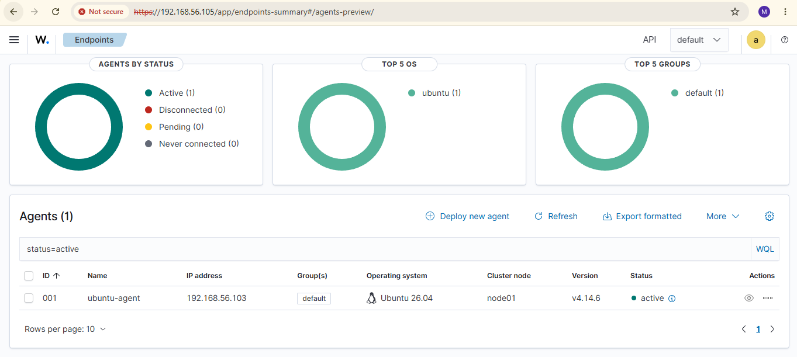
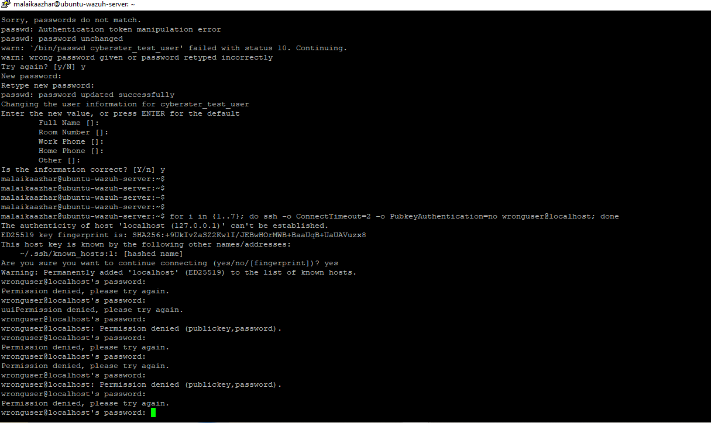
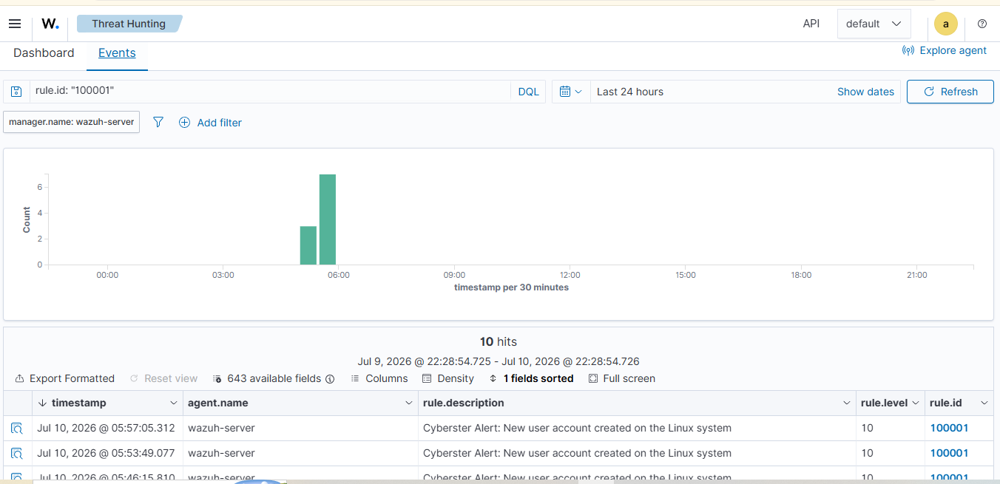

# 🛡️ Project 04 — Index
### Wazuh File Integrity Monitoring & Custom Detection Rules
**Project 04 of 29 — Advanced Cyber Projects**

**Quick guide to every step, screenshot and rule in this project.**

### [📖 Open the full README](README.md)

---

| 🧩 Modules | 🖼️ Screenshots | 📜 Custom Rules | 🎯 MITRE Techniques |
|:---:|:---:|:---:|:---:|
| **2** | **8** | **2 tested + 1 drafted** | **2** |

🧩 <b>Lab:</b> Ubuntu Server (Wazuh Agent v4.14.6) ➜ Wazuh Manager · Indexer · Dashboard, both in Oracle VirtualBox

---

## 📑 Step Index

All 9 steps of the project, with the screenshot that proves each one.

| # | Step | Module | Result | Evidence |
|:---:|---|:---:|---|:---:|
| 1 | Enable real-time syscheck on `/etc` and `/var/log` | 🔵 Module 1 | Real-time on `/etc`, notification-only on `/var/log` | [Exhibit 1](#ex1) |
| 2 | Restart the agent and confirm it is Active | 🔵 Module 1 | `ubuntu-agent` shows Active | [Exhibit 2](#ex2) |
| 3 | Create, modify and delete a test file in `/etc` | 🔵 Module 1 | 3 file events generated | Commands (see README) |
| 4 | Confirm the 3 FIM events on the dashboard | 🔵 Module 1 | Rules 554 added, 550 modified, 553 deleted | [Exhibit 3](#ex3) |
| 5 | Write the custom rule set in `local_rules.xml` | 🟢 Module 2 | 3 rules saved (2 tested, 1 drafted) | [Exhibit 4](#ex4) |
| 6 | Trigger Rule 100001 with `adduser` | 🟢 Module 2 | Test user `cyberster_test_user` created | [Exhibit 5](#ex5) |
| 7 | Confirm Rule 100001 fires on the dashboard | 🟢 Module 2 | Rule 100001 fired, Level 10 | [Exhibit 7](#ex7) |
| 8 | Trigger Rule 100002 with an SSH failure burst | 🟢 Module 2 | Repeated SSH login failures generated | [Exhibit 6](#ex6) |
| 9 | Confirm Rule 100002 fires on the dashboard | 🟢 Module 2 | Rule 100002 fired, Level 12 | [Exhibit 8](#ex8) |

---

## 🔵 Module 1 — File Integrity Monitoring

Exhibits 1 to 3. Click a screenshot to open it full size.

<table>
<tr>
<td align="center" valign="top" width="33%">

 <b>Exhibit 1 — Syscheck config</b>
 Active syscheck block inside <code>ossec.conf</code> on the Linux agent
</td>
<td align="center" valign="top" width="33%">

 <b>Exhibit 2 — Agent Active</b>
 <code>ubuntu-agent</code> reporting Active on the Wazuh Dashboard after the restart
</td>
<td align="center" valign="top" width="33%">

 <b>Exhibit 3 — FIM alerts</b>
 Added (554), modified (550) and deleted (553) events for the test file
</td>
</tr>
</table>

---

## 🟢 Module 2 — Custom Detection Rules

Exhibits 4 to 8.

<table>
<tr>
<td align="center" valign="top" width="33%">

 <b>Exhibit 4 — Custom rules XML</b>
 Rules 100001, 100002 and 100003 in <code>local_rules.xml</code>
</td>
<td align="center" valign="top" width="33%">

 <b>Exhibit 5 — adduser command</b>
 <code>adduser cyberster_test_user</code> run on the Ubuntu endpoint
</td>
<td align="center" valign="top" width="33%">

 <b>Exhibit 6 — SSH failure burst</b>
 SSH loop producing repeated "Permission denied" failures
</td>
</tr>
<tr>
<td align="center" valign="top" width="33%">

 <b>Exhibit 7 — Rule 100001 alert</b>
 Level 10 alert in Threat Hunting. Alerts recorded under agent <code>wazuh-server</code>
</td>
<td align="center" valign="top" width="33%">

 <b>Exhibit 8 — Rule 100002 alert</b>
 Level 12 alert in Threat Hunting on the SSH failure burst
</td>
<td></td>
</tr>
</table>

---

## 🎯 Rules and MITRE ATT&CK

| Rule | Detects | Technique | Tactic | Level | Status |
|:---:|---|---|---|:---:|:---:|
| `100001` | Local user account creation | [T1136.001](https://attack.mitre.org/techniques/T1136/001/) | Persistence | 10 | ✅ Tested & firing |
| `100002` | SSH brute-force | [T1110.001](https://attack.mitre.org/techniques/T1110/001/) | Credential Access | 12 | ✅ Tested & firing |
| `100003` | External USB storage insertion | [T1200](https://attack.mitre.org/techniques/T1200/) | Initial Access | 7 | ⏳ Drafted, untested |

> [!NOTE]
> Rule 100003 is written but untested because the lab had no Windows agent.

---

[⬆️ Back to top](#top) &nbsp;·&nbsp; [📖 Full README](README.md)

🛡️ **[Wazuh](https://wazuh.com)** · 🐧 **[Ubuntu](https://ubuntu.com)** · 🎯 **[MITRE ATT&CK](https://attack.mitre.org)** · 🔍 **[Detection Engineering](README.md#detection-pipeline)**

