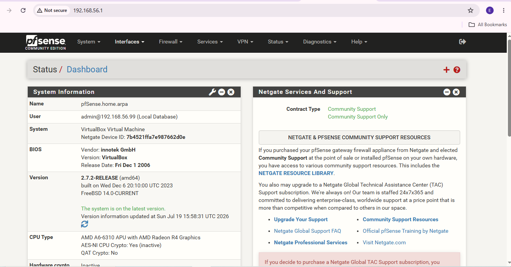
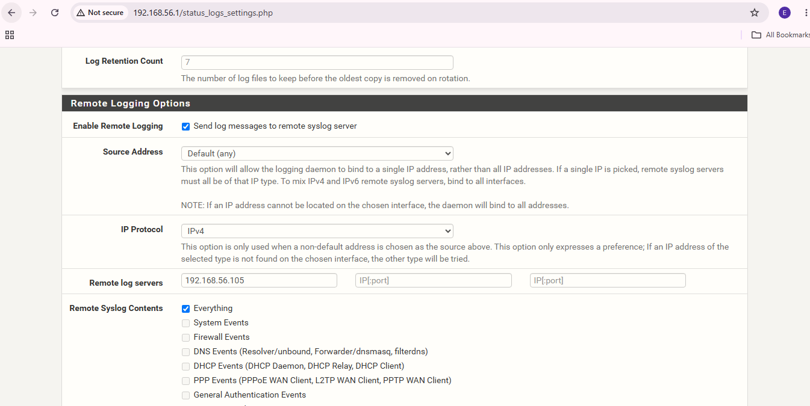
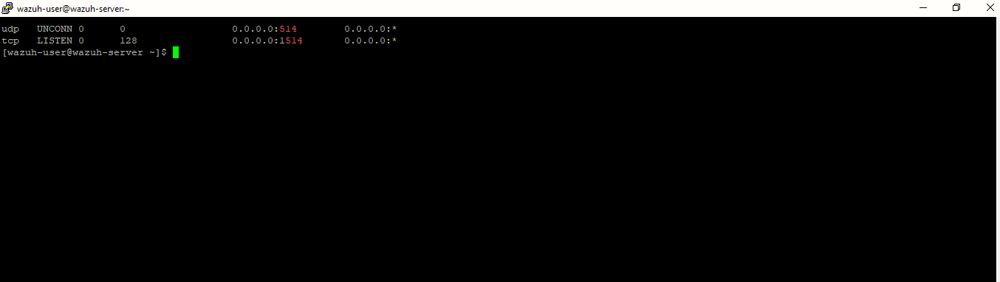

# 🌐 Project 05 — Index
### Network Perimeter Defense with pfSense
**Project 05 of 29 — Advanced Cyber Projects**

**Quick guide to every step and screenshot in this project.**

### [📖 Open the full README](README.md)

---

| 🧩 Modules | 🖼️ Screenshots | 🌉 Interfaces | 📡 Log Pipeline |
|:---:|:---:|:---:|:---:|
| **2** | **3** | **2 (WAN / LAN)** | **✅ End-to-End** |

🧩 <b>Lab:</b> pfSense Gateway (WAN/LAN) ➜ Ubuntu Agent + Wazuh Manager · Indexer · Dashboard, both in Oracle VirtualBox

---

## 📑 Step Index

All 4 steps of the project, with the screenshot that proves each one.

| # | Step | Module | Result | Evidence |
|:---:|---|:---:|---|:---:|
| 1 | Point every internal VM's default gateway at pfSense | 🔵 Module 1 | All traffic now routes through the firewall | Commands (see README) |
| 2 | Confirm both WAN and LAN interfaces are live | 🔵 Module 1 | pfSense dashboard shows both interfaces up | [Exhibit 1](#ex1) |
| 3 | Enable remote logging on pfSense, target the Manager | 🟢 Module 2 | "Everything" selected, forwarding to `192.168.56.105` | [Exhibit 2](#ex2) |
| 4 | Confirm the Manager is actually listening on UDP 514 | 🟢 Module 2 | `ss` shows an active `UNCONN` socket on port 514 | [Exhibit 3](#ex3) |

---

## 🔵 Module 1 — Perimeter Deployment

Exhibit 1. Click a screenshot to open it full size.

<table>
<tr>
<td align="center" valign="top" width="50%">

 <b>Exhibit 1 — pfSense dashboard</b>
 Firewall running (2.7.2-RELEASE), WAN and LAN interfaces both up
</td>
<td align="center" valign="top" width="50%">

**🌍 WAN**
`10.0.2.15/24`
  
**🏠 LAN**
`192.168.56.1/24`
  
Every internal VM's default route now points at the pfSense LAN interface — nothing reaches another host without crossing the gateway first.

</td>
</tr>
</table>

---

## 🟢 Module 2 — Syslog Forwarding & Verification

Exhibits 2 to 3.

<table>
<tr>
<td align="center" valign="top" width="50%">

 <b>Exhibit 2 — Remote logging config</b>
 Remote server set to <code>192.168.56.105</code>, "Everything" selected under Remote Syslog Contents
</td>
<td align="center" valign="top" width="50%">

 <b>Exhibit 3 — Wazuh listening on UDP 514</b>
 <code>ss</code> output confirming <code>udp UNCONN 0 0 0.0.0.0:514</code> — the Manager is actively receiving
</td>
</tr>
</table>

---

## 🎯 Verification Checklist

| Check | Method | Layer | Status |
|:---:|---|---|:---:|
| Both interfaces live | pfSense Dashboard | WAN / LAN | ✅ Confirmed |
| Remote logging enabled | pfSense GUI — Status/Logs/Settings | Firewall → SIEM | ✅ Confirmed |
| Target IP correct | `192.168.56.105` matches Wazuh Manager | Firewall → SIEM | ✅ Confirmed |
| Manager receiving | `ss` showing `UNCONN` on UDP 514 | SIEM Ingestion | ✅ Confirmed |

> [!NOTE]
> Rule enforcement (allow/deny logic) is addressed as a separate, following module — this project confirms the perimeter and the logging pipeline first.

---

[⬆️ Back to top](#top) &nbsp;·&nbsp; [📖 Full README](README.md)

🌐 **[pfSense](https://www.pfsense.org)** · 🛡️ **[Wazuh](https://wazuh.com)** · 📡 **[Syslog Protocol](https://datatracker.ietf.org/doc/html/rfc5424)** · 🧭 **[Traffic Pipeline](README.md#traffic-pipeline)**

