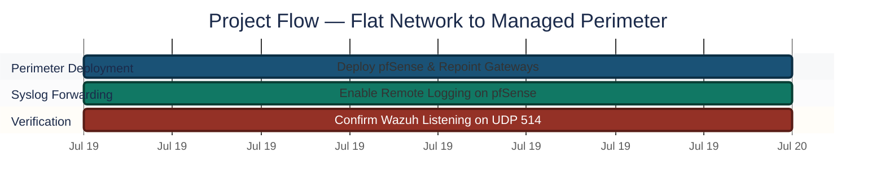
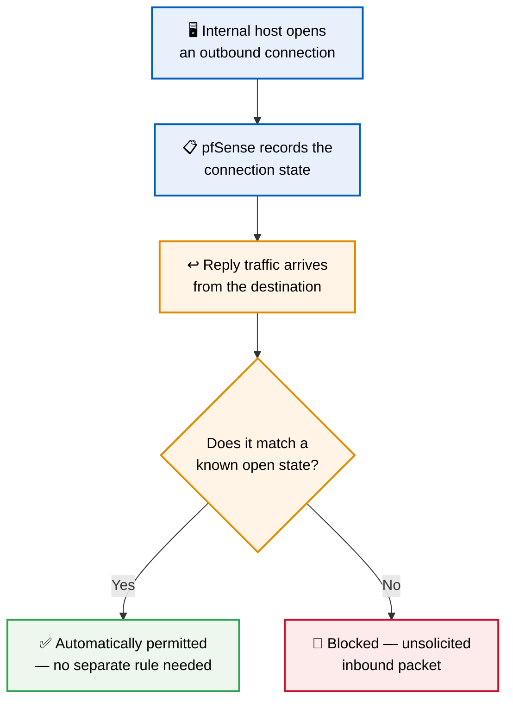
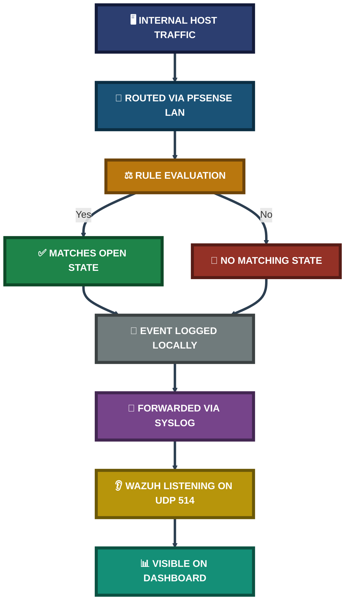
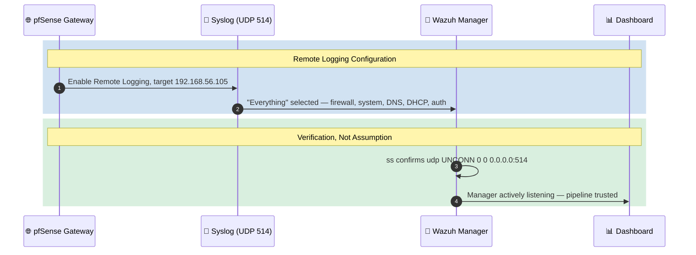

<div align="center">

# 🌐 Network Perimeter Defense with pfSense

**Project 05 of 29 — Advanced Cyber Projects**

Network Perimeter Engineering (pfSense + Wazuh)


A flat, unmanaged Host-Only lab network replaced with a dedicated pfSense gateway enforcing stateful inspection at the perimeter — every VM's default route repointed through the firewall, remote logging enabled, and the pipeline verified end-to-end by confirming the Wazuh Manager is actually listening for incoming syslog traffic.

### [📑 Open the visual index](INDEX.md)

</div>

---

## 📑 Table of Contents

1. [At a Glance](#at-a-glance)
2. [Project Background](#project-background)
3. [Environment](#environment)
4. [Project Flow](#project-flow)
5. [Module 1 — Perimeter Deployment](#module-1)
6. [Coverage Snapshot](#coverage-snapshot)
7. [Traffic Enforcement Pipeline](#traffic-pipeline)
8. [Module 2 — Syslog Forwarding & Verification](#module-2)
9. [Project Summary](#project-summary)
10. [Challenges & Fixes](#challenges-fixes)
11. [Scope & Limitations](#scope-limitations)
12. [What I Learned](#what-i-learned)
13. [Skills Demonstrated](#skills-demonstrated)
14. [Screenshot Index](#screenshot-index)
15. [Repo Structure](#repo-structure)

---

<a id="at-a-glance"></a>
## 📊 At a Glance

| 🧩 Modules | 🖼️ Screenshots | 🌉 Interfaces Configured | 📡 Log Pipeline Verified |
|:---:|:---:|:---:|:---:|
| **2** | **3** | **2 (WAN / LAN)** | **✅ End-to-End** |

---

<a id="project-background"></a>
## 📖 Project Background

A flat Host-Only network lets every machine talk to every other machine with no enforcement at all — there is no boundary to inspect, filter, or log traffic against. This project replaces that flat topology with a dedicated firewall VM sitting between every lab machine and the outside network, so that all internal and outbound traffic is now subject to rule evaluation before it reaches its destination.

- **Module 1 — Perimeter Deployment:** Stand up pfSense as the LAN gateway, repoint every internal VM's default route through it, and confirm both interfaces are live.
- **Module 2 — Syslog Forwarding & Verification:** Enable remote logging on the firewall itself and prove — not assume — that the SIEM on the other end is actually receiving it.

> [!NOTE]
> Confirming the Wazuh Manager is genuinely listening on UDP 514 before trusting the pipeline was treated as a mandatory step here, not an optional formality — a firewall silently failing to forward logs looks identical to a quiet network with nothing to report.

<div align="center">

### 🧩 Lab Setup at a Glance

<table>
<tr>
<td align="center" valign="top" width="30%">

**🌍 WAN**<br>
<sub><code>10.0.2.15/24</code><br>NAT to outside</sub>

</td>
<td align="center" valign="middle" width="10%">

**➜**

</td>
<td align="center" valign="top" width="30%">


**Firewall Gateway**<br>
<sub>Stateful inspection<br>Rule evaluation point</sub>

</td>
<td align="center" valign="middle" width="10%">

**➜**

</td>
<td align="center" valign="top" width="20%">

**🏠 LAN**<br>
<sub><code>192.168.56.1/24</code><br>All internal VMs</sub>

</td>
</tr>
<tr>
<td colspan="5" align="center">

<br>
<sub>Receives forwarded syslog on UDP 514 · <code>192.168.56.105</code></sub>

</td>
</tr>
</table>

</div>

---

<a id="environment"></a>
## 🖧 Environment

| Item | Value |
|---|---|
| **Firewall Platform** | pfSense Community Edition 2.7.2-RELEASE |
| **pfSense WAN** | `10.0.2.15/24` (NAT) |
| **pfSense LAN** | `192.168.56.1/24` (internal gateway) |
| **Wazuh Manager** | `192.168.56.105` |
| **Monitored Endpoint** | Ubuntu Agent — `192.168.56.103` |
| **Logging Protocol** | Syslog over UDP, port `514` |

---

<a id="project-flow"></a>
## ⏱️ Project Flow


<p align="center"><em>Colors distinguish each project stage — all stages complete.</em></p>

---

<a id="module-1"></a>
## 🔵 Module 1 — Perimeter Deployment

**Objective:** Replace the flat, unmanaged network with a dedicated pfSense gateway, route every internal VM through it, and confirm both interfaces are live before trusting any rule evaluation downstream.

### Step 1 — Point every internal VM's default gateway at pfSense ✅

```bash
sudo ip route del default
sudo ip route add default via 192.168.56.1
ip route
```

All traffic between VMs, and all traffic leaving the lab network, now passes through pfSense and is subject to its rule evaluation — nothing reaches another host without crossing the gateway first.

### Step 2 — Confirm both interfaces are live ✅

<p align="center">
  <br>
  <em>Exhibit 1 — pfSense Status/Dashboard confirming the firewall is running (version 2.7.2-RELEASE), with WAN and LAN interfaces both up</em>
</p>

🎯 **Result:** The gateway is live on both interfaces before any traffic is trusted to route through it.

| Interface | Address | Role |
|:---:|:---:|---|
| WAN | `10.0.2.15/24` | Connects the gateway itself to the outside network |
| LAN | `192.168.56.1/24` | Default gateway for every internal VM |

### 🔍 Analyst Note — Why Stateful Inspection Matters Here

A firewall that only filters by IP, port and protocol needs an explicit rule for every direction of every conversation — including the reply traffic to something an internal host requested itself. A rule broad enough to allow that reply back in is also broad enough to let unsolicited traffic in.



Stateful inspection tracks which connections were actually opened from the inside, and permits the corresponding reply automatically — while still blocking any inbound packet that doesn't correspond to a connection the firewall itself initiated tracking on.

---

<a id="coverage-snapshot"></a>
## 🌟 Coverage Snapshot

| 🛡️ Layer | ✅ Status | 📌 Detail |
|---|---|---|
| Network Topology | Replaced | Flat Host-Only network → managed pfSense perimeter |
| Gateway Routing | Live | Every internal VM's default route points at pfSense LAN |
| Remote Logging | Enabled | "Everything" selected — firewall, system, DNS, DHCP, auth events |
| SIEM Ingestion | Verified | Wazuh Manager confirmed actively listening on UDP 514 |

---

<a id="traffic-pipeline"></a>
## 🧭 Traffic Enforcement Pipeline

How a packet moves from an internal host, through the perimeter, and into the SIEM's visibility



---

<a id="module-2"></a>
## 🟢 Module 2 — Syslog Forwarding & Verification

**Objective:** Enable remote logging on the firewall itself so perimeter activity becomes visible in the SIEM, then confirm — with direct evidence, not assumption — that the Manager is actually receiving it.

### Rule Chaining Map — How a Firewall Event Reaches the Dashboard



### Step 3 — Enable remote logging on pfSense ✅

Remote logging was pointed at the Wazuh Manager's IP, with "Everything" selected under Remote Syslog Contents — so firewall, system, DNS, DHCP, and authentication events all forward, not just a narrow subset that might miss the event type actually needed later.

<p align="center">
  <br>
  <em>Exhibit 2 — pfSense Remote Logging Options: Enable Remote Logging checked, remote log server set to <code>192.168.56.105</code>, "Everything" selected under Remote Syslog Contents</em>
</p>

### Step 4 — Confirm the Manager is actually listening, not just configured ✅

```bash
ss -tulnp | grep 514
```

<p align="center">
  <br>
  <em>Exhibit 3 — <code>ss</code> output on the Wazuh Manager confirming <code>udp UNCONN 0 0 0.0.0.0:514</code>, proving the Manager is actively listening for pfSense's forwarded syslog traffic</em>
</p>

🎯 **Result:** The pipeline was verified end-to-end — configuration on the sending side, and an active listener confirmed on the receiving side, rather than assuming the configuration alone guarantees delivery.

| Check | Method | Outcome |
|---|---|---|
| Remote logging enabled | pfSense GUI — Status/Logs/Settings | ✅ Confirmed |
| Target IP correct | `192.168.56.105` matches Wazuh Manager | ✅ Confirmed |
| Manager receiving | `ss` showing `UNCONN` on UDP 514 | ✅ Confirmed |

### 🔍 Why Rule Direction (LAN vs. WAN) Is a Common Source of Misconfiguration

A rule applied to the wrong interface enforces the right logic in the wrong place. A rule meant to restrict what internal machines can send out needs to sit on the LAN interface, evaluating traffic as it leaves the internal network. A rule meant to restrict what external traffic can come in needs to sit on the WAN interface. Placing an intended outbound restriction on the WAN interface evaluates it against the wrong direction of traffic entirely — doing nothing for its intended purpose while potentially leaving the actual traffic completely unrestricted.

---

<a id="project-summary"></a>
## 📝 Project Summary

| Module | Tooling | Key Finding |
|---|---|---|
| Perimeter Deployment | pfSense, VM routing | Flat network replaced with an enforced gateway on both interfaces |
| Syslog Forwarding & Verification | pfSense Remote Logging, `ss` | Firewall events confirmed reaching the SIEM end-to-end |

---

<a id="challenges-fixes"></a>
## ⚠️ Challenges & Fixes

| ❌ Challenge | ✅ Fix |
|---|---|
| Configuration alone doesn't prove delivery — a firewall silently failing to forward logs looks identical to a quiet network with nothing to report | Queried the Manager directly with `ss` to confirm an active UDP 514 listener before trusting the pipeline |
| A narrow syslog content selection risks missing the specific event type needed later during an investigation | Selected "Everything" under Remote Syslog Contents rather than a partial subset |

---

<a id="scope-limitations"></a>
## 🚧 Scope & Limitations

- **Rule enforcement not yet authored:** This phase deploys the gateway and confirms the logging pipeline. Specific allow/deny rules are addressed as a separate, following module.
- **Single perimeter point:** The lab models one gateway between the internal network and the outside — it does not model a multi-segment or DMZ topology.
- **Verification scope:** "Listening" confirms the Manager's socket is open and receiving; it does not by itself confirm every individual event type is being correctly decoded downstream.

These gaps are marked here instead of hidden, so the results reflect exactly what was tested.

---

<a id="what-i-learned"></a>
## 🧠 What I Learned

- **A rule broad enough to allow replies back in is also broad enough to let unsolicited traffic in** — unless the firewall tracks connection state itself, rather than filtering purely on IP, port, and protocol in isolation.
- **Configuration is not the same as delivery.** Enabling a setting on the sending side proves nothing about the receiving side without direct confirmation.
- **Rule direction is a real, common failure mode.** The same logic applied to the wrong interface silently does nothing for its intended purpose.
- **Logging everything up front costs little and avoids reconstructing a gap later** — a narrow selection made today can silently exclude the one event type needed during a future investigation.

---

<a id="skills-demonstrated"></a>
## 🛠️ Skills Demonstrated

- Deploying and configuring a pfSense gateway as a managed network perimeter
- Redirecting VM routing tables to enforce a single point of traffic inspection
- Configuring remote syslog forwarding from a firewall to a SIEM
- Verifying a logging pipeline end-to-end with direct socket-level evidence, not assumption
- Explaining stateful inspection and rule-direction concepts in practical, applied terms

---

<a id="screenshot-index"></a>
## 🖼️ Screenshot Index

| # | File | Shows |
|:---:|---|---|
| 1 | `Exhibit1_pfsense_dashboard.png` | pfSense dashboard confirming WAN/LAN interfaces up |
| 2 | `Exhibit2_remote_syslog_config.png` | Remote Logging Options — target IP and "Everything" selected |
| 3 | `Exhibit3_wazuh_udp514_listening.png` | Wazuh Manager confirmed listening on UDP 514 |

---

<a id="repo-structure"></a>
## 📁 Repo Structure

```text
project-05-network-perimeter-defense/
|-- README.md
`-- screenshots/
    |-- Exhibit1_pfsense_dashboard.png
    |-- Exhibit2_remote_syslog_config.png
    `-- Exhibit3_wazuh_udp514_listening.png
```

<div align="center">

🌐 **[pfSense](https://www.pfsense.org)** · 🛡️ **[Wazuh](https://wazuh.com)** · 📡 **[Syslog Protocol](https://datatracker.ietf.org/doc/html/rfc5424)** · 🧭 **[Traffic Pipeline](#traffic-pipeline)**

</div>
