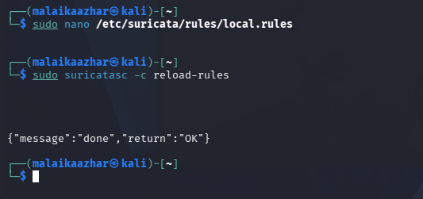

<a id="top"></a>
<div align="center">

# 🔍 Project 05 — Index
### Suricata Custom Rule Detection Lab
**Project 05 of 18 — Advanced Cyber Projects**


**Quick guide to every step and screenshot in this project.**

### [📖 Open the full README](README.md)

</div>

---

<div align="center">

| 🧩 Modules | 🖼️ Screenshots | 📜 Custom Rules | 🎯 MITRE Techniques |
|:---:|:---:|:---:|:---:|
| **2** | **6** | **2** | **2** |

</div>

<p align="center">🧩 <b>Lab:</b> Kali Linux (Suricata sensor + Nmap NULL scan) and a second VM (ICMP flood) ➜ custom signatures in <code>local.rules</code></p>

---

## 📑 Step Index

All 7 steps of the project, with the screenshot that proves each one.

| # | Step | Module | Result | Evidence |
|:---:|---|:---:|---|:---:|
| 1 | Bind Suricata to the lab interface | 🔵 Module 1 | `af-packet` set to `eth0` | [Exhibit 1](#ex1) |
| 2 | Start the Suricata service | 🔵 Module 1 | `active (running)`, version 8.0.6 | [Exhibit 2](#ex2) |
| 3 | Update the Suricata ruleset | 🔵 Module 1 | Emerging Threats Open, already current | [Exhibit 3](#ex3) |
| 4 | Author the NULL scan and ICMP flood signatures | 🔵 Module 1 | `sid:9000001`, `sid:9000003` | Code blocks (see README) |
| 5 | Reload the rules into the running sensor | 🟢 Module 2 | `{"message":"done","return":"OK"}`, no restart | [Exhibit 4](#ex4) |
| 6 | Trigger a real NULL scan, confirm the alert | 🟢 Module 2 | `[1:9000001:3]` in `fast.log` | [Exhibit 5](#ex5) |
| 7 | Trigger an ICMP flood, confirm the alert | 🟢 Module 2 | `[1:9000003:1]` in `fast.log` | [Exhibit 6](#ex6) |

---

## 🔵 Module 1 — Sensor Setup & Rule Authoring

Exhibits 1 to 3. Click a screenshot to open it full size.

<table>
<tr>
<td align="center" valign="top" width="33%">
<a id="ex1"></a>
<a href="screenshots/Exhibit1_af_packet_capture_config.png"></a>
<br><b>Exhibit 1 — Capture interface</b>
<br><sub><code>af-packet</code> bound to <code>eth0</code></sub>
</td>
<td align="center" valign="top" width="33%">
<a id="ex2"></a>
<a href="screenshots/Exhibit2_suricata_service_running.png"></a>
<br><b>Exhibit 2 — Service running</b>
<br><sub>Suricata 8.0.6, <code>active (running)</code></sub>
</td>
<td align="center" valign="top" width="33%">
<a id="ex3"></a>
<a href="screenshots/Exhibit3_suricata_update_run.png"></a>
<br><b>Exhibit 3 — Ruleset update</b>
<br><sub><code>suricata-update</code>, remote checksum unchanged</sub>
</td>
</tr>
</table>

**✍️ Signatures**

```text
alert tcp any any -> any any (msg:"CUSTOM Nmap NULL Scan Detected"; flags:0; sid:9000001; rev:3;)
alert icmp any any -> any any (msg:"CUSTOM ICMP Flood Detected"; icode:0; itype:8; threshold:type threshold, track by_src, count 20, seconds 5; sid:9000003; rev:1;)
```

---

## 🟢 Module 2 — Live Reload & Verification

Exhibits 4 to 6.

<table>
<tr>
<td align="center" valign="top" width="33%">
<a id="ex4"></a>
<a href="screenshots/Exhibit4_live_rule_reload_confirmation.png"></a>
<br><b>Exhibit 4 — Live reload</b>
<br><sub><code>suricatasc reload-rules</code> — no sensor restart</sub>
</td>
<td align="center" valign="top" width="33%">
<a id="ex5"></a>
<a href="screenshots/Exhibit5_null_scan_alert_firing.png"></a>
<br><b>Exhibit 5 — NULL scan alert</b>
<br><sub><code>fast.log</code> confirming <code>sid:9000001</code> on a real scan</sub>
</td>
<td align="center" valign="top" width="33%">
<a id="ex6"></a>
<a href="screenshots/Exhibit6_icmp_flood_alert_firing.png"></a>
<br><b>Exhibit 6 — ICMP flood alert</b>
<br><sub><code>fast.log</code> confirming <code>sid:9000003</code> firing</sub>
</td>
</tr>
</table>

---

## 🎯 Signatures and MITRE ATT&CK

| Signature | Detects | Technique | Tactic | Status |
|:---:|---|---|---|:---:|
| `sid:9000001` | TCP NULL scan (all control flags cleared) | [T1046](https://attack.mitre.org/techniques/T1046/) | Discovery | ✅ Tested & firing |
| `sid:9000003` | ICMP echo flood (20 hits in 5 s per source) | [T1498](https://attack.mitre.org/techniques/T1498/) | Impact | ✅ Tested & firing |

> [!NOTE]
> The exhibits show the alerts with their SID and revision. The rule text above is the version recorded in the internship Week 3 report; the rule file itself is not shown on screen.

---

<div align="center">

[⬆️ Back to top](#top) &nbsp;·&nbsp; [📖 Full README](README.md)

🔍 **[Suricata](https://suricata.io)** · 🐧 **[Nmap](https://nmap.org)** · 🎯 **[MITRE ATT&CK](https://attack.mitre.org)** · 🔄 **[Detection Pipeline](README.md#detection-pipeline)**

</div>
