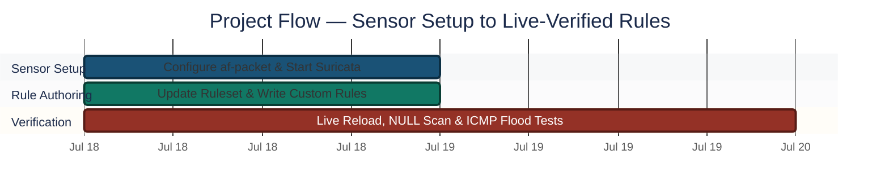
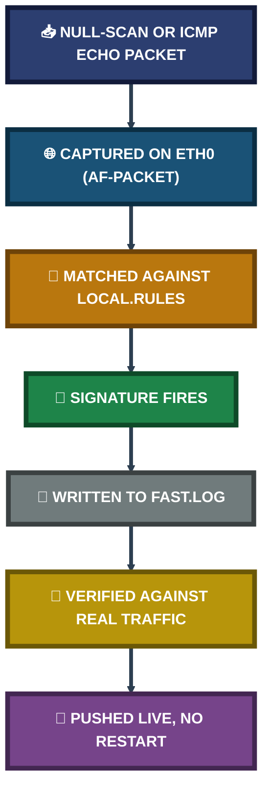

<div align="center">

# 🔍 Suricata Custom Rule Detection Lab

**Project 05 of 18 — Advanced Cyber Projects**

Network IDS Rule Engineering (Suricata)


Two custom Suricata signatures — one for a stealth Nmap NULL port scan, one for an ICMP flood — loaded into a running sensor with a live reload and proven against real generated traffic in `fast.log`.

### [📑 Open the visual index](INDEX.md)

</div>

---

## 📑 Table of Contents

1. [At a Glance](#at-a-glance)
2. [Project Background](#project-background)
3. [Environment](#environment)
4. [Project Flow](#project-flow)
5. [Module 1 — Sensor Setup & Rule Authoring](#module-1)
6. [Coverage Snapshot](#coverage-snapshot)
7. [Detection Pipeline](#detection-pipeline)
8. [Module 2 — Live Reload & Verification](#module-2)
9. [MITRE ATT&CK Mapping](#mitre-mapping)
10. [Project Summary](#project-summary)
11. [Challenges & Fixes](#challenges-fixes)
12. [Scope & Limitations](#scope-limitations)
13. [What I Learned](#what-i-learned)
14. [Skills Demonstrated](#skills-demonstrated)
15. [Screenshot Index](#screenshot-index)
16. [Repo Structure](#repo-structure)

---

<a id="at-a-glance"></a>
## 📊 At a Glance

| 🧩 Modules | 🖼️ Screenshots | 📜 Custom Rules | 🎯 MITRE Techniques |
|:---:|:---:|:---:|:---:|
| **2** | **6** | **2** | **2** |

---

<a id="project-background"></a>
## 📖 Project Background

A network IDS is only as useful as the rules it runs. Default rulesets cover known malware and exploits, but a SOC analyst also needs to write rules for behaviour the default set does not cover. This project writes two signatures from scratch and then proves each one works against real traffic generated in the lab, rather than trusting it on the strength of its syntax alone.

- **NULL scan (port scan):** A NULL scan sends TCP packets with every control flag cleared. Real TCP communication always sets at least one flag, so a completely flagless packet is the fingerprint of a stealth scanning tool such as Nmap probing port state.
- **ICMP flood:** A single ping is normal diagnostics. What marks a flood is the rate, so this rule alerts on volume per source instead of on the packet type.

- **Module 1 — Sensor Setup & Rule Authoring:** Bind Suricata to the lab interface, confirm the service runs, update the ruleset, and author the two custom signatures.
- **Module 2 — Live Reload & Verification:** Push the rules into the running sensor without a restart, then trigger each one with real traffic and confirm the alert in `fast.log`.

<div align="center">

### 🧩 Detection Setup at a Glance

<table>
<tr>
<td align="center" valign="top" width="30%">


**Traffic Source**<br>
<sub><code>nmap -sN</code> scan<br>and ICMP echo flood</sub>

</td>
<td align="center" valign="middle" width="10%">

**➜**

</td>
<td align="center" valign="top" width="30%">


**Detection Engine**<br>
<sub>Custom rules in<br><code>local.rules</code></sub>

</td>
<td align="center" valign="middle" width="10%">

**➜**

</td>
<td align="center" valign="top" width="20%">

**📄 fast.log**<br>
<sub>Alert confirmed<br>with SID and revision</sub>

</td>
</tr>
</table>

</div>

---

<a id="environment"></a>
## 🖧 Environment

| Item | Value |
|---|---|
| **IDS Platform** | Suricata 8.0.6 RELEASE, run as a systemd service |
| **Sensor Host** | Kali Linux VM (VirtualBox), Host-Only lab network `192.168.56.0/24` |
| **Capture Interface** | `eth0` (af-packet) |
| **Rule File** | `/etc/suricata/rules/local.rules` |
| **Alert Log** | `/var/log/suricata/fast.log` |
| **Reload Method** | `suricatasc -c reload-rules` (live, no restart) |
| **Traffic Tools** | Nmap (`-sN` NULL scan), ICMP echo flood from a second lab VM (`192.168.56.103`) |

---

<a id="project-flow"></a>
## ⏱️ Project Flow


<p align="center"><em>Colors distinguish each project stage — all stages complete.</em></p>

---

<a id="module-1"></a>
## 🔵 Module 1 — Sensor Setup & Rule Authoring

**Objective:** Get a working Suricata sensor on the lab network, bring its ruleset up to date, and author two signatures that match specific traffic fingerprints.

### Step 1 — Bind Suricata to the lab interface ✅

The Host-Only interface was identified with `ip a` and written into the `af-packet` section of `suricata.yaml`.

<p align="center">
  <br>
  <em>Exhibit 1 — <code>suricata.yaml</code> <code>af-packet</code> section with <code>interface: eth0</code>, the Host-Only lab interface</em>
</p>

### Step 2 — Start the service ✅

```bash
sudo systemctl daemon-reload
sudo systemctl enable --now suricata
sudo systemctl status suricata
```

<p align="center">
  <br>
  <em>Exhibit 2 — <code>systemctl status suricata</code> showing <b>active (running)</b>, Suricata 8.0.6 RELEASE, started with <code>--af-packet</code></em>
</p>

### Step 3 — Update the ruleset ✅

```bash
sudo suricata-update
```

<p align="center">
  <br>
  <em>Exhibit 3 — <code>suricata-update</code> run against Emerging Threats Open, reporting the remote checksum has not changed (ruleset already current)</em>
</p>

### Step 4 — Author the custom signatures ✅

Both rules live in `/etc/suricata/rules/local.rules`.

**`sid:9000001` — Nmap NULL scan**

```text
alert tcp any any -> any any (msg:"CUSTOM Nmap NULL Scan Detected"; flags:0; sid:9000001; rev:3;)
```

The `flags:0` match fires on a TCP packet where every control flag is zero — the fingerprint of a NULL scan probe, since a legitimate handshake always sets at least one flag.

**`sid:9000003` — ICMP flood**

```text
alert icmp any any -> any any (msg:"CUSTOM ICMP Flood Detected"; icode:0; itype:8; threshold:type threshold, track by_src, count 20, seconds 5; sid:9000003; rev:1;)
```

The rule matches ICMP echo requests (type 8, code 0) and alerts when one source sends 20 of them within 5 seconds. A lower count would fire on ordinary ping bursts; a much higher one would let a real flood consume bandwidth before detection.

---

<a id="coverage-snapshot"></a>
## 🌟 Coverage Snapshot

| 🛡️ Layer | ✅ Status | 📌 Detail |
|---|---|---|
| Sensor | Running | Suricata 8.0.6, af-packet on `eth0` |
| Ruleset Currency | Updated | Emerging Threats Open, remote checksum unchanged |
| Port Scan Detection | Fired | `sid:9000001` on a real `nmap -sN` scan |
| Flood Detection | Fired | `sid:9000003` on ICMP echo traffic from `192.168.56.103` |
| Live Reload | Confirmed | Pushed via `suricatasc`, no service restart |

---

<a id="detection-pipeline"></a>
## 🧭 Detection Pipeline

How a packet becomes a verified, reloadable signature



---

<a id="module-2"></a>
## 🟢 Module 2 — Live Reload & Verification

**Objective:** Load the rules into the running sensor without interrupting capture, then trigger each signature with real traffic and confirm the exact alert in the sensor's own log.

### Step 5 — Reload the rules into the running sensor ✅

```bash
sudo nano /etc/suricata/rules/local.rules
sudo suricatasc -c reload-rules
```

<p align="center">
  <br>
  <em>Exhibit 4 — Live rule reload via the Suricata socket control interface, confirming <code>{"message":"done","return":"OK"}</code></em>
</p>

A restart would create a short capture blind window. The socket reload applies new rules while the sensor keeps capturing.

### Step 6 — Trigger a real NULL scan and confirm the alert ✅

```bash
nmap -sN 192.168.56.107
```

<p align="center">
  <br>
  <em>Exhibit 5 — <code>fast.log</code> filtered on <code>9000001</code>: <b>CUSTOM Nmap NULL Scan Detected</b> (<code>[1:9000001:3]</code>) firing repeatedly from source port 45647 against different destination ports of <code>192.168.56.107</code></em>
</p>

The alerts arrive within milliseconds of each other on one source port and many destination ports, which is the pattern a port scan produces.

### Step 7 — Trigger an ICMP flood and confirm the alert ✅

<p align="center">
  <br>
  <em>Exhibit 6 — <code>fast.log</code> showing repeated <b>CUSTOM ICMP Flood Detected</b> (<code>[1:9000003:1]</code>) alerts, ICMP type 8 from <code>192.168.56.103</code> to <code>192.168.56.107</code></em>
</p>

🎯 **Result:** Both custom signatures fired on real traffic and were logged with their SID and revision, after being loaded into a live sensor with no service restart.

| Check | Method | Outcome |
|---|---|---|
| NULL scan signature fires | `fast.log` after live `nmap -sN` | ✅ Confirmed (`9000001`, rev 3) |
| ICMP flood signature fires | `fast.log` after ICMP echo flood | ✅ Confirmed (`9000003`, rev 1) |
| Reload applied without restart | `suricatasc -c reload-rules` | ✅ Confirmed (`"return":"OK"`) |

---

<a id="mitre-mapping"></a>
## 🎯 MITRE ATT&CK Mapping

| Signature | Detects | Technique | Tactic |
|:---:|---|---|---|
| `sid:9000001` | TCP NULL scan (all control flags cleared) | [T1046](https://attack.mitre.org/techniques/T1046/) — Network Service Discovery | Discovery |
| `sid:9000003` | ICMP echo flood (20 hits in 5 s per source) | [T1498](https://attack.mitre.org/techniques/T1498/) — Network Denial of Service | Impact |

A NULL scan is reconnaissance, so it maps to Discovery: the attacker is enumerating port state before choosing a target. A flood aims to exhaust the target's resources, so it maps to Impact.

---

<a id="project-summary"></a>
## 📝 Project Summary

| Module | Tooling | Key Finding |
|---|---|---|
| Sensor Setup & Rule Authoring | `suricata.yaml`, `suricata-update`, `local.rules` | Sensor bound to `eth0`, ruleset current, two custom signatures written |
| Live Reload & Verification | `suricatasc`, `nmap -sN`, `fast.log` | Rules loaded live; both signatures confirmed firing on real traffic |

---

<a id="challenges-fixes"></a>
## ⚠️ Challenges & Fixes

| ❌ Challenge | ✅ Fix |
|---|---|
| A wrong `af-packet` interface leaves Suricata running healthy but blind, with an empty `fast.log` | Confirmed the real lab interface with `ip a` before writing it into `suricata.yaml` |
| A full sensor restart creates a capture blind window while testing rules | Used the Suricata socket interface (`suricatasc -c reload-rules`) to push rules into the running sensor |
| An ICMP rule that alerts per packet would fire on normal pings | Added a per-source threshold (20 hits in 5 s) so only rate, not the packet type, triggers the alert |

---

<a id="scope-limitations"></a>
## 🚧 Scope & Limitations

- **Two signatures proven:** `sid:9000001` and `sid:9000003` have alert evidence in this project. Other stealth scan types (FIN, Xmas) would need their own flag matches.
- **Rule text is documented, alerts are screenshotted:** The exhibits show the alerts with SID and revision. The rule text above is the version recorded in the internship Week 3 report, and the rule file itself is not shown on screen.
- **IDS mode, not IPS:** The sensor observes and logs matching traffic. It does not block it.
- **Lab-generated traffic only:** Verification uses controlled traffic in the lab, not production network noise.

---

<a id="what-i-learned"></a>
## 🧠 What I Learned

- **A signature is only proven by generating the real traffic it targets.** A rule that parses without errors is not the same as a rule that fires; the check is always the log.
- **Rate-based rules need a threshold, not just a match.** An ICMP echo is harmless alone, so the detection has to count per source over a time window.
- **Live reload is an operational skill.** Pushing rules into a running sensor avoids the blind window a restart creates.
- **A healthy service does not mean a working sensor.** Suricata reports running even on the wrong interface, so the capture interface has to be verified against `ip a`.

---

<a id="skills-demonstrated"></a>
## 🛠️ Skills Demonstrated

- Configuring Suricata capture (`af-packet`) and running it as a service
- Authoring custom Suricata signatures, including a threshold-based rate rule
- Validating detections against real triggered traffic and reading `fast.log`
- Using the Suricata socket control interface for live rule reloads
- Mapping detections to MITRE ATT&CK techniques and tactics

---

<a id="screenshot-index"></a>
## 🖼️ Screenshot Index

| # | File | Shows |
|:---:|---|---|
| 1 | `Exhibit1_af_packet_capture_config.png` | `af-packet` section of `suricata.yaml`, `interface: eth0` |
| 2 | `Exhibit2_suricata_service_running.png` | Suricata 8.0.6 `active (running)` |
| 3 | `Exhibit3_suricata_update_run.png` | `suricata-update` run, ruleset current |
| 4 | `Exhibit4_live_rule_reload_confirmation.png` | Live reload via `suricatasc`, no restart |
| 5 | `Exhibit5_null_scan_alert_firing.png` | `fast.log` showing `sid:9000001` firing on a NULL scan |
| 6 | `Exhibit6_icmp_flood_alert_firing.png` | `fast.log` showing `sid:9000003` firing on an ICMP flood |

---

<a id="repo-structure"></a>
## 📁 Repo Structure

```text
project-05-suricata-custom-rule-detection-lab/
|-- README.md
|-- INDEX.md
`-- screenshots/
    |-- Exhibit1_af_packet_capture_config.png
    |-- Exhibit2_suricata_service_running.png
    |-- Exhibit3_suricata_update_run.png
    |-- Exhibit4_live_rule_reload_confirmation.png
    |-- Exhibit5_null_scan_alert_firing.png
    `-- Exhibit6_icmp_flood_alert_firing.png
```

<div align="center">

🔍 **[Suricata](https://suricata.io)** · 🐧 **[Nmap](https://nmap.org)** · 🎯 **[MITRE ATT&CK](https://attack.mitre.org)** · 🔄 **[Detection Pipeline](#detection-pipeline)**

</div>
