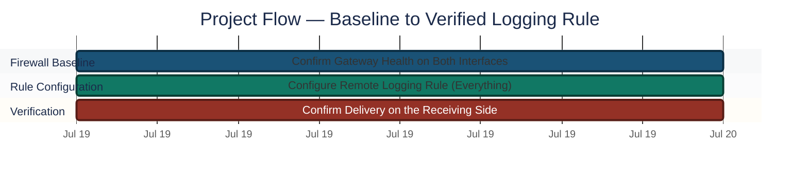
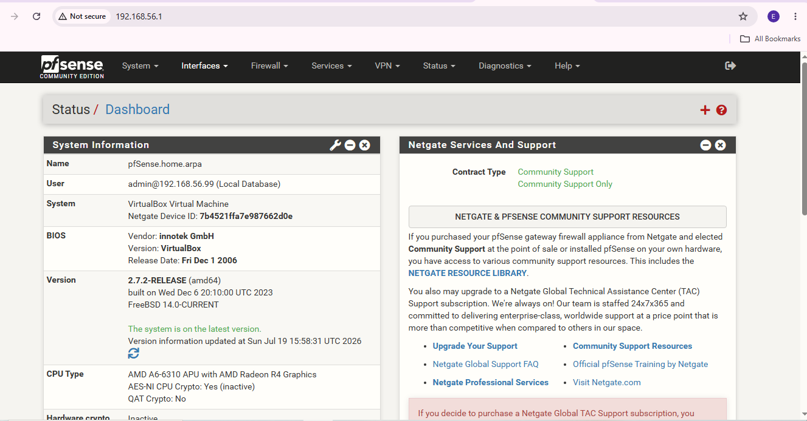
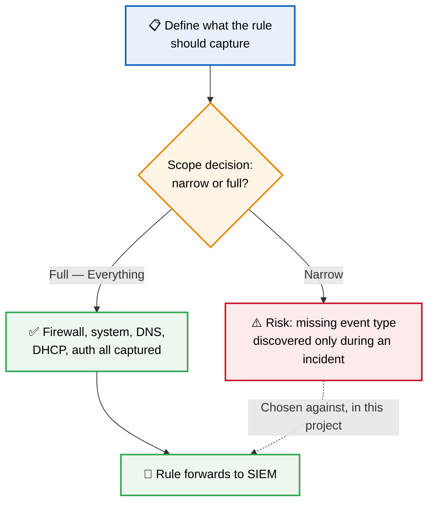
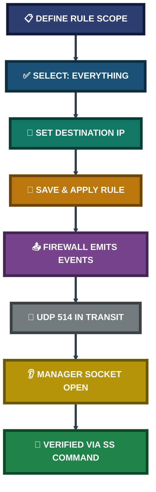
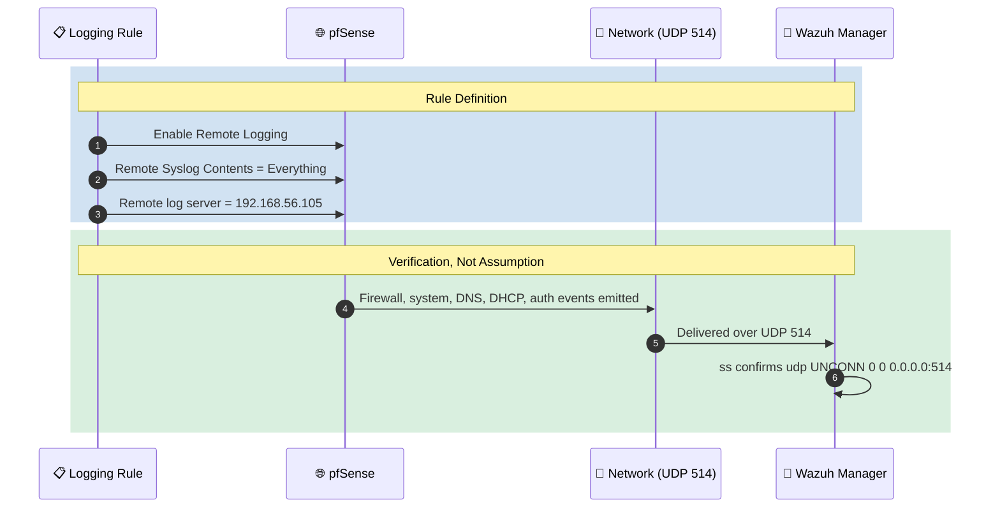
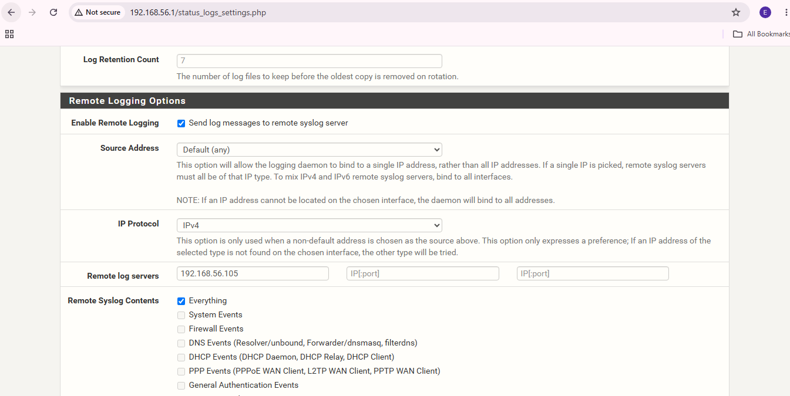
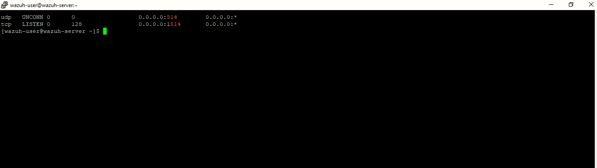

<div align="center">

# 🔥 Firewall Rules Configuration on pfSense

**Project 06 of 29 — Advanced Cyber Projects**

Firewall Rule Engineering (pfSense + Wazuh)


The pfSense gateway deployed in the perimeter phase is configured with an explicit logging rule set — Remote Syslog Contents scoped deliberately to "Everything" rather than a narrow subset — then verified by confirming the SIEM on the other end actually receives what the rule sends.

### [📑 Open the visual index](INDEX.md)

</div>

---

## 📑 Table of Contents

1. [At a Glance](#at-a-glance)
2. [Project Background](#project-background)
3. [Environment](#environment)
4. [Project Flow](#project-flow)
5. [Module 1 — Firewall Dashboard & Baseline](#module-1)
6. [Coverage Snapshot](#coverage-snapshot)
7. [Rule Evaluation Pipeline](#rule-pipeline)
8. [Module 2 — Logging Rule Configuration](#module-2)
9. [Project Summary](#project-summary)
10. [Challenges & Fixes](#challenges-fixes)
11. [Scope & Limitations](#scope-limitations)
12. [What I Learned](#what-i-learned)
13. [Skills Demonstrated](#skills-demonstrated)
14. [Screenshot Index](#screenshot-index)
15. [Repo Structure](#repo-structure)

---

<a id="at-a-glance"></a>
## 📊 At a Glance

| 🧩 Modules | 🖼️ Screenshots | 📋 Rule Configured | 📡 Delivery Verified |
|:---:|:---:|:---:|:---:|
| **2** | **3** | **Remote Logging — "Everything"** | **✅ End-to-End** |

---

<a id="project-background"></a>
## 📖 Project Background

A firewall that is deployed but not configured to log its own decisions is a blind spot wearing the shape of a control — traffic gets filtered, but nobody downstream can see what was allowed, what was dropped, or when. This project focuses specifically on the **rule that makes the firewall's own activity visible**: the Remote Logging configuration, scoped deliberately wide rather than narrow.

- **Module 1 — Firewall Dashboard & Baseline:** Confirm the gateway itself is healthy on both interfaces before trusting any rule configured on top of it.
- **Module 2 — Logging Rule Configuration:** Configure the Remote Logging rule with a full content scope, then verify delivery against the receiving side rather than the sending side alone.

> [!NOTE]
> "Everything" was chosen over a narrow content selection (e.g. firewall events only) so that system, DNS, DHCP, and authentication events all forward too — a scope decision made once, up front, rather than discovered as a gap during a later investigation.

<div align="center">

### 🧩 Rule Configuration at a Glance

<table>
<tr>
<td align="center" valign="top" width="30%">


**Rule Source**<br>
<sub>Status → Logs → Settings<br>Remote Logging Options</sub>

</td>
<td align="center" valign="middle" width="10%">

**➜**

</td>
<td align="center" valign="top" width="30%">

**📋 Scope**<br>
<sub><code>Everything</code> selected<br>not a narrow subset</sub>

</td>
<td align="center" valign="middle" width="10%">

**➜**

</td>
<td align="center" valign="top" width="20%">


**Destination**<br>
<sub><code>192.168.56.105</code><br>UDP 514</sub>

</td>
</tr>
</table>

</div>

---

<a id="environment"></a>
## 🖧 Environment

| Item | Value |
|---|---|
| **Firewall Platform** | pfSense Community Edition 2.7.2-RELEASE |
| **Rule Location** | Status → Logs → Settings → Remote Logging Options |
| **Rule Scope** | `Everything` (System, Firewall, DNS, DHCP, PPP, Authentication) |
| **Destination Target** | Wazuh Manager — `192.168.56.105` |
| **Delivery Protocol** | Syslog over UDP, port `514` |

---

<a id="project-flow"></a>
## ⏱️ Project Flow


<p align="center"><em>Colors distinguish each project stage — all stages complete.</em></p>

---

<a id="module-1"></a>
## 🔵 Module 1 — Firewall Dashboard & Baseline

**Objective:** Confirm the firewall itself is healthy and both interfaces are live before configuring any rule on top of it — a rule added to an unhealthy gateway proves nothing.

### Step 1 — Open the pfSense dashboard and confirm system health ✅

<p align="center">
  <br>
  <em>Exhibit 1 — pfSense Status/Dashboard confirming the firewall is running (version 2.7.2-RELEASE), with both WAN and LAN interfaces up before any rule is trusted</em>
</p>

🎯 **Result:** Baseline confirmed healthy — safe to proceed with rule configuration.

| Check | Value | Status |
|---|---|:---:|
| Firewall version | 2.7.2-RELEASE | ✅ Current |
| WAN interface | Up | ✅ Confirmed |
| LAN interface | Up | ✅ Confirmed |

### 🔍 Analyst Note — Why Rule Scope Is Decided Before Rule Placement

A logging rule that captures too little looks identical to a healthy, quiet system — right up until the one event type that was excluded turns out to be the one needed during an investigation. Deciding scope *before* placement, rather than narrowing it later for convenience, avoids silently building that gap in from the start.



---

<a id="coverage-snapshot"></a>
## 🌟 Coverage Snapshot

| 🛡️ Layer | ✅ Status | 📌 Detail |
|---|---|---|
| Firewall Health | Confirmed | Both WAN and LAN interfaces up before rule configuration |
| Logging Rule Scope | Full | "Everything" — not narrowed to firewall events only |
| Delivery Target | Correct | Destination IP matches the live Wazuh Manager |
| Receiving-Side Verification | Confirmed | Manager socket actively listening, checked directly |

---

<a id="rule-pipeline"></a>
## 🧭 Rule Evaluation Pipeline

How the logging rule's configuration turns into a verified, receivable event stream



---

<a id="module-2"></a>
## 🟢 Module 2 — Logging Rule Configuration

**Objective:** Configure the Remote Logging rule with a deliberately full scope, targeting the correct SIEM destination, then verify delivery against the receiving side directly.

### Rule Configuration Map



### Step 2 — Configure the Remote Logging rule ✅

The rule was set to forward to the Wazuh Manager's address with the content scope set to "Everything" rather than a partial selection — firewall, system, DNS, DHCP, PPP, and authentication events are all included under this single rule.

<p align="center">
  <br>
  <em>Exhibit 2 — pfSense Remote Logging Options: Enable Remote Logging checked, remote log server set to <code>192.168.56.105</code>, "Everything" selected under Remote Syslog Contents</em>
</p>

| Field | Value |
|---|---|
| Enable Remote Logging | ✅ Checked |
| Source Address | Default (any) |
| IP Protocol | IPv4 |
| Remote log server | `192.168.56.105` |
| Remote Syslog Contents | `Everything` |

### Step 3 — Verify the rule's effect on the receiving side ✅

```bash
ss -tulnp | grep 514
```

<p align="center">
  <br>
  <em>Exhibit 3 — <code>ss</code> output on the Wazuh Manager confirming <code>udp UNCONN 0 0 0.0.0.0:514</code>, proving the configured rule is actually delivering, not just saved</em>
</p>

🎯 **Result:** The rule was not trusted on the strength of a saved configuration screen alone — its effect was confirmed on the opposite end of the connection.

| Check | Method | Outcome |
|---|---|---|
| Rule saved without error | pfSense GUI | ✅ Confirmed |
| Correct destination configured | IP matches Wazuh Manager | ✅ Confirmed |
| Rule actually delivering | `ss` showing `UNCONN` on UDP 514 | ✅ Confirmed |

---

<a id="project-summary"></a>
## 📝 Project Summary

| Module | Tooling | Key Finding |
|---|---|---|
| Firewall Dashboard & Baseline | pfSense Dashboard | Gateway confirmed healthy on both interfaces before rule work began |
| Logging Rule Configuration | pfSense Remote Logging, `ss` | Full-scope logging rule configured and confirmed delivering end-to-end |

---

<a id="challenges-fixes"></a>
## ⚠️ Challenges & Fixes

| ❌ Challenge | ✅ Fix |
|---|---|
| A saved rule configuration does not by itself prove events are being delivered | Queried the Manager directly with `ss` rather than trusting the pfSense save confirmation alone |
| A narrow Remote Syslog Contents selection risks silently excluding the one event type needed later | Selected "Everything" up front instead of scoping down to firewall events only |

---

<a id="scope-limitations"></a>
## 🚧 Scope & Limitations

- **Logging rule only, not traffic-filtering rules:** This project configures and verifies the *logging* rule. Allow/deny traffic-filtering rules on the WAN/LAN interfaces are addressed separately.
- **Single rule, single destination:** Only one remote logging target is configured. A production deployment might forward to multiple collectors for redundancy.
- **Verification scope:** Confirms the Manager's socket is open and receiving; does not independently confirm every emitted event type is correctly decoded downstream.

These gaps are marked here instead of hidden, so the results reflect exactly what was tested.

---

<a id="what-i-learned"></a>
## 🧠 What I Learned

- **A rule's scope is a decision, not a default.** Choosing "Everything" over a narrower selection was deliberate — the cost of capturing more is low, the cost of missing the wrong event later is high.
- **A saved rule is not a delivered event.** The configuration screen confirms intent; only checking the receiving side confirms the rule is actually having an effect.
- **Baseline health comes before rule trust.** Configuring a rule on top of an unconfirmed gateway risks attributing a delivery failure to the rule when the real cause sits one layer lower.

---

<a id="skills-demonstrated"></a>
## 🛠️ Skills Demonstrated

- Configuring firewall logging rules with deliberate, documented scope decisions
- Verifying rule effect on the receiving side rather than trusting the sending-side configuration alone
- Using socket-level command-line evidence (`ss`) to confirm SIEM ingestion
- Structuring firewall configuration work as baseline → configure → verify, rather than configure-and-assume

---

<a id="screenshot-index"></a>
## 🖼️ Screenshot Index

| # | File | Shows |
|:---:|---|---|
| 1 | `Exhibit1_pfsense_firewall_rules.png` | pfSense dashboard confirming firewall health and both interfaces up |
| 2 | `Exhibit2_logging_rule_config.png` | Remote Logging rule — destination IP and "Everything" scope |
| 3 | `Exhibit3_wazuh_udp514_listening.png` | Wazuh Manager confirmed listening on UDP 514 |

---

<a id="repo-structure"></a>
## 📁 Repo Structure

```text
project-06-firewall-rules-configuration/
|-- README.md
|-- INDEX.md
`-- screenshots/
    |-- Exhibit1_pfsense_firewall_rules.png
    |-- Exhibit2_logging_rule_config.png
    `-- Exhibit3_wazuh_udp514_listening.png
```

<div align="center">

🔥 **[pfSense](https://www.pfsense.org)** · 🛡️ **[Wazuh](https://wazuh.com)** · 📡 **[Syslog Protocol](https://datatracker.ietf.org/doc/html/rfc5424)** · 🧭 **[Rule Pipeline](#rule-pipeline)**

</div>
