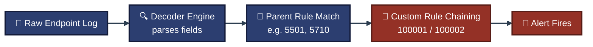
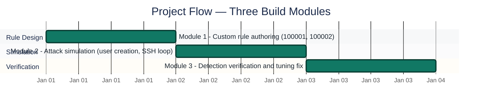
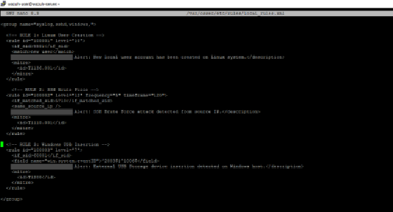
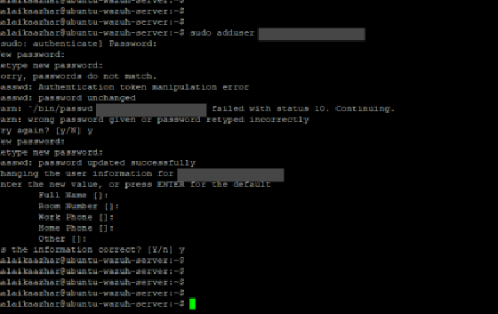
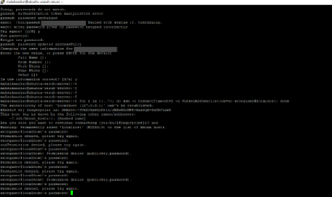
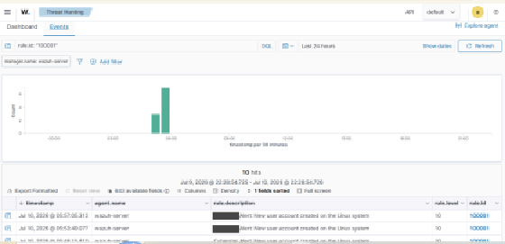
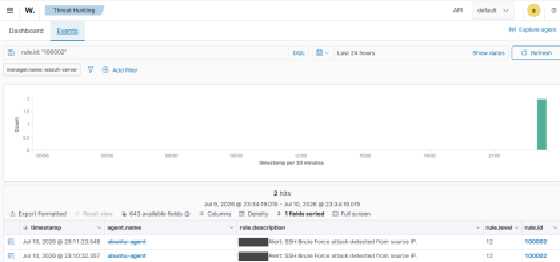
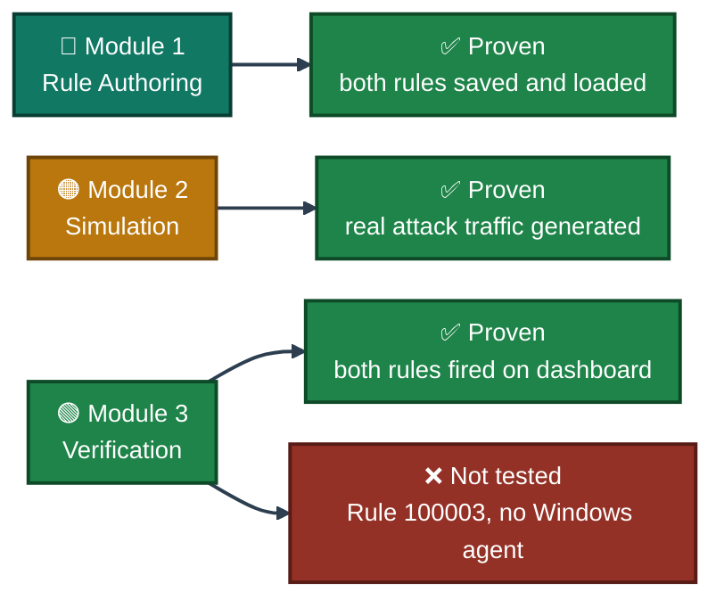
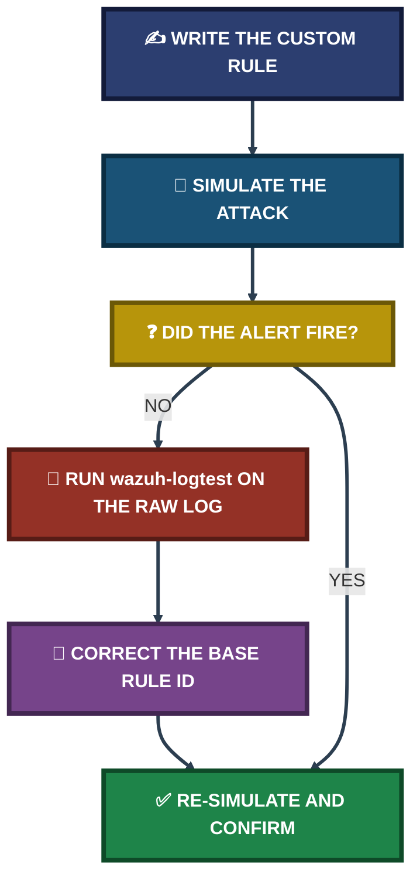

<div align="center">

# 🔓 SSH BruteForce Detection Lab

**Project 06 of 18 — Blue Team Internship Portfolio**

Custom Wazuh Rule Engineering · SSH Attack Simulation · Detection Verification


Two custom Wazuh detection rules written from scratch, tested against real attack simulations on a two-VM lab, and corrected mid-build when `wazuh-logtest` proved my first assumption about the underlying rule ID wrong. Every rule fired and was verified on the dashboard before being called done.

### [📑 Open the visual index](INDEX.md)

</div>

---

## 📑 Table of Contents

1. [At a Glance](#at-a-glance)
2. [Project Background](#project-background)
3. [Environment](#environment)
4. [Detection Pipeline](#detection-pipeline)
5. [Project Flow](#project-flow)
6. [Module 1 — Custom Rule Authoring](#module-1)
7. [Module 2 — Attack Simulation](#module-2)
8. [Module 3 — Detection Verification](#module-3)
9. [Coverage Snapshot](#coverage-snapshot)
10. [Troubleshooting Pipeline](#troubleshooting-pipeline)
11. [Command Reference](#command-reference)
12. [Project Summary](#project-summary)
13. [Challenges & Fixes](#challenges-fixes)
14. [Scope & Limitations](#scope-limitations)
15. [What I Learned](#what-i-learned)
16. [Skills Demonstrated](#skills-demonstrated)
17. [Screenshot Index](#screenshot-index)
18. [Repo Structure](#repo-structure)

---

<a id="at-a-glance"></a>
## 📊 At a Glance

| 🧩 Custom Rules Written | 🖼️ Screenshots | 🎯 MITRE Techniques Mapped | 🔁 Attempts to Get the Rule Right | 💰 Cost |
|:---:|:---:|:---:|:---:|:---:|
| **2** | **5** | **2** | **2** | **$0** |

---

<a id="project-background"></a>
## 📖 Project Background

A default Wazuh install monitors generic infrastructure activity, but a real SOC needs detection logic tuned to its own environment. This project builds and proves two custom rules on a two-VM lab (one Wazuh Manager, one Ubuntu agent):

- **Rule 100001:** A new local user account being created — a classic persistence indicator.
- **Rule 100002:** Rapid, repeated SSH password failures from one source — brute-force password guessing.

> [!NOTE]
> A third rule (100003, Windows USB insertion) was written and syntax-checked into the same rules file, but **never simulated or validated** — the lab had no Windows agent at the time. It is left out of this project's verified scope; see Scope & Limitations.

<div align="center">

### 🧩 Lab Setup at a Glance

<table>
<tr>
<td align="center" valign="top" width="42%">


**Monitored Endpoint**<br>
<sub>Generates the raw auth.log events</sub>

</td>
<td align="center" valign="middle" width="16%">

**➜**<br>
<sub>telemetry</sub>

</td>
<td align="center" valign="top" width="42%">


**Custom Rules Engine**<br>
<sub>Rule 100001 + Rule 100002</sub>

</td>
</tr>
</table>

</div>

---

<a id="environment"></a>
## 🖧 Environment

| Item | Value |
|---|---|
| **Lab Topology** | 2 VMs: Wazuh Manager/Indexer/Dashboard + Ubuntu Server agent |
| **Rules File** | `/var/ossec/etc/rules/local_rules.xml` (persists across software updates) |
| **Rule 100001** | Level 10, `if_sid` 5501, `<match>new user</match>`, MITRE `T1136.001` |
| **Rule 100002** | Level 12, `frequency="5"` `timeframe="120"`, `if_matched_sid` 5710, `<same_source_ip/>`, MITRE `T1110.001` |
| **Base Pattern Used** | Rule 5710 (invalid user) — corrected from an initial assumption of 5716 |
| **Windows Agent** | Not present in this lab — Rule 100003 written but not tested |

---

<a id="detection-pipeline"></a>
## 🔬 Detection Pipeline


<p align="center"><em>Custom rules inherit from a parent rule via <code>if_sid</code> / <code>if_matched_sid</code> rather than being built from scratch — they reuse the parent's already-parsed fields.</em></p>

---

<a id="project-flow"></a>
## ⏱️ Project Flow


<p align="center"><em>Dates are relative sequence markers. All three modules complete.</em></p>

---

<a id="module-1"></a>
## 🔵 Module 1 — Custom Rule Authoring

**Objective:** Write two detection rules directly into `local_rules.xml`, each inheriting from a parent rule rather than parsing raw logs from scratch.

### Step 1 — Author both rules in `local_rules.xml` ✅

```xml
<!-- RULE 1: Linux Local User Account Creation -->
<rule id="100001" level="10">
  <if_sid>5501</if_sid>
  <match>new user</match>
  <description>Alert: New local user account has been created on Linux system.</description>
  <mitre><id>T1136.001</id></mitre>
</rule>

<!-- RULE 2: SSH High-Frequency Brute Force Detection -->
<rule id="100002" level="12" frequency="5" timeframe="120">
  <if_matched_sid>5710</if_matched_sid>
  <same_source_ip />
  <description>Alert: SSH Brute Force attack detected from source IP.</description>
  <mitre><id>T1110.001</id></mitre>
</rule>
```

<p align="center">
  <br>
  <em>Exhibit 1 — <code>local_rules.xml</code> custom rule block saved on the Wazuh Manager via <code>nano</code></em>
</p>

🎯 **Design decision:** Rule 100002 combines `frequency="5"` with `timeframe="120"` deliberately — frequency alone could fire on five failures spread across several days. Requiring five failures inside a 2-minute window is what actually separates an automated brute-force burst from ordinary mistyped passwords.

---

<a id="module-2"></a>
## 🟠 Module 2 — Attack Simulation

**Objective:** Trigger both rules with real activity on the Ubuntu agent, not synthetic test data.

### Step 2 — Provision a new local user (Rule 100001 trigger) ✅

```
sudo adduser lab_test_user
```

<p align="center">
  <br>
  <em>Exhibit 2 — <code>adduser lab_test_user</code> executed on the Ubuntu agent</em>
</p>

### Step 3 — Run the SSH brute-force loop (Rule 100002 trigger) ✅

```
for i in {1..10}; do ssh -o ConnectTimeout=2 -o PubkeyAuthentication=no wronguser@localhost; done
```

<p align="center">
  <br>
  <em>Exhibit 3 — SSH brute-force loop generating repeated <code>Permission denied</code> failures</em>
</p>

---

<a id="module-3"></a>
## 🟢 Module 3 — Detection Verification

**Objective:** Confirm both rules actually fired on the dashboard, and fix the one that didn't fire correctly the first time.

### Step 4 — Confirm Rule 100001 fired ✅

<p align="center">
  <br>
  <em>Exhibit 4 — Threat Hunting panel: Rule 100001 (Level 10) firing on the new-user event</em>
</p>

### Step 5 — Confirm Rule 100002 fired, after a mid-build correction ✅

`wazuh-logtest` showed the target logging failures under base pattern **5710** (invalid user) — not **5716**, which I had initially assumed. The rule was corrected from `if_matched_sid` `5716` to `5710` before it would match.

<p align="center">
  <br>
  <em>Exhibit 5 — Threat Hunting panel: Rule 100002 (Level 12) firing on the SSH brute-force burst</em>
</p>

🎯 **Result:** Both rules fired against real, self-generated attack traffic, and the false SSH-rule assumption was caught with `wazuh-logtest` before being called complete — not discovered later during dashboard review.

---

<a id="coverage-snapshot"></a>
## 🌟 Coverage Snapshot

| 🛡️ Rule | ✅ Status | 📌 Detail |
|---|---|---|
| 100001 — New User Creation | Complete | Fired correctly on first test, no tuning needed |
| 100002 — SSH Brute Force | Complete | Base pattern corrected from 5716 → 5710 via `wazuh-logtest`, then fired correctly |
| 100003 — Windows USB Insertion | Not tested | No Windows agent available in this lab; syntax-only |

### 🧾 What the Evidence Proves



---

<a id="troubleshooting-pipeline"></a>
## 🧭 Troubleshooting Pipeline

How a wrong rule assumption gets caught before it ships



---

<a id="command-reference"></a>
## 🧰 Command Reference

| # | Command / Config | Used In | Purpose |
|:---:|---|---|---|
| 1 | `sudo adduser lab_test_user` | Module 2 | Trigger Rule 100001 with a real new-user event |
| 2 | `for i in {1..10}; do ssh -o ConnectTimeout=2 -o PubkeyAuthentication=no wronguser@localhost; done` | Module 2 | Generate a rapid SSH failure burst to trigger Rule 100002 |
| 3 | `wazuh-logtest` | Module 3 | Test a raw log line against the rules engine to find the true base rule ID |
| 4 | `<if_matched_sid>5710</if_matched_sid>` | Module 1 / 3 | Corrected base pattern for SSH invalid-user failures |
| 5 | `<same_source_ip />` | Module 1 | Restrict Rule 100002 to failures from one IP, avoiding false positives from multiple users mistyping at once |

---

<a id="project-summary"></a>
## 📝 Project Summary

| Module | Tooling | Key Outcome |
|---|---|---|
| Module 1 — Rule Authoring | `local_rules.xml`, `nano` | Two custom rules written, inheriting from parent rules 5501 and 5710 |
| Module 2 — Attack Simulation | `adduser`, bash SSH loop | Real new-user event and a genuine 10-attempt SSH failure burst generated |
| Module 3 — Detection Verification | Wazuh Threat Hunting, `wazuh-logtest` | Both rules confirmed firing; one base-pattern assumption corrected before completion |

---

<a id="challenges-fixes"></a>
## ⚠️ Challenges & Fixes

| ❌ Challenge | ✅ Fix |
|---|---|
| Rule 100002 initially built against base pattern 5716 (assumed) | `wazuh-logtest` showed the real pattern was 5710 (invalid user); corrected `if_matched_sid` before re-testing |
| Frequency-only threshold could fire on failures spread days apart | Added `timeframe="120"` alongside `frequency="5"` to require a genuine 2-minute burst |
| Multiple users mistyping passwords at once could falsely resemble a brute-force burst | Added `<same_source_ip/>` to scope the rule to one attacking IP |
| Rule 100003 (Windows USB) had no endpoint to validate against | Left syntactically integrated but explicitly marked "Not Tested" rather than claimed complete |

---

<a id="scope-limitations"></a>
## 🚧 Scope & Limitations

- **Rule 100003 not validated:** No Windows agent existed in this lab; the rule is written and syntax-checked only, not simulated or confirmed to fire.
- **Single attacking source:** The SSH brute-force simulation used one source (`localhost`), so distributed/multi-IP brute-force behavior was not tested.
- **Two-VM lab only:** Wazuh Manager + one Ubuntu agent — no additional endpoints or network segmentation involved in this specific module.
- **`wronguser` target, not a real account:** The SSH loop authenticates against a non-existent user by design, to generate failures without risking a real account lockout.

---

<a id="what-i-learned"></a>
## 🧠 What I Learned

- **A rule assumption should be tested, not trusted.** Assuming base pattern 5716 seemed reasonable, but `wazuh-logtest` against the actual raw log proved it was 5710 — checking against real data caught the error before the rule shipped.
- **Frequency needs a timeframe to mean anything.** Five events with no timeframe can span days; pairing it with a timeframe is what actually captures "a burst," not just "eventually five."
- **`same_source_ip` is cheap insurance against false positives.** Without it, several people mistyping passwords around the same time could look like one coordinated attack.
- **Parent-rule inheritance keeps custom rules simple.** Chaining from an already-decoded parent rule (5501, 5710) means the custom rule only has to add the specific condition that matters, not re-parse the whole log line.
- **"Not Tested" is a valid, honest status.** Rule 100003 stayed in the file for future validation rather than being deleted or falsely marked complete.

---

<a id="skills-demonstrated"></a>
## 🛠️ Skills Demonstrated

- Writing custom Wazuh detection rules in XML, chained from parent rules via `if_sid` / `if_matched_sid`
- Mapping custom rules to MITRE ATT&CK techniques (`T1136.001`, `T1110.001`)
- Using `wazuh-logtest` to verify a rule's real base pattern against raw log data
- Balancing `frequency` and `timeframe` to distinguish a genuine attack burst from coincidental noise
- Reducing false positives with scoping conditions (`same_source_ip`)
- Generating real attack traffic (SSH failure bursts) to validate detection logic end to end
- Documenting what was tested against real telemetry versus what remains unvalidated

---

<a id="screenshot-index"></a>
## 🖼️ Screenshot Index

| # | File | Shows |
|:---:|---|---|
| 1 | `ss-01-custom-rules-local-rules-xml.PNG` | `local_rules.xml` custom rule block saved via `nano` |
| 2 | `ss-02-new-user-creation-command.PNG` | `adduser lab_test_user` executed on the Ubuntu agent |
| 3 | `ss-03-ssh-bruteforce-loop-trigger.PNG` | SSH brute-force loop generating repeated `Permission denied` failures |
| 4 | `ss-04-alert-new-user-creation-firing.PNG` | Rule 100001 (Level 10) firing on the new-user event |
| 5 | `ss-05-alert-ssh-bruteforce-firing.PNG` | Rule 100002 (Level 12) firing on the SSH brute-force burst |

---

<a id="repo-structure"></a>
## 📁 Repo Structure

```text
project-06-ssh-bruteforce-detection-lab/
|-- README.md
|-- INDEX.md
`-- screenshots/
    |-- ss-01-custom-rules-local-rules-xml.PNG
    |-- ss-02-new-user-creation-command.PNG
    |-- ss-03-ssh-bruteforce-loop-trigger.PNG
    |-- ss-04-alert-new-user-creation-firing.PNG
    `-- ss-05-alert-ssh-bruteforce-firing.PNG
```

<div align="center">

🛡️ **[Wazuh Rules Docs](https://documentation.wazuh.com/current/user-manual/ruleset/index.html)** · 🐧 **[Ubuntu Server](https://ubuntu.com/server)** · 🧭 **[MITRE ATT&CK](https://attack.mitre.org)** · 🧭 **[Troubleshooting Pipeline](#troubleshooting-pipeline)**

</div>
