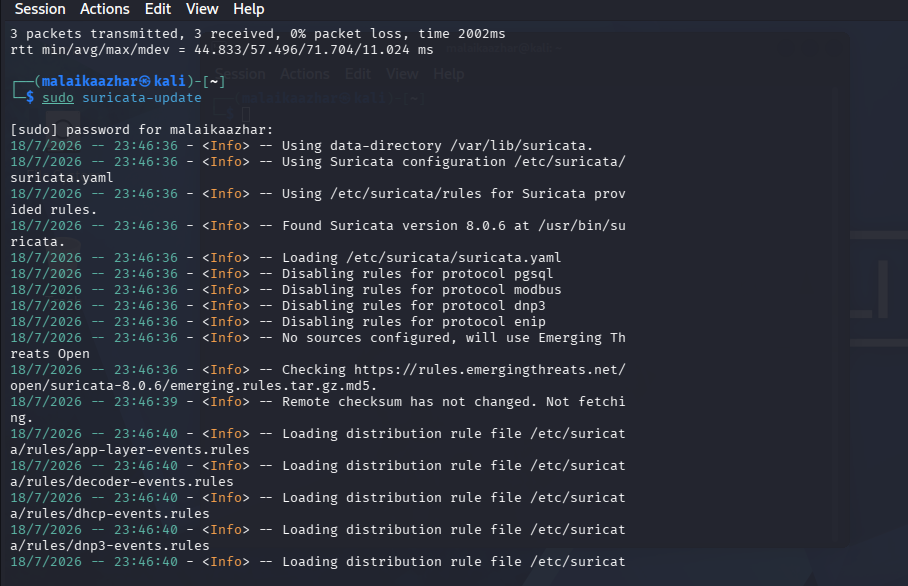
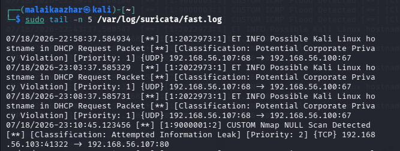
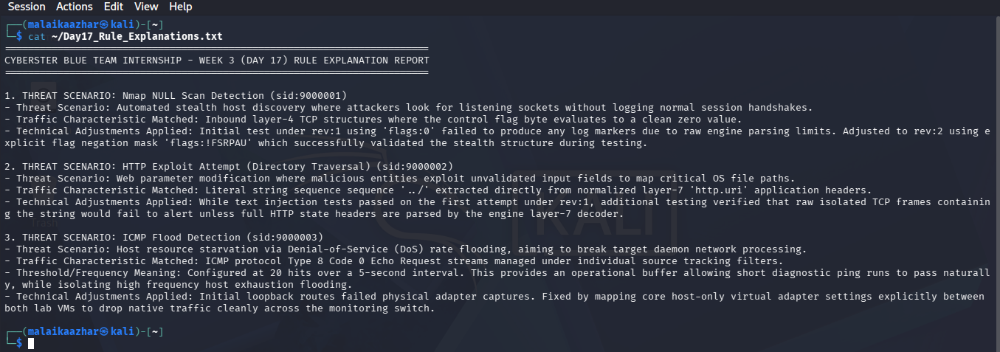
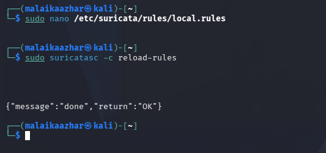

<a id="top"></a>
<div align="center">

# 🔍 Project 07 — Index
### Port Scan Detection Lab
**Project 07 of 29 — Advanced Cyber Projects**


**Quick guide to every step and screenshot in this project.**

### [📖 Open the full README](README.md)

</div>

---

<div align="center">

| 🧩 Modules | 🖼️ Screenshots | 📜 Signature Revisions | 🎯 MITRE Techniques |
|:---:|:---:|:---:|:---:|
| **2** | **4** | **2 (iterated live)** | **1** |

</div>

<p align="center">🧩 <b>Lab:</b> Kali Linux (Nmap NULL scan) ➜ Suricata IDS sensor, custom signature in <code>local.rules</code></p>

---

## 📑 Step Index

All 6 steps of the project, with the screenshot that proves each one.

| # | Step | Module | Result | Evidence |
|:---:|---|:---:|---|:---:|
| 1 | Update the Suricata ruleset | 🔵 Module 1 | Checksum verified against Emerging Threats Open | [Exhibit 1](#ex1) |
| 2 | Author the NULL scan detection signature | 🔵 Module 1 | `sid:9000001`, `flags:0` bitmask match | Code block (see README) |
| 3 | Trigger a real NULL scan | 🟢 Module 2 | `nmap -sN` run against the monitored host | Commands (see README) |
| 4 | Confirm the signature fires in `fast.log` | 🟢 Module 2 | Alert logged, classified as Attempted Information Leak | [Exhibit 2](#ex2) |
| 5 | Document the detection rationale | 🟢 Module 2 | Written threat-scenario and adjustment report | [Exhibit 3](#ex3) |
| 6 | Reload the corrected rule into a running sensor | 🟢 Module 2 | `{"message":"done","return":"OK"}`, zero downtime | [Exhibit 4](#ex4) |

---

## 🔵 Module 1 — Signature Authoring & Iteration

Exhibit 1. Click a screenshot to open it full size.

<table>
<tr>
<td align="center" valign="top" width="50%">
<a id="ex1"></a>
<a href="screenshots/Exhibit1_suricata_update_clean_run.png"></a>
<br><b>Exhibit 1 — Clean ruleset update</b>
<br><sub>Remote checksum verified against Emerging Threats Open, no connectivity warnings</sub>
</td>
<td align="center" valign="top" width="50%">

**✍️ Signature**
```text
alert tcp any any -> any any
(msg:"CUSTOM Nmap NULL
Scan Detected"; flags:0;
sid:9000001; rev:3;)
```
<sub>Matches a TCP packet where every control flag evaluates to zero — the fingerprint of a NULL scan probe.</sub>

</td>
</tr>
</table>

---

## 🟢 Module 2 — Live Verification & Reload

Exhibits 2 to 4.

<table>
<tr>
<td align="center" valign="top" width="33%">
<a id="ex2"></a>
<a href="screenshots/Exhibit2_nmap_null_scan_alert_firing.png"></a>
<br><b>Exhibit 2 — Alert firing</b>
<br><sub><code>fast.log</code> confirming the signature fired on a real scan</sub>
</td>
<td align="center" valign="top" width="33%">
<a id="ex3"></a>
<a href="screenshots/Exhibit3_rule_explanation_document.png"></a>
<br><b>Exhibit 3 — Rationale document</b>
<br><sub>Threat scenario, traffic characteristic, and adjustments applied</sub>
</td>
<td align="center" valign="top" width="33%">
<a id="ex4"></a>
<a href="screenshots/Exhibit4_live_rule_reload_confirmation.png"></a>
<br><b>Exhibit 4 — Live reload</b>
<br><sub><code>suricatasc reload-rules</code> — no sensor restart required</sub>
</td>
</tr>
</table>

---

## 🎯 Signature and MITRE ATT&CK

| Signature | Detects | Technique | Tactic | Status |
|:---:|---|---|---|:---:|
| `sid:9000001` | TCP NULL scan (all control flags cleared) | [T1046](https://attack.mitre.org/techniques/T1046/) | Discovery | ✅ Tested & firing |

> [!NOTE]
> The signature's first form (`flags:!FSRPAU`) looked more precise but did not reliably fire. The simpler bitmask form (`flags:0`) is what the engine actually matched — both revisions are documented in the full README.

---

<div align="center">

[⬆️ Back to top](#top) &nbsp;·&nbsp; [📖 Full README](README.md)

🔍 **[Suricata](https://suricata.io)** · 🐧 **[Nmap](https://nmap.org)** · 🎯 **[MITRE ATT&CK](https://attack.mitre.org)** · 🔄 **[Detection Pipeline](README.md#detection-pipeline)**

</div>
