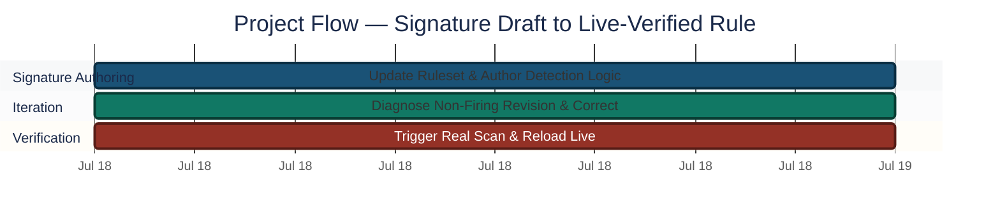
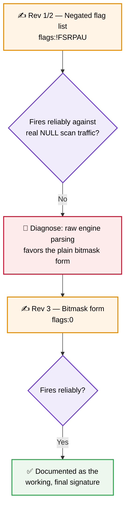
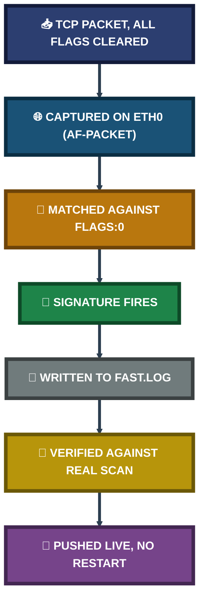

<div align="center">

# 🔍 Port Scan Detection Lab

**Project 07 of 29 — Advanced Cyber Projects**

Network IDS Rule Engineering (Suricata)


A custom Suricata signature written to detect a stealth Nmap NULL scan — tested against real scan traffic, corrected after its first form under-performed, and pushed live into a running sensor without a service restart.

### [📑 Open the visual index](INDEX.md)

</div>

---

## 📑 Table of Contents

1. [At a Glance](#at-a-glance)
2. [Project Background](#project-background)
3. [Environment](#environment)
4. [Project Flow](#project-flow)
5. [Module 1 — Signature Authoring & Iteration](#module-1)
6. [Coverage Snapshot](#coverage-snapshot)
7. [Detection Pipeline](#detection-pipeline)
8. [Module 2 — Live Verification & Reload](#module-2)
9. [MITRE ATT&CK Mapping](#mitre-mapping)
10. [Project Summary](#project-summary)
11. [Challenges & Fixes](#challenges-fixes)
12. [Scope & Limitations](#scope-limitations)
13. [What I Learned](#what-i-learned)
14. [Skills Demonstrated](#skills-demonstrated)
15. [Screenshot Index](#screenshot-index)
16. [Repo Structure](#repo-structure)

---

<a id="at-a-glance"></a>
## 📊 At a Glance

| 🧩 Modules | 🖼️ Screenshots | 📜 Signature Revisions | 🎯 MITRE Techniques |
|:---:|:---:|:---:|:---:|
| **2** | **4** | **2 (iterated live)** | **1** |

---

<a id="project-background"></a>
## 📖 Project Background

A NULL scan sends TCP packets with every control flag cleared — real TCP communication always sets at least one flag, so a completely flagless packet is not something a legitimate client ever produces. It is a fingerprint of a stealth scanning tool deliberately probing port state without completing a handshake. This project writes a signature to catch exactly that pattern, then proves the signature works against real generated traffic rather than trusting it on the strength of its syntax alone.

- **Module 1 — Signature Authoring & Iteration:** Update the ruleset, author the detection logic, and correct it after the first form failed to reliably fire.
- **Module 2 — Live Verification & Reload:** Trigger a real scan, confirm the alert in the sensor's own log, and push the corrected rule into a running sensor without any capture downtime.

> [!NOTE]
> The first version of this signature looked more precise on paper than the version that actually worked. Both are documented here, because understanding *why* the more deliberate-looking syntax under-performed is itself part of the detection-engineering skill.

<div align="center">

### 🧩 Detection Setup at a Glance

<table>
<tr>
<td align="center" valign="top" width="30%">


**Scanning Source**<br>
<sub><code>nmap -sN</code><br>Stealth NULL scan</sub>

</td>
<td align="center" valign="middle" width="10%">

**➜**

</td>
<td align="center" valign="top" width="30%">


**Detection Engine**<br>
<sub>Custom rule in<br><code>local.rules</code></sub>

</td>
<td align="center" valign="middle" width="10%">

**➜**

</td>
<td align="center" valign="top" width="20%">

**📄 fast.log**<br>
<sub>Alert confirmed<br>with SID and revision</sub>

</td>
</tr>
</table>

</div>

---

<a id="environment"></a>
## 🖧 Environment

| Item | Value |
|---|---|
| **IDS Platform** | Suricata 8.0.6 RELEASE |
| **Capture Interface** | `eth0` (af-packet) |
| **Rule File** | `/etc/suricata/rules/local.rules` |
| **Alert Log** | `/var/log/suricata/fast.log` |
| **Reload Method** | `suricatasc -c reload-rules` (live, no restart) |
| **Scan Tool** | Nmap — `nmap -sN` (TCP NULL scan) |

---

<a id="project-flow"></a>
## ⏱️ Project Flow


<p align="center"><em>Colors distinguish each project stage — all stages complete.</em></p>

---

<a id="module-1"></a>
## 🔵 Module 1 — Signature Authoring & Iteration

**Objective:** Update Suricata's ruleset against the latest Emerging Threats Open feed, then author a signature that matches the specific packet-level fingerprint of a stealth NULL scan.

### Step 1 — Update the ruleset ✅

```bash
sudo suricata-update
```

<p align="center">
  <br>
  <em>Exhibit 1 — Clean <code>suricata-update</code> run confirming the remote checksum was successfully verified against the Emerging Threats Open ruleset</em>
</p>

### Step 2 — Author the detection logic ✅

```text
alert tcp any any -> any any (msg:"CUSTOM Nmap NULL Scan Detected"; flags:0; sid:9000001; rev:3;)
```

The `flags:0` bitmask matches a TCP packet where every control flag byte evaluates to a clean zero — the exact fingerprint of a NULL scan probe, since a legitimate handshake always sets at least one flag.

### 🔍 Iteration Note — Why the More Deliberate Syntax Under-performed



The first instinct was that explicitly excluding every named flag (`flags:!FSRPAU`) would be a more precise match than the bare zero-value shorthand. In practice, the plain bitmask form (`flags:0`) is what the engine matched reliably. This is recorded rather than hidden, because a signature that *looks* more precise is not the same as a signature that *fires* correctly — the only way to know is to generate the real traffic and check the log.

---

<a id="coverage-snapshot"></a>
## 🌟 Coverage Snapshot

| 🛡️ Layer | ✅ Status | 📌 Detail |
|---|---|---|
| Ruleset Currency | Updated | Emerging Threats Open, checksum verified |
| Signature Authored | Complete | `sid:9000001` — NULL scan bitmask match |
| Live Traffic Test | Fired | Real `nmap -sN` scan against the monitored host |
| Live Reload | Confirmed | Pushed via `suricatasc`, zero capture downtime |

---

<a id="detection-pipeline"></a>
## 🧭 Detection Pipeline

How a scan packet becomes a verified, reloadable signature



---

<a id="module-2"></a>
## 🟢 Module 2 — Live Verification & Reload

**Objective:** Trigger the signature with a real scan, confirm the exact alert in the sensor's own log, document the rationale behind the detection logic, and push the corrected rule into a running sensor without interrupting capture.

### Step 3 — Trigger a real NULL scan ✅

```bash
nmap -sN 192.168.56.107
```

### Step 4 — Confirm the signature fires in fast.log ✅

<p align="center">
  <br>
  <em>Exhibit 2 — <code>fast.log</code> confirming <b>CUSTOM Nmap NULL Scan Detected</b> firing against the live scan, classified as an Attempted Information Leak</em>
</p>

### Step 5 — Document the detection rationale ✅

Each rule was documented with the threat scenario, the exact traffic characteristic matched, and any adjustment made after the first test — so the signature is self-explanatory to anyone reviewing it later.

<p align="center">
  <br>
  <em>Exhibit 3 — Written rule-explanation report covering threat scenario, traffic characteristic matched, and technical adjustments applied during testing</em>
</p>

### Step 6 — Reload the corrected rule into a running sensor ✅

```bash
sudo nano /etc/suricata/rules/local.rules
sudo suricatasc -c reload-rules
```

<p align="center">
  <br>
  <em>Exhibit 4 — Live rule reload via the Suricata socket control interface, confirming <code>{"message":"done","return":"OK"}</code> with no reload errors</em>
</p>

🎯 **Result:** The signature was corrected and pushed into a live sensor without a single service restart — an operationally significant distinction, since restarting a network sensor even briefly creates a genuine blind window in a production SOC.

| Check | Method | Outcome |
|---|---|---|
| Signature fires on real traffic | `fast.log` after live scan | ✅ Confirmed |
| Reload applied without downtime | `suricatasc -c reload-rules` | ✅ Confirmed, no restart |
| Rationale documented | Written explanation report | ✅ Confirmed |

---

<a id="mitre-mapping"></a>
## 🎯 MITRE ATT&CK Mapping

| Signature | Detects | Technique | Tactic |
|:---:|---|---|---|
| `sid:9000001` | TCP NULL scan (all control flags cleared) | [T1046](https://attack.mitre.org/techniques/T1046/) — Network Service Discovery | Discovery |

A NULL scan is reconnaissance, not exploitation — the technique maps to the Discovery tactic because the attacker is enumerating live services and port state before deciding where to focus a follow-on attack.

---

<a id="project-summary"></a>
## 📝 Project Summary

| Module | Tooling | Key Finding |
|---|---|---|
| Signature Authoring & Iteration | `suricata-update`, `local.rules` | Bitmask form (`flags:0`) fired reliably where a negated flag list did not |
| Live Verification & Reload | `nmap -sN`, `fast.log`, `suricatasc` | Real scan confirmed detected; corrected rule pushed live with zero downtime |

---

<a id="challenges-fixes"></a>
## ⚠️ Challenges & Fixes

| ❌ Challenge | ✅ Fix |
|---|---|
| The negated flag list (`flags:!FSRPAU`) looked more precise but did not reliably fire against real scan traffic | Diagnosed against live traffic and corrected to the simpler bitmask form (`flags:0`) |
| A full sensor restart would create a capture blind window while testing corrections | Used the Suricata socket control interface (`suricatasc reload-rules`) to push changes into a running sensor |

---

<a id="scope-limitations"></a>
## 🚧 Scope & Limitations

- **Single scan type:** This signature targets the NULL scan flag pattern specifically. Other stealth scan types (FIN, Xmas) would need their own signatures with different flag matches.
- **IDS mode, not IPS:** The sensor observes and logs matching traffic; it does not block the scan itself.
- **Lab-generated traffic only:** Verification is against a controlled `nmap -sN` run in the lab, not production network noise.

---

<a id="what-i-learned"></a>
## 🧠 What I Learned

- **Syntax that looks more precise is not automatically more correct.** The negated flag list was a reasonable first instinct, but the plain bitmask form is what the engine actually matched reliably against real traffic.
- **A signature is only proven by generating the real attack it targets.** Reading the rule syntax back to confirm it "looks right" is not a substitute for triggering it.
- **Live reload is an operational skill, not just a convenience.** Pushing a correction into a running sensor without a restart avoids creating the exact blind window a network IDS exists to eliminate.

---

<a id="skills-demonstrated"></a>
## 🛠️ Skills Demonstrated

- Authoring Suricata detection signatures from a raw threat scenario
- Diagnosing a non-firing rule against real triggered traffic rather than assuming syntax correctness
- Using the Suricata socket control interface for live rule reloads
- Mapping a reconnaissance-stage detection to its correct MITRE ATT&CK tactic
- Documenting rule rationale for future review, not just the final working syntax

---

<a id="screenshot-index"></a>
## 🖼️ Screenshot Index

| # | File | Shows |
|:---:|---|---|
| 1 | `Exhibit1_suricata_update_clean_run.png` | Clean `suricata-update` run, checksum verified |
| 2 | `Exhibit2_nmap_null_scan_alert_firing.png` | `fast.log` confirming the signature firing on a real scan |
| 3 | `Exhibit3_rule_explanation_document.png` | Written rationale covering threat scenario and adjustments |
| 4 | `Exhibit4_live_rule_reload_confirmation.png` | Live rule reload via `suricatasc`, no restart required |

---

<a id="repo-structure"></a>
## 📁 Repo Structure

```text
project-07-port-scan-detection-lab/
|-- README.md
|-- INDEX.md
`-- screenshots/
    |-- Exhibit1_suricata_update_clean_run.png
    |-- Exhibit2_nmap_null_scan_alert_firing.png
    |-- Exhibit3_rule_explanation_document.png
    `-- Exhibit4_live_rule_reload_confirmation.png
```

<div align="center">

🔍 **[Suricata](https://suricata.io)** · 🐧 **[Nmap](https://nmap.org)** · 🎯 **[MITRE ATT&CK](https://attack.mitre.org)** · 🔄 **[Detection Pipeline](#detection-pipeline)**

</div>
