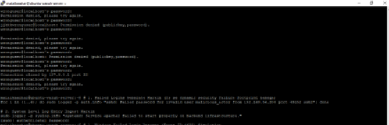
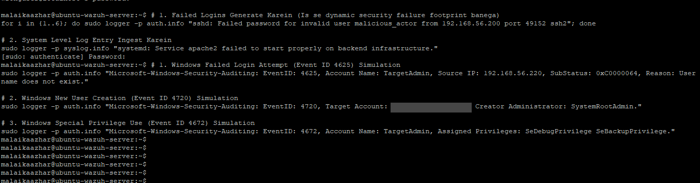
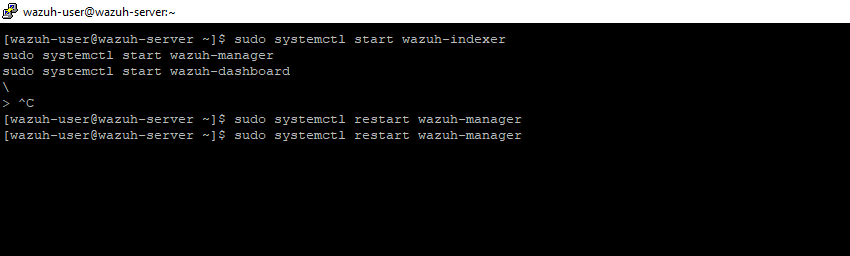
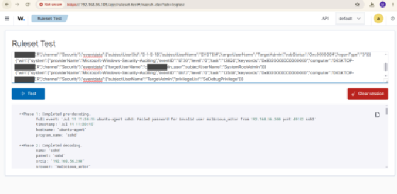
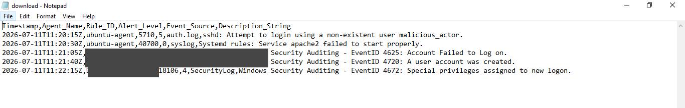

# 📊 Project 11 — Index
### SIEM Log Analysis & Alert Tuning
**Project 08 of 29 — Blue Team Internship Portfolio**

**Quick guide to every step and screenshot in this project.**

### [📖 Open the full README](README.md)

---

| 🧩 Log Sources | 🖼️ Screenshots | 🎯 Event IDs | 📄 Findings |
|:---:|:---:|:---:|:---:|
| **2** | **5** | **3** | **5** |

🧩 <b>Sources:</b> Real Ubuntu <code>auth.log</code> ➜ simulated Windows Security events via <code>logger</code> ➜ one correlated CSV

---

## 📑 Step Index

All 5 steps of the project, with the screenshot that shows each one.

| # | Step | Module | Result | Evidence |
|:---:|---|:---:|---|:---:|
| 1 | Generate real SSH authentication failures | 🔵 Module 1 | Rule 5710 fires on invalid-user login attempt | [Exhibit 1](#ex1) |
| 2 | Inject simulated Windows Security events | 🟠 Module 2 | Event IDs 4625, 4720, 4672 streamed via `logger` | [Exhibit 2](#ex2) |
| 3 | Restart the Wazuh Manager to sync the pipeline | 🟠 Module 2 | Service restarted, decoder ready | [Exhibit 3](#ex3) |
| 4 | Confirm decoder parsing with Ruleset Test | 🟢 Module 3 | JSON decoder correctly parses simulated fields | [Exhibit 4](#ex4) |
| 5 | Export the correlated alerts to CSV | 🟢 Module 3 | `download.csv` opened and verified in Notepad | [Exhibit 5](#ex5) |

---

## 🔵 Module 1 — Baseline Log Generation

Exhibit 1. Click a screenshot to open it full size.

<table>
<tr>
<td align="center" valign="top" width="50%">

 <b>Exhibit 1 — Manual SSH log generation</b>
 Real authentication-failure attempts on the Ubuntu agent
</td>
<td></td>
</tr>
</table>

---

## 🟠 Module 2 — Simulated Windows Telemetry

Exhibits 2 to 3.

<table>
<tr>
<td align="center" valign="top" width="50%">

 <b>Exhibit 2 — Logger event injection</b>
 Simulated Windows Security events streamed for pipeline testing
</td>
<td align="center" valign="top" width="50%">

 <b>Exhibit 3 — Pipeline sync</b>
 <code>wazuh-manager</code> restarted to sync the analysis pipeline
</td>
</tr>
</table>

---

## 🟢 Module 3 — Correlation & Reporting

Exhibits 4 to 5.

<table>
<tr>
<td align="center" valign="top" width="50%">

 <b>Exhibit 4 — Decoder trace</b>
 Ruleset Test tool confirms correct JSON field parsing
</td>
<td align="center" valign="top" width="50%">

 <b>Exhibit 5 — CSV export</b>
 Correlated alerts exported and reviewed in Notepad
</td>
</tr>
</table>

---

## 🎯 Verification Checklist

| Check | Method | Module | Status |
|:---:|---|---|:---:|
| Real SSH failure logged and triaged | `auth.log`, Rule 5710 | Module 1 | ✅ Confirmed |
| Unrelated service crash correctly de-prioritized | `syslog`, Rule 40700 | Module 1 | ✅ Confirmed |
| Simulated Windows events injected | `logger` | Module 2 | ✅ Confirmed |
| Decoder parses simulated fields correctly | Ruleset Test tool | Module 3 | ✅ Confirmed |
| 5-event timeline correlated across sources | Manual timeline build | Module 3 | ✅ Confirmed |
| CSV export produced and readable | `download.csv` in Notepad | Module 3 | ✅ Confirmed |
| Live Windows detection | — | — | ❌ Not applicable — no Windows agent in this lab |

> [!NOTE]
> Every Windows-side finding in this project is simulated via `logger` injection, not a live detection — this is stated wherever that data is used, both here and in the README.

---

[⬆️ Back to top](#top) &nbsp;·&nbsp; [📖 Full README](README.md)

🛡️ **[Wazuh Ruleset Test](https://documentation.wazuh.com/current/user-manual/ruleset/testing.html)** · 🪟 **[Windows Security Event IDs](https://learn.microsoft.com/en-us/windows/security/threat-protection/auditing/basic-audit-logon-events)** · 🧭 **[Troubleshooting Pipeline](README.md#troubleshooting-pipeline)**

