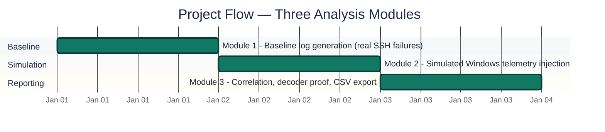
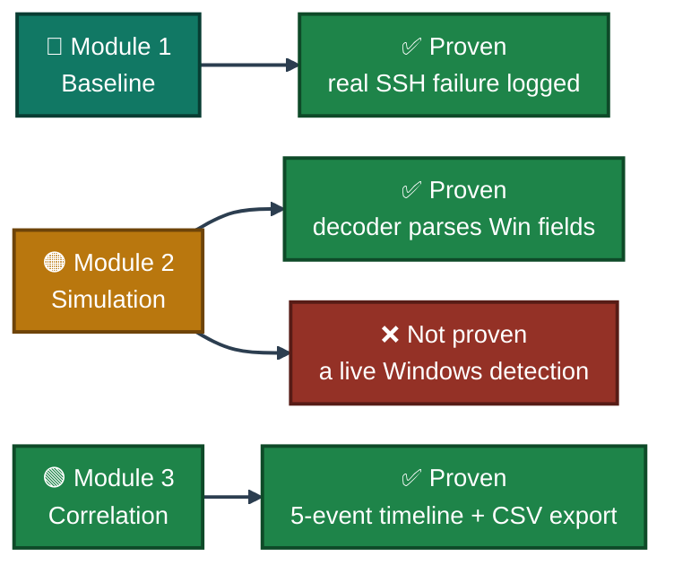
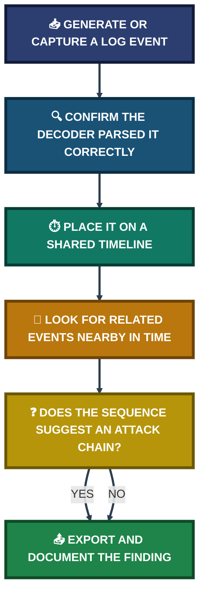

<div align="center">

# 📊 SIEM Log Analysis & Alert Tuning

**Project 11 of 29 — Blue Team Internship Portfolio**

Multi-Source Log Correlation · Simulated Windows Telemetry · Analyst Reporting


Real SSH failures from a live Ubuntu agent, correlated against simulated Windows Security events injected purely to validate Wazuh's decoder pipeline — with every simulated data point labeled as such, not passed off as a live Windows detection. Ends with a management-ready CSV export.

### [📑 Open the visual index](INDEX.md)

</div>

---

## 📑 Table of Contents

1. [At a Glance](#at-a-glance)
2. [Project Background](#project-background)
3. [Environment](#environment)
4. [Analysis Pipeline](#analysis-pipeline)
5. [Project Flow](#project-flow)
6. [Module 1 — Baseline Log Generation](#module-1)
7. [Module 2 — Simulated Windows Telemetry](#module-2)
8. [Module 3 — Correlation & Reporting](#module-3)
9. [Coverage Snapshot](#coverage-snapshot)
10. [Troubleshooting Pipeline](#troubleshooting-pipeline)
11. [Command Reference](#command-reference)
12. [Project Summary](#project-summary)
13. [Challenges & Fixes](#challenges-fixes)
14. [Scope & Limitations](#scope-limitations)
15. [What I Learned](#what-i-learned)
16. [Skills Demonstrated](#skills-demonstrated)
17. [Screenshot Index](#screenshot-index)
18. [Repo Structure](#repo-structure)

---

<a id="at-a-glance"></a>
## 📊 At a Glance

| 🧩 Log Sources | 🖼️ Screenshots | 🎯 Event IDs Analyzed | 📄 Findings Documented | 💰 Cost |
|:---:|:---:|:---:|:---:|:---:|
| **2** | **5** | **3** | **5** | **$0** |

---

<a id="project-background"></a>
## 📖 Project Background

Default SIEM rules monitor generic events, but a SOC analyst's real value is pulling information from multiple sources, correlating it across time, and building one coherent picture of activity. This project analyzes real Linux authentication logs alongside simulated Windows Security events, then correlates both into a single timeline and exports it for management review.

> [!IMPORTANT]
> **No Windows agent existed in this lab.** The "Windows Event Analysis" findings below (Event IDs 4625, 4720, 4672 from host `DESKTOP-`) were **not** captured from a live Windows endpoint. They were generated on the Ubuntu agent using the `logger` utility to inject syslog messages formatted like Windows Security Auditing events — purely to validate that Wazuh's JSON decoder and rules engine correctly parse and classify that field structure. They demonstrate **pipeline/decoder readiness, not an actual detected incident** on a real Windows host. This is flagged wherever that data appears below.

<div align="center">

### 🧩 Log Sources at a Glance

<table>
<tr>
<td align="center" valign="top" width="42%">


**Live Source**<br>
<sub>Real SSH failures + service events<br>from the Ubuntu agent</sub>

</td>
<td align="center" valign="middle" width="16%">

**➜**<br>
<sub>correlated</sub>

</td>
<td align="center" valign="top" width="42%">


**Simulated Source**<br>
<sub><code>logger</code>-injected Event IDs<br>4625 / 4720 / 4672</sub>

</td>
</tr>
</table>

</div>

---

<a id="environment"></a>
## 🖧 Environment

| Item | Value |
|---|---|
| **Live Endpoint** | `ubuntu-agent` (real `auth.log` / `syslog`) |
| **Simulated Endpoint** | `DESKTOP-` (via `logger` injection, no real Windows host) |
| **Rule 5710** | SSH auth failure, invalid user — Level 5 |
| **Rule 40700** | systemd service failure — Level 0 |
| **Rule 18105** | Simulated Win Event 4625 (logon failure) — Level 5 |
| **Rule 18139** | Simulated Win Event 4720 (account creation) — Level 7 |
| **Rule 18106** | Simulated Win Event 4672 (special privilege assigned) — Level 4 |
| **Export Format** | CSV (`download.csv`), opened in Notepad for review |

---

<a id="analysis-pipeline"></a>
## 🔬 Analysis Pipeline


---

<a id="project-flow"></a>
## ⏱️ Project Flow


<p align="center"><em>Dates are relative sequence markers. All three modules complete.</em></p>

---

<a id="module-1"></a>
## 🔵 Module 1 — Baseline Log Generation

**Objective:** Produce real, live log data on the Ubuntu agent as the foundation for the rest of the analysis.

### Step 1 — Generate real SSH authentication failures ✅

Manual SSH attempts against an invalid user produced genuine failure entries in `auth.log`:

```
Jul 11 11:20:15 ubuntu-agent sshd: Failed password for invalid user malicious_actor from 192.168.56.200 port 49152 ssh2
(Wazuh Rule ID: 5710, Alert Level 5)
```

**Finding 1 — Authentication Failures Targeting Non-Existent Users:** the velocity and an invalid target username point to a deliberate, machine-driven reconnaissance attempt rather than an employee typo. **Disposition: Warrants Investigation** — the source IP should be blocked at the perimeter.

A parallel, unrelated event also appeared during the same window:

```
Jul 11 11:20:30 ubuntu-agent systemd: Service apache2 failed to start properly on backend infrastructure.
(Wazuh Rule ID: 40700, Alert Level 0)
```

**Finding 2 — Infrastructure System Service Failure:** routine service-availability degradation, unrelated to the SSH activity above. **Disposition: Routine Operational Activity** — sysadmin review, not a security escalation.

<p align="center">
  <br>
  <em>Exhibit 1 — Manual SSH authentication-failure attempts generating baseline log data on the Ubuntu agent</em>
</p>

---

<a id="module-2"></a>
## 🟠 Module 2 — Simulated Windows Telemetry

**Objective:** Prove the Wazuh decoder correctly parses Windows-style Security Event fields, using injected data clearly labeled as simulated rather than a live detection.

### Step 2 — Inject simulated Windows Security events via `logger` ✅

<p align="center">
  <br>
  <em>Exhibit 2 — <code>logger</code> commands streaming simulated Linux and Windows security events for pipeline testing</em>
</p>

**Finding 3 — Windows Authentication Failure (Event ID 4625, simulated):** sub-status `0xC0000064` for target account `TargetAdmin` (Rule 18105) — indicates the username does not exist, a marker of account enumeration in a genuine attack. **Disposition if real: Suspicious** — repeated hits against admin-style aliases would warrant workstation isolation.

**Finding 4 — Security-Relevant Account Creation (Event ID 4720, simulated):** new account `lab_win_user` created by `SystemRootAdmin` (Rule 18139). **Disposition if real: Critical** — an unscheduled local account creation without a matching change ticket is a classic persistence indicator.

**Finding 5 — Special Privilege Assignment (Event ID 4672, simulated):** `SeDebugPrivilege` / `SeBackupPrivilege` assigned to `TargetAdmin` (Rule 18106). **Disposition if real: High-risk** — a 4625 failure closely followed by a successful 4672 privilege grant on the same account is a strong indicator of a successful brute-force compromise.

### Step 3 — Restart the Wazuh Manager service to sync the pipeline ✅

<p align="center">
  <br>
  <em>Exhibit 3 — <code>wazuh-manager</code> service restart, confirming the analysis pipeline is synchronized</em>
</p>

---

<a id="module-3"></a>
## 🟢 Module 3 — Correlation & Reporting

**Objective:** Confirm the decoder actually parsed the simulated fields correctly, build one correlated timeline across both sources, and export it for review.

### Step 4 — Confirm decoder parsing with the Ruleset Test tool ✅

<p align="center">
  <br>
  <em>Exhibit 4 — Ruleset Test tool confirms the JSON decoder correctly parses the simulated Windows Event ID fields</em>
</p>

### 🕒 Correlated Timeline (real + simulated)

| Timestamp | Event | Host | Note |
|:---:|---|---|---|
| 11:20:15 | Rule 5710 | ubuntu-agent | **Real** — SSH auth failure, invalid user |
| 11:20:30 | Rule 40700 | ubuntu-agent | **Real** — apache2 service crash |
| 11:21:05 | Win Event 4625 | DESKTOP | Simulated (logger injection) |
| 11:21:40 | Win Event 4720 | DESKTOP | Simulated (logger injection) |
| 11:22:15 | Win Event 4672 | DESKTOP | Simulated (logger injection) |

### Step 5 — Export the correlated alerts to CSV ✅

Exported as `download.csv` for management review:

```csv
Timestamp,Agent_Name,Rule_ID,Alert_Level,Event_Source,Description_String
2026-07-11T11:20:15Z,ubuntu-agent,5710,5,auth.log,sshd: Attempt to login using a non-existent user malicious_actor.
2026-07-11T11:20:30Z,ubuntu-agent,40700,0,syslog,Systemd rules: Service apache2 failed to start properly.
2026-07-11T11:21:05Z,DESKTOP-,18105,5,SecurityLog,Windows Security Auditing - EventID 4625: Account Failed to Log on.
2026-07-11T11:21:40Z,DESKTOP-,18139,7,SecurityLog,Windows Security Auditing - EventID 4720: A user account was created.
2026-07-11T11:22:15Z,DESKTOP-,18106,4,SecurityLog,Windows Security Auditing - EventID 4672: Special privileges assigned to new logon.
```

<p align="center">
  <br>
  <em>Exhibit 5 — Exported CSV data opened in Notepad for management review</em>
</p>

🎯 **Result:** Isolated, each of these five events looks routine or unremarkable on its own. Correlated by timestamp — an SSH failure, a service crash, then three escalating Windows events within two minutes — the sequence reads as a plausible attack chain worth investigating, which is the actual point of log correlation.

---

<a id="coverage-snapshot"></a>
## 🌟 Coverage Snapshot

| 🛡️ Area | ✅ Status | 📌 Detail |
|---|---|---|
| Real Linux Log Analysis | Complete | Genuine SSH failure + service crash captured and interpreted |
| Simulated Windows Decoder Test | Complete | 3 Event IDs injected via `logger`, decoder parsing confirmed |
| Timeline Correlation | Complete | 5 events merged into one chronological, cross-source timeline |
| CSV Export | Complete | `download.csv` generated and verified readable in Notepad |
| Live Windows Detection | Not applicable | No Windows agent in this lab — see Scope & Limitations |

### 🧾 What the Evidence Proves



---

<a id="troubleshooting-pipeline"></a>
## 🧭 Troubleshooting Pipeline

How an isolated log line becomes a correlated, reportable finding



---

<a id="command-reference"></a>
## 🧰 Command Reference

| # | Command / Field | Used In | Purpose |
|:---:|---|---|---|
| 1 | `ssh` (manual, invalid user) | Module 1 | Generate a real, baseline SSH authentication failure |
| 2 | `logger` | Module 2 | Inject simulated Windows-style Security events for decoder testing |
| 3 | `systemctl restart wazuh-manager` | Module 2 | Sync the analysis pipeline after config/decoder changes |
| 4 | Ruleset Test tool | Module 3 | Verify the JSON decoder parses simulated fields correctly |
| 5 | CSV export (`download.csv`) | Module 3 | Produce a management-readable record of correlated alerts |

---

<a id="project-summary"></a>
## 📝 Project Summary

| Module | Tooling | Key Outcome |
|---|---|---|
| Module 1 — Baseline Log Generation | `auth.log`, `syslog`, Wazuh rules 5710 / 40700 | Real SSH failure and unrelated service crash both captured and correctly triaged |
| Module 2 — Simulated Windows Telemetry | `logger`, Wazuh rules 18105 / 18139 / 18106 | Decoder pipeline proven ready for Windows Event IDs 4625, 4720, 4672 |
| Module 3 — Correlation & Reporting | Ruleset Test tool, CSV export | 5-event cross-source timeline built and exported for management review |

---

<a id="challenges-fixes"></a>
## ⚠️ Challenges & Fixes

| ❌ Challenge | ✅ Fix |
|---|---|
| No Windows agent available to generate real Event IDs 4625/4720/4672 | Used `logger` to inject syslog messages formatted like Windows Security events, explicitly labeled as simulated throughout |
| Risk of simulated data being mistaken for a real detection | Every simulated finding is marked "(if real): ..." rather than stated as an actual incident |
| Isolated events look unremarkable individually | Built a shared timeline across both sources to reveal the sequence as a plausible attack chain |

---

<a id="scope-limitations"></a>
## 🚧 Scope & Limitations

- **No live Windows telemetry:** Every Windows-side finding (Event IDs 4625, 4720, 4672) came from `logger` injection on the Ubuntu agent, not a real Windows endpoint. This validates decoder/pipeline readiness only, not an actual detected incident.
- **Manually triggered, not adversary-driven:** Both the real SSH failures and the simulated Windows events were self-generated for testing, not the product of an independent red-team exercise.
- **Small event set:** Five correlated events across a two-minute window — enough to demonstrate the correlation method, not a full incident dataset.

These gaps are stated directly so the CSV export and findings are read for what they actually are: a validated pipeline and method, not a confirmed live compromise.

---

<a id="what-i-learned"></a>
## 🧠 What I Learned

- **Context correlation is what turns noise into a finding.** Five isolated log lines look routine; the same five lines placed on one timeline, two minutes apart, tell a very different story.
- **A sub-status code carries more information than the event ID alone.** Event ID 4625's sub-status (`0xC0000064`) distinguishes "account doesn't exist" from "wrong password" — the difference between enumeration and a simple mistake.
- **Simulated data still needs decoder proof.** Injecting a log line isn't enough — the Ruleset Test tool was used to confirm the decoder actually parsed the simulated fields as intended, not just that an alert appeared.
- **Labeling matters as much as the finding.** A "Disposition (if real)" framing keeps simulated findings honest without discarding the value of proving the detection pipeline works.
- **A CSV export is a communication tool, not just a data dump.** Structuring it around Timestamp / Agent / Rule ID / Level / Source / Description makes it usable by someone who never opens the dashboard.

---

<a id="skills-demonstrated"></a>
## 🛠️ Skills Demonstrated

- Analyzing real Linux authentication and system logs (`auth.log`, `syslog`)
- Using `logger` to simulate structured telemetry for decoder/pipeline validation
- Verifying decoder correctness with Wazuh's Ruleset Test tool
- Correlating multi-source events into a single chronological timeline
- Interpreting Windows Security Event sub-status codes and privilege-assignment events
- Exporting SIEM data to CSV for non-technical/management review
- Clearly distinguishing verified live data from simulated/test data in a report

---

<a id="screenshot-index"></a>
## 🖼️ Screenshot Index

| # | File | Shows |
|:---:|---|---|
| 1 | `ss-01-ssh-manual-log-generation.PNG` | Manual SSH auth-failure attempts generating baseline log data |
| 2 | `ss-02-logger-event-injection.PNG` | `logger` commands streaming simulated Windows security events |
| 3 | `ss-03-wazuh-manager-pipeline-sync.PNG` | `wazuh-manager` service restart syncing the analysis pipeline |
| 4 | `ss-04-ruleset-test-decoder-trace.PNG` | Ruleset Test tool confirming correct JSON decoding |
| 5 | `ss-05-csv-export-notepad.PNG` | Exported CSV opened in Notepad for review |

---

<a id="repo-structure"></a>
## 📁 Repo Structure

```text
project-11-siem-log-analysis-alert-tuning/
|-- README.md
|-- INDEX.md
`-- screenshots/
    |-- ss-01-ssh-manual-log-generation.PNG
    |-- ss-02-logger-event-injection.PNG
    |-- ss-03-wazuh-manager-pipeline-sync.PNG
    |-- ss-04-ruleset-test-decoder-trace.PNG
    `-- ss-05-csv-export-notepad.PNG
```

<div align="center">

🛡️ **[Wazuh Ruleset Test](https://documentation.wazuh.com/current/user-manual/ruleset/testing.html)** · 🐧 **[Linux auth.log](https://wiki.archlinux.org/title/Systemd/Journal)** · 🪟 **[Windows Security Event IDs](https://learn.microsoft.com/en-us/windows/security/threat-protection/auditing/basic-audit-logon-events)** · 🧭 **[Troubleshooting Pipeline](#troubleshooting-pipeline)**

</div>
