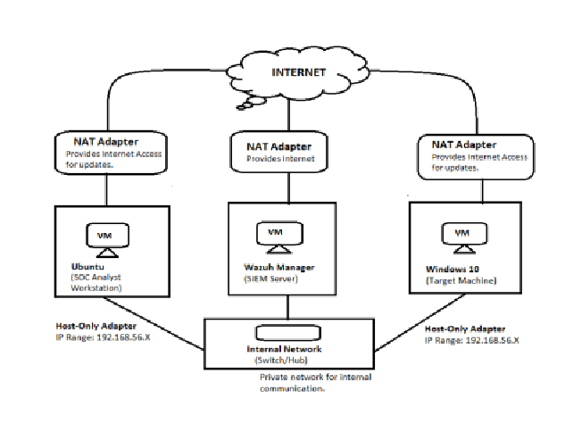
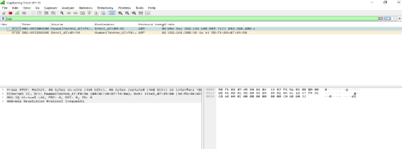
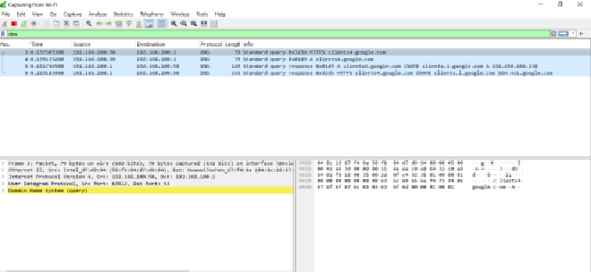
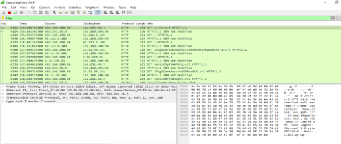
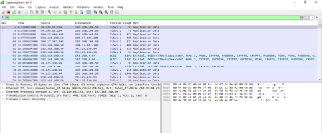
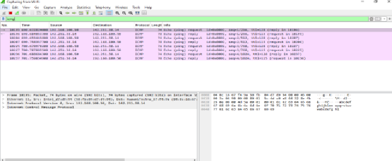

# 🦈 Project 13 — Index
### Network Traffic Analysis (Wireshark)
**Project 10 of 29 — Blue Team Internship Portfolio**

**Quick guide to every step and screenshot in this project.**

### [📖 Open the full README](README.md)

---

| 🧩 Protocols | 🖼️ Screenshots | 🔌 Ports Documented | 📶 OSI Layers Traced |
|:---:|:---:|:---:|:---:|
| **5** | **6** | **7** | **4** |

🧩 <b>Capture:</b> Laptop on Wi-Fi ➜ Wireshark, live traffic + one deliberately generated protocol (ICMP)

---

## 📑 Step Index

All 6 steps of the project, with the screenshot that shows each one.

| # | Step | Module | Result | Evidence |
|:---:|---|:---:|---|:---:|
| 1 | Diagram the planned lab topology | 🔵 Module 1 | Three-VM, dual-adapter design mapped | [Exhibit 1](#ex1) |
| 2 | Capture ARP | 🟠 Module 2 | Router resolves a known IP to a MAC address | [Exhibit 2](#ex2) |
| 3 | Capture DNS | 🟠 Module 2 | Standard query resolved via CNAME to an IP | [Exhibit 3](#ex3) |
| 4 | Capture HTTP | 🟠 Module 2 | Plain-text GET fetching a Certificate Revocation List | [Exhibit 4](#ex4) |
| 5 | Capture HTTPS/TLS | 🟠 Module 2 | TLSv1.2 Application Data between known hosts | [Exhibit 5](#ex5) |
| 6 | Capture ICMP | 🟠 Module 2 | 4 echo request/reply pairs, generated manually via `ping` | [Exhibit 6](#ex6) |

---

## 🔵 Module 1 — Lab Topology

Exhibit 1. Click a screenshot to open it full size.

<table>
<tr>
<td align="center" valign="top" width="50%">

 <b>Exhibit 1 — Planned lab topology</b>
 Three VMs, each with NAT + Host-only adapters
</td>
<td></td>
</tr>
</table>

---

## 🟠 Module 2 — Protocol Capture: Normal vs Suspicious

Exhibits 2 to 6.

<table>
<tr>
<td align="center" valign="top" width="50%">

 <b>Exhibit 2 — ARP</b>
 Router resolves a known IP to a MAC address
</td>
<td align="center" valign="top" width="50%">

 <b>Exhibit 3 — DNS</b>
 Standard query resolved via CNAME to an IP
</td>
</tr>
<tr>
<td align="center" valign="top" width="50%">

 <b>Exhibit 4 — HTTP</b>
 Plain-text GET fetching a Certificate Revocation List
</td>
<td align="center" valign="top" width="50%">

 <b>Exhibit 5 — HTTPS/TLS</b>
 TLSv1.2 Application Data, normal encrypted browsing
</td>
</tr>
<tr>
<td align="center" valign="top" width="50%">

 <b>Exhibit 6 — ICMP</b>
 4 echo request/reply pairs, generated manually
</td>
<td></td>
</tr>
</table>

---

## 🎯 Verification Checklist

| Check | Method | Module | Status |
|:---:|---|---|:---:|
| ARP normal resolution captured | Wireshark live capture | Module 2 | ✅ Confirmed |
| DNS normal resolution captured | Wireshark live capture | Module 2 | ✅ Confirmed |
| HTTP plaintext traffic captured | Wireshark live capture | Module 2 | ✅ Confirmed |
| HTTPS/TLS encrypted traffic captured | Wireshark live capture | Module 2 | ✅ Confirmed |
| ICMP traffic captured | `ping -c 4 8.8.8.8` + Wireshark | Module 2 | ✅ Confirmed (required manual generation) |
| A real attack/suspicious packet | — | — | ❌ Not present — suspicious patterns documented conceptually only |

> [!NOTE]
> The "suspicious traffic" side of each protocol reflects known attack patterns, not a captured attack — no real malicious traffic was present on this network. This is stated directly rather than implied.

---

[⬆️ Back to top](#top) &nbsp;·&nbsp; [📖 Full README](README.md)

🦈 **[Wireshark](https://www.wireshark.org)** · 🧭 **[OSI Model](https://en.wikipedia.org/wiki/OSI_model)** · 🧭 **[Troubleshooting Pipeline](README.md#troubleshooting-pipeline)**

