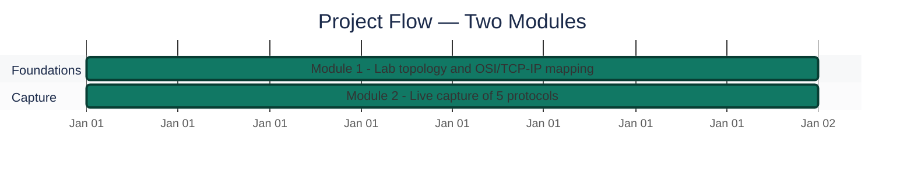
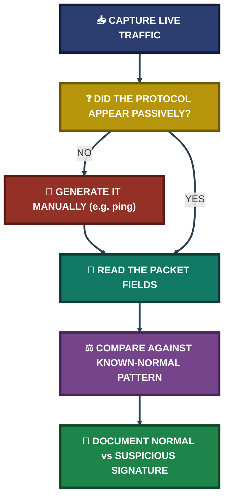

<div align="center">

# 🦈 Network Traffic Analysis (Wireshark)

**Project 13 of 29 — Blue Team Internship Portfolio**

OSI/TCP-IP Fundamentals · Live Packet Capture · Normal vs Suspicious Traffic


Five core protocols captured live and read packet by packet — ARP, DNS, HTTP, HTTPS/TLS, and ICMP — each documented as what normal traffic looks like versus what would flag it as suspicious. One protocol (ICMP) never appeared until it was deliberately generated, and one early assumption about ARP was caught and corrected against the actual capture.

### [📑 Open the visual index](INDEX.md)

</div>

---

## 📑 Table of Contents

1. [At a Glance](#at-a-glance)
2. [Project Background](#project-background)
3. [OSI / TCP-IP Trace](#osi-tcpip-trace)
4. [SOC Ports Reference](#soc-ports-reference)
5. [Project Flow](#project-flow)
6. [Module 1 — Lab Topology](#module-1)
7. [Module 2 — Protocol Capture: Normal vs Suspicious](#module-2)
8. [Coverage Snapshot](#coverage-snapshot)
9. [Troubleshooting Pipeline](#troubleshooting-pipeline)
10. [Command Reference](#command-reference)
11. [Project Summary](#project-summary)
12. [Challenges & Fixes](#challenges-fixes)
13. [Scope & Limitations](#scope-limitations)
14. [What I Learned](#what-i-learned)
15. [Skills Demonstrated](#skills-demonstrated)
16. [Screenshot Index](#screenshot-index)
17. [Repo Structure](#repo-structure)

---

<a id="at-a-glance"></a>
## 📊 At a Glance

| 🧩 Protocols Analyzed | 🖼️ Screenshots | 🔌 SOC Ports Documented | 📶 Layers Traced | 💰 Cost |
|:---:|:---:|:---:|:---:|:---:|
| **5** | **6** | **7** | **4** | **$0** |

---

<a id="project-background"></a>
## 📖 Project Background

Before touching any SIEM tooling, this project builds the foundation underneath it: how a request actually moves through the network stack, and what five of the most common protocols look like on the wire — both in ordinary use and when they turn suspicious. Live traffic was captured in Wireshark on my own laptop, since the VM lab itself was built the following module.

<div align="center">

### 🧩 Protocols Covered at a Glance

| Protocol | Normal Signal | Suspicious Signal |
|---|---|---|
| **ARP** | Router resolves a known IP to a MAC address | One MAC suddenly claims multiple IPs (spoofing/MITM) |
| **DNS** | Standard query resolved via CNAME to an IP | Long, randomized domains — possible C2 beaconing |
| **HTTP** | Plain-text CRL checks, routine cert validation | Logins/cookies sent unencrypted, readable by anyone sniffing |
| **HTTPS/TLS** | Encrypted `Application Data` between known hosts | Untrusted/expired cert, or sudden large uploads to an unknown host |
| **ICMP** | A handful of echo request/reply pairs from a manual `ping` | A continuous flood of oversized packets — scanning or DoS |

</div>

---

<a id="osi-tcpip-trace"></a>
## 🗺️ OSI / TCP-IP Trace — Following One Web Request

| Layer | What Happens |
|---|---|
| **Application** | Type a URL, browser sends an HTTP/HTTPS request. A DNS query goes out first to resolve the server's IP. |
| **Transport** | The request is split into TCP segments, targeting port 443 for secure traffic. Sequence numbers and handshakes ensure no data is lost. |
| **Network** | Source IP (my PC) and destination IP (the server) are added, forming an IP packet so routers know where to send it. |
| **Data Link & Physical** | The packet gets a MAC address label and travels over Wi-Fi or cable as electrical signals; the server reverses the process to read it. |

**Subnetting note:** on a standard `/24` network (mask `255.255.255.0`), the first three octets are the network ID — e.g. `192.168.1.5` and `192.168.1.20` share the same network and can talk directly on the local switch without a router.

---

<a id="soc-ports-reference"></a>
## 🔌 SOC Ports Reference

| Port | Service | Use |
|:---:|---|---|
| 22 | SSH | Secure remote command-line access |
| 25 | SMTP | Routing email between servers |
| 53 | DNS | Matching domain names to IP addresses |
| 80 / 8080 | HTTP / alt-HTTP | Plain web traffic |
| 443 | HTTPS | Encrypted web browsing |
| 445 | SMB | Local file sharing and network printers |
| 3389 | RDP | Remote graphical access to Windows desktops |

---

<a id="project-flow"></a>
## ⏱️ Project Flow


<p align="center"><em>Both modules were completed in one working session, ahead of the VM lab build.</em></p>

---

<a id="module-1"></a>
## 🔵 Module 1 — Lab Topology

**Objective:** Map out the planned network topology before any traffic is captured, so every later packet can be reasoned about against a known design.

### Step 1 — Diagram the planned lab topology ✅

The planned lab uses three VMs — Ubuntu Analyst, Wazuh SIEM Server, and Windows 10 Target — each with two adapters: a **NAT adapter** for internet access (tools, packages, updates) and a **Host-only adapter** for an isolated internal network so the VMs can exchange logs without touching the real home network.

<p align="center">
  <br>
  <em>Exhibit 1 — Planned three-VM lab topology: Ubuntu Analyst, Wazuh SIEM Server, Windows 10 Target, each with NAT + Host-only adapters</em>
</p>

> [!NOTE]
> This is the *planned* topology used to reason about traffic paths. The lab that was actually built (see [Project 01](../project-01-home-soc-lab-setup)) was reduced to one Ubuntu VM per an approved hardware plan — that substitution is documented there, not here.

---

<a id="module-2"></a>
## 🟠 Module 2 — Protocol Capture: Normal vs Suspicious

**Objective:** Capture five core protocols live in Wireshark and document each as what normal traffic looks like versus what would flag it as suspicious.

### Step 2 — ARP ✅

**Normal:** the capture showed a router asking *"Who has 192.168.100.50? Tell 192.168.100.1"*, answered by my laptop's MAC address — the router resolving a known IP to a MAC to deliver data.

**Suspicious:** one MAC address suddenly claiming multiple different IPs — a sign of ARP spoofing or a Man-in-the-Middle attack.

<p align="center">
  <br>
  <em>Exhibit 2 — ARP request/reply pair: router resolving a known IP to a MAC address</em>
</p>

### Step 3 — DNS ✅

**Normal:** standard queries for `clients4.google.com`, resolved via a CNAME to `clients.l.google.com` and then to an IP — ordinary Google service traffic.

**Suspicious:** long, randomized domain names usually mean malware contacting a Command and Control (C2) server; DNS traffic to an unauthorized external server instead of the normal gateway is also a red flag.

<p align="center">
  <br>
  <em>Exhibit 3 — DNS query resolved via CNAME, ordinary Google service traffic</em>
</p>

### Step 4 — HTTP ✅

**Normal:** plain-text GET requests fetching Certificate Revocation Lists (`.crl` files) — routine background checks that happen automatically during certificate validation.

**Suspicious:** HTTP doesn't encrypt anything — logins, cookies, or sensitive data sent over plain HTTP can be read by anyone sniffing the network.

<p align="center">
  <br>
  <em>Exhibit 4 — Plain-text HTTP GET request fetching a Certificate Revocation List</em>
</p>

### Step 5 — HTTPS / TLS ✅

**Normal:** multiple TLSv1.2 `Application Data` packets between my laptop and several remote servers — normal encrypted browsing where content can't be read by an observer.

**Suspicious:** an untrusted self-signed certificate, an expired cert, or a machine suddenly uploading large amounts of encrypted data to an unknown destination can indicate a data breach.

<p align="center">
  <br>
  <em>Exhibit 5 — TLSv1.2 Application Data packets, normal encrypted browsing</em>
</p>

### Step 6 — ICMP ✅

**Normal:** 4 echo request/reply pairs between my laptop and a Google IP — a normal reachability check, generated manually with `ping` since it didn't appear from passive browsing.

**Suspicious:** a large flood of continuous or oversized ICMP packets usually means network scanning or a Denial-of-Service attempt.

<p align="center">
  <br>
  <em>Exhibit 6 — 4 ICMP echo request/reply pairs, generated manually via <code>ping</code></em>
</p>

---

<a id="coverage-snapshot"></a>
## 🌟 Coverage Snapshot

| 🛡️ Protocol | ✅ Status | 📌 Detail |
|---|---|---|
| ARP | Complete | Normal resolution captured; spoofing signature documented conceptually |
| DNS | Complete | Standard CNAME resolution captured live |
| HTTP | Complete | Plain-text CRL check captured live |
| HTTPS/TLS | Complete | Encrypted Application Data captured live |
| ICMP | Complete | Required manual `ping` to appear — passive browsing alone didn't generate it |

---

<a id="troubleshooting-pipeline"></a>
## 🧭 Troubleshooting Pipeline

How raw traffic becomes a normal-vs-suspicious classification



---

<a id="command-reference"></a>
## 🧰 Command Reference

| # | Command | Used In | Purpose |
|:---:|---|---|---|
| 1 | `ping -c 4 8.8.8.8` | Module 2 — ICMP | Manually generate ICMP echo request/reply traffic to capture, since it didn't appear from passive browsing |

---

<a id="project-summary"></a>
## 📝 Project Summary

| Module | Tooling | Key Outcome |
|---|---|---|
| Module 1 — Lab Topology | Network diagram | Planned three-VM, dual-adapter topology mapped before any capture |
| Module 2 — Protocol Capture | Wireshark | 5 protocols (ARP, DNS, HTTP, HTTPS/TLS, ICMP) captured live and classified normal vs suspicious |

---

<a id="challenges-fixes"></a>
## ⚠️ Challenges & Fixes

| ❌ Challenge | ✅ Fix |
|---|---|
| ICMP never appeared in the passive capture | Generated it manually with `ping -c 4 8.8.8.8`, learning that some traffic has to be deliberately produced to study it |
| Initially misunderstood ARP as "finding an IP address" | Re-checked the actual capture against the explanation and corrected it: ARP takes a known IP and finds the matching MAC address — the opposite of the first assumption |

---

<a id="scope-limitations"></a>
## 🚧 Scope & Limitations

- **Capture machine, not the lab VMs:** This capture was taken on my own laptop, since the VM lab itself (see Project 01) was built in the module that followed.
- **Planned topology, not the built one:** The three-VM, dual-adapter diagram here is the *design* used to reason about traffic paths. The lab actually built was reduced to one VM per an approved hardware plan — a separate, documented substitution.
- **ICMP required manual generation:** The 4 echo request/reply pairs shown are from a deliberate `ping`, not organic background traffic.
- **Conceptual suspicious-traffic examples:** The "suspicious traffic" side of each protocol is documented from knowledge of attack patterns, not captured live — no actual attack traffic was present on this network.

---

<a id="what-i-learned"></a>
## 🧠 What I Learned

- **Not every protocol shows up from normal browsing.** ICMP needed a manual `ping` before anything appeared in the capture — some traffic has to be generated on purpose to study it.
- **A capture is also a way to check your own understanding.** I initially had ARP backwards — thinking it found an IP address — and only caught the mistake by comparing my own written explanation against what the capture actually showed.
- **Encryption doesn't mean "no signal."** Even without reading TLS `Application Data`, its volume, destination, and certificate details still carry meaningful security information.
- **The suspicious side of a protocol is usually a volume or context problem, not the protocol itself.** ARP, DNS, HTTP, HTTPS, and ICMP are all normal — what turns them suspicious is an unusual pattern layered on top (one MAC/many IPs, randomized domains, plaintext credentials, untrusted certs, or floods).

---

<a id="skills-demonstrated"></a>
## 🛠️ Skills Demonstrated

- Tracing a single web request through all four layers of the OSI/TCP-IP model
- Live packet capture and protocol identification in Wireshark
- Distinguishing normal protocol behavior from indicators of spoofing, C2 beaconing, credential exposure, and DoS
- Practical subnetting and CIDR interpretation
- Recognizing when traffic must be deliberately generated to be observed
- Self-correcting a technical misunderstanding by re-checking it against real capture data

---

<a id="screenshot-index"></a>
## 🖼️ Screenshot Index

| # | File | Shows |
|:---:|---|---|
| 1 | `ss-01-lab-topology-diagram.PNG` | Planned three-VM lab topology with NAT + Host-only adapters |
| 2 | `ss-02-arp-capture-evidence.PNG` | ARP request/reply — router resolving an IP to a MAC address |
| 3 | `ss-03-dns-capture-evidence.PNG` | DNS query resolved via CNAME to an IP |
| 4 | `ss-04-http-capture-evidence.PNG` | Plain-text HTTP GET fetching a Certificate Revocation List |
| 5 | `ss-05-https-tls-capture-evidence.PNG` | TLSv1.2 Application Data packets |
| 6 | `ss-06-icmp-capture-evidence.PNG` | 4 ICMP echo request/reply pairs from a manual `ping` |

---

<a id="repo-structure"></a>
## 📁 Repo Structure

```text
project-13-network-traffic-analysis-wireshark/
|-- README.md
|-- INDEX.md
`-- screenshots/
    |-- ss-01-lab-topology-diagram.PNG
    |-- ss-02-arp-capture-evidence.PNG
    |-- ss-03-dns-capture-evidence.PNG
    |-- ss-04-http-capture-evidence.PNG
    |-- ss-05-https-tls-capture-evidence.PNG
    `-- ss-06-icmp-capture-evidence.PNG
```

<div align="center">

🦈 **[Wireshark](https://www.wireshark.org)** · 🧭 **[OSI Model](https://en.wikipedia.org/wiki/OSI_model)** · 🧭 **[Troubleshooting Pipeline](#troubleshooting-pipeline)**

</div>
