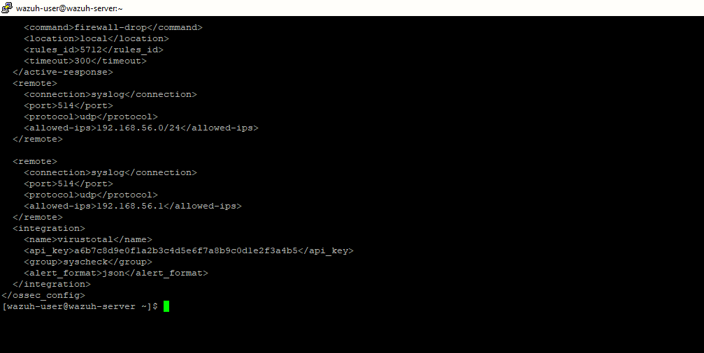
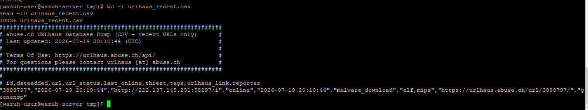
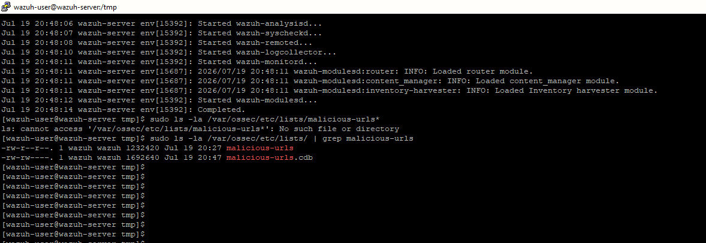
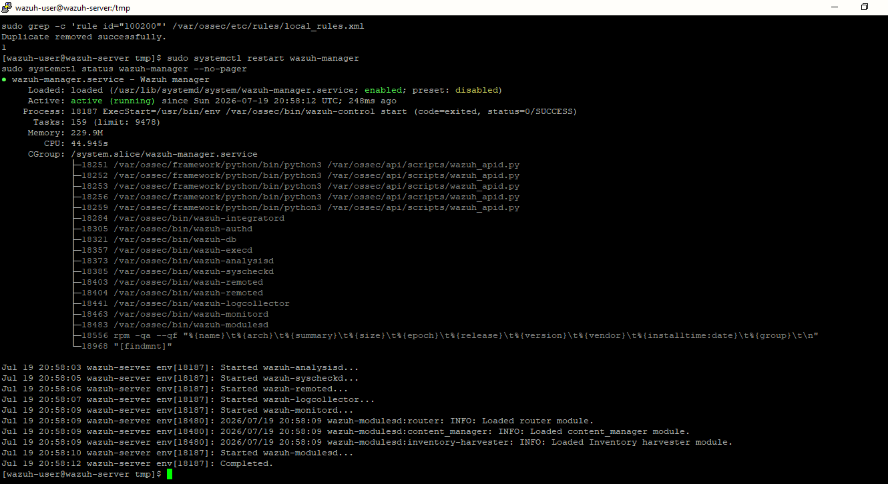
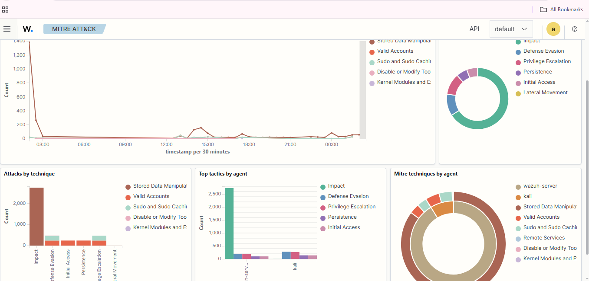
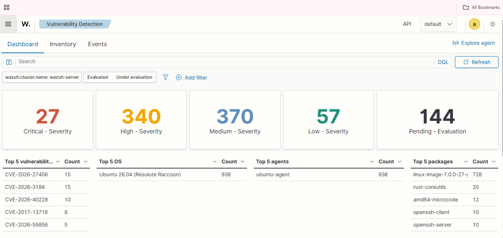
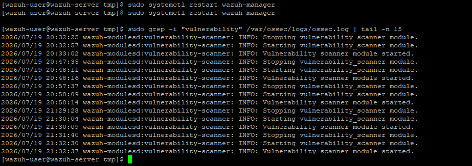
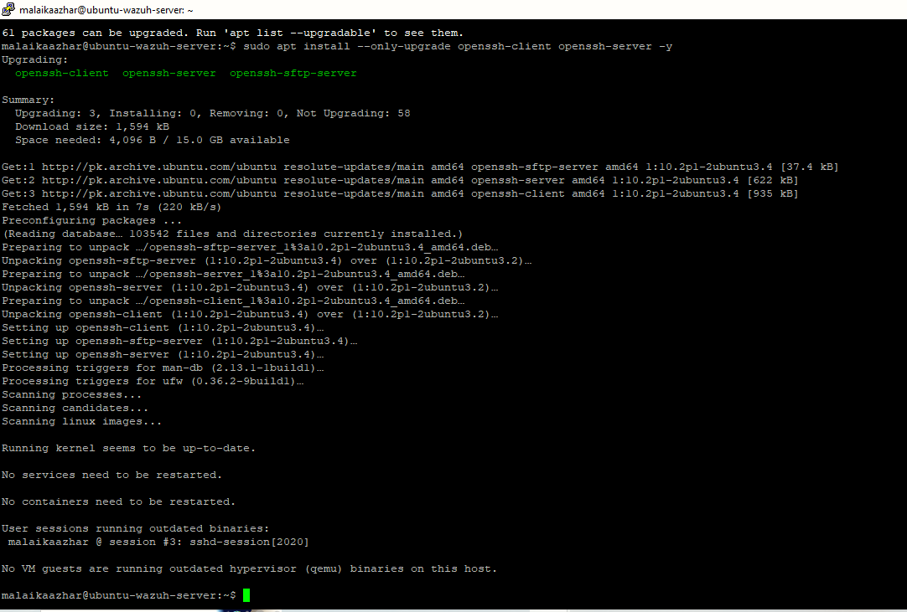
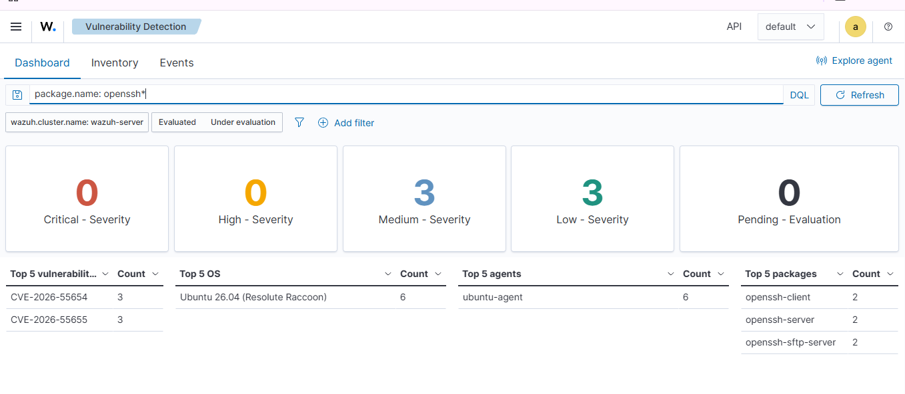

# 🎯 Project 10 — Index
### Threat Intelligence Enrichment & Vulnerability Assessment
**Project 10 of 29 — Advanced Cyber Projects**

**Quick guide to every step and screenshot in this project.**

### [📖 Open the full README](README.md)

---

| 🧩 Modules | 🖼️ Screenshots | 📡 Indicators Loaded | 🩹 High-Sev CVEs Closed |
|:---:|:---:|:---:|:---:|
| **2** | **9** | **20,826** | **3 → 0** |

🧩 <b>Lab:</b> VirusTotal + Live URLhaus Feed ➜ Wazuh CDB List & Custom Rule ➜ MITRE ATT&CK Module ➜ Vulnerability Detection & Patch Verification

---

## 📑 Step Index

All 9 steps of the project, with the screenshot that proves each one.

| # | Step | Module | Result | Evidence |
|:---:|---|:---:|---|:---:|
| 1 | Wire VirusTotal into the FIM pipeline | 🔵 Module 1 | Integration block active in `ossec.conf` | [Exhibit 1](#ex1) |
| 2 | Pull a real, live URLhaus threat feed | 🔵 Module 1 | 20,836-line feed downloaded and verified | [Exhibit 2](#ex2) |
| 3 | Compile the feed into a CDB list | 🔵 Module 1 | `malicious-urls.cdb` compiled and confirmed | [Exhibit 3](#ex3) |
| 4 | Restart the Manager cleanly | 🔵 Module 1 | All modules started, zero errors | [Exhibit 4](#ex4) |
| 5 | Confirm MITRE ATT&CK aggregation | 🔵 Module 1 | 6 tactics mapped across 2 agents | [Exhibit 5](#ex5) |
| 6 | Establish the CVE baseline | 🟢 Module 2 | 27 Critical / 340 High / 370 Medium / 57 Low | [Exhibit 6](#ex6) |
| 7 | Confirm the scanner module is cycling | 🟢 Module 2 | Clean start/stop cycle, no errors | [Exhibit 7](#ex7) |
| 8 | Patch the selected package (OpenSSH) | 🟢 Module 2 | Upgraded `3.2` → `3.4`, no failed triggers | [Exhibit 8](#ex8) |
| 9 | Verify the fix with an independent rescan | 🟢 Module 2 | 0 High-severity CVEs remaining | [Exhibit 9](#ex9) |

---

## 🔵 Module 1 — Threat Intelligence Enrichment

Exhibits 1 to 5. Click a screenshot to open it full size.

<table>
<tr>
<td align="center" valign="top" width="33%">

 <b>Exhibit 1 — VirusTotal wired in</b>
 Integration block in <code>ossec.conf</code>, alongside remote syslog config
</td>
<td align="center" valign="top" width="33%">

 <b>Exhibit 2 — Real feed download</b>
 20,836-line URLhaus dump, genuine malware-download sample visible
</td>
<td align="center" valign="top" width="33%">

 <b>Exhibit 3 — CDB list compiled</b>
 <code>malicious-urls</code> and <code>.cdb</code> confirmed via <code>ls -la</code>
</td>
</tr>
<tr>
<td align="center" valign="top" width="33%">

 <b>Exhibit 4 — Clean restart</b>
 All modules active, zero errors after rule/CDB changes
</td>
<td align="center" valign="top" width="33%">

 <b>Exhibit 5 — MITRE ATT&CK view</b>
 6 tactics aggregated: Impact, Defense Evasion, Persistence, and more
</td>
<td></td>
</tr>
</table>

---

## 🟢 Module 2 — Vulnerability Baseline & Patch Verification

Exhibits 6 to 9.

<table>
<tr>
<td align="center" valign="top" width="33%">

 <b>Exhibit 6 — CVE baseline</b>
 27 Critical, 340 High, 370 Medium, 57 Low findings
</td>
<td align="center" valign="top" width="33%">

 <b>Exhibit 7 — Scanner cycling</b>
 Clean stop/start log, no errors across restarts
</td>
<td align="center" valign="top" width="33%">

 <b>Exhibit 8 — Patch applied</b>
 OpenSSH upgraded <code>3.2</code> → <code>3.4</code>, no failed triggers
</td>
</tr>
<tr>
<td align="center" valign="top" width="33%">

 <b>Exhibit 9 — Rescan confirms fix</b>
 0 Critical, 0 High — down from 30 total findings to 6
</td>
<td></td>
<td></td>
</tr>
</table>

---

## 🎯 Rule and MITRE ATT&CK

| Rule | Detects | Technique | Tactic | Status |
|:---:|---|---|---|:---:|
| `100200` | URL match against live threat feed | [T1071](https://attack.mitre.org/techniques/T1071/) | Command and Control | ✅ Deployed |

## 🩹 Patch Verification Summary

| Metric | Before | After |
|---|:---:|:---:|
| Critical | 0 | 0 |
| High | 3 | **0** |
| Medium | 21 | 3 |
| Low | 6 | 3 |
| **Total** | **30** | **6** |

> [!NOTE]
> No live match occurred against the URLhaus feed during testing — expected, since lab traffic is internal and synthetic. The MITRE ATT&CK module's independent 6-tactic aggregation is what confirms the enrichment pipeline itself works.

---

[⬆️ Back to top](#top) &nbsp;·&nbsp; [📖 Full README](README.md)

🎯 **[Wazuh](https://wazuh.com)** · 🌐 **[URLhaus](https://urlhaus.abuse.ch)** · 🦠 **[VirusTotal](https://virustotal.com)** · 🗺️ **[MITRE ATT&CK](https://attack.mitre.org)**

